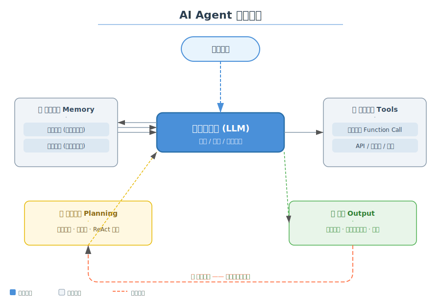
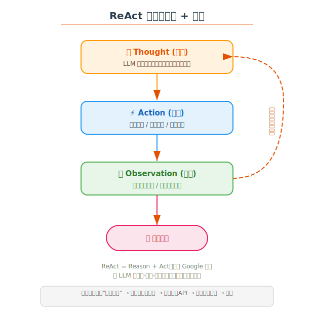

# 🤖 AI Agent 学习笔记

> 学习日期：2026-06-06 | 整理人：小夏

---

## 目录

1. [什么是 AI Agent](#1-什么是-ai-agent)
2. [核心架构](#2-核心架构)
3. [ReAct 循环](#3-react-循环)
4. [Agent 类型](#4-agent-类型)
5. [关键组件详解](#5-关键组件详解)
6. [主流框架对比](#6-主流框架对比)
7. [应用场景](#7-应用场景)
8. [参考资料](#8-参考资料)

---

## 1. 什么是 AI Agent

**AI Agent（智能体）** 是一个能够**自主感知环境、制定计划、执行行动**的智能系统。不同于传统的聊天机器人（只做问答），Agent 可以：

| 传统 LLM | AI Agent |
|----------|----------|
| 单轮/多轮对话 | 多步骤自主规划 |
| 被动回答问题 | 主动调用工具 |
| 无记忆或有限记忆 | 短期 + 长期记忆 |
| 单一文本输出 | 文本 + 行动 + 反馈循环 |

> 💡 **一句话总结**：Agent = LLM + 记忆 + 工具 + 规划能力

---

## 2. 核心架构



### 架构分层

| 层级 | 组件 | 职责 |
|------|------|------|
| 🧠 **核心** | 大语言模型 (LLM) | 推理、规划、决策 |
| 🧠 **记忆** | 短期记忆 | 当前对话上下文（Token 窗口） |
| 🧠 **记忆** | 长期记忆 | 向量数据库存储的关键信息 |
| 🔧 **工具** | Function Call | 调用外部 API / 数据库 / 网络 |
| 📋 **规划** | 任务分解 | 将复杂任务拆解为子步骤 |
| 💬 **输出** | 结果整合 | 将工具结果组织为自然语言回复 |

### 工作流程

```
用户输入 → LLM推理/规划 → 调用工具 → 获取结果 → LLM分析 → 输出/下一步
                                ↕
                        记忆系统检索补充
```

---

## 3. ReAct 循环

ReAct（Reason + Act）是当前最主流的 Agent 范式，由 Google 提出。



### 循环步骤

```
1. Thought（思考）→ LLM 分析当前状态和下一步计划
2. Action（行动）→ 执行具体操作（调用工具/查询/计算）
3. Observation（观察）→ 获取环境和工具返回的反馈
4. 回到 Step 1 或 输出最终答案
```

### ReAct vs 传统 Prompt

| | 传统 Prompt | ReAct |
|---|------------|-------|
| 推理方式 | 一次性输出 | 思考-行动-观察循环 |
| 纠错能力 | 错误后无法调整 | 观察反馈后修正 |
| 复杂任务 | 效果有限 | 适合多步骤推理 |
| 可解释性 | 黑盒 | 白盒，每一步可追溯 |

---

## 4. Agent 类型

### 按复杂度分

```
简单反射型 Agent     → 条件 → 行动
                              ↓
基于模型的 Agent     → 环境模型 → 规划 → 行动
                              ↓
目标驱动型 Agent     → 设定目标 → 规划执行
                              ↓
效用驱动型 Agent     → 目标 + 效用函数 → 最优选择
```

### 按功能分

| 类型 | 说明 | 示例 |
|------|------|------|
| 🛠️ **Tool Agent** | 调用外部工具辅助回答 | 查天气、搜网页 |
| 🤝 **Conversational Agent** | 记忆驱动的多轮对话 | 客服机器人 |
| 📊 **Data Agent** | 数据分析和可视化 | SQL 查询助手 |
| 🧪 **Coding Agent** | 编写、调试、执行代码 | Devin、Cursor |
| 🔄 **Multi-Agent** | 多个 Agent 协同工作 | AutoGen、CrewAI |
| 🌐 **Web Agent** | 自主浏览网页操作 | Operator、Voyager |

---

## 5. 关键组件详解

### 5.1 记忆系统 Memory

```
┌─────────────────────────────────┐
│         记忆系统                   │
│  ┌──────────┐  ┌──────────┐     │
│  │短期记忆   │  │长期记忆   │     │
│  │(上下文)   │  │(向量库)   │     │
│  └────┬─────┘  └────┬─────┘     │
│       │             │           │
│       ▼             ▼           │
│  ┌─────────────────────────┐    │
│  │   检索增强生成 (RAG)     │    │
│  └─────────────────────────┘    │
└─────────────────────────────────┘
```

- **短期记忆**：对话历史、当前上下文窗口
- **长期记忆**：向量数据库（Chroma、Pinecone、Weaviate）
- **RAG**：检索相关文档，注入提示词中

### 5.2 工具调用 Tools

```
LLM 输出 → 解析 Function Call → 执行 API → 返回结果 → LLM 整合
                ↕
        函数描述 (OpenAI Function Calling / Tool Description)
```

关键设计：
- 工具必须有清晰的名称、描述、参数 Schema
- LLM 自主决定何时调用什么工具
- 工具结果需要反馈给 LLM 做下一步判断

### 5.3 规划能力 Planning

常见策略：

| 策略 | 说明 |
|------|------|
| **Chain-of-Thought** | 思维链，逐步推理 |
| **Task Decomposition** | 任务分解，分而治之 |
| **Tree-of-Thought** | 思维树，多路径探索 |
| **Self-Ask** | 自我提问，逐步搜索 |
| **Plan-and-Solve** | 先规划再执行 |

---

## 6. 主流框架对比

| 框架 | 开发商 | 特点 | 适用场景 |
|------|--------|------|----------|
| **LangChain** | LangChain | 生态最丰富，组件化 | 通用 Agent |
| **AutoGen** | Microsoft | 多 Agent 对话 | 多 Agent 协作 |
| **CrewAI** | 开源 | 角色分工，团队协作 | 任务流水线 |
| **Semantic Kernel** | Microsoft | 深度集成 .NET/Azure | 企业应用 |
| **Dify** | 开源 | 可视化编排 | 低代码 Agent |
| **Coze** | ByteDance | 插件生态丰富 | 快速搭建 Bot |
| **OpenAI Assistants** | OpenAI | 官方托管 | 快速原型 |
| **Claude Agent** | Anthropic | Tool Use 原生支持 | 代码/分析任务 |

### 简单选择指南

```
❓ 需要快速原型？       → OpenAI Assistants / Claude Agent
❓ 需要复杂 Pipeline？   → LangChain / Semantic Kernel
❓ 需要多 Agent 协作？   → AutoGen / CrewAI
❓ 想要可视化搭建？      → Dify / Coze
❓ 企业级应用？          → Semantic Kernel / LangChain
```

---

## 7. 应用场景

```
┌─────────────────────────────────────────────────────┐
│                   AI Agent 应用场景                     │
├──────────────┬──────────────┬──────────────────────┤
│  客户服务     │  代码开发     │  数据分析              │
│  自动客服应答  │  AI 编程助手   │  SQL 查询与报表        │
│  工单处理     │  代码审查     │  数据清洗              │
│  知识库问答   │  Bug 修复     │  可视化生成            │
├──────────────┼──────────────┼──────────────────────┤
│  自动化运维   │  内容创作     │  研究与调研            │
│  故障排查     │  文章撰写     │  文献综述              │
│  监控告警     │  翻译润色     │  竞品分析              │
│  配置管理     │  多语言生成   │  报告生成              │
└──────────────┴──────────────┴──────────────────────┘
```

---

## 8. 参考资料

- 📄 [ReAct: Synergizing Reasoning and Acting in Language Models](https://arxiv.org/abs/2210.03629)
- 📄 [Tree of Thoughts: Deliberate Problem Solving with LLMs](https://arxiv.org/abs/2305.10601)
- 📄 [AutoGen: Enabling Next-Gen LLM Applications via Multi-Agent Conversation](https://arxiv.org/abs/2308.08155)
- 🌐 [LangChain Agent Documentation](https://python.langchain.com/docs/modules/agents/)
- 🌐 [OpenAI Function Calling Guide](https://platform.openai.com/docs/guides/function-calling)
- 🌐 [Anthropic Tool Use Documentation](https://docs.anthropic.com/en/docs/build-with-claude/tool-use)
- 📚 [Hugging Face Agents Course](https://huggingface.co/learn/agents-course/)

---

> ✍️ **学习心得**：AI Agent 是 LLM 能力的放大器。没有 Agent 的 LLM 只是个聪明点的聊天机器人；有了 Agent，LLM 才能真正"动手做事"。关键在于把工具调用、记忆管理和规划策略三个环节打通。
