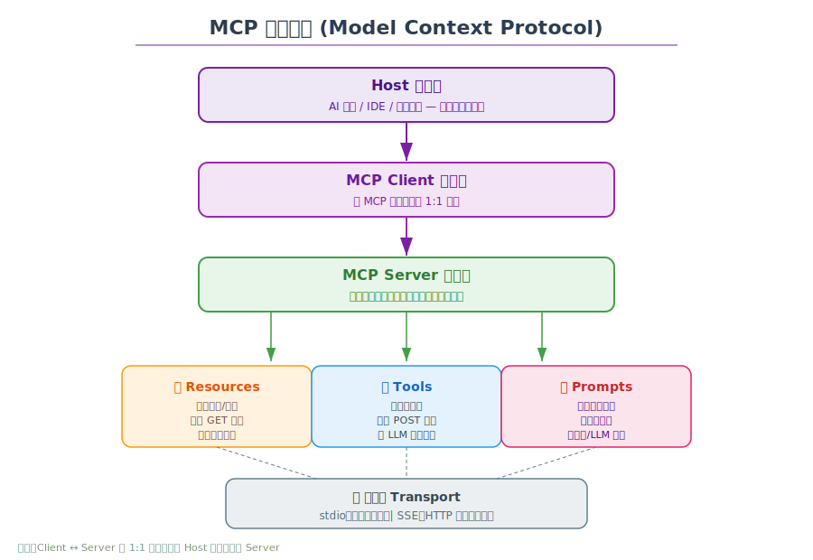
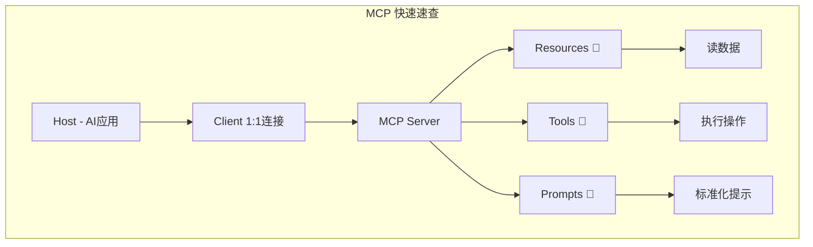

# 🔌 MCP 学习笔记 — Model Context Protocol

> 学习日期：2026-06-06 | 整理人：小夏

---

## 目录

1. [什么是 MCP](#1-什么是-mcp)
2. [为什么需要 MCP](#2-为什么需要-mcp)
3. [核心架构](#3-核心架构)
4. [生命周期与交互流程](#4-生命周期与交互流程)
5. [三大核心概念](#5-三大核心概念)
6. [传输层 Transport](#6-传输层-transport)
7. [JSON-RPC 消息格式](#7-json-rpc-消息格式)
8. [MCP  vs  传统集成方式](#8-mcp-vs-传统集成方式)
9. [开发实践](#9-开发实践)
10. [参考资料](#10-参考资料)

---

## 1. 什么是 MCP

**MCP（Model Context Protocol，模型上下文协议）** 是由 Anthropic 提出的开放标准协议，旨在为 AI 模型（尤其是 LLM）提供一种**统一、标准化的方式**来连接外部工具和数据源。

> 💡 **一句话**：MCP 是 AI 应用的"USB-C 接口"——让任何 LLM 都能以统一方式连接任何工具和数据。

### 官方定义

> "MCP is an open protocol that standardizes how applications provide context and tools to LLMs."
>
> — Anthropic

---

## 2. 为什么需要 MCP

在没有 MCP 之前，每个 AI 应用集成外部工具都需要**定制开发**：

```
    ┌─────────┐    ┌─────────┐    ┌─────────┐
    │ App A   │    │ App B   │    │ App C   │
    └───┬─────┘    └───┬─────┘    └───┬─────┘
        │              │              │
   ┌────▼────┐   ┌────▼────┐   ┌────▼────┐
   │ 定制API  │   │ 定制API  │   │ 定制API  │
   └─────────┘   └─────────┘   └─────────┘
        │              │              │
   ┌────▼──────────────▼──────────────▼────┐
   │         数据源 / 工具                   │
   └────────────────────────────────────────┘
```

有了 MCP 之后：

```
    ┌─────────┐    ┌─────────┐    ┌─────────┐
    │ App A   │    │ App B   │    │ App C   │
    └───┬─────┘    └───┬─────┘    └───┬─────┘
        │              │              │
   ┌────▼──────────────▼──────────────▼────┐
   │            MCP 协议标准                  │
   └────┬──────────────┬──────────────┬────┘
        │              │              │
   ┌────▼────┐   ┌────▼────┐   ┌────▼────┐
   │ Server  │   │ Server  │   │ Server  │
   │ (文件)  │   │ (数据库) │   │ (API)   │
   └─────────┘   └─────────┘   └─────────┘
```

---

## 3. 核心架构



### 三层模型

| 层级 | 名称 | 说明 |
|------|------|------|
| 🏠 **Host** | 主机 | 用户直接交互的 AI 应用（Claude Desktop、IDE、自定义 App） |
| 🔗 **Client** | 客户端 | 与 MCP Server 建立 1:1 连接，负责协议通信 |
| 🖥️ **Server** | 服务器 | 轻量级服务，暴露资源、工具、提示词 |

### 核心特点

- **1:1 连接**：每个 Client 只连接一个 Server
- **多 Server**：一个 Host 可以同时连接多个 Server
- **双向通信**：Server 可以主动推送通知（资源变更）
- **语言无关**：任何语言都可实现 MCP Server

---

## 4. 生命周期与交互流程


### 完整流程

| 阶段 | 操作 | 说明 |
|------|------|------|
| **① 初始化** | Client ↔ Server 握手 | 建立传输层，创建会话 |
| **② 能力协商** | 双方交换能力列表 | 版本号、支持的协议特性 |
| **③ 运行时** | LLM 按需调用 | 列举资源 → 读取资源 → 调用工具 |
| **④ 推送通知** | Server → Client | 资源变更时主动通知 |
| **⑤ 关闭** | 任一方发起 | 断开传输连接 |

---

## 5. 三大核心概念

### 📂 Resources（资源）

- **作用**：暴露结构化数据，类似 REST 的 GET
- **特征**：只读、支持 URI 定位
- **支持订阅**：资源变化时 Server 可推送通知
- **示例**：文件内容、数据库记录、API 响应

```
资源 URI 示例：
file:///logs/app.log
db://users/active
api://weather/shanghai
```

### 🔧 Tools（工具）

- **作用**：可执行的操作，类似 REST 的 POST
- **特征**：有输入参数和返回结果
- **由 LLM 自主调用**：LLM 根据对话内容判断何时调用
- **示例**：发送邮件、创建文件、执行 SQL

```
Tool 定义示例（JSON Schema）：
{
  "name": "send_email",
  "description": "发送邮件",
  "inputSchema": {
    "type": "object",
    "properties": {
      "to": {"type": "string"},
      "subject": {"type": "string"},
      "body": {"type": "string"}
    },
    "required": ["to", "subject"]
  }
}
```

### 📝 Prompts（提示词）

- **作用**：预制可复用的提示模板
- **特征**：可包含动态参数
- **触发方式**：用户或 LLM 主动请求
- **示例**：代码审查模板、翻译模板、SQL 生成模板

```
Prompt 示例：
名称：code_review
参数：{ "language": "python", "code": "..." }
模板："请审查以下 {language} 代码：\n{code}"
```

---

## 6. 传输层 Transport

MCP 目前支持两种传输方式：

| 传输方式 | 说明 | 适用场景 |
|----------|------|----------|
| **stdio** | 标准输入/输出通信 | 本地子进程，性能最优 |
| **SSE** | Server-Sent Events | 远程服务，HTTP 流式推送 |

### stdio 模式

```
Host → Client → 启动 Server 子进程 → stdin/stdout 通信
```

- 适合本地工具
- 延迟最低
- Server 生命周期由 Client 管理

### SSE 模式

```
Host → Client → HTTP 连接到远程 Server → 事件流
```

- 适合远程服务
- 支持 Server 主动推送
- 可跨网络部署

---

## 7. JSON-RPC 消息格式

所有 MCP 通信基于 **JSON-RPC 2.0** 协议。

### 请求格式

```json
{
  "jsonrpc": "2.0",
  "method": "tools/call",
  "params": {
    "name": "send_email",
    "arguments": {
      "to": "user@example.com",
      "subject": "Hello",
      "body": "MCP test message"
    }
  },
  "id": 1
}
```

### 响应格式

```json
{
  "jsonrpc": "2.0",
  "id": 1,
  "result": {
    "content": [
      {
        "type": "text",
        "text": "邮件发送成功"
      }
    ]
  }
}
```

### 通知格式（无需响应）

```json
{
  "jsonrpc": "2.0",
  "method": "notifications/resources/list_changed",
  "params": {}
}
```

### 核心方法列表

| 方法 | 方向 | 说明 |
|------|------|------|
| `initialize` | Client → Server | 初始化连接 |
| `resources/list` | Client → Server | 列举可用资源 |
| `resources/read` | Client → Server | 读取资源内容 |
| `resources/subscribe` | Client → Server | 订阅资源变更 |
| `tools/list` | Client → Server | 列举可用工具 |
| `tools/call` | Client → Server | 调用工具 |
| `prompts/list` | Client → Server | 列举提示词模板 |
| `prompts/get` | Client → Server | 获取提示词内容 |
| `notifications/*` | 双向 | 事件通知推送 |

---

## 8. MCP vs 传统集成方式

| 维度 | 传统集成 | MCP |
|------|----------|-----|
| **接口标准** | 各不相同，定制开发 | 统一标准协议 |
| **发现机制** | 手动文档查阅 | 自动列表（List） |
| **可复用性** | 低，每个 App 重写 | 高，一个 Server 通用 |
| **推送能力** | 需额外实现 | 原生支持通知 |
| **Schema** | 非标准 | JSON Schema 标准 |
| **学习成本** | 每个 API 不同 | 一次学习，到处使用 |

### 类似协议对比

| 协议 | 定位 | 区别 |
|------|------|------|
| **MCP** | LLM ↔ 工具/数据 | 专为 LLM 设计的上下文协议 |
| **OpenAPI** | HTTP API 描述 | 通用 API 规范，非 LLM 专用 |
| **Function Calling** | LLM 调用函数 | 各厂商私有格式，不互通 |
| **gRPC** | 服务间通信 | 高性能 RPC，非面向 LLM |
| **Anthropic Tool Use** | Anthropic 工具调用 | 单一厂商实现 |

---

## 9. 开发实践

### 快速实现一个 MCP Server（Python）

```python
# mcp_server.py
from mcp.server import Server, NotificationOptions
from mcp.server.models import InitializationOptions
import mcp.server.stdio

# 创建 Server 实例
server = Server("my-server")

# 定义一个 Tool
@server.list_tools()
async def handle_list_tools():
    return [
        {
            "name": "greet",
            "description": "向用户打招呼",
            "inputSchema": {
                "type": "object",
                "properties": {
                    "name": {"type": "string"}
                }
            }
        }
    ]

@server.call_tool()
async def handle_call_tool(name: str, arguments: dict):
    if name == "greet":
        return [{"type": "text", "text": f"你好, {arguments['name']}!"}]

# 启动
async def main():
    async with mcp.server.stdio.stdio_server() as (read, write):
        await server.run(read, write)

if __name__ == "__main__":
    import asyncio
    asyncio.run(main())
```

### 客户端连接示例

```python
# 使用 MCP Python SDK 连接 Server
from mcp import Client

async def main():
    async with Client("http://localhost:8080") as client:
        # 列举工具
        tools = await client.list_tools()
        print(f"可用工具: {tools}")
        
        # 调用工具
        result = await client.call_tool("greet", {"name": "小夏"})
        print(result)

import asyncio
asyncio.run(main())
```

### 生态工具

| 工具 | 说明 |
|------|------|
| **MCP Python SDK** | Python 官方 SDK |
| **MCP TypeScript SDK** | TypeScript 官方 SDK |
| **MCP Inspector** | 调试和测试 MCP Server |
| **FastMCP** | 简化版服务器框架 |
| **mcp-cli** | 命令行 MCP 客户端 |

---

## 10. 参考资料

- 🌐 [MCP 官方文档](https://modelcontextprotocol.io/)
- 🌐 [MCP GitHub 仓库](https://github.com/modelcontextprotocol)
- 🐍 [MCP Python SDK](https://github.com/modelcontextprotocol/python-sdk)
- 📄 [Anthropic MCP 公告](https://www.anthropic.com/news/model-context-protocol)
- 🎥 [MCP 介绍视频](https://youtu.be/kQmX4m1X1qY)
- 📚 [MCP Specification](https://spec.modelcontextprotocol.io/)
- 💻 [MCP Servers 示例集合](https://github.com/modelcontextprotocol/servers)
- 🔧 [MCP Inspector](https://github.com/modelcontextprotocol/inspector)

---

## 附：速查卡片



---

> ✍️ **学习心得**：MCP 解决了一个很实际的问题——每个 AI 应用都要重复造轮子去连各种数据源。它像是一个"协议层抽象"，让 AI 应用的开发者只需要实现一个 MCP Client，就能接入任何实现 MCP 标准的工具和数据。这种"标准化"的思路跟 USB-C、HTTP 这些经典协议如出一辙。未来如果 LLM 生态想要健康发展，MCP 这样的标准协议是不可或缺的基础设施。
