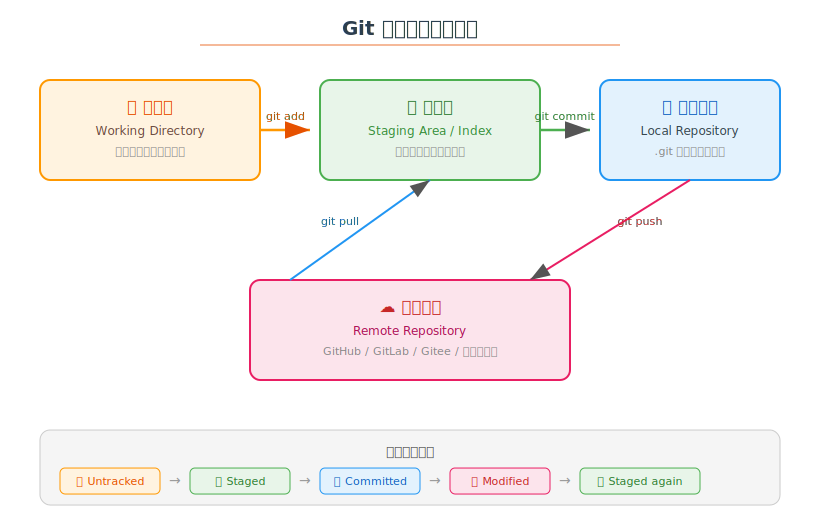
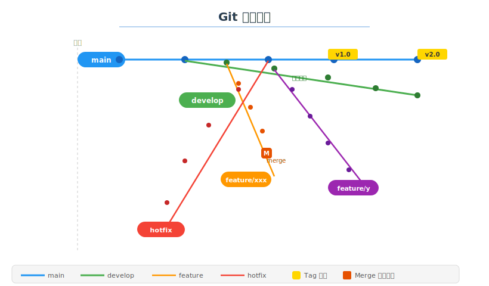
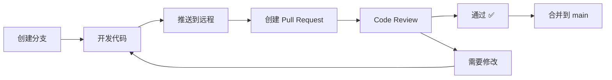

# 📚 Git 学习笔记

> 学习日期：2026-06-06 | 整理人：小夏

---

## 目录

1. [Git 是什么](#1-git-是什么)
2. [核心工作流](#2-核心工作流)
3. [分支模型](#3-分支模型)
4. [常用命令速查](#4-常用命令速查)
5. [.gitignore](#5-gitignore)
6. [Merge vs Rebase](#6-merge-vs-rebase)
7. [协作流程](#7-协作流程)
8. [进阶技巧](#8-进阶技巧)
9. [参考资料](#9-参考资料)

---

## 1. Git 是什么

**Git** 是目前最流行的**分布式版本控制系统**，由 Linus Torvalds 于 2005 年创建。

### 核心特点

| 特点 | 说明 |
|------|------|
| **分布式** | 每个开发者都有完整的代码仓库副本 |
| **快照式** | 每次提交都是文件的完整快照，而非差异 |
| **分支轻量** | 分支只是一个指针，创建成本极低 |
| **完整性** | 所有数据存储前都经过 SHA-1 哈希校验 |
| **原子性** | 提交要么完全成功，要么完全不成功 |

---

## 2. 核心工作流



### 四大区域

| 区域 | 说明 | 对应命令 |
|------|------|----------|
| 📁 **工作区** | 你实际编辑文件的地方 | `git status`, `git diff` |
| 📦 **暂存区** | 下次提交的准备区 | `git add`, `git restore --staged` |
| 💾 **本地仓库** | .git 目录，保存所有提交历史 | `git commit`, `git log` |
| ☁️ **远程仓库** | GitHub/GitLab 等远程服务器 | `git push`, `git pull` |

### 文件生命周期

```
Untracked（未追踪）
    ↓ git add
Staged（已暂存）
    ↓ git commit
Committed（已提交）
    ↓ 编辑文件
Modified（已修改）
    ↓ git add
Staged（再次暂存） → git commit → Committed
```

---

## 3. 分支模型



### 常用分支策略

#### Git Flow（适合大型项目）

```
main ─────────────●────────────────●──
                    \              /
develop ──●───●─────●───●───●────●────
           \      /       \    /
feature    ●────●          ●──●
                              \
hotfix                       ●───●
```

| 分支 | 用途 |
|------|------|
| **main** | 生产就绪的代码，只能从 develop/hotfix 合并 |
| **develop** | 日常开发的主分支 |
| **feature/*** | 新功能开发，完成后合并到 develop |
| **release/*** | 发布准备分支，只做 bug 修复 |
| **hotfix/*** | 紧急修复，直接从 main 创建，修复后合并回 main 和 develop |

#### GitHub Flow（更轻量，适合持续部署）

```
main ●──●──●──●──●──●──●──●──●──●
       \          /  \        /
feature ●──●──●──●    ●──●──●
```

- 直接基于 main 创建功能分支
- 通过 Pull Request 合并回 main
- 合并即部署

### 分支操作

```bash
# 创建并切换到新分支
git checkout -b feature/xxx
# 等同于：
git branch feature/xxx
git checkout feature/xxx

# 列出所有分支
git branch -a

# 删除本地分支
git branch -d feature/xxx

# 删除远程分支
git push origin --delete feature/xxx
```

---

## 4. 常用命令速查

### 基础操作

```bash
# 初始化仓库
git init

# 克隆远程仓库
git clone <url>

# 查看状态
git status

# 添加文件到暂存区
git add <file>
git add .            # 添加所有更改
git add -p           # 交互式添加（逐个确认）

# 提交
git commit -m "消息"
git commit -am "消息"        # 跳过 git add（仅追踪过的文件）
git commit --amend           # 修改上一次提交

# 查看历史
git log
git log --oneline --graph   # 简洁图形化
git log -p                  # 显示每次提交的 diff
```

### 远程操作

```bash
# 管理远程仓库
git remote -v
git remote add origin <url>
git remote remove origin

# 推送
git push origin main
git push -u origin main      # 设置上游分支
git push --tags              # 推送标签

# 拉取
git pull                     # fetch + merge
git pull --rebase            # fetch + rebase

# 获取但不合并
git fetch origin
```

### 撤销与回退

```bash
# 撤销工作区修改（危险！）
git restore <file>
git checkout -- <file>      # 旧式写法

# 取消暂存
git restore --staged <file>

# 回退到上一个提交（保留修改）
git reset --soft HEAD~1

# 回退并丢弃修改（危险！）
git reset --hard HEAD~1

# 回退远程（需要 force push，谨慎！）
git reset --hard HEAD~1
git push --force-with-lease

# 回滚到某个历史提交（保留历史）
git revert <commit-hash>    # 创建一个新的反向提交
```

### 暂存与储藏

```bash
git stash                  # 暂存当前工作
git stash pop              # 恢复最近一次暂存
git stash list             # 查看所有暂存
git stash drop             # 删除最近一次暂存
```

### 差异比较

```bash
git diff                   # 工作区 vs 暂存区
git diff --staged          # 暂存区 vs 上次提交
git diff HEAD             # 工作区 vs 上次提交
git diff <branch1> <branch2>  # 两个分支差异
```

---

## 5. .gitignore

```gitignore
# 忽略编译产物
build/
dist/
*.exe
*.dll
*.so

# 忽略依赖
node_modules/
vendor/
__pycache__/
*.pyc
.venv/

# 忽略环境配置
.env
*.local

# 忽略 IDE 配置
.idea/
.vscode/
*.swp

# 忽略日志
*.log
logs/

# 忽略系统文件
.DS_Store
Thumbs.db
```

> 💡 使用 [gitignore.io](https://www.toptal.com/developers/gitignore) 自动生成项目对应的 .gitignore

---

## 6. Merge vs Rebase

### Merge（合并）

```bash
# 将 feature 分支合并到 main
git checkout main
git merge feature
```

```
main ●──●──●──●──●──●
         \          /
feature  ●──●──●──●
        ^ 这是 merge commit
```

**优点**：保留完整的分支历史，适合团队协作
**缺点**：产生多余的 merge commit，历史较乱

### Rebase（变基）

```bash
# 将 feature 分支变基到 main
git checkout feature
git rebase main
```

```
main ●──●──●──●
         \     
feature  ●──●──●──●──●──●
                feature 的提交被"重放"到 main 之后
```

**优点**：线性历史，干净整洁
**缺点**：改写提交历史，**绝不要在公共分支上使用**

### 选择原则

| 场景 | 推荐 | 原因 |
|------|------|------|
| 合并到公共分支 | Merge | 保留历史，不 rewrite |
| 更新个人功能分支 | Rebase | 保持历史线性 |
| PR/MR 合并 | Squash & Merge | 整条分支压缩为一个提交 |
| 修复冲突 | Rebase | 逐个提交解决冲突 |

> ⚠️ **黄金法则**：不要对已推送到远程的分支做 rebase

---

## 7. 协作流程

### PR/MR 标准流程



### Git 协作最佳实践

```
1. 开始新功能前，先从最新的 main 创建分支
2. 频繁提交，每个提交只做一件事
3. 提交信息写清楚"为什么"，而非"做了什么"
4. 推送到远程前，先 rebase 到最新的远程分支
5. 冲突在本地解决，不要在 GitHub 上直接解决
6. PR 不超过 400 行，过大的 PR 拆分成多个
```

### 提交信息规范

```
<type>(<scope>): <subject>

<body>

<footer>
```

推荐使用 [Conventional Commits](https://www.conventionalcommits.org/)：

| Type | 说明 | 示例 |
|------|------|------|
| **feat** | 新功能 | `feat: add user login` |
| **fix** | Bug 修复 | `fix: fix null pointer` |
| **docs** | 文档 | `docs: update README` |
| **refactor** | 重构 | `refactor: extract auth module` |
| **test** | 测试 | `test: add unit tests` |
| **chore** | 杂项 | `chore: update deps` |

---

## 8. 进阶技巧

### 交互式 Rebase（修改历史）

```bash
# 修改最近 3 个提交
git rebase -i HEAD~3
```

常用操作：
- `pick` — 保留该提交
- `reword` — 修改提交信息
- `squash` — 合并到上一个提交
- `fixup` — 合并并丢弃提交信息
- `drop` — 删除该提交

### Git Bisect（二分查找 Bug）

```bash
# 标记好的和坏的版本
git bisect start
git bisect bad HEAD       # 当前版本有 bug
git bisect good v1.0      # 这个版本没 bug
# Git 会二分查找，每次告诉你一个提交让你测试
git bisect good           # 这个提交没问题
git bisect bad            # 这个提交有 bug
# 重复直到找到第一个出问题的提交
git bisect reset
```

### Git Hooks

```
.git/hooks/
├── pre-commit         # 提交前运行（代码检查、格式化）
├── commit-msg         # 检查提交信息格式
├── pre-push           # 推送前运行（运行测试）
└── post-merge         # 合并后运行
```

### Alias 别名

```bash
git config --global alias.st status
git config --global alias.co checkout
git config --global alias.br branch
git config --global alias.ci commit
git config --global alias.lg "log --oneline --graph --all"
git config --global alias.unstage "restore --staged"
```

---

## 9. 参考资料

- 📖 [Pro Git Book（官方中文版）](https://git-scm.com/book/zh/v2)
- 🌐 [Git 官方文档](https://git-scm.com/doc)
- 🌐 [GitHub Git 教程](https://docs.github.com/zh/get-started)
- 📝 [Conventional Commits](https://www.conventionalcommits.org/)
- 🎮 [Learn Git Branching（交互式学习）](https://learngitbranching.js.org/)
- 📄 [A Successful Git Branching Model](https://nvie.com/posts/a-successful-git-branching-model/)

---

> ✍️ **学习心得**：Git 的核心思想其实很简单——**快照 + 指针**。每个提交就是一次快照，分支就是指向某个快照的指针。理解了这一点，几乎所有 Git 操作都能想明白。日常开发中记住 `add` → `commit` → `push` 这条线，再加上 branch 和 merge，就能覆盖 90% 的场景了。
