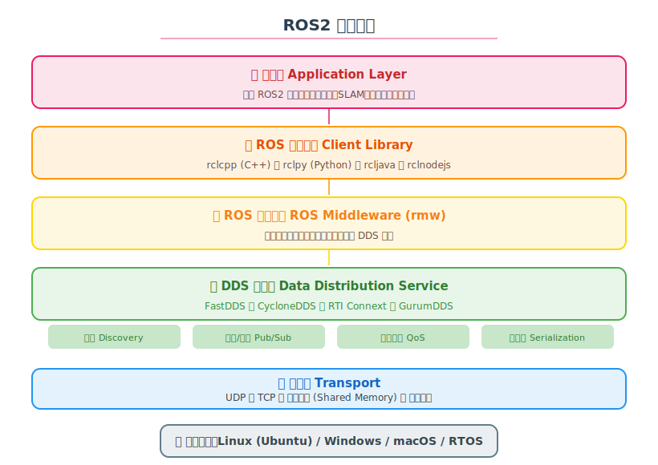
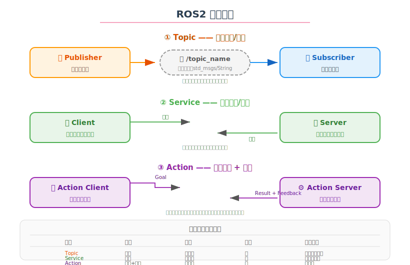

# 🤖 ROS2 学习笔记

> 学习日期：2026-06-06 | 整理人：小夏

---

## 目录

1. [ROS2 是什么](#1-ros2-是什么)
2. [ROS1 vs ROS2](#2-ros1-vs-ros2)
3. [整体架构](#3-整体架构)
4. [核心概念](#4-核心概念)
5. [通信模型详解](#5-通信模型详解)
6. [常用命令](#6-常用命令)
7. [Package 结构](#7-package-结构)
8. [Launch 文件](#8-launch-文件)
9. [开发实践](#9-开发实践)
10. [参考资料](#10-参考资料)

---

## 1. ROS2 是什么

**ROS2（Robot Operating System 2）** 是面向机器人开发的**分布式通信框架**。它不是真正的操作系统，而是一个提供通信、工具、库和硬件抽象的中间件。

> 💡 **一句话**：ROS2 让机器人的不同模块（感知、规划、控制）能够像微服务一样互相通信。

### 核心特点

| 特点 | 说明 |
|------|------|
| **分布式** | 各节点可运行在不同机器上 |
| **去中心化** | 无中心节点，避免单点故障 |
| **实时性** | 支持实时操作系统 (RTOS) |
| **跨平台** | Linux / Windows / macOS / 嵌入式 |
| **DDS 驱动** | 底层通信基于数据分发服务 (DDS) |
| **多语言** | C++ / Python / Java / Rust / Node.js |

---

## 2. ROS1 vs ROS2

| 对比项 | ROS1 | ROS2 |
|--------|------|------|
| **核心架构** | 有 Master 中心节点 | 去中心化，DDS 自动发现 |
| **通信协议** | 自定义 TCPROS/UDPROS | DDS (FastDDS/CycloneDDS) |
| **实时性** | ❌ 不支持 | ✅ 支持 |
| **多机器人** | ❌ 困难 | ✅ 原生支持 |
| **跨平台** | Linux only | Linux / Win / macOS / RTOS |
| **安全加密** | ❌ 无 | ✅ DDS 原生支持 |
| **Python 版本** | Python 2 | Python 3 |
| **启动文件** | .launch (XML) | .launch.py (Python) |
| **Lifecycle 管理** | ❌ 无 | ✅ 有 LifecycleNode |
| **参数系统** | 全局 Parameter Server | 节点本地参数 |
| **维护状态** | 2025 年 EOL ❌ | 活跃开发 ✅ |

---

## 3. 整体架构



### 分层详解

| 层级 | 作用 | 技术选型 |
|------|------|----------|
| **应用层** | 你的机器人代码 | 控制、SLAM、导航、感知节点 |
| **Client Library** | 语言封装层 | rclcpp / rclpy |
| **ROS Middleware (rmw)** | 抽象接口层 | 统一 API 对接不同 DDS |
| **DDS 层** | 数据分发服务 | FastDDS / CycloneDDS / Connext |
| **传输层** | 网络通信 | UDP / TCP / 共享内存 |
| **操作系统** | 底层平台 | Ubuntu / Windows / RTOS |

### DDS 关键特性

| 特性 | 说明 |
|------|------|
| **Discovery** | 节点自动发现，无需中心服务器 |
| **Pub/Sub** | 发布/订阅模式，多对多通信 |
| **QoS** | 服务质量策略（可靠性、持久性等） |
| **Serialization** | 数据序列化/反序列化 |

---

## 4. 核心概念

### Node（节点）

**节点**是 ROS2 中最基本的执行单元，每个节点负责一个独立的模块功能。

```python
import rclpy
from rclpy.node import Node

class MyNode(Node):
    def __init__(self):
        super().__init__('my_node_name')
        self.get_logger().info('节点已启动！')
```

```bash
# 运行节点
ros2 run <package_name> <node_name>
# 列出所有节点
ros2 node list
# 查看节点信息
ros2 node info <node_name>
```

### 核心元素

```
┌─────────────────────────────────────────┐
│              Node 节点                     │
│                                           │
│  ┌─────────┐  ┌─────────┐  ┌────────┐   │
│  │Publisher│  │Subscriber│  │Service │   │
│  └────┬────┘  └────┬────┘  └───┬────┘   │
│       │            │           │        │
│  发布 Topic   订阅 Topic    提供 Service │
└─────────────────────────────────────────┘
```

| 元素 | 说明 | 示例 |
|------|------|------|
| **Node** | 基本执行单元 | `/camera_node`, `/controller_node` |
| **Topic** | 数据总线（异步） | `/camera/image`, `/odom` |
| **Service** | 请求/响应（同步） | `/set_parameter`, `/get_map` |
| **Action** | 任务+反馈（异步） | `/navigate_to_pose`, `/follow_path` |
| **Parameter** | 节点配置参数 | `~resolution`, `~max_speed` |

### Topic 命名规则

```
/namespace/node_name/topic_name

示例：
/robot1/camera/image_raw
/robot1/cmd_vel
```

---

## 5. 通信模型详解



### ① Topic —— 发布/订阅（异步）

```python
# 发布者
publisher = self.create_publisher(String, '/chatter', 10)
msg = String()
msg.data = 'Hello ROS2!'
publisher.publish(msg)

# 订阅者
self.subscription = self.create_subscription(
    String, '/chatter', self.callback, 10)

def callback(self, msg):
    self.get_logger().info(f'收到: {msg.data}')
```

**QoS 设置**：

```python
from rclpy.qos import QoSProfile, ReliabilityPolicy, DurabilityPolicy

qos = QoSProfile(
    reliability=ReliabilityPolicy.RELIABLE,    # 可靠传输
    durability=DurabilityPolicy.TRANSIENT_LOCAL,  # 持久化
    depth=10                                   # 缓存深度
)
```

| QoS 策略 | 说明 |
|----------|------|
| `RELIABLE` | 保证消息送达（适合控制指令） |
| `BEST_EFFORT` | 尽力送达（适合传感器数据） |
| `TRANSIENT_LOCAL` | 晚加入的订阅者也能收到（适合地图/静态数据） |

### ② Service —— 请求/响应（同步）

```python
# Server 端
from example_interfaces.srv import AddTwoInts

def add_callback(request, response):
    response.sum = request.a + request.b
    return response

self.srv = self.create_service(AddTwoInts, '/add_two_ints', add_callback)

# Client 端
client = self.create_client(AddTwoInts, '/add_two_ints')
while not client.wait_for_service(1.0):
    self.get_logger().info('等待服务...')
request = AddTwoInts.Request()
request.a = 3
request.b = 5
future = client.call_async(request)
```

### ③ Action —— 任务+反馈（异步）

```python
# Action Server
from nav2_msgs.action import NavigateToPose

class NavActionServer(Node):
    def __init__(self):
        super().__init__('nav_action_server')
        self._action_server = ActionServer(
            self, NavigateToPose, '/navigate_to_pose',
            self.execute_callback)
    
    async def execute_callback(self, goal_handle):
        # 发送反馈
        feedback = NavigateToPose.Feedback()
        for i in range(10):
            feedback.distance_remaining = 10.0 - i
            goal_handle.publish_feedback(feedback)
            time.sleep(1.0)
        # 返回结果
        return NavigateToPose.Result().Result.SUCCESS
```

---

## 6. 常用命令

### 节点与运行

```bash
# 运行节点
ros2 run <pkg> <node_name> [--ros-args -p param:=value]

# 节点管理
ros2 node list                         # 列出所有节点
ros2 node info <node_name>             # 查看节点详情

# 查看话题
ros2 topic list                       # 列出所有话题
ros2 topic echo <topic_name>          # 打印话题数据
ros2 topic info <topic_name>          # 话题信息
ros2 topic hz <topic_name>            # 话题发布频率
ros2 topic bw <topic_name>            # 话题带宽
ros2 topic pub <topic_name> <msg_type> 'data: "hello"'

# 服务
ros2 service list                     # 列出所有服务
ros2 service type <service_name>      # 服务类型
ros2 service call <name> <type> '{...}'

# Action
ros2 action list                      # 列出所有 Action
ros2 action info <action_name>        # Action 信息
ros2 action send_goal <name> <type> '{...}'
```

### 包管理

```bash
# 创建新包
ros2 pkg create <pkg_name> --build-type ament_cmake
ros2 pkg create <pkg_name> --build-type ament_python

# 包信息
ros2 pkg list

# 编译
colcon build
colcon build --packages-select <pkg_name>
colcon build --symlink-install         # 开发模式

# 环境
source install/setup.bash
```

### 调试

```bash
# 日志级别
ros2 run pkg node --ros-args --log-level debug

# 录制/回放
ros2 bag record -a                     # 录制所有话题
ros2 bag play <bag_file>               # 回放

# TF 变换
ros2 run tf2_tools view_frames         # 生成 TF 树
```

---

## 7. Package 结构

### Python Package

```
my_robot_pkg/
├── package.xml            # 元信息（依赖、描述）
├── setup.py               # 安装配置
├── setup.cfg              # 安装路径
├── launch/                # launch 文件
│   └── example.launch.py
├── my_robot_pkg/          # 源码
│   ├── __init__.py
│   ├── node_1.py
│   └── node_2.py
└── config/                # 配置文件
    └── params.yaml
```

### C++ Package

```
my_robot_pkg/
├── package.xml
├── CMakeLists.txt
├── launch/
│   └── example.launch.py
├── src/
│   ├── node_1.cpp
│   └── node_2.cpp
├── include/
│   └── my_robot_pkg/
│       └── header.h
└── config/
    └── params.yaml
```

---

## 8. Launch 文件

ROS2 使用 Python 作为启动配置语言：

```python
# navigation.launch.py
from launch import LaunchDescription
from launch_ros.actions import Node

def generate_launch_description():
    return LaunchDescription([
        Node(
            package='my_robot',
            executable='controller_node',
            name='controller',
            parameters=['config/params.yaml'],
            remappings=[('/cmd_vel', '/robot1/cmd_vel')],
            output='screen'
        ),
        Node(
            package='my_robot',
            executable='camera_node',
            name='camera',
            prefix=['gdb -ex run --args'],  # 调试
            emulate_tty=True
        ),
    ])
```

```bash
ros2 launch my_robot navigation.launch.py
```

---

## 9. 开发实践

### 生命周期管理

```
Unconfigured ─→ Inactive ─→ Active ─→ Finalized
     ↓              ↓          ↓
   configure()   activate()  cleanup()
```

LifecycleNode 让机器人节点可以被外部管理（导航、传感器）：

```python
from rclpy.lifecycle import LifecycleNode, State, TransitionCallbackReturn

class MyLifecycleNode(LifecycleNode):
    def on_configure(self, state: State) -> TransitionCallbackReturn:
        # 加载参数、分配资源
        return TransitionCallbackReturn.SUCCESS
    
    def on_activate(self, state: State) -> TransitionCallbackReturn:
        # 开始发布/订阅
        return TransitionCallbackReturn.SUCCESS
    
    def on_deactivate(self, state: State) -> TransitionCallbackReturn:
        # 停止发布/订阅
        return TransitionCallbackReturn.SUCCESS
```

### 常用消息类型

| 包 | 消息 | 说明 |
|----|------|------|
| `std_msgs` | String, Int32, Float64, Bool | 基本类型 |
| `geometry_msgs` | Twist, Pose, Point, Quaternion | 几何数据 |
| `sensor_msgs` | Image, LaserScan, Imu, JointState | 传感器数据 |
| `nav_msgs` | Odometry, Path, OccupancyGrid | 导航数据 |
| `tf2_msgs` | TFMessage | 坐标变换 |

### Humble 安装

```bash
# Ubuntu 22.04
sudo apt install ros-humble-desktop
source /opt/ros/humble/setup.bash

# 工作空间
mkdir -p ~/ros2_ws/src
cd ~/ros2_ws
colcon build
```

---

## 10. 参考资料

- 🌐 [ROS2 官方文档](https://docs.ros.org/en/humble/)
- 📖 [ROS2 官方教程](https://docs.ros.org/en/humble/Tutorials.html)
- 🌐 [Robot Ignite Academy（在线实操）](https://www.theconstructsim.com/)
- 📄 [ROS2 Design Documents](https://design.ros2.org/)
- 🎥 [ROS2 基础教程（YouTube）](https://www.youtube.com/@ROS2)
- 📚 [A Gentle Introduction to ROS2](https://www.amazon.com/Gentle-Introduction-ROS2-Fairchild/dp/B09QZV3K8L)
- 🌐 [Nav2 文档](https://docs.nav2.org/)

---

> ✍️ **学习心得**：ROS2 相比 ROS1 最大的改进就是**去中心化**。没有 Master 之后，系统的健壮性大幅提升。理解 DDS（尤其是 QoS）是关键——"什么数据用什么可靠性级别"直接决定了机器人能不能稳定工作。另外，Lifecycle 管理对导航这类有状态系统来说非常有用，能避免"还没准备好就开始导航"的问题。
