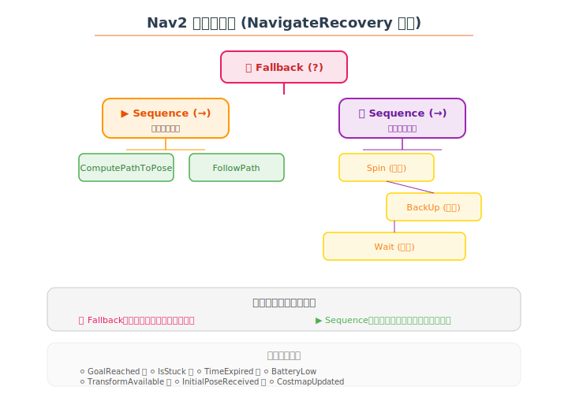

# 🗺️ Nav2 学习笔记

> 学习日期：2026-06-06 | 整理人：小夏

---

## 目录

1. [Nav2 是什么](#1-nav2-是什么)
2. [系统架构](#2-系统架构)
3. [核心模块详解](#3-核心模块详解)
4. [行为树导航](#4-行为树导航)
5. [代价地图 Costmap](#5-代价地图-costmap)
6. [规划器 Planner](#6-规划器-planner)
7. [控制器 Controller](#7-控制器-controller)
8. [生命周期管理](#8-生命周期管理)
9. [配置与调参](#9-配置与调参)
10. [常见问题](#10-常见问题)
11. [参考资料](#11-参考资料)

---

## 1. Nav2 是什么

**Nav2** 是 ROS2 的官方导航框架，用于让机器人从 A 点自主导航到 B 点，同时避让障碍物。

> 💡 **一句话**：Nav2 是机器人的"自动驾驶系统"。

### 核心能力

```
┌──────────────────────────────────────┐
│        Nav2 能做什么？                  │
├──────────────────────────────────────┤
│ ✅ 给定目标点，生成全局路径             │
│ ✅ 实时避障，绕开动态障碍物             │
│ ✅ 路径规划失败时执行恢复行为           │
│ ✅ 支持多传感器融合（激光、声纳、深度相机）│
│ ✅ 行为树驱动的灵活导航策略             │
│ ✅ 支持多种地图（已知地图 / 探索建图）   │
└──────────────────────────────────────┘
```

---

## 2. 系统架构


### 整体流程

```
        用户输入目标位姿
              ↓
    ┌─── Behavior Tree (BT Navigator) ───┐
    │  ↓ ComputePathToPose  │  ↑ Recovery │
    │  ↓ FollowPath         │  ↑ Spin/... │
    └────────┬────────────────┬──────────┘
             │                │
    ┌────────▼──┐    ┌───────▼────────┐
    │  Global   │    │  Controller    │
    │  Planner  │    │  (Local)       │
    │  NavFn/A* │    │  DWB/TEB/MPPI │
    └─────┬─────┘    └───────┬────────┘
          │                  │
    ┌─────▼──────────────────▼────────┐
    │         Costmap 代价地图          │
    │  Global Costmap + Local Costmap  │
    └──────────────┬──────────────────┘
                   │
    ┌──────────────▼──────────────────┐
    │    传感器：LiDAR / Odom / IMU    │
    └─────────────────────────────────┘
```

---

## 3. 核心模块详解

| 模块 | 节点名 | 作用 |
|------|--------|------|
| 🌳 **BT Navigator** | `bt_navigator` | 行为树导航大脑 |
| 🗺️ **Global Planner** | `planner_server` | 全局路径规划 |
| 🎮 **Local Planner** | `controller_server` | 局部路径跟踪与避障 |
| 🧭 **Costmap** | `costmap_2d` | 代价地图维护 |
| 🔄 **Recovery** | `recoveries_server` | 故障恢复行为 |
| 🧠 **Behavior Server** | `behavior_server` | 自定行为扩展 |
| 🚦 **Lifecycle Manager** | `lifecycle_manager` | 生命周期管理 |

---

## 4. 行为树导航



### 行为树（Behavior Tree）是什么

行为树是一种树状控制结构，用于定义导航的**逻辑流程**：

| 节点类型 | 符号 | 行为 |
|----------|------|------|
| **Sequence** | → | 按顺序执行子节点，全部成功才算成功 |
| **Fallback** | ? | 尝试子节点，任意一个成功即可 |
| **Action** | ⚡ | 执行具体行为 |
| **Condition** | ⚪ | 检查条件是否满足 |

### 默认行为树：NavigateRecovery

```
                    ? Fallback
                   /          \
              → Sequence    → Sequence（Recovery）
             /       \       /      |      \
    ComputePath  FollowPath  Spin  BackUp  Wait
```

**执行逻辑**：

```
1. 尝试 ComputePathToPose（计算路径）
   → 成功：执行 FollowPath（跟随路径）
   → 失败：
2.  尝试 Spin（旋转）
     → 成功：回到步骤 1
     → 失败：
3.   尝试 BackUp（后退）
      → 成功：回到步骤 1
      → 失败：
4.    尝试 Wait（等待）
       → 成功：回到步骤 1
       → 失败：导航失败
```

### 创建自定义行为树

```xml
<!-- my_navigate.xml -->
<root main_tree_to_execute="MainTree">
  <BehaviorTree ID="MainTree">
    <Fallback name="root">
      <Sequence name="navigate">
        <ComputePathToPose goal="{goal}" path="{path}"/>
        <FollowPath path="{path}"/>
      </Sequence>
      <ReactiveFallback name="recovery">
        <Spin spin_dist="1.57"/>
        <BackUp backup_dist="0.3"/>
      </ReactiveFallback>
    </Fallback>
  </BehaviorTree>
</root>
```

配置使用自定义行为树：

```yaml
bt_navigator:
  ros__parameters:
    default_bt_xml_filename: "my_navigate.xml"
```

---

## 5. 代价地图 Costmap

### 两种代价地图

| 类型 | 范围 | 分辨率 | 更新频率 | 用途 |
|------|------|--------|----------|------|
| **Global Costmap** | 整个地图 | 较粗 | 低 | 全局路径规划 |
| **Local Costmap** | 机器人周围 | 较细 | 高 | 实时避障 |

### 代价地图图层

```
┌──────────────────────────────────┐
│          Costmap Layer             │
│                                   │
│  ┌──────────┐  ┌──────────┐     │
│  │ Static   │  │ Obstacle │     │
│  │ Layer    │  │ Layer    │     │
│  │ (地图)   │  │ (障碍物) │     │
│  └──────────┘  └──────────┘     │
│  ┌──────────┐  ┌──────────┐     │
│  │ Inflation│  │ Voxel   │     │
│  │ Layer   │  │ Layer   │     │
│  │ (膨胀)  │  │ (体素)  │     │
│  └──────────┘  └──────────┘     │
└──────────────────────────────────┘
```

### Costmap 代价说明

```
代价 0     ← 自由空间（可通行）
代价 1-50  ← 靠近障碍物
代价 51-98 ← 膨胀区域
代价 99    ← 内切圆（致命，接近障碍）
代价 100   ← 致命障碍物本身
代价 255   ← 未知区域
```

### 配置示例

```yaml
local_costmap:
  local_costmap:
    ros__parameters:
      robot_radius: 0.22
      resolution: 0.05
      width: 3.0
      height: 3.0
      plugins: ["obstacle_layer", "inflation_layer"]
      obstacle_layer:
        plugin: "nav2_costmap_2d::ObstacleLayer"
        enabled: True
        observation_sources: scan
        scan:
          topic: /scan
          max_obstacle_height: 2.0
      inflation_layer:
        plugin: "nav2_costmap_2d::InflationLayer"
        cost_scaling_factor: 3.0
        inflation_radius: 0.55
```

---

## 6. 规划器 Planner

### 支持的规划器

| 规划器 | 类型 | 特点 | 适用场景 |
|--------|------|------|----------|
| **NavFn** | Grid-based | 经典 A* 算法 | 标准导航 |
| **Smac Planner** | Hybrid-A* | 考虑运动学约束 | 阿克曼/差速 |
| **Theta*** | 改进 A* | 路径更平滑 | 任意方向移动 |
| **Smac Planner 2D** | 2D A* | 快速高效 | 简单场景 |

### 配置示例

```yaml
planner_server:
  ros__parameters:
    planner_plugin_types: ["nav2_navfn_planner/NavfnPlanner"]
    expected_planner_frequency: 1.0
    Navfn:
      tolerance: 0.5
      use_astar: true
      use_quadratic: true
```

---

## 7. 控制器 Controller

### 支持的控制器

| 控制器 | 类型 | 特点 | 适用场景 |
|--------|------|------|----------|
| **DWB** | Dynamic Window | 经典的 DWA 改进版 | 差速/全向 |
| **TEB** | Timed Elastic Band | 轨迹优化 | 阿克曼/差速 |
| **MPPI** | Model Predictive | 模型预测控制 | 复杂地形 |
| **Regulated Pure Pursuit** | 纯跟踪 | 简单稳定 | 标准导航 |

### DWB 配置示例

```yaml
controller_server:
  ros__parameters:
    controller_plugin_types: ["dwb_core::DWBLocalPlanner"]
    min_vel_x: 0.0
    max_vel_x: 0.26
    min_vel_theta: 0.0
    max_vel_theta: 1.0
    min_speed_xy: 0.0
    max_speed_xy: 0.26
    min_speed_theta: 0.0
    acc_lim_x: 2.5
    acc_lim_theta: 3.2
    decel_lim_x: -2.5
    path_distance_bias: 32.0
    goal_distance_bias: 24.0
    occdist_scale: 0.02
```

### 控制器选择经验

```
机器人类型    推荐控制器
──────────    ────────────
差速驱动      DWB / Regulated Pure Pursuit
阿克曼转向    TEB / Smac Planner + MPPI
全向轮        DWB（全向模式）
履带式        MPPI
```

---

## 8. 生命周期管理

Nav2 的所有核心模块都使用 **LifecycleNode**：

```
Unconfigured ─→ Inactive ─→ Active ─→ Finalized
    [创建]       [配置]      [激活]      [清理]
```

`lifecycle_manager` 负责管理所有节点的生命周期：

```bash
# 启动整个 Nav2
ros2 run nav2_lifecycle_manager lifecycle_manager

# 手动切换生命周期状态
ros2 lifecycle set /bt_navigator configure
ros2 lifecycle set /bt_navigator activate
ros2 lifecycle set /bt_navigator deactivate
ros2 lifecycle set /bt_navigator cleanup
```

---

## 9. 配置与调参

### 导航配置文件结构

```
config/
├── nav2_params.yaml          # Nav2 总参数
├── behavior_tree.xml         # 自定义行为树
└── map.yaml                  # 地图文件
```

### 快速调参指南

| 症状 | 参数 | 调整方向 |
|------|------|----------|
| 速度太慢 | `max_vel_x` | 增大 |
| 转弯太急 | `max_vel_theta` | 减小 |
| 太靠近障碍 | `inflation_radius` | 增大 |
| 路径不顺畅 | `cost_scaling_factor` | 减小 |
| 路径规划失败 | `tolerance` | 增大 |
| 抖动频繁 | `acc_lim_x` | 减小 |
| 到达不了目标 | `goal_distance_bias` | 增大 |

### 启动 Nav2

```bash
# 1. 启动机器人底盘
ros2 launch my_robot bringup.launch.py

# 2. 启动 SLAM（如果需要建图）
ros2 launch slam_toolbox online_async.launch.py

# 3. 启动 Nav2
ros2 launch nav2_bringup navigation_launch.py \
    params_file:=/path/to/nav2_params.yaml \
    map:=/path/to/map.yaml

# 4. 发送导航目标
ros2 run nav2_simple_commander demo_security
```

或者使用 RViz 发送目标：

```bash
ros2 launch nav2_bringup bringup_launch.py \
    use_simulation:=false \
    map:=/path/to/map.yaml
```

然后在 RViz 中点击 **Nav2 Goal** 按钮，在地图上点击目标点。

---

## 10. 常见问题

### Q1: 导航开始后机器人不动

```
可能原因：
- 机器人 odom 和 base_link 之间的 TF 没有正确发布
- cmd_vel 话题没有被正确 remap
- 机器人底盘驱动没有启动
- Costmap 没有正确接收到传感器数据
```

### Q2: 路径规划失败

```
可能原因：
- 目标点在地图不可通行区域（障碍物上）
- 机器人初始位姿没有被正确定位
- Global Costmap 没有静态地图数据
- inflation_radius 太大导致没有可行路径
```

### Q3: 机器人在原地转圈

```
可能原因：
- Local Costmap 没有传感器数据，认为四周都是障碍
- min_vel_theta 太大导致转向太灵敏
- 车轮打滑，里程计漂移
- 恢复行为无限循环（Spin → BackUp → Spin）
```

### Q4: 导航速度太慢

```yaml
# 提高速度
max_vel_x: 0.5              # 原 0.26
acc_lim_x: 3.5              # 原 2.5
# 减小膨胀半径可走更近的路径
inflation_radius: 0.3       # 原 0.55
```

### 调试工具

```bash
# 查看 TF 树
ros2 run tf2_tools view_frames

# 查看 Costmap
ros2 run nav2_costmap_2d costmap_display

# 查看行为树状态
ros2 run nav2_behavior_tree visualize_bt

# 生命周期状态
ros2 lifecycle list /bt_navigator
```

---

## 11. 参考资料

- 🌐 [Nav2 官方文档](https://docs.nav2.org/)
- 🌐 [Nav2 GitHub](https://github.com/ros-planning/navigation2)
- 📖 [Nav2 Configuration Guide](https://docs.nav2.org/configuration/index.html)
- 📄 [Behavior Tree 介绍 (PyTree)](https://www.behaviortree.dev/)
- 📄 [Nav2 论文](https://arxiv.org/abs/2103.06889)
- 🎥 [Nav2 官方教程（YouTube）](https://www.youtube.com/@ros-navigation)
- 🌐 [ROS2 Navigation: Concepts & Tutorials](https://ros2-industrial-workshop.readthedocs.io/)

---

> ✍️ **学习心得**：Nav2 最核心的设计理念就是 **行为树驱动**。传统导航是硬编码的状态机（初始化→导航→避障→恢复），而 Nav2 把全部逻辑交给行为树，用户可以零代码修改导航行为。理解行为树、代价地图、规划器和控制器这四个模块，就能搞定 90% 的导航问题。调参时记住一条原则：**先调 TF 和传感器，再调速度和路径**。
