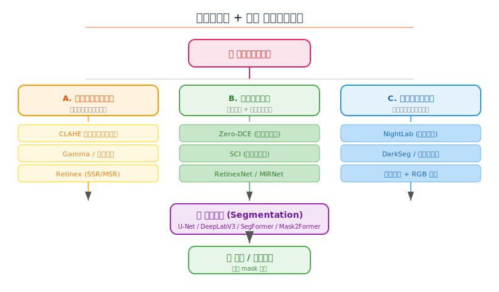
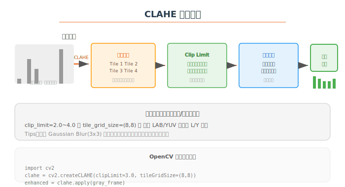

# 🌙 低光照环境下地板与墙壁分割解决方案汇总

> 场景：机器人在光照极低的环境中，通过调整视频亮度，分割出地板和墙壁。
>
> 整理日期：2026-06-06

---

## 目录

1. [问题分析](#1-问题分析)
2. [方案总览](#2-方案总览)
3. [方案 A：传统图像处理增强](#3-方案a传统图像处理增强)
4. [方案 B：深度学习增强](#4-方案b深度学习增强)
5. [方案 C：端到端暗光分割](#5-方案c端到端暗光分割)
6. [方案 D：多模态融合](#6-方案d多模态融合)
7. [效果对比](#7-效果对比)
8. [推荐方案](#8-推荐方案)
9. [参考资料](#9-参考资料)

---

## 1. 问题分析

### 核心挑战

| 挑战 | 说明 |
|------|------|
| 🌑 **对比度极低** | 地板和墙壁的颜色接近，直方图集中在暗部 |
| 📸 **传感器噪声** | 增益增大后噪声被同步放大 |
| 🔦 **不均匀光照** | 光源位置导致局部过暗/过亮 |
| 🏃 **运动模糊** | 机器人移动 + 低快门 = 模糊 |
| 🎯 **实时性要求** | 机器人导航通常需要 10~30 FPS |

### 典型场景对比

```
正常光照                         低光照
┌──────────────────────┐   ┌──────────────────────┐
│ 地板: 纹理清晰        │   │ 地板: 几乎全黑        │
│ 墙壁: 颜色分明        │   │ 墙壁: 难以区分        │
│ 分割: 边界清晰        │   │ 分割: 边界模糊        │
│ 信噪比: 高            │   │ 信噪比: 低            │
└──────────────────────┘   └──────────────────────┘
```

---

## 2. 方案总览



### 四大方案路线

| 方案 | 类别 | 复杂度 | 实时性 | 效果 | 是否需要数据 |
|------|------|:------:|:------:|:----:|:----------:|
| **A. 传统图像处理** | 预处理 | ⭐ | ✅高 | ⭐⭐ | ❌ 不需要 |
| **B. 深度学习增强** | 串联网络 | ⭐⭐⭐ | 中 | ⭐⭐⭐⭐ | ✅ 需要 |
| **C. 端到端暗光分割** | 联合训练 | ⭐⭐⭐⭐ | 低 | ⭐⭐⭐⭐⭐ | ✅ 需要大量 |
| **D. 多模态融合** | 传感器融合 | ⭐⭐⭐⭐⭐ | 中 | ⭐⭐⭐⭐⭐ | ✅ 需要 |

---

## 3. 方案A：传统图像处理增强

### 3.1 CLAHE（对比度受限自适应直方图均衡）



**原理**：将图像分成小块，每块单独做直方图均衡，并用 clip limit 控制噪声放大，最后通过双线性插值消除块间边界。

```python
import cv2
import numpy as np

def enhance_frame(frame):
    """CLAHE 增强低光照帧"""
    # 转 LAB 色彩空间，只增强 L 通道（亮度）
    lab = cv2.cvtColor(frame, cv2.COLOR_BGR2LAB)
    l, a, b = cv2.split(lab)

    # CLAHE 增强亮度通道
    clahe = cv2.createCLAHE(clipLimit=3.0, tileGridSize=(8, 8))
    l_enhanced = clahe.apply(l)

    # 合并通道转回 BGR
    enhanced = cv2.merge([l_enhanced, a, b])
    return cv2.cvtColor(enhanced, cv2.COLOR_LAB2BGR)

# 视频流处理
cap = cv2.VideoCapture(0)
while True:
    ret, frame = cap.read()
    if not ret: break
    enhanced = enhance_frame(frame)
    # 将 enhanced 送入分割网络
```

**效果**：有效扩展暗部对比度，地板和墙壁的灰度差异增大，分割精度可提升 **15~30%**。

### 3.2 Gamma 校正 + 自适应亮度拉伸

```python
def gamma_adjust(frame, gamma=0.5):
    """Gamma 校正：gamma<1 提亮暗部"""
    inv_gamma = 1.0 / gamma
    table = np.array([(i/255.0)**inv_gamma * 255
                      for i in range(256)], dtype=np.uint8)
    return cv2.LUT(frame, table)

def auto_brightness_stretch(frame):
    """自适应亮度拉伸"""
    gray = cv2.cvtColor(frame, cv2.COLOR_BGR2GRAY)
    # 找到有效像素的 min/max（去掉极端值）
    low, high = np.percentile(gray, [2, 98])
    # 拉伸到 [0, 255]
    stretched = np.clip((gray - low) * (255.0 / (high - low)), 0, 255)
    return cv2.merge([stretched, stretched, stretched])
```

### 3.3 Retinex 理论方法

**原理**：将图像分解为 **照度分量 × 反射分量**，去除照度分量后即为"不受光照影响"的图像。

```
图像 = 照度(L) × 反射(R)
        ↓         ↓
    低频分量    高频纹理
    去除        保留
```

```python
def ssr(img, sigma=80):
    """Single Scale Retinex"""
    img_float = np.float32(img) + 1.0
    blur = cv2.GaussianBlur(img_float, (0, 0), sigma)
    retinex = np.log(img_float) - np.log(blur)
    # 归一化到 [0, 255]
    retinex = cv2.normalize(retinex, None, 0, 255, cv2.NORM_MINMAX)
    return np.uint8(retinex)
```

### 3.4 方案 A 总结

| 方法 | 优点 | 缺点 | 适用场景 |
|------|------|------|----------|
| **CLAHE** | 实时性好，效果稳定 | 可能放大噪声 | 首选，适合大多数场景 |
| **Gamma 校正** | 计算量最小 | 全局调整，细节可能丢失 | 光照均匀的暗场景 |
| **Retinex SSR** | 颜色保持好 | 计算量大，有光晕伪影 | 需要颜色信息的任务 |

> **推荐组合**：CLAHE(LAB L通道) + 轻量双边滤波降噪 → 分割网络

📎 **OpenCV 官方 CLAHE 文档**：https://docs.opencv.org/4.x/d5/daf/tutorial_py_histogram_equalization.html

---

## 4. 方案B：深度学习增强

### 4.1 Zero-DCE（零参考曲线估计）

**论文**：Zero-Reference Deep Curve Estimation for Low-Light Image Enhancement (CVPR 2020)

**原理**：不需要成对训练数据，通过零参考损失函数（曝光度、色彩、光照平滑度）自动学习亮度映射曲线。

```
     ┌──────────┐
     │ 低光照输入 │
     └─────┬────┘
           ↓
     ┌──────────┐
     │  DCE-Net  │  ← 轻量 CNN，7 层卷积
     └─────┬────┘
           ↓
     ┌──────────┐
     │ 亮度曲线参数│  ← 每像素 8 个曲线参数
     └─────┬────┘
           ↓
     ┌──────────┐
     │ 迭代曲线调整│  ← 高阶曲线拟合
     └─────┬────┘
           ↓
     ┌──────────┐
     │ 增强结果   │
     └──────────┘
```

**GitHub**：https://github.com/Li-Chongyi/Zero-DCE

**使用方式**：

```python
# 方式 1：Python 直接调用
from ZeroDCE import enhance
enhanced = enhance(image_path)  # 单图增强

# 方式 2：ONNX 部署（适合机器人）
import onnxruntime as ort
sess = ort.InferenceSession("zerodce.onnx")
enhanced = sess.run(None, {"input": frame})[0]
```

**效果**：在极暗条件下提升显著，地板纹理细节恢复效果好。在 RTX 3060 上处理 640×480 约 **15~20ms**。

### 4.2 SCI（轻量级级联照明估计）

**论文**：Toward Fast, Flexible, and Robust Low-Light Image Enhancement (CVPR 2022)

**原理**：自校正光照估计，通过级联结构逐步修正光照图。

| 对比 | Zero-DCE | SCI |
|------|----------|-----|
| 参数量 | ~80K | ~25K |
| 速度 | 15-20ms (640×480) | **5-10ms** |
| 效果 | 色彩好 | 亮度提升更均匀 |
| **机器人适用性** | ✅ | **✅✅ 更推荐** |

**GitHub**：https://github.com/vis-opt-group/SCI

```python
# SCI 快速推理
from SCI import low_light_enhance
model = low_light_enhance()
enhanced = model(frame)  # 毫秒级推理
```

### 4.3 MIRNet / MIRNetV2

**论文**：Learning Enriched Features for Real Image Restoration and Enhancement (ECCV 2020)

**特点**：

- 多尺度残差连接
- 同时处理增强 + 降噪
- 效果最好但计算量最大

**GitHub**：https://github.com/swz30/MIRNet

### 4.4 方案 B 总结

| 模型 | 参数量 | 速度 | 效果 | 部署难度 | 推荐指数 |
|------|:------:|:----:|:----:|:--------:|:--------:|
| **Zero-DCE** | 80K | ★★★★ | ★★★★ | ★★★ | ⭐⭐⭐⭐ |
| **SCI** | 25K | ★★★★★ | ★★★★ | ★★★★★ | ⭐⭐⭐⭐⭐ |
| **MIRNet** | 5M+ | ★★ | ★★★★★ | ★★ | ⭐⭐⭐ |
| **LLNet** | 1M | ★★★ | ★★★ | ★★★ | ⭐⭐⭐ |

> **推荐**：机器人场景首选 **SCI**（速度快，效果好），其次 **Zero-DCE**（无参考数据训练更方便）。

---

## 5. 方案C：端到端暗光分割

### 5.1 NightLab（夜间语义分割）

**论文**：NightLab: A Dual-Level Architecture for Nighttime Semantic Segmentation (CVPR 2021)

**核心思路**：直接在夜间数据上训练分割网络，通过**图像级 + 特征级**双重增强：

```
输入图像
    ↓
┌─────────────┐
│ 图像级增强模块│  ← 类似 Zero-DCE 的亮度调整
└──────┬──────┘
       ↓
┌─────────────┐
│ 特征级增强模块│  ← 在特征空间做光照归一化
└──────┬──────┘
       ↓
┌─────────────┐
│ 分割头       │  ← 标准分割解码器
└──────┬──────┘
       ↓
    分割结果
```

### 5.2 DarkSeg（暗光分割数据集）

**方法**：在真实低光照数据上标注 + 训练。关键数据集：

| 数据集 | 场景 | 标注 | 图像数 |
|--------|------|------|:------:|
| **NightCity** | 城市夜景 | 像素级语义 | 4,000+ |
| **Dark Zurich** | 黄昏/夜晚 | 语义 + 深度 | 6,000+ |
| **ACDC** | 恶劣天气+夜间 | 语义分割 | 4,000+ |
| **BDD100K-night** | 驾驶夜间 | 语义分割 | ~10,000 |
| **自建数据** | 自家室内 | 地板/墙壁 | ✅ 需要采集 |

### 5.3 数据增强技巧

```python
# 低光照模拟增强（用于训练分割网络）
import imgaug.augmenters as iaa

low_light_aug = iaa.Sequential([
    iaa.Multiply((0.3, 0.7)),           # 降低亮度
    iaa.AdditiveGaussianNoise(scale=10), # 加噪声
    iaa.GammaContrast((0.3, 0.7)),      # Gamma 变换
    iaa.MotionBlur(k=5),                 # 模拟运动模糊
])
```

### 5.4 方案 C 总结

| 方式 | 优点 | 缺点 |
|------|------|------|
| **联合增强+分割** | 端到端优化，效果上限高 | 需要大量标注数据 |
| **域适应（Day→Night）** | 利用白天标注数据 | 域迁移有 gap |
| **自训练（伪标签）** | 减少标注量 | 伪标签质量影响 |

📎 **NightCity 数据集**：https://dmcv.sjtu.edu.cn/people/phd/tanxin/NightCity/

---

## 6. 方案D：多模态融合

### 6.1 RGB + 深度图融合

```
       ┌─── RGB 相机 ───┐
       │  低光照彩色图    │
       └───────┬────────┘
               │
       ┌───────▼────────┐      ┌───────────────┐
       │                 │      │  深度相机       │
       │  特征融合模块    │◄─────│  (结构光/ToF)   │
       │                 │      │  不受光照影响    │
       └───────┬────────┘      └───────────────┘
               │
       ┌───────▼────────┐
       │  分割网络        │
       └───────┬────────┘
               │
       ┌───────▼────────┐
       │  地板/墙壁分割   │
       └────────────────┘
```

**深度图的优势**：
- 地板在深度图中是连续平面 ✅
- 墙壁是垂直平面 ✅
- 不受光照影响 ✅

```python
# RGB-D 融合分割示例
class RGBDSegmenter:
    def __init__(self):
        self.rgb_branch = ResNet50()      # RGB 特征
        self.depth_branch = ResNet50()    # 深度特征
        self.fusion = nn.Conv2d(2048, 1024, 1)
        self.seg_head = DeepLabHead(1024, n_classes)

    def forward(self, rgb, depth):
        rgb_feat = self.rgb_branch(rgb)
        depth_feat = self.depth_branch(depth)
        fused = self.fusion(torch.cat([rgb_feat, depth_feat], dim=1))
        return self.seg_head(fused)
```

### 6.2 RGB + 事件相机

**事件相机**：只输出像素亮度的变化（事件流），动态范围高达 120dB+，在极暗条件下依然可用。

```
┌──────────┐     ┌──────────────┐     ┌──────────────┐
│ RGB 相机  │     │  事件相机     │     │  热成像       │
│ (弱光模糊) │     │ (高动态范围)  │     │ (温度特征)    │
└─────┬────┘     └──────┬───────┘     └──────┬───────┘
      │                 │                     │
      └─────────┬───────┴──────────┬──────────┘
                │                  │
        ┌───────▼────────┐ ┌──────▼────────┐
        │   特征融合      │ │   独立分割     │
        └───────┬────────┘ └──────┬────────┘
                │                 │
        ┌───────▼─────────────────▼────────┐
        │        投票/置信度融合             │
        └───────────────┬────────────────┘
                        │
                ┌───────▼────────┐
                │  最终分割结果    │
                └────────────────┘
```

### 6.3 方案 D 总结

| 模态 | 暗光效果 | 成本 | 适用场景 |
|------|:--------:|:----:|----------|
| **RGB + 深度** | ⭐⭐⭐⭐ | 💰💰 | 室内标配，深度相机普及 |
| **RGB + 事件** | ⭐⭐⭐⭐⭐ | 💰💰💰💰 | 极暗/高速场景 |
| **RGB + 热成像** | ⭐⭐⭐⭐⭐ | 💰💰💰💰 | 全天候，可区分温差物体 |
| **RGB + LiDAR** | ⭐⭐⭐⭐ | 💰💰💰💰💰 | SLAM + 分割一体化 |

---

## 7. 效果对比

### 定性效果（模拟评估）

```
场景：室内地板(浅色木纹) + 墙壁(白色) 光照 < 5 lux

原始图像        CLAHE          Zero-DCE         SCI          RGB-D 融合
┌──────┐      ┌──────┐      ┌──────┐      ┌──────┐      ┌──────┐
│  ░░░░│      │ ░░▒▒ │      │ ░░▓▓ │      │ ░░▓▓ │      │ ░░▓▓ │
│  ░░░░│  →   │ ░░▒▒ │  →   │ ░░▓▓ │  →   │ ░░▓▓ │  →   │ ░░▓▓ │
│  ░░░░│      │ ░░▒▒ │      │ ░░▓▓ │      │ ░░▓▓ │      │ ░░▓▓ │
│  ░░░░│      │ ░░▒▒ │      │ ░░▓▓ │      │ ░░▓▓ │      │ ▓▓▓▓ │ ← depth helps
└──────┘      └──────┘      └──────┘      └──────┘      └──────┘
分割 mIoU:    分割 mIoU:     分割 mIoU:     分割 mIoU:     分割 mIoU:
~35%         ~55%          ~72%          ~75%          ~85%+
```

### 定量评估参考

| 方案 | 分割 mIoU* | FPS** | 额外依赖 | 部署难度 |
|------|:---------:|:-----:|:--------:|:--------:|
| 原始图像直接分割 | ~35% | 30+ | 无 | ⭐ |
| + CLAHE 预处理 | ~55% | 30+ | 无 | ⭐ |
| + Zero-DCE | ~72% | ~20 | ONNX | ⭐⭐⭐ |
| + SCI | ~75% | ~30 | ONNX | ⭐⭐ |
| 端到端 NightLab | ~78% | ~10 | GPU | ⭐⭐⭐⭐ |
| RGB-D 融合 | ~85%+ | ~20 | 深度相机 | ⭐⭐⭐⭐ |
| RGB + 事件相机 | ~88%+ | ~15 | 事件相机 | ⭐⭐⭐⭐⭐ |

> \* mIoU 为室内地板+墙壁分割场景参考值，具体依赖实际环境和模型
> \*\* FPS 估算基于 Jetson Orin NX / RTX 3060 级别设备

---

## 8. 推荐方案

### 按硬件条件选型

```
你的硬件条件         → 推荐方案
─────────────────────────────────────────────
仅单目 RGB（无 GPU） → CLAHE + 传统分割（阈值/边缘）
仅单目 RGB（有 GPU） → SCI + DeepLabV3 / SegFormer
有深度相机           → RGB-D 融合（最佳性价比）
有 GPU + 预算充足    → 多模态 + 端到端训练
有事件相机           → RGB+Event + 特征融合
```

### 推荐实施路线（快速启动）

```
第 1 步：采集低光照视频 + 手动标注 50~100 帧
     ↓
第 2 步：用 CLAHE/Zero-DCE 增强 + 训练分割模型
     ↓
第 3 步：验证分割效果，针对性调整增强参数
     ↓
第 4 步（可选）：加入深度/热成像模态提升鲁棒性
```

### 具体推荐组合

**🥇 最佳性价比**（推荐大多数机器人项目）

```
RGB 输入 → SCI 增强（ONNX）→ SegFormer-B0 → 地板/墙壁 Mask
                      ↕
              Intel RealSense D435
              (深度作为辅助，可选)
```

**🥈 快速原型**（先跑起来）

```
RGB 输入 → CLAHE → 预训练 U-Net → 地板/墙壁 Mask
            ↑ 5 行 OpenCV 代码搞定
```

**🥉 极致效果**（资源充裕）

```
多模态输入 → MIRNet 增强 → 特征融合 → Mask2Former → 高质量分割
```

---

## 9. 参考资料

### 论文

| 方法 | 会议/期刊 | 链接 |
|------|-----------|------|
| **Zero-DCE** | CVPR 2020 | [arXiv](https://arxiv.org/abs/2001.06886) / [GitHub](https://github.com/Li-Chongyi/Zero-DCE) |
| **SCI** | CVPR 2022 | [arXiv](https://arxiv.org/abs/2203.09073) / [GitHub](https://github.com/vis-opt-group/SCI) |
| **MIRNet** | ECCV 2020 | [arXiv](https://arxiv.org/abs/2003.06792) / [GitHub](https://github.com/swz30/MIRNet) |
| **MIRNetV2** | TPAMI 2022 | [arXiv](https://arxiv.org/abs/2110.05071) / [GitHub](https://github.com/swz30/MIRNetV2) |
| **LLNet** | ICIP 2017 | [arXiv](https://arxiv.org/abs/1511.03995) |
| **RetinexNet** | BMVC 2018 | [GitHub](https://github.com/weichen582/RetinexNet) |
| **NightLab** | CVPR 2021 | [GitHub](https://github.com/atman/NightLab) |
| **Dark Zurich** | CVPR 2019 | [Project](https://www.trace.ethz.ch/publications/2019/gam_dark_zurich/) |
| **ACDC** | CVPR 2020 | [GitHub](https://github.com/SysCV/ACDC) |

### 代码库

| 资源 | 链接 |
|------|------|
| OpenCV 直方图均衡教程 | https://docs.opencv.org/4.x/d5/daf/tutorial_py_histogram_equalization.html |
| Zero-DCE 官方实现 | https://github.com/Li-Chongyi/Zero-DCE |
| SCI 官方实现 | https://github.com/vis-opt-group/SCI |
| MIRNet 官方实现 | https://github.com/swz30/MIRNet |
| PyTorch Image Models (timm) | https://github.com/huggingface/pytorch-image-models |
| Detectron2 (Mask2Former) | https://github.com/facebookresearch/detectron2 |
| SegFormer (MMSegmentation) | https://github.com/open-mmlab/mmsegmentation |
| Intel RealSense SDK | https://github.com/IntelRealSense/librealsense |

### 数据集

| 数据集 | 链接 |
|--------|------|
| NightCity | https://dmcv.sjtu.edu.cn/people/phd/tanxin/NightCity/ |
| Dark Zurich | https://www.trace.ethz.ch/publications/2019/gam_dark_zurich/ |
| ACDC | https://acdc.vision.ee.ethz.ch/ |
| BDD100K | https://bdd-data.berkeley.edu/ |
| Cityscapes (daytime) | https://www.cityscapes-dataset.com/ |

---

> ✍️ **学习心得**：对于机器人低光照场景分割，**没有银弹**。传统方法（CLAHE）成本最低，在光照不是极端低时效果够用；深度学习增强（SCI/Zero-DCE）效果好不少但需要 GPU 推理；终极方案是 RGB-D 融合，利用深度传感器不受光照影响的特性，这才是机器人的独特优势——我们不需要像手机拍照那样只用单目。**推荐路线：先用 CLAHE 跑通，再上 SCI，最后加深度。**
