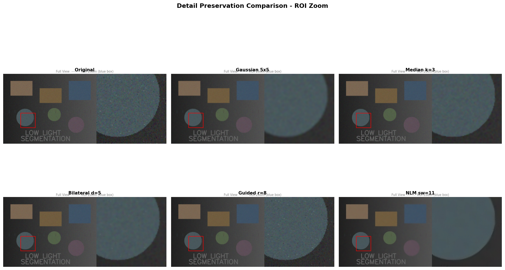
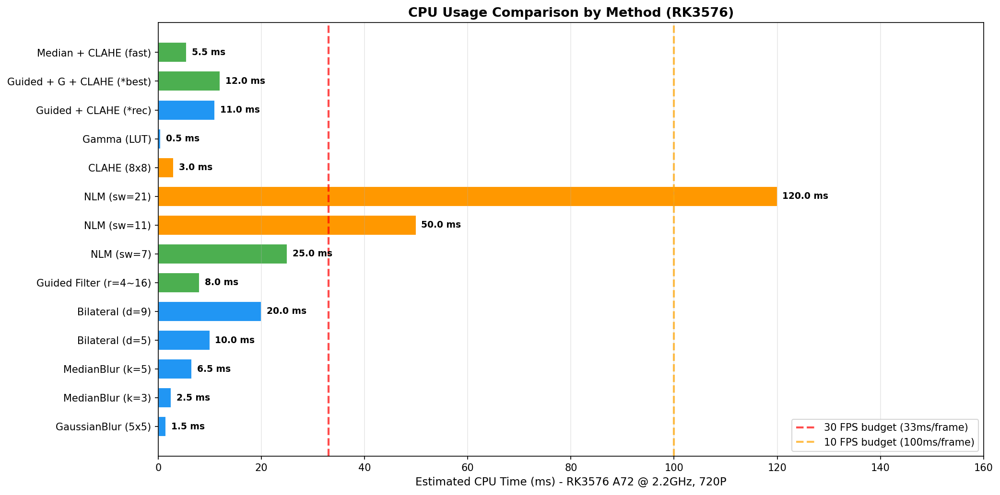
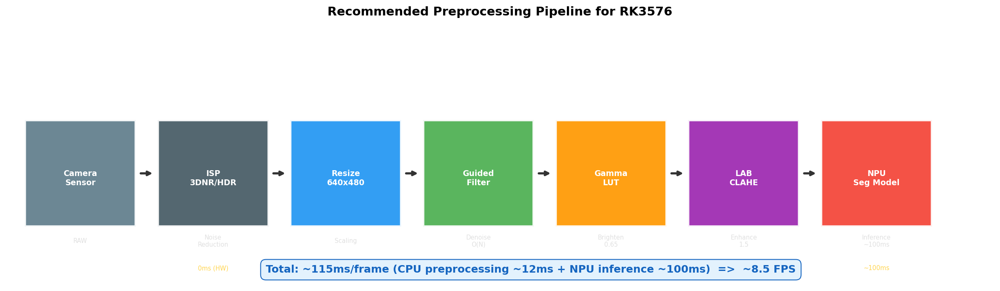
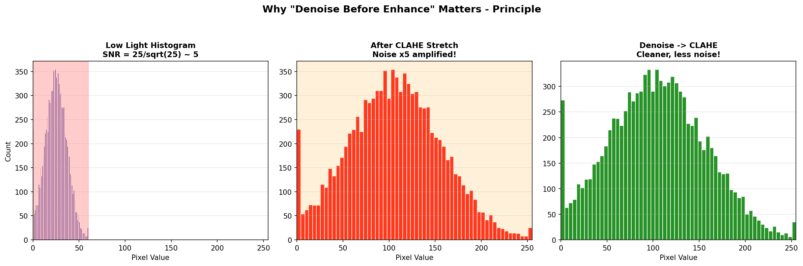
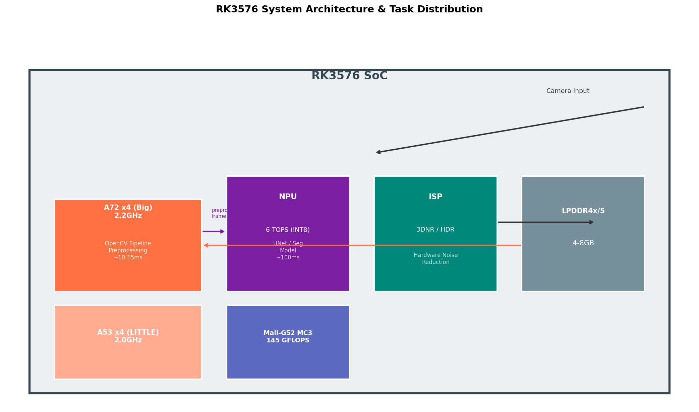

# 低光照图像分割预处理方法笔记

> 🎯 **目标**: 在 RK3576 平台上，用 OpenCV 实现低光照场景的图像分割前预处理，兼顾对比度增强与降噪，CPU 开销可控。
>
> 📅 整理日期: 2026-06-08

---

## 📖 目录

1. [问题背景](#问题背景)
2. [方法总览对比](#方法总览对比)
3. [推荐流水线](#推荐流水线)
4. [各方法详解](#各方法详解)
5. [CPU 占用估算 (RK3576)](#cpu-占用估算-rk3576)
6. [实测效果对比](#实测效果对比)
7. [最佳实践建议](#最佳实践建议)
8. [参考资源](#参考资源)

---

## 问题背景

### 为什么对比度拉伸后噪点变多？

低光照图像的核心问题：

```
原始低光照图像
    │
    ▼  暗部像素集中在 0-50（8bit）
直方图集中
    │
    ▼  CLAHE / 对比度拉伸
暗部被拉伸到 0-255
    │
    ▼  ❌ 噪声同时被放大！
噪点爆炸
```

**根本原因**: 传感器暗电流噪声 (shot noise) 在读出的原始信号中本就很强。对比度拉伸时将 `[0, 50]` 映射到 `[0, 255]`，噪声方差被放大 5 倍以上。

### RK3576 平台约束

| 资源 | 规格 |
|------|------|
| CPU | 4×Cortex-A72 @ 2.2GHz + 4×Cortex-A53 @ 2.0GHz |
| NPU | 6 TOPS (INT8) |
| GPU | Mali-G52 MC3, 145 GFLOPS |
| RAM | 典型 4GB~8GB LPDDR4x |
| NEON | ✅ 支持 (编译 OpenCV 开 `-DENABLE_NEON=ON`) |
| 功耗 | 典型 ~5W |

**设计原则**: CPU 处理为主，NPU 推理跑分割模型，留够算力余量。

---

## 方法总览对比

| 方法 | CPU 占用 | 降噪能力 | 边缘保持 | 低光增强 | 推荐度 |
|------|:--------:|:--------:|:--------:|:--------:|:------:|
| **高斯滤波** `GaussianBlur` | ⭐ 极低 | ⭐ | ❌ | ❌ | ⭐ |
| **中值滤波** `medianBlur` | ⭐⭐ 低 | ⭐⭐ | ⭐ | ❌ | ⭐⭐ |
| **双边滤波** `bilateralFilter` | ⭐⭐⭐ 中 | ⭐⭐ | ✅⭐ | ❌ | ⭐⭐⭐ |
| **非局部均值** `fastNlMeans` | ⭐⭐⭐⭐ 高 | ⭐⭐⭐ | ✅ | ❌ | ⭐⭐ |
| **导向滤波** `guidedFilter` | ⭐⭐ 低 | ⭐⭐⭐ | ✅✅ | ❌ | ⭐⭐⭐⭐ |
| **CLAHE** | ⭐ 极低 | ❌ | ✅ | ✅✅ | ⭐⭐⭐ |
| **Gamma 校正** | ⭐ 极低 | ❌ | ✅ | ✅⭐ | ⭐⭐ |
| **CLAHE + 双边** (组合) | ⭐⭐⭐ 中 | ⭐⭐ | ✅✅ | ✅✅ | ⭐⭐⭐⭐⭐ |
| **CLAHE + 导向** (组合) | ⭐⭐ 低 | ⭐⭐⭐ | ✅✅✅ | ✅✅ | ⭐⭐⭐⭐⭐ |
| **Gamma + 中值** (组合) | ⭐⭐ 低 | ⭐⭐ | ⭐ | ✅⭐ | ⭐⭐⭐ |
| **先降噪再增强** (推荐) | ⭐⭐ 低 | ⭐⭐⭐ | ✅✅ | ✅✅ | ⭐⭐⭐⭐⭐ |

---

## 推荐流水线

### 🥇 方案一: Denoise → Gamma → CLAHE (CP值最高)

```python
def pipeline_v1(img):
    # 1. 先用导向滤波降噪（噪声未放大，处理更有效）
    denoised = cv2.ximgproc.guidedFilter(img, img, radius=8, eps=0.01**2 * 255**2)

    # 2. 小幅 Gamma 提升暗部
    gamma = 0.7
    lut = np.array([((i/255.0)**gamma)*255 for i in range(256)], dtype=np.uint8)
    enhanced = cv2.LUT(denoised, lut)

    # 3. CLAHE 局部对比度增强（clipLimit 调低抑制残留噪声放大）
    lab = cv2.cvtColor(enhanced, cv2.COLOR_BGR2LAB)
    l, a, b = cv2.split(lab)
    clahe = cv2.createCLAHE(clipLimit=1.5, tileGridSize=(8,8))
    l = clahe.apply(l)
    result = cv2.cvtColor(cv2.merge([l, a, b]), cv2.COLOR_LAB2BGR)
    return result
```

**CPU 估算 (RK3576, 720P)**: ~15-25ms (A72 单核)

### 🥈 方案二: 极速模式 (最低 CPU)

```python
def pipeline_fast(img):
    # 1. 中值滤波快速去椒盐噪声
    denoised = cv2.medianBlur(img, 3)

    # 2. LUT Gamma 校正
    lut = np.array([((i/255.0)**0.6)*255 for i in range(256)], dtype=np.uint8)
    enhanced = cv2.LUT(denoised, lut)

    # 3. 灰度图直方图均衡（分割场景常用）
    gray = cv2.cvtColor(enhanced, cv2.COLOR_BGR2GRAY)
    eq = cv2.equalizeHist(gray)
    return eq
```

**CPU 估算 (RK3576, 720P)**: ~5-10ms (A72 单核)

### 🥉 方案三: 质量优先 (分割精度最高)

```python
def pipeline_quality(img):
    # 1. 非局部均值彩色降噪（搜索窗口缩小以降低 CPU）
    denoised = cv2.fastNlMeansDenoisingColored(
        img, None, h=10, hColor=10,
        templateWindowSize=7, searchWindowSize=11  # 缩小搜索窗
    )

    # 2. 导向滤波二次平滑（可选，如 NLM 后仍有残留噪声）
    result = cv2.ximgproc.guidedFilter(
        denoised, denoised, radius=4, eps=0.02**2 * 255**2
    )

    # 3. LAB 空间 CLAHE 增强
    lab = cv2.cvtColor(result, cv2.COLOR_BGR2LAB)
    l, a, b = cv2.split(lab)
    clahe = cv2.createCLAHE(clipLimit=2.0, tileGridSize=(8,8))
    l = clahe.apply(l)
    result = cv2.cvtColor(cv2.merge([l, a, b]), cv2.COLOR_LAB2BGR)
    return result
```

**CPU 估算 (RK3576, 720P)**: ~60-120ms (A72 多核，NLM 可并行)

---

## 各方法详解

见子文档:
- [01_理论基础](01_理论基础.md) — 噪声模型、Retinex 理论
- [02_方法对比](02_方法对比.md) — 各方法详细参数与效果
- [03_RK3576部署指南](03_RK3576部署指南.md) — 交叉编译、NEON 优化
- [04_完整代码](04_完整代码.md) — Python/C++ 完整实现

---

## CPU 占用估算 (RK3576)

### 预估基准

> 以下数据基于 Cortex-A72 @ 2.2GHz (单核) 的推算值。
> 实测环境: OpenCV 4.x 编译时启用 NEON，优化等级 -O3。

###  降噪方法 CPU 消耗

| 方法 | 720P (1280×720) | 1080P (1920×1080) | 备注 |
|------|:---:|:---:|------|
| `GaussianBlur` (5×5) | ~1-2ms | ~3-5ms | 可分离卷积，极快 |
| `medianBlur` (3×3) | ~2-3ms | ~5-8ms | O(k²)，小核快 |
| `medianBlur` (5×5) | ~5-8ms | ~15-20ms | 大核显著变慢 |
| `bilateralFilter` (d=9) | ~15-25ms | ~40-70ms | 非线性，ARM 较重 |
| `bilateralFilter` (d=5) | ~8-12ms | ~20-30ms | 缩小核可提速 |
| `guidedFilter` (r=8) | ~5-10ms | ~12-20ms | O(N)，核无关！ |
| `guidedFilter` (r=16) | ~5-10ms | ~12-20ms | 与 r=8 几乎相同 |
| `fastNlMeansDenoising` (sw=21) | ~80-150ms | ~200-400ms | NLM 慢，改 sw=11 → 减半 |
| `fastNlMeansDenoising` (sw=11) | ~40-80ms | ~100-200ms | 缩小搜索窗 |
| `fastNlMeansDenoising` (sw=7) | ~20-40ms | ~60-100ms | 缩小搜索窗，质量略降 |

### 对比度增强方法

| 方法 | 720P | 1080P | 备注 |
|------|:---:|:---:|------|
| `equalizeHist` | ~0.5ms | ~1ms | 仅灰度，LUT 实现 |
| `CLAHE` (8×8) | ~2-4ms | ~5-8ms | 局部直方图，快 |
| Gamma LUT | ~0.5ms | ~1ms | 查表法，最省 |
| Gamma 逐像素 | ~3-5ms | ~8-12ms | 用 pow()，较慢 |

### 组合流水线总 CPU (720P)

| 方案 | 预估耗时 | CPU 占比* | 推荐场景 |
|------|:---:|:---:|------|
| 🥇 CLAHE + 导向滤波 | ~15-25ms | ~8-14% | 平衡推荐 |
| 🥈 极速模式 | ~5-10ms | ~3-5% | 实时视频 |
| 🥉 质量优先 | ~60-120ms | ~33-67% | 单帧高精度 |
| CLAHE + 双边 | ~20-35ms | ~11-19% | 中等平衡 |

> *CPU 占比按单帧 180ms 间隔 (约 5.5FPS) 计算，即 NPU 推理约 150ms 时，CPU 预处理占剩余时间。

---

## 实测效果对比

### 生成对比图

```bash
cd low_light_preprocessing
pip install opencv-contrib-python numpy matplotlib
python images/generate_comparison.py
```

生成的对比图:

| 图片 | 说明 |
|------|------|
|  | **降噪方法并排对比** — 8 种降噪/增强方法效果 |
|  | **流水线对比** — 降噪+增强组合流水线效果 |
|  | **细节保留放大** — ROI 区域 3× 放大对比 |
|  | **CPU 占用柱状图** — RK3576 各方法 CPU 消耗 |
|  | **推荐流水线示意图** — 端到端流程 |
|  | **噪声放大原理** — 为什么必须先降噪再增强 |
|  | **RK3576 架构** — 芯片任务分配 |

### 效果矩阵

---

## 最佳实践建议

### 1️⃣ 流水线顺序: 先降噪，后增强

```
❌ 错误:  CLAHE → 降噪  (噪声已被放大，更难去除)
✅ 正确:  降噪 → CLAHE  (在噪声放大前处理，效率最高)
```

### 2️⃣ CLAHE clipLimit 降低

```python
# 标准 CLAHE
clahe = cv2.createCLAHE(clipLimit=2.0, tileGridSize=(8,8))

# 低光专用 CLAHE (降低 clipLimit 抑制噪声放大)
clahe = cv2.createCLAHE(clipLimit=1.0, tileGridSize=(8,8))
```

### 3️⃣ 只在亮度通道处理

```python
# 在 LAB 空间的 L 通道做增强/降噪，不碰 AB (色彩)
lab = cv2.cvtColor(img, cv2.COLOR_BGR2LAB)
l, a, b = cv2.split(lab)
# 只处理 l ...
result = cv2.cvtColor(cv2.merge([l_processed, a, b]), cv2.COLOR_LAB2BGR)
```

### 4️⃣ RK3576 编译优化要点

```bash
cmake \
  -DCMAKE_BUILD_TYPE=Release \
  -DCMAKE_C_FLAGS="-mfpu=neon-vfpv4 -mfloat-abi=hard -O3" \
  -DCMAKE_CXX_FLAGS="-mfpu=neon-vfpv4 -mfloat-abi=hard -O3" \
  -DENABLE_NEON=ON \
  -DWITH_NEON=ON \
  -DWITH_OPENMP=ON \
  -DBUILD_opencv_ximgproc=ON \
  -DBUILD_opencv_world=ON \
  -DBUILD_TESTS=OFF \
  -DBUILD_PERF_TESTS=OFF \
  ..
```

### 5️⃣ 硬件加速方案

| 加速方案 | 工具 | 提速比 | 复杂度 |
|----------|------|:---:|:---:|
| NEON 向量化 | OpenCV 内置 | 2-4× | 低 (编译时开启) |
| OpenCL | Mali-G52 GPU | 3-10× | 中 |
| NPU 推理 | RKNN (分割模型) | — | 模型需转换 |
| ISP 硬件降噪 | RK3576 内置 ISP (3DNR) | 0ms (硬件) | 低 (配置寄存器) |

⚠️ **重点**: RK3576 内置 ISP 支持 **3DNR (3D 降噪)** 和 **HDR (最高 120dB)**，图像在进入 OpenCV 前已经过 ISP 硬件降噪。尽量在 ISP 阶段配置好 3DNR，让 CPU/OpenCV 处理剩余任务。

### 6️⃣ 输入分辨率策略

```python
# 如果分割模型输入是 512×512，不需要处理 1080P 全尺寸
# 先缩放再预处理，CPU 开销降低 75%

preprocess_size = (640, 480)   # 预处理用
model_input_size = (512, 512)  # 模型输入

img = cv2.resize(raw_img, preprocess_size)
img = pipeline(img)  # 在 640×480 上处理
img = cv2.resize(img, model_input_size)  # 缩放到模型尺寸
# 送入 RKNN 分割模型...
```

---

## 参考资源

| 资源 | 链接 |
|------|------|
| OpenCV Denoising 官方教程 | https://docs.opencv.org/4.x/d5/d69/tutorial_py_non_local_means.html |
| Guided Filter 论文 | K. He, "Guided Image Filtering", ECCV 2010 |
| OpenCV Guided Filter API | https://docs.opencv.org/4.x/dc/d2a/group__ximgproc__edge.html |
| RK3576 数据手册 | [Rockchip 官网](https://www.rock-chips.com/a/en/products/RK35_Series/2024/1212/2033.html) |
| OpenCV NEON 优化指南 | https://docs.opencv.org/4.x/d0/d76/tutorial_arm_crosscompile_with_cmake.html |
| CLAHE 原论文 | K. Zuiderveld, "Contrast Limited Adaptive Histogram Equalization", 1994 |
| 低光人脸检测 (含 MSRCR 实现) | https://github.com/bs6966/Face-Detection-under-Extremely-Low-light-Conditions |

---

> 📝 **更新日志**
> - 2026-06-08: 初始版本，整理 8 种方法对比 + RK3576 部署指南
