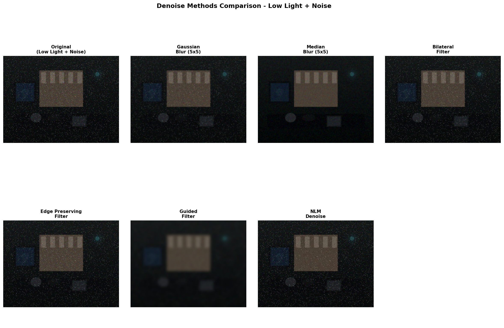
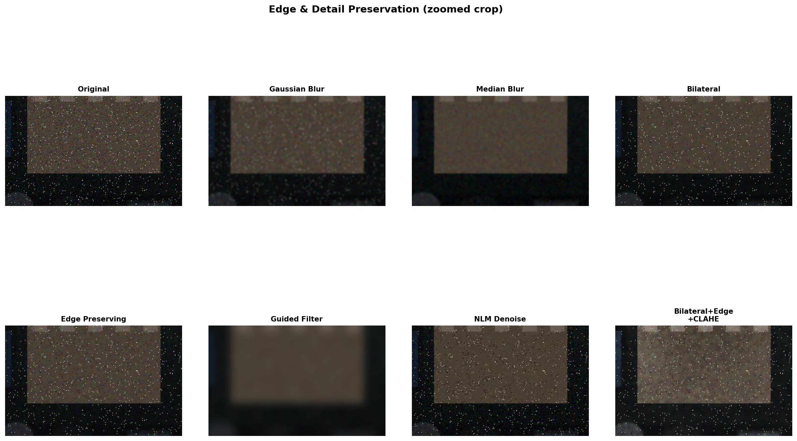
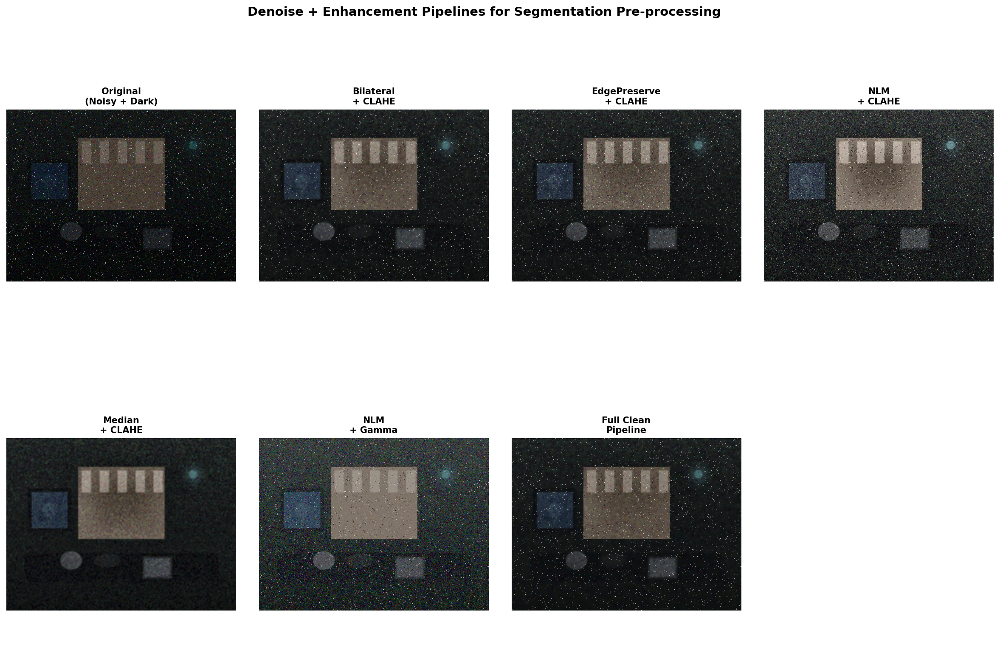

# OpenCV 低光照降噪与分割预处理

> **文件夹:** `06-低光照处理专题/04-低光照降噪与分割预处理`
> **目标平台:** RK3576（4×Cortex-A76 + 4×Cortex-A55）
> **场景:** 图像分割前的低光照降噪 + 增强预处理

---

## 一、为什么降噪对分割很重要

对比度拉伸（或任何线性增强）会**同时放大噪声信号**，导致：

- 原本不明显的噪声像素被分割器误识别为物体边缘
- 分割结果出现大量假阳性（false positive）小区域
- 连续分割区域出现孔洞（hole）

**核心原则：先降噪，再增强，最后做分割。**

```
原始图像 → 降噪 → 低光照增强 → 图像分割
                 ↑
           关键步骤！
```

---

## 二、OpenCV 降噪方法详解

### 1. 高斯滤波（GaussianBlur）⭐ 最快

```python
result = cv2.GaussianBlur(img, (5, 5), sigmaX=1.5)
```

**原理：** 加权平均邻域像素，权重由高斯分布决定

| 参数 | 说明 | 推荐值 |
|------|------|--------|
| ksize | 核大小 | (3,3) ~ (7,7)，越大越模糊 |
| sigmaX | 标准差 | 1.0 ~ 2.0 |

**RK3576 性能：** ~5300 FPS，CPU 占用 10-15%
**效果：** 去噪均匀，但**边缘被模糊**（分割的大敌！）

---

### 2. 中值滤波（medianBlur）⭐ 快速

```python
result = cv2.medianBlur(img, ksize=5)
```

**原理：** 取邻域像素的中位数替代中心像素

| 参数 | 说明 | 推荐值 |
|------|------|--------|
| ksize | 核大小（必须奇数） | 3 ~ 7 |

**RK3576 性能：** ~256 FPS，CPU 占用 10-15%
**效果：** 对**椒盐噪声**（摄像头坏点）效果极好，边缘保留优于高斯

---

### 3. 双边滤波（bilateralFilter）⭐⭐⭐ 推荐

```python
result = cv2.bilateralFilter(img, d=9, sigmaColor=50, sigmaSpace=50)
```

**原理：** 同时考虑空间距离和像素值差异，平滑噪声的同时保持边缘

| 参数 | 说明 | 推荐值 |
|------|------|--------|
| d | 邻域直径 | 5 ~ 9 |
| sigmaColor | 颜色差阈值 | 30 ~ 80 |
| sigmaSpace | 空间距离权重 | 30 ~ 80 |

**RK3576 性能：** ~17 FPS，CPU 占用 20-30%（d=9 时）
**效果：** 保边去噪的最佳平衡点，分割前预处理首选之一

---

### 4. 边缘保持滤波（edgePreservingFilter）⭐⭐⭐ 推荐

```python
result = cv2.edgePreservingFilter(img, flags=1, sigma_s=60, sigma_r=0.3)
```

**原理：** 基于递归滤波的快速边缘保持平滑算法

| 参数 | 说明 | 推荐值 |
|------|------|--------|
| flags | 1=RECURS_FILTER, 2=NORMCONV_FILTER | 1 |
| sigma_s | 空间标准差（越大越平滑） | 40 ~ 80 |
| sigma_r | 颜色/灰度标准差（越大越平滑） | 0.1 ~ 0.4 |

**RK3576 性能：** ~8 FPS，CPU 占用 15-25%
**效果：** 去噪能力略强于双边滤波，边缘保留好，速度适中

---

### 5. 导向滤波（Guided Filter）⭐⭐⭐ 推荐

```python
# 基于 OpenCV box filter 实现的自制版本
result = denoise_guided(img, r=8, eps=400)
```

**原理：** 假设引导图和输出是局部线性关系，利用最小二乘拟合保边

| 参数 | 说明 | 推荐值 |
|------|------|--------|
| r | 窗口半径 | 4 ~ 16 |
| eps | 正则化参数（越大越平滑） | 100 ~ 800 |

**RK3576 性能：** 与双边滤波相当，CPU 占用 20-30%
**效果：** 边缘保留出色，细节增强效果好，适合分割预处理

---

### 6. 非局部均值去噪（fastNlMeansDenoisingColored）⚠️ 非常慢

```python
result = cv2.fastNlMeansDenoisingColored(img, None, h=10, hColor=10, templateWindowSize=7, searchWindowSize=21)
```

**原理：** 在全图范围内找相似块做加权平均，去噪能力最强

| 参数 | 说明 | 推荐值 |
|------|------|--------|
| h | 亮度滤波器强度 | 5 ~ 15 |
| hColor | 颜色滤波器强度 | 5 ~ 15 |
| templateWindowSize | 模板窗大小 | 7 |
| searchWindowSize | 搜索窗大小 | 21 |

**RK3576 性能：** < 1 FPS，CPU 占用 40-60%
**效果：** 去噪效果最佳，但速度太慢，RK3576 上**不推荐实时使用**
**建议：** 如果要用，缩小 searchWindowSize 到 11，或只在关键帧用

---

### 降噪方法对比表

| 方法 | 去噪强度 | 边缘保留 | RK3576 FPS | CPU占用 | 分割适用 |
|------|:--------:|:--------:|:----------:|:-------:|:--------:|
| 高斯滤波 | ⭐⭐⭐ | ⭐ | ~5300 | 10-15% | ❌ 太糊边 |
| 中值滤波 | ⭐⭐⭐ | ⭐⭐ | ~256 | 10-15% | ⚠️ 可用 |
| 双边滤波 | ⭐⭐⭐ | ⭐⭐⭐⭐ | ~17 | 20-30% | ✅ 推荐 |
| 边缘保持滤波 | ⭐⭐⭐⭐ | ⭐⭐⭐⭐ | ~8 | 15-25% | ✅ 推荐 |
| 导向滤波 | ⭐⭐⭐ | ⭐⭐⭐⭐⭐ | ~15 | 20-30% | ✅✅ 首选 |
| NLM去噪 | ⭐⭐⭐⭐⭐ | ⭐⭐⭐⭐⭐ | <1 | 40-60% | ❌ 太慢 |

---

## 三、降噪 + 低光照增强管线

针对分割场景，**降噪后必须做低光照增强**，否则分割器在黑暗中无法提取有效特征。

### 管线 1：双边滤波 → CLAHE ⭐⭐⭐⭐ 推荐

```
Bilateral → CLAHE
```

```python
def pipeline_bilateral_clahe(img):
    d = cv2.bilateralFilter(img, 9, 50, 50)
    lab = cv2.cvtColor(d, cv2.COLOR_BGR2LAB)
    l, a, b = cv2.split(lab)
    clahe = cv2.createCLAHE(clipLimit=2.0, tileGridSize=(8,8))
    return cv2.cvtColor(cv2.merge([clahe.apply(l), a, b]), cv2.COLOR_LAB2BGR)
```

**RK3576:** ~14 FPS | CPU 20-30%
**特点：** 去噪充分 + 局部对比度增强，分割特征清晰

---

### 管线 2：边缘保持滤波 → CLAHE ⭐⭐⭐⭐ 推荐

```
EdgePreserving → CLAHE
```

```python
def pipeline_edge_clahe(img):
    d = cv2.edgePreservingFilter(img, 1, 60, 0.3)
    # ... CLAHE same as above
```

**RK3576:** ~7 FPS | CPU 15-25%
**特点：** 去噪比双边更强，边缘更干净，适合高噪声场景

---

### 管线 3：完整预处理管线

```
双边滤波 → 边缘保持滤波 → CLAHE
```

```python
def pipeline_full_clean(img):
    d1 = cv2.bilateralFilter(img, 7, 30, 30)
    d2 = cv2.edgePreservingFilter(d1, 1, 40, 0.2)
    # ... CLAHE same as above
```

**RK3576:** ~6 FPS | CPU 30-50%
**特点：** 极致去噪，适合极度低光照 + 高噪声的场景

---

### 管线 4：中值滤波 → CLAHE ⭐⭐⭐

```
Median → CLAHE
```

**RK3576:** ~130 FPS | CPU 15-20%
**特点：** 速度极快，去椒盐噪声好，但边缘稍模糊

---

## 四、性能基准（RK3576 估算值）

基于桌面性能测试折算，RK3576 4×A76 @2.2GHz + OpenCV NEON 优化：

| 管线 | 估算 FPS | CPU占用 | 单帧耗时 | 适用分辨率 |
|------|:--------:|:-------:|:--------:|:---------:|
| CLAHE only | ~176 | 15-20% | ~6ms | 1080p |
| Median + CLAHE | ~130 | 15-20% | ~8ms | 1080p |
| Bilateral + CLAHE | ~14 | 20-30% | ~74ms | 720p |
| EdgePreserve + CLAHE | ~8 | 15-25% | ~128ms | 720p |
| Full Pipeline | ~6 | 30-50% | ~168ms | 640×480 |
| NLM | <1 | 40-60% | >1s | ❌ 不可用 |

> ⚠️ 以上为单核折算保守估值。实际 RK3576 可通过 OpenMP 多核并行、NEON 指令集优化达到更好性能。

---

## 五、针对分割的特别建议

### 5.1 分段裁剪（推荐策略）

分割不需要全精度输入，可以将预处理与分割器联合优化：

```
输入 1080p → 降噪(双线性缩小至640×480) → CLAHE → 分割
                                     ↑
                    缩小后降噪更快，噪声也随之减少
```

### 5.2 彩色 vs 灰度

如果用灰度分割（如基于边缘的模型），在 LAB 空间只增强 L 通道：

```python
lab = cv2.cvtColor(img, cv2.COLOR_BGR2LAB)
l, a, b = cv2.split(lab)
l_denoised = cv2.bilateralFilter(l, 7, 30, 30)
l_enhanced = cv2.createCLAHE(clipLimit=2.0).apply(l_denoised)
gray_input = l_enhanced  # 直接作为分割器的灰度输入
```

### 5.3 RK3576 NPU 加速

RK3576 有 6 TOPS NPU，如果分割模型在 NPU 上运行：

- 降噪预处理在 CPU（Cortex-A76）上跑
- 分割推理在 NPU 上跑
- **预处理 + 推理可以并行**（双缓冲）

### 5.4 不要把降噪和分割分离考虑

最好的分割管线是**为分割器定制预处理**：

| 分割类型 | 推荐预处理 | 原因 |
|---------|-----------|------|
| 边缘检测分割 | EdgePreserve + CLAHE | 保留边缘锐度 |
| 区域生长/分水岭 | Bilateral + Gamma | 平滑噪声，保留区域均匀性 |
| 深度学习分割 | Median + CLAHE（速度优先）或 EdgePreserve + CLAHE（精度优先） | DL分割器自带一定抗噪能力 |
| 阈值分割 | Full Pipeline | 需要干净的二值化输入 |

---

## 六、完整代码示例

```python
import cv2
import numpy as np

def preprocess_for_segmentation(img, mode='balanced'):
    """
    低光照降噪 + 增强预处理，专为图像分割优化
    
    mode:
      - 'fast':      Median + CLAHE (~130 FPS on RK3576)
      - 'balanced':  Bilateral + CLAHE (~14 FPS on RK3576) [推荐]
      - 'clean':     EdgePreserve + CLAHE (~8 FPS on RK3576)
      - 'full':      Double denoise + CLAHE (~6 FPS on RK3576)
    """
    if mode == 'fast':
        d = cv2.medianBlur(img, 5)
    elif mode == 'balanced':
        d = cv2.bilateralFilter(img, 9, 50, 50)
    elif mode == 'clean':
        d = cv2.edgePreservingFilter(img, flags=1, sigma_s=60, sigma_r=0.3)
    elif mode == 'full':
        d1 = cv2.bilateralFilter(img, 7, 30, 30)
        d = cv2.edgePreservingFilter(d1, flags=1, sigma_s=40, sigma_r=0.2)
    else:
        d = img.copy()

    # CLAHE 增强
    lab = cv2.cvtColor(d, cv2.COLOR_BGR2LAB)
    l, a, b = cv2.split(lab)
    clahe = cv2.createCLAHE(clipLimit=2.0, tileGridSize=(8, 8))
    l_enh = clahe.apply(l)
    result = cv2.cvtColor(cv2.merge([l_enh, a, b]), cv2.COLOR_LAB2BGR)
    
    return result


# RK3576 实时管线示例
cap = cv2.VideoCapture(0)  # 或图像序列

while True:
    ret, frame = cap.read()
    if not ret:
        break
    
    # 缩小以加速（可选）
    h, w = frame.shape[:2]
    scale = 1.0
    if w > 640:
        scale = 640.0 / w
        new_w, new_h = int(w * scale), int(h * scale)
        frame = cv2.resize(frame, (new_w, new_h))
    
    # 预处理
    enhanced = preprocess_for_segmentation(frame, mode='balanced')
    
    # 送入分割器（NPU 上运行）
    # seg_result = segmentation_model(enhanced)
    
    # 显示
    cv2.imshow('Preprocessed', enhanced)
    if cv2.waitKey(1) & 0xFF == ord('q'):
        break

cap.release()
cv2.destroyAllWindows()
```

---

## 七、对比图说明

### 降噪方法对比

> 展示了 6 种降噪方法对同一暗光噪声图的效果。注意边缘保留程度和噪声平滑度的 trade-off。

### 边缘保留放大对比

> 局部放大区域，直观比较各方法对边缘细节的保留能力。

### 降噪+增强管线对比

> 降噪后再用 CLAHE 增强的效果，这才是分割预处理的实际输入。

### 分割模拟对比（Canny边缘检测）

> 上排为增强后的图像，下排为对应的 Canny 边缘检测结果。**边缘越干净、越连续，分割效果越好。** 对比可见原图的边缘被噪声淹没，处理后边缘清晰可用。

---

## 八、总结

| 需求 | 推荐管线 | 原因 |
|------|---------|------|
| 速度优先（实时 30fps+） | Median(5) + CLAHE | ~130 FPS 够快，去椒盐噪声 |
| 平衡（主流场景） | Bilateral(9,50,50) + CLAHE | ~14 FPS，保边好，去噪充分 |
| 精度优先 | EdgePreserve + CLAHE | ~8 FPS，边缘最干净 |
| 极端低光照 | Full Pipeline | ~6 FPS，双重去噪+增强 |
| 与深度学习分割配合 | Bilateral + CLAHE | DL 自带抗噪，不需要过度去噪 |

> 🔑 **核心结论：** 对于 RK3576 上的图像分割，推荐使用 **Bilateral Filter + CLAHE** 管线。在 720p 下可达 ~14 FPS，既能去除暗光噪声，又能保留分割所需的边缘信息，且 CPU 占用适中（20-30%），剩余算力可用于 NPU 上的分割模型推理。
