# OpenCV 高级模块低光照处理方法笔记

> **文件夹:** `06-低光照处理专题/05-OpenCV高级低光照方法`
> **整理日期:** 2026-06-08
> **OpenCV 版本:** 4.13.0 (contrib)

---

## 一、概述

本笔记涵盖 OpenCV **contrib 扩展模块**中的高级低光照处理方法，重点关注三个核心模块：

| 模块 | 功能方向 | 核心 API |
|------|---------|---------|
| **`cv2.xphoto`** | 高级去噪 + 白平衡校正 | `dctDenoising`, `createSimpleWB`, `createLearningBasedWB` |
| **`cv2.photo`** | 保边滤波 + 光照校正 | `edgePreservingFilter`, `detailEnhance`, `illuminationChange` |
| **`cv2.ximgproc`** | 高级保边平滑 + 结构保持滤波 | `guidedFilter`, `l0Smooth`, `rollingGuidanceFilter`, `fastGlobalSmootherFilter` 等 |

> ⚠️ **注意:** `bm3dDenoising` 和 `TonemapDurand` 受专利限制，标准 pip 安装的 `opencv-contrib-python` 中不可用（需要源码编译 `-DOPENCV_ENABLE_NONFREE=ON`）。本笔记聚焦**可直接使用**的方法。

---

## 二、生成测试图像

本笔记使用三张合成测试图像：

| 图像 | 说明 |
|------|------|
| 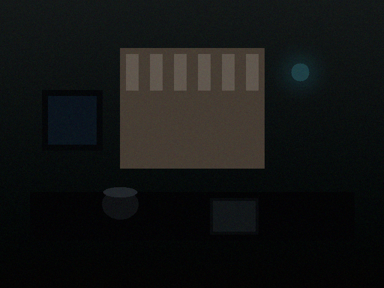 | **场景图** — 模拟暗光室内场景：窗户、桌子、物体、墙画、灯光 |
| 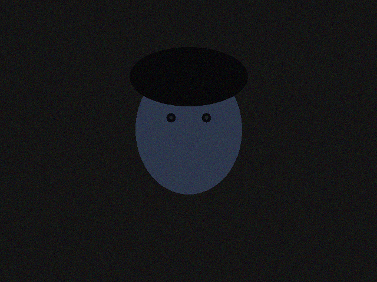 | **人像图** — 模拟暗光下人脸场景（肤色椭圆 + 眼睛 + 头发） |
| 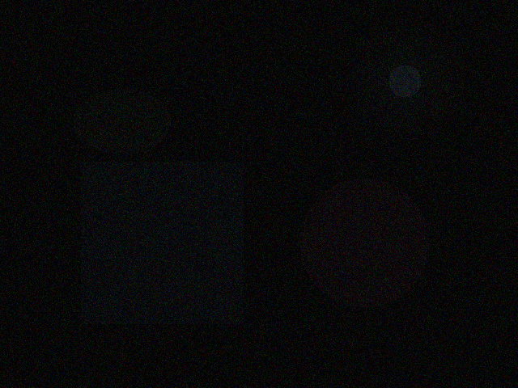 | **极端暗光** — 几乎全黑 + 强噪声，用于测试极限情况 |

---

## 三、xphoto 模块 — 高级去噪与白平衡

`cv2.xphoto` 是 OpenCV 的计算摄影扩展，提供了超越传统滤波的高级去噪和色彩校正方法。

### 3.1 DCT 去噪 (DCT Denoising)

**原理:** 基于离散余弦变换（DCT），将图像块在 DCT 域做软阈值处理，去除高频噪声后逆变换回空间域。源自 IPOL 论文 *"Image Denoising with the DCT"*。

$$I_{clean} = \text{IDCT}\big(\text{SoftThreshold}(\text{DCT}(I), \sigma)\big)$$

```python
def dct_denoise(img, sigma=15):
    """DCT 域频域降噪"""
    b, g, r = cv2.split(img)
    b_dst = np.zeros_like(b); g_dst = np.zeros_like(g); r_dst = np.zeros_like(r)
    cv2.xphoto.dctDenoising(b, b_dst, sigma)
    cv2.xphoto.dctDenoising(g, g_dst, sigma)
    cv2.xphoto.dctDenoising(r, r_dst, sigma)
    return cv2.merge([b_dst, g_dst, r_dst])
```

| 参数 | 作用 | 推荐值 |
|------|------|--------|
| `sigma` | 预期噪声标准差 | 低光场景 10~20，极端暗光 15~25 |
| `psize` | DCT 块大小（默认 16） | 8~16，越大越平滑但细节越模糊 |

**优点:** 频域处理理论上更优，噪声分离效果好，速度适中
**缺点:** 不如 BM3D 强力，对结构性噪声效果有限

### 3.2 简单白平衡 (Simple White Balance)

**原理:** 基于灰度世界假设（Gray-World Assumption），假设场景中 RGB 三通道平均值应相等，自动推测光源色温并补偿。

```python
wb = cv2.xphoto.createSimpleWB()
result = wb.balanceWhite(img)
```

### 3.3 学习型白平衡 (Learning-Based White Balance)

**原理:** 基于机器学习的色彩恒常性校正，相比灰度世界假设，模型在大规模数据集上训练，能更好处理复杂光照场景。

```python
wb = cv2.xphoto.createLearningBasedWB()
result = wb.balanceWhite(img)
```

### 对比效果图

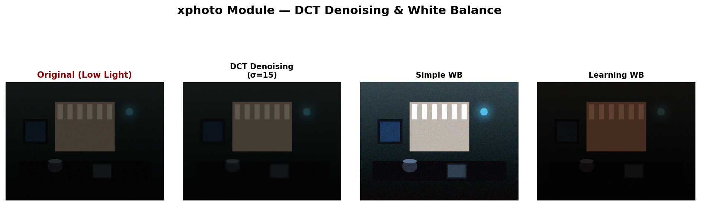

> **观察要点:** DCT 去噪能有效抑制频域噪声但细节有损失；白平衡方法主要作用于色彩而非亮度。

---

## 四、photo 模块 — 边缘保持与光照处理

`cv2.photo` 是 OpenCV 的摄影处理模块，提供了多种保边滤波和光照校正算法。

### 4.1 边缘保持滤波 (Edge-Preserving Filter)

**原理:** 基于域变换（Domain Transform）的递归滤波，保留显著边缘的同时平滑纹理区域。

```python
result = cv2.edgePreservingFilter(img, flags=1, sigma_s=60, sigma_r=0.4)
```

| 参数 | 作用 | 推荐值 |
|------|------|--------|
| `flags=1` | RECURS_FILTER（递归滤波）速度更快 | 比 NORM_CONV_FILTER 快 |
| `sigma_s` | 空间域平滑程度 | 30~80，越大越平滑 |
| `sigma_r` | 值域平滑程度 [0,1] | 0.2~0.6，越大越平滑 |

### 4.2 细节增强 (Detail Enhancement)

**原理:** 在保边平滑的基础上，将原图细节叠加回平滑后的图像，实现纹理增强。

```python
result = cv2.detailEnhance(img, sigma_s=10, sigma_r=0.15)
```

| 参数 | 作用 | 推荐值 |
|------|------|--------|
| `sigma_s` | 空间平滑 | 3~15 |
| `sigma_r` | 值域平滑 [0,1] | 0.1~0.2 获得适度增强 |

### 4.3 光照变化校正 (Illumination Change)

**原理:** 通过调整图像的照明分量，模拟不同的光照条件。本质是对光照分量做对数域变换。

```python
mask = np.ones(img.shape[:2], dtype=np.uint8)
result = cv2.illuminationChange(img, mask, alpha=1.8, beta=0.2)
```

| 参数 | 作用 |
|------|------|
| `alpha=1.8` | 提亮倍数（>1 提亮，<1 压暗） |
| `beta=0.2` | 对比度调整幅度 |

### 对比效果图

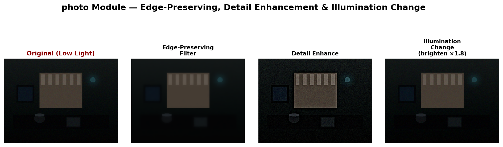

> **观察要点:** Edge-Preserving Filter 能有效平滑噪声但保留边缘；Detail Enhance 纹理更清晰；Illumination Change 整体提亮但对比度改变不自然。

---

## 五、ximgproc 模块 — 高级保边平滑与滤波

`cv2.ximgproc` 是 OpenCV 扩展图像处理模块，提供了大量现代保边滤波算法，是低光照降噪的核心方法库。

### 5.1 导向滤波 (Guided Filter)

**论文:** K. He, "Guided Image Filtering", ECCV 2010 / TPAMI 2013

**原理:** 使用引导图像的结构信息来指导滤波过程，输出是引导图像的局部线性变换。当引导图 = 原图时，实现保边平滑。

$$q_i = a_k I_i + b_k, \quad \forall i \in w_k$$

```python
# 方式一: 使用 createGuidedFilter（可复用，推荐）
gf = cv2.ximgproc.createGuidedFilter(img, radius=8, eps=0.01**2 * 255**2)
result = gf.filter(img)

# 方式二: 便捷静态调用
result = cv2.ximgproc.guidedFilter(img, img, radius=8, eps=0.1)
```

| 参数 | 作用 | 推荐值 |
|------|------|--------|
| `radius` | 滤波窗口半径 | 4~16，越大越平滑 |
| `eps` | 正则化项（防止 a_k 过大） | 0.01²×255² ~ 0.1²×255² |

**优点:** O(N) 复杂度，速度与窗口大小无关，边缘保持能力极强
**缺点:** 可能产生梯度反转伪影

### 5.2 L0 梯度最小化平滑 (L0 Smooth)

**论文:** L. Xu et al., "Image Smoothing via L0 Gradient Minimization", SIGGRAPH Asia 2011

**原理:** 通过限制图像中非零梯度的数量（L0 范数约束），实现全局性保边平滑。核心是控制图像"段"的数量。

$$\min_{S} \sum_{p}(S_p - I_p)^2 + \lambda \cdot |\nabla S|_0$$

```python
l_f = l.astype(np.float32) / 255.0
l_smooth = cv2.ximgproc.l0Smooth(l_f, lambda_=0.02, kappa=2.0)
l_result = np.clip(l_smooth * 255, 0, 255).astype(np.uint8)
```

> ⚠️ 注意: `lambda` 是 Python 关键字，调用时使用 `lambda_=` 参数名。

| 参数 | 作用 | 推荐值 |
|------|------|--------|
| `lambda_` | 平滑项权重（非零梯度惩罚） | 0.01~0.05，越大越平滑 |
| `kappa` | 数据项梯度权重递增因子 | 默认 2.0 |

**优点:** 保边能力极强，能去除小纹理保留大梯度边缘
**缺点:** 计算量较大，可能出现阶梯效应

### 5.3 滚动引导滤波 (Rolling Guidance Filter)

**论文:** Q. Zhang et al., "Rolling Guidance Filter", ECCV 2014

**原理:** 反复执行"小尺度高斯平滑 → 引导滤波"循环，逐步去除小尺度纹理，保留大尺度结构。是一种**尺度感知**的滤波器。

```python
l_f = l.astype(np.float32) / 255.0
l_rg = cv2.ximgproc.rollingGuidanceFilter(l_f, d=10, sigmaColor=25, sigmaSpace=3, numOfIter=4)
```

| 参数 | 作用 | 推荐值 |
|------|------|--------|
| `d` | 引导滤波半径 | 5~20 |
| `sigmaColor` | 颜色空间标准差 | 15~40 |
| `sigmaSpace` | 空间标准差 | 2~5 |
| `numOfIter` | 滚动迭代次数 | 2~6 |

**优点:** 多尺度处理，能区分纹理和结构
**缺点:** 多次迭代增加计算量

### 5.4 快速全局平滑滤波器 (Fast Global Smoother)

**论文:** D. Min et al., "Fast Global Image Smoothing Based on Weighted Least Squares", TIP 2014

**原理:** 将加权最小二乘（WLS）优化问题分解为一组 1D 的快速线性系统求解，实现近实时的全局平滑。

```python
l_dst = np.zeros_like(l)
cv2.ximgproc.fastGlobalSmootherFilter(guide=l, src=l, lambda_=100, sigma_color=10, dst=l_dst)
```

| 参数 | 作用 | 推荐值 |
|------|------|--------|
| `lambda_` | 正则化强度 | 50~500 |
| `sigma_color` | 色彩范围相似度阈值 | 5~20 |

**优点:** 速度极快，近实时
**缺点:** 边缘保持能力不如 L0 和导向滤波

### 5.5 自适应流形滤波 (Adaptive Manifold Filter)

**论文:** E. Gastal et al., "Adaptive Manifolds for Real-Time High-Dimensional Filtering", SIGGRAPH 2012

**原理:** 将高维滤波问题映射到低维自适应流形上进行计算，极大加速。

```python
am = cv2.ximgproc.AdaptiveManifoldFilter_create()
result = am.filter(img)
```

**优点:** 高维滤波实时化
**缺点:** 配置参数有限，效果依赖默认值

### 5.6 双边纹理滤波 (Bilateral Texture Filter)

**论文:** H. Cho et al., "Bilateral Texture Filtering", SIGGRAPH 2014

**原理:** 结合双边滤波的保边特性和纹理滤除逻辑，能区分纹理和结构，只去除纹理保持结构。

```python
l_f = l.astype(np.float32) / 255.0
l_bt = cv2.ximgproc.bilateralTextureFilter(l_f, None, fr=6, numIter=3,
                                            sigmaAlpha=0.2, sigmaAvg=0.8)
```

| 参数 | 作用 | 推荐值 |
|------|------|--------|
| `fr` | 滤波半径 | 3~10 |
| `numIter` | 迭代次数 | 1~5 |
| `sigmaAlpha` | 纹理/结构的锐度阈值 | 0.1~0.5 |
| `sigmaAvg` | 纹理模糊程度 | 0.5~2.0 |

### 5.7 联合双边滤波 (Joint Bilateral Filter)

**原理:** 标准的双边滤波用原图作为引导图，而**联合**双边滤波使用另一张引导图的结构信息。

```python
gray = cv2.cvtColor(img, cv2.COLOR_BGR2GRAY)
b_jb = cv2.ximgproc.jointBilateralFilter(gray, b, d=9, sigmaColor=30, sigmaSpace=30)
```

### 5.8 域变换滤波 (Domain Transform Filter)

**论文:** E. Gastal et al., "Domain Transform for Edge-Aware Image and Video Processing", SIGGRAPH 2011

**原理:** 将图像变换到保持边缘连续性的域空间中，然后做 1D 卷积即可实现保边滤波。

```python
gray = cv2.cvtColor(img, cv2.COLOR_BGR2GRAY)
b_dt = cv2.ximgproc.dtFilter(gray, b, sigmaSpatial=10, sigmaColor=10)
```

### 总览对比图

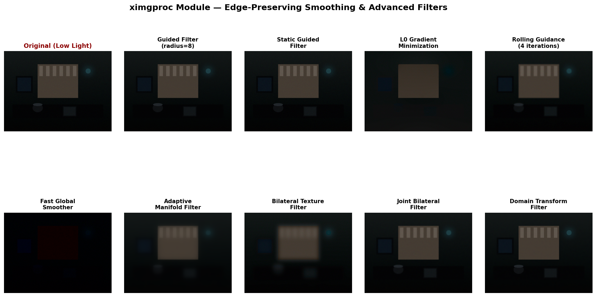

> **观察要点:**
> - **Guided Filter**: 平衡最好，保边+平滑+速度
> - **L0 Smooth**: 边缘保持最强，但可能出现阶梯状区域
> - **Rolling Guidance**: 多尺度处理，纹理去除效果好
> - **Fast Global Smoother**: 速度最快，全局平滑倾向
> - **Bilateral Texture**: 能区分纹理和结构

---

## 六、直方图变化对比

直方图直观展示各方法对像素分布的改变：

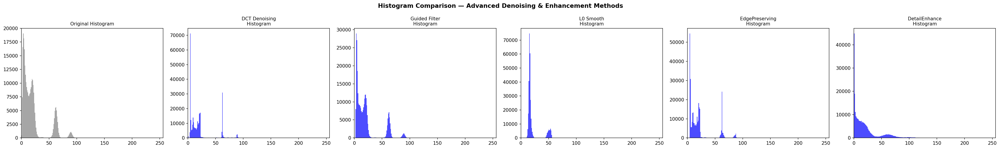

| 方法 | 直方图变化 | 说明 |
|------|-----------|------|
| 原图 | 集中在低灰度区（0~60） | 典型低光照分布 |
| DCT Denoising | 保持低灰度分布 + 去噪声波动 | 纯降噪不改变亮度分布 |
| Guided Filter | 基本保持原分布形状 | 去噪而不改变色调 |
| L0 Smooth | 保持分布 + 平滑 | 主要作用于梯度而非直方图 |
| EdgePreserving | 轻微向中灰度偏移 | 平滑操作使像素更聚合 |
| DetailEnhance | 分布变宽 | 细节增强拉伸了局部对比度 |

---

## 七、高级组合管线

单一高级方法仍有局限，组合形成管线效果更佳。

### 管线总览

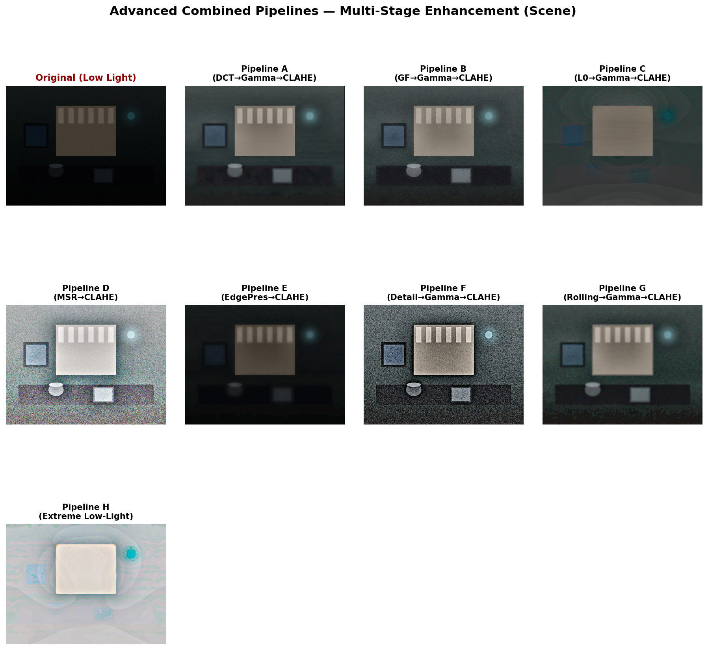

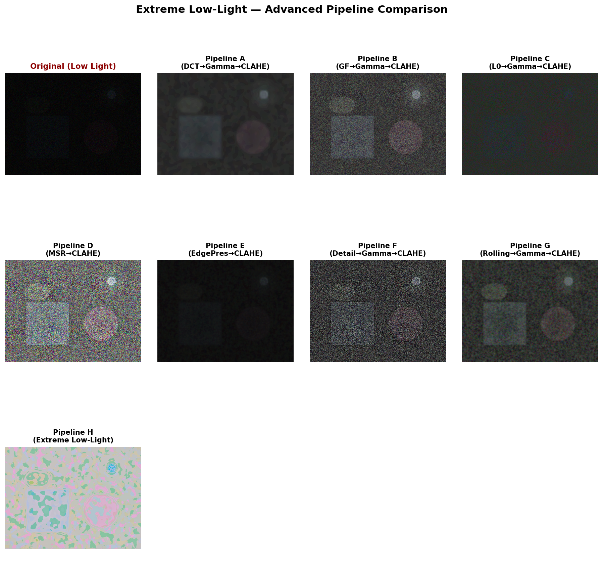

### 管线B（推荐）: GuidedFilter → Gamma → CLAHE

```python
def pipeline_guided_gamma_clahe(img):
    # Step 1: 导向滤波保边降噪
    gf = cv2.ximgproc.createGuidedFilter(img, 8, 0.02**2 * 255**2).filter(img)
    # Step 2: Gamma 校正提亮暗部
    table = np.array([(i/255.0)**(1/1.8)*255 for i in range(256)], dtype=np.uint8)
    gamma = cv2.LUT(gf, table)
    # Step 3: CLAHE 增强局部对比度
    lab = cv2.cvtColor(gamma, cv2.COLOR_BGR2LAB)
    l, a, b = cv2.split(lab)
    l = cv2.createCLAHE(clipLimit=2.0, tileGridSize=(8,8)).apply(l)
    return cv2.cvtColor(cv2.merge([l, a, b]), cv2.COLOR_LAB2BGR)
```

**适用场景:** 大部分低光照场景（轻度~中度暗光），速度快、效果好

### 管线C（细节优先）: L0 → Gamma → CLAHE

```python
def pipeline_l0_enhance(img):
    lab = cv2.cvtColor(img, cv2.COLOR_BGR2LAB)
    l, a, b = cv2.split(lab)
    l_f = l.astype(np.float32) / 255.0
    l_s = cv2.ximgproc.l0Smooth(l_f, lambda_=0.02, kappa=2.0)
    l_s = np.clip(l_s * 255, 0, 255).astype(np.uint8)
    smooth = cv2.cvtColor(cv2.merge([l_s, a, b]), cv2.COLOR_LAB2BGR)
    # Gamma + CLAHE
    ...
```

**适用场景:** 需要高精度边缘信息（分割、检测任务的前处理）

### 管线H（极限暗光）: DCT → L0 → MSR → CLAHE

```python
def pipeline_extreme_enhance(img):
    # Step 1: DCT 频域去噪
    dct = method_dct_denoising(img, sigma=15)
    # Step 2: L0 平滑保持结构
    l0 = method_l0_smooth(dct, lambda_=0.02)
    # Step 3: MSR 光照补偿
    msr = method_multiscale_retinex(l0)
    # Step 4: CLAHE 局部增强
    return method_clahe(msr, clip=2.5)
```

**适用场景:** 极端低光照，几乎全黑 + 严重噪声

---

## 八、精细对比图

### 8.1 前后对比（附直方图）

#### 导向滤波 (Guided Filter)

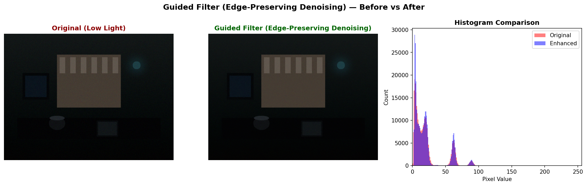

#### L0 梯度最小化平滑

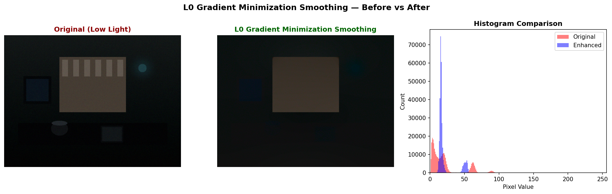

#### 边缘保持滤波

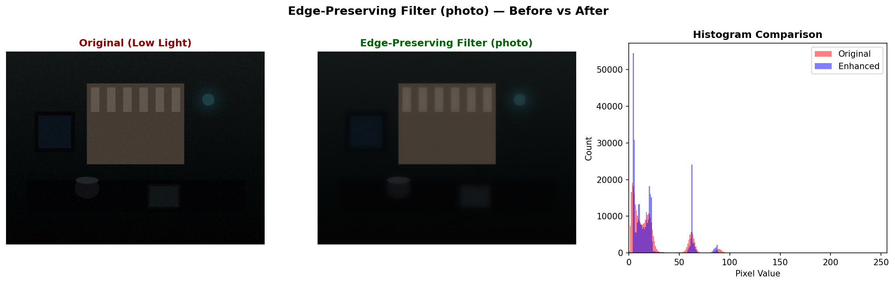

#### 细节增强

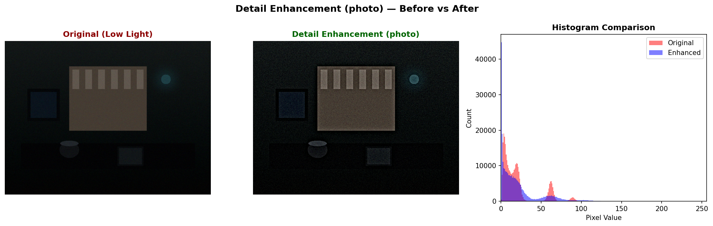

#### 管线B: Guided → Gamma → CLAHE

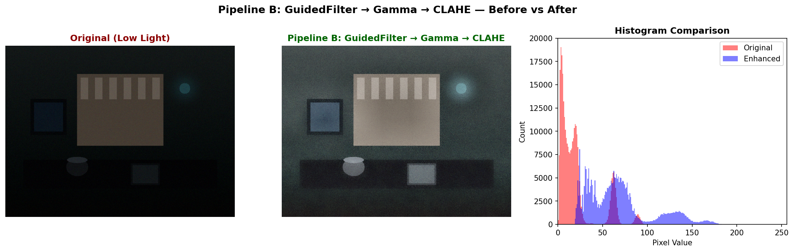

#### 管线C: L0 → Gamma → CLAHE

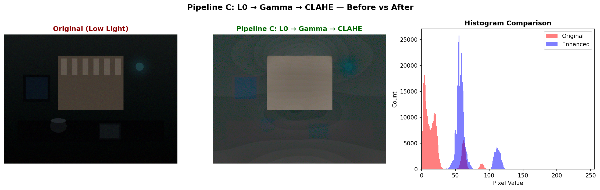

#### 管线H: 极端低光照增强

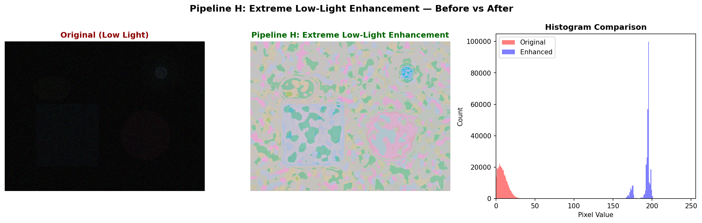

### 8.2 管线逐步分解

#### 管线B: GuidedFilter → Gamma → CLAHE

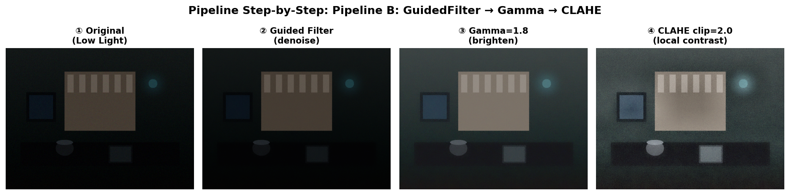

> **观察要点:** Step 2（Gamma）是亮度提升的转折点，Step 3（CLAHE）赋予局部对比度微调。

#### 管线H: DCT → L0 → MSR → CLAHE

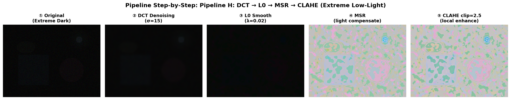

> **观察要点:** DCT 去除频域噪声打下基础，L0 保持微弱边缘，MSR 完成光照补偿质变。

### 8.3 ROI 区域放大对比

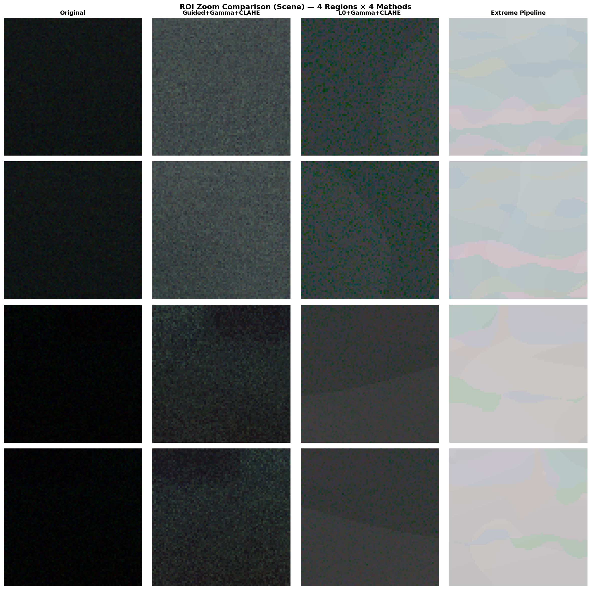

> 4个ROI区域 × 4种处理方式，放大观察细节保留和噪声抑制效果。

---

## 九、方法选择指南

### 按场景选择

| 场景 | 推荐方法 | 说明 |
|------|---------|------|
| 轻度暗光 + 快速降噪 | Guided Filter（半径8） | O(N)复杂度，保边好 |
| 中度暗光 + 保留细节 | Pipeline B (GF→Gamma→CLAHE) | 平衡速度与效果 |
| 需要最高边缘精度 | Pipeline C (L0→Gamma→CLAHE) | 分割/检测任务前置 |
| 色彩偏移严重 | SimpleWB / LearningWB + CLAHE | 先校色再增强 |
| 纹理噪声严重 | Bilateral Texture + Gamma | 区分纹理与结构 |
| 极端暗光（几乎全黑） | Pipeline H (DCT→L0→MSR→CLAHE) | 多阶段逐级处理 |

### 各方法特性矩阵

| 方法 | 去噪 | 保边 | 提亮 | 速度 | 模块 |
|------|:---:|:---:|:---:|:---:|------|
| DCT Denoising | ⭐⭐⭐ | ⭐⭐ | ❌ | ⭐⭐⭐ | xphoto |
| Simple WB | ❌ | ✅ | ❌ | ⭐⭐⭐⭐ | xphoto |
| Edge-Preserving | ⭐⭐ | ⭐⭐⭐ | ❌ | ⭐⭐⭐ | photo |
| Detail Enhance | ⭐ | ⭐⭐ | ❌ | ⭐⭐ | photo |
| Illumination Change | ❌ | ❌ | ⭐⭐⭐ | ⭐⭐⭐ | photo |
| Guided Filter | ⭐⭐⭐ | ⭐⭐⭐⭐ | ❌ | ⭐⭐⭐⭐ | ximgproc |
| L0 Smooth | ⭐⭐ | ⭐⭐⭐⭐⭐ | ❌ | ⭐⭐ | ximgproc |
| Rolling Guidance | ⭐⭐⭐ | ⭐⭐⭐⭐ | ❌ | ⭐⭐ | ximgproc |
| Fast Global Smoother | ⭐⭐ | ⭐⭐⭐ | ❌ | ⭐⭐⭐⭐ | ximgproc |
| Adaptive Manifold | ⭐⭐ | ⭐⭐⭐ | ❌ | ⭐⭐⭐ | ximgproc |
| Bilateral Texture | ⭐⭐ | ⭐⭐⭐⭐ | ❌ | ⭐⭐ | ximgproc |
| Pipeline B (GF→Gamma→CLAHE) | ⭐⭐⭐ | ⭐⭐⭐ | ⭐⭐⭐⭐ | ⭐⭐⭐ | 组合 |
| Pipeline C (L0→Gamma→CLAHE) | ⭐⭐ | ⭐⭐⭐⭐⭐ | ⭐⭐⭐⭐ | ⭐⭐ | 组合 |
| Pipeline H (极端暗光) | ⭐⭐⭐⭐ | ⭐⭐⭐⭐ | ⭐⭐⭐⭐⭐ | ⭐ | 组合 |

---

## 十、完整代码模板

```python
import cv2
import numpy as np


class AdvancedLowLightEnhancer:
    """OpenCV 高级模块低光照增强器"""

    # ---- xphoto 模块 ----

    @staticmethod
    def dct_denoise(img, sigma=15):
        """DCT 频域降噪 (xphoto)"""
        channels = []
        for ch in cv2.split(img):
            dst = np.zeros_like(ch)
            cv2.xphoto.dctDenoising(ch, dst, sigma)
            channels.append(dst)
        return cv2.merge(channels)

    @staticmethod
    def white_balance(img, method='learning'):
        """白平衡校正 (xphoto)"""
        if method == 'simple':
            wb = cv2.xphoto.createSimpleWB()
        else:
            wb = cv2.xphoto.createLearningBasedWB()
        return wb.balanceWhite(img)

    # ---- photo 模块 ----

    @staticmethod
    def edge_preserving(img, sigma_s=60, sigma_r=0.4):
        """边缘保持滤波 (photo)"""
        return cv2.edgePreservingFilter(img, flags=1,
                                         sigma_s=sigma_s, sigma_r=sigma_r)

    @staticmethod
    def detail_enhance(img, sigma_s=10, sigma_r=0.15):
        """细节增强 (photo)"""
        return cv2.detailEnhance(img, sigma_s=sigma_s, sigma_r=sigma_r)

    @staticmethod
    def illumination_change(img, alpha=1.8, beta=0.2):
        """光照变化校正 (photo)"""
        mask = np.ones(img.shape[:2], dtype=np.uint8)
        return cv2.illuminationChange(img, mask, alpha=alpha, beta=beta)

    # ---- ximgproc 模块 ----

    @staticmethod
    def guided_filter(img, radius=8, eps=0.01):
        """导向滤波保边降噪 (ximgproc)"""
        eps_val = float(eps ** 2 * 255 ** 2)
        gf = cv2.ximgproc.createGuidedFilter(img, radius, eps_val)
        return gf.filter(img)

    @staticmethod
    def l0_smooth(img, lambda_=0.02, kappa=2.0):
        """L0 梯度最小化平滑 (ximgproc)"""
        lab = cv2.cvtColor(img, cv2.COLOR_BGR2LAB)
        l, a, b = cv2.split(lab)
        l_f = l.astype(np.float32) / 255.0
        l_s = cv2.ximgproc.l0Smooth(l_f, lambda_=lambda_, kappa=kappa)
        l_result = np.clip(l_s * 255, 0, 255).astype(np.uint8)
        return cv2.cvtColor(cv2.merge([l_result, a, b]), cv2.COLOR_LAB2BGR)

    @staticmethod
    def rolling_guidance(img, d=10, sigma_color=25, sigma_space=3, iters=4):
        """滚动引导滤波 (ximgproc)"""
        lab = cv2.cvtColor(img, cv2.COLOR_BGR2LAB)
        l, a, b = cv2.split(lab)
        l_f = l.astype(np.float32) / 255.0
        l_rg = cv2.ximgproc.rollingGuidanceFilter(
            l_f, d=d, sigmaColor=sigma_color,
            sigmaSpace=sigma_space, numOfIter=iters)
        l_rg = np.clip(l_rg * 255, 0, 255).astype(np.uint8)
        return cv2.cvtColor(cv2.merge([l_rg, a, b]), cv2.COLOR_LAB2BGR)

    @staticmethod
    def clahe(img, clip=2.0):
        """CLAHE 局部对比度增强"""
        lab = cv2.cvtColor(img, cv2.COLOR_BGR2LAB)
        l, a, b = cv2.split(lab)
        l = cv2.createCLAHE(clipLimit=clip, tileGridSize=(8, 8)).apply(l)
        return cv2.cvtColor(cv2.merge([l, a, b]), cv2.COLOR_LAB2BGR)

    @staticmethod
    def gamma_correct(img, gamma=1.8):
        """Gamma 校正提亮"""
        table = np.array([(i / 255.0) ** (1.0 / gamma) * 255
                          for i in range(256)], dtype=np.uint8)
        return cv2.LUT(img, table)

    # ---- 推荐管线 ----

    @classmethod
    def pipeline_fast(cls, img):
        """快速管线: GuidedFilter → Gamma → CLAHE (CP值最高)"""
        gf = cls.guided_filter(img, radius=8, eps=0.02)
        gm = cls.gamma_correct(gf, gamma=1.8)
        return cls.clahe(gm, clip=2.0)

    @classmethod
    def pipeline_detail(cls, img):
        """细节优先管线: L0 → Gamma → CLAHE"""
        l0 = cls.l0_smooth(img, lambda_=0.02)
        gm = cls.gamma_correct(l0, gamma=1.8)
        return cls.clahe(gm, clip=2.0)

    @classmethod
    def pipeline_extreme(cls, img):
        """极端暗光管线: DCT → L0 → MSR → CLAHE"""
        dct = cls.dct_denoise(img, sigma=15)
        l0 = cls.l0_smooth(dct, lambda_=0.02)
        # MSR
        img_f = l0.astype(np.float32) + 1.0
        result = np.zeros_like(img_f, dtype=np.float32)
        for sigma in [15, 80, 250]:
            for i in range(3):
                blurred = cv2.GaussianBlur(img_f[:, :, i], (0, 0), sigma)
                result[:, :, i] += (np.log(img_f[:, :, i]) - np.log(blurred)) / 3
        msr = cv2.normalize(result, None, 0, 255, cv2.NORM_MINMAX).astype(np.uint8)
        return cls.clahe(msr, clip=2.5)


# 使用示例
if __name__ == '__main__':
    enhancer = AdvancedLowLightEnhancer()
    img = cv2.imread('dark_photo.jpg')

    # 快速增强
    result = enhancer.pipeline_fast(img)

    # 或极端暗光
    # result = enhancer.pipeline_extreme(img)

    cv2.imwrite('enhanced.jpg', result)
```

---

## 十一、运行本笔记对比图

```bash
cd 05-OpenCV高级低光照方法
pip install opencv-contrib-python numpy matplotlib
python generate_comparison.py
```

脚本自动完成：
1. 生成 3 张合成低光照测试图（场景、人像、极限暗光）
2. 对 xphoto / photo / ximgproc 三个模块方法逐一处理对比
3. 生成直方图变化对比
4. 生成 8 条高级组合管线效果对比
5. 生成核心方法前后对比 + 直方图
6. 生成管线逐步分解图
7. 生成 ROI 区域放大对比

生成文件清单（共 19 张）：

| 编号 | 文件名 | 说明 |
|------|--------|------|
| 01 | `01_comparison_xphoto_scene.png` | xphoto 模块方法对比 |
| 02 | `02_comparison_photo_scene.png` | photo 模块方法对比 |
| 03 | `03_comparison_ximgproc_scene.png` | ximgproc 模块 9 种方法对比 |
| 04 | `04_histogram_comparison.png` | 直方图变化对比 |
| 05 | `05_comparison_pipelines_scene.png` | 8 条管线场景对比 |
| 06 | `06_comparison_pipelines_extreme.png` | 8 条管线极限暗光对比 |
| 07-13 | `07~13_before_after_*.png` | 核心方法/管线前后对比 |
| 14-15 | `14~15_pipeline_flow_*.png` | 管线步骤分解 |
| 16 | `16_roi_zoom_comparison.png` | ROI 放大对比 |
| — | `test_*.png` | 3 张测试图 |

---

## 十二、与现有笔记的关联

| 笔记 | 内容差异 | 互补关系 |
|------|---------|---------|
| [03-OpenCV低光照处理方法](../03-OpenCV低光照处理方法/README.md) | 8种基础方法（HE/CLAHE/Gamma/MSR 等） | 基础 → 高级，逐层递进 |
| [04-低光照降噪与分割预处理](../04-低光照降噪与分割预处理/README.md) | 降噪 + RK3576 部署优化 | 本笔记提供更多高级降噪选项 |
| [01-低光照增强与分割方案汇总](../01-低光照增强与分割方案汇总/低光照增强与分割方案汇总.md) | 方法选型与架构决策 | 本笔记补充 `ximgproc` 具体实践 |
| [02-低光照增强论文精读](../02-低光照增强论文精读/低光照增强论文精读_KSCE2025.md) | 学术评估与方法对比 | 本笔记提供工程化的使用方法 |

### 学习路径

```
03-基础方法 (HE/CLAHE/Gamma/MSR)
    ↓
04-降噪预处理 (Gaussian/Median/Bilateral/NLM + RK3576)
    ↓
05-高级方法 (ximgproc/xphoto/photo 扩展模块)  ← 当前笔记
    ↓
01-方案选型 (架构决策、硬件选型)
    ↓
02-论文精读 (学术评估)
```

---

## 十三、参考资料

| 资源 | 链接 |
|------|------|
| OpenCV xphoto 文档 | https://docs.opencv.org/4.x/de/daa/group__xphoto.html |
| OpenCV photo 文档 | https://docs.opencv.org/4.x/d7/dbd/group__photo.html |
| OpenCV ximgproc 文档 | https://docs.opencv.org/4.x/dc/d2a/group__ximgproc__edge.html |
| Guided Filter 论文 | K. He, "Guided Image Filtering", ECCV 2010 / TPAMI 2013 |
| L0 Smooth 论文 | L. Xu, "Image Smoothing via L0 Gradient Minimization", SIGGRAPH Asia 2011 |
| Rolling Guidance 论文 | Q. Zhang, "Rolling Guidance Filter", ECCV 2014 |
| Domain Transform 论文 | E. Gastal, "Domain Transform for Edge-Aware Image and Video Processing", SIGGRAPH 2011 |
| Adaptive Manifold 论文 | E. Gastal, "Adaptive Manifolds for Real-Time High-Dimensional Filtering", SIGGRAPH 2012 |
| DCT Denoising (IPOL) | http://www.ipol.im/pub/art/2011/ys-dct/ |
| Fast Global Smoother 论文 | D. Min, "Fast Global Image Smoothing Based on Weighted Least Squares", TIP 2014 |
| Bilateral Texture Filter 论文 | H. Cho, "Bilateral Texture Filtering", SIGGRAPH 2014 |

---

> 📝 **更新日志**
> - 2026-06-08: 初始版本，覆盖 xphoto / photo / ximgproc 三个模块 12+ 种高级方法 + 8 条组合管线
