# 📖 OpenCV 完整学习笔记

> OpenCV 4.10 — 最全面的图像处理与计算机视觉库
> **流行度标记：** ⭐⭐⭐⭐⭐ = 必学 / ⭐⭐⭐⭐ = 常用 / ⭐⭐⭐ = 了解 / ⭐⭐ = 特定场景

---

## 📑 目录

1. [图像读写与显示](#1-图像读写与显示)
2. [色彩空间](#2-色彩空间)
3. [图像几何变换](#3-图像几何变换)
4. [图像滤波与去噪](#4-图像滤波与去噪)
5. [形态学操作](#5-形态学操作)
6. [边缘检测](#6-边缘检测)
7. [阈值处理与二值化](#7-阈值处理与二值化)
8. [图像直方图](#8-图像直方图)
9. [轮廓检测与分析](#9-轮廓检测与分析)
10. [图像金字塔与缩放](#10-图像金字塔与缩放)
11. [特征检测与匹配](#11-特征检测与匹配)
12. [模板匹配](#12-模板匹配)
13. [低光照增强](#13-低光照增强)
14. [图像分割](#14-图像分割)
15. [深度学习 (DNN) 模块](#15-深度学习-dnn-模块)
16. [视频处理](#16-视频处理)
17. [相机标定](#17-相机标定)
18. [图像拼接](#18-图像拼接)
19. [傅里叶变换](#19-傅里叶变换)
20. [实用工具函数](#20-实用工具函数)

---

## 1. 图像读写与显示

⭐⭐⭐⭐⭐ **最基础，必须掌握**

### 读取

```python
import cv2

img = cv2.imread('photo.jpg')           # BGR 格式
img = cv2.imread('photo.jpg', cv2.IMREAD_GRAYSCALE)   # 灰度
img = cv2.imread('photo.jpg', cv2.IMREAD_UNCHANGED)   # 含 alpha 通道
img = cv2.imdecode(np.fromfile('中文.jpg', dtype=np.uint8), cv2.IMREAD_COLOR)  # 中文路径
```

| Flag | 说明 |
|------|------|
| `IMREAD_COLOR` (1) | 默认，彩色 BGR |
| `IMREAD_GRAYSCALE` (0) | 灰度图 |
| `IMREAD_UNCHANGED` (-1) | 原样（含 alpha） |

### 显示

```python
cv2.imshow('Window', img)
cv2.waitKey(0)          # 等待按键
cv2.destroyAllWindows()
```

### 保存

```python
cv2.imwrite('result.jpg', img)                    # 不支持中文路径
cv2.imencode('.jpg', img)[1].tofile('中文名.jpg')  # 支持中文路径
```

| 保存参数 | 说明 |
|---------|------|
| `IMWRITE_JPEG_QUALITY` | 0-100，默认 95 |
| `IMWRITE_PNG_COMPRESSION` | 0-9，默认 3 |

---

## 2. 色彩空间

⭐⭐⭐⭐⭐ **颜色处理的基础**

### 常用转换

```python
gray  = cv2.cvtColor(img, cv2.COLOR_BGR2GRAY)   # BGR → 灰度
hsv   = cv2.cvtColor(img, cv2.COLOR_BGR2HSV)    # BGR → HSV
lab   = cv2.cvtColor(img, cv2.COLOR_BGR2LAB)    # BGR → LAB（增强用）
rgb   = cv2.cvtColor(img, cv2.COLOR_BGR2RGB)    # BGR → RGB（matplotlib 用）
```

### 各空间用途

| 色彩空间 | 流行度 | 用途 |
|---------|:------:|------|
| **BGR** | ⭐⭐⭐⭐⭐ | OpenCV 默认格式 |
| **GRAY** | ⭐⭐⭐⭐⭐ | 边缘检测、阈值、大部分传统算法 |
| **HSV** | ⭐⭐⭐⭐⭐ | **颜色分割**（比 RGB 更直观）、目标跟踪 |
| **LAB** | ⭐⭐⭐⭐ | **亮度增强**（CLAHE 只处理 L 通道）、颜色分析 |
| **YCrCb** | ⭐⭐⭐ | 视频压缩、肤色检测 |

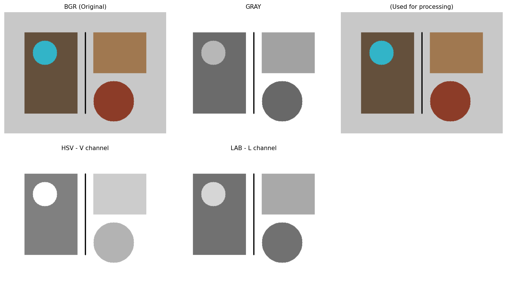

---

## 3. 图像几何变换

⭐⭐⭐⭐⭐ **图像预处理必备**

### 缩放

```python
small = cv2.resize(img, (320, 240))                         # 指定尺寸
small = cv2.resize(img, (0,0), fx=0.5, fy=0.5)              # 比例缩放
```

| 插值方法 | 说明 | 场景 |
|---------|------|------|
| `INTER_LINEAR` | 双线性（默认） | 放大通用 |
| `INTER_CUBIC` | 双三次 | 放大高质量 |
| `INTER_AREA` | 像素区域关系 | 缩小（推荐） |
| `INTER_NEAREST` | 最近邻 | 速度优先 |

### 旋转

```python
h, w = img.shape[:2]
M = cv2.getRotationMatrix2D((w//2, h//2), angle=45, scale=1.0)
rotated = cv2.warpAffine(img, M, (w, h))
```

### 平移

```python
M = np.float32([[1, 0, 50], [0, 1, 30]])  # 右移50，下移30
shifted = cv2.warpAffine(img, M, (w, h))
```

### 翻转

```python
flip_h = cv2.flip(img, 1)   # 水平翻转
flip_v = cv2.flip(img, 0)   # 垂直翻转
flip_both = cv2.flip(img, -1)  # 同时
```

### 裁剪

```python
crop = img[y1:y2, x1:x2]  # numpy 切片即可
```

### 仿射变换

```python
pts1 = np.float32([[50,50], [200,50], [50,200]])
pts2 = np.float32([[10,100], [200,50], [100,250]])
M = cv2.getAffineTransform(pts1, pts2)
result = cv2.warpAffine(img, M, (w, h))
```

### 透视变换

```python
pts1 = np.float32([[0,0], [w,0], [0,h], [w,h]])
pts2 = np.float32([[50,20], [w-30,10], [20,h-20], [w-10,h-10]])
M = cv2.getPerspectiveTransform(pts1, pts2)
result = cv2.warpPerspective(img, M, (w, h))
```

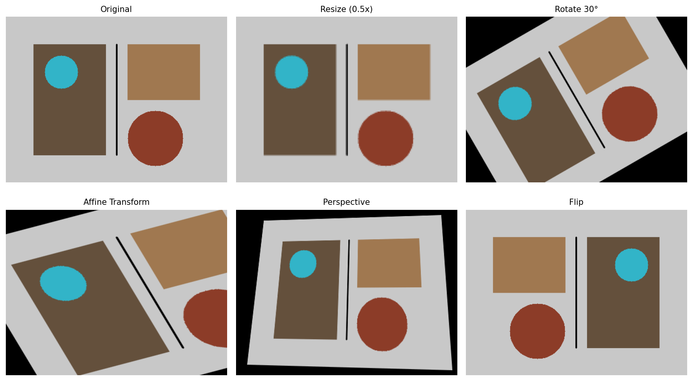

---

## 4. 图像滤波与去噪

⭐⭐⭐⭐⭐ **图像预处理核心**

### 均值滤波

```python
blur = cv2.blur(img, (5, 5))           # 最快但最糊
```

### 高斯滤波

```python
blur = cv2.GaussianBlur(img, (5, 5), sigmaX=1.5)
```

### 中值滤波

```python
median = cv2.medianBlur(img, 5)        # 去椒盐噪声最强
```

### 双边滤波 ⭐⭐⭐⭐⭐

```python
filtered = cv2.bilateralFilter(img, d=9, sigmaColor=50, sigmaSpace=50)
# 保边去噪，分割预处理首选
```

### 边缘保持滤波

```python
result = cv2.edgePreservingFilter(img, flags=1, sigma_s=60, sigma_r=0.3)
```

### 导向滤波（需 ximgproc）

```python
result = cv2.ximgproc.guidedFilter(img, img, radius=8, eps=100)
```

### 非局部均值去噪

```python
result = cv2.fastNlMeansDenoisingColored(img, None, h=10, hColor=10, template=7, search=21)
```

### 去噪方法对比

| 方法 | 流行度 | 速度 | 保边 | 适用场景 |
|------|:------:|:----:|:----:|---------|
| 高斯滤波 | ⭐⭐⭐⭐⭐ | 极快 | ❌ | 通用平滑 |
| 中值滤波 | ⭐⭐⭐⭐⭐ | 快 | ⭐⭐ | 椒盐噪声 |
| 双边滤波 | ⭐⭐⭐⭐ | 中等 | ⭐⭐⭐⭐ | **分割预处理** |
| 边缘保持滤波 | ⭐⭐⭐ | 中等 | ⭐⭐⭐⭐ | 高噪声保边 |
| 导向滤波 | ⭐⭐⭐ | 中等 | ⭐⭐⭐⭐⭐ | 边缘保留最优 |
| NLM | ⭐⭐⭐ | 极慢 | ⭐⭐⭐⭐⭐ | 离线高质量去噪 |

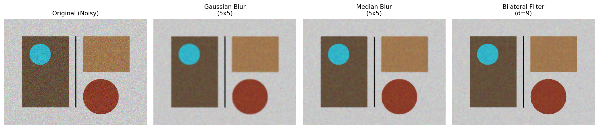

---

## 5. 形态学操作

⭐⭐⭐⭐⭐ **二值图像处理利器**

### 核结构

```python
kernel = np.ones((5,5), np.uint8)           # 矩形核
kernel = cv2.getStructuringElement(cv2.MORPH_ELLIPSE, (5,5))  # 椭圆核
kernel = cv2.getStructuringElement(cv2.MORPH_CROSS, (5,5))    # 十字核
```

### 基础操作

| 操作 | 函数 | 效果 | 流行度 |
|------|------|------|:------:|
| 腐蚀 | `cv2.erode()` | 收缩白色区域，去除小白点 | ⭐⭐⭐⭐⭐ |
| 膨胀 | `cv2.dilate()` | 扩大白色区域，填充小孔 | ⭐⭐⭐⭐⭐ |
| 开运算 | `MORPH_OPEN` | 先腐蚀后膨胀 → 去噪 | ⭐⭐⭐⭐⭐ |
| 闭运算 | `MORPH_CLOSE` | 先膨胀后腐蚀 → 填洞 | ⭐⭐⭐⭐⭐ |
| 形态学梯度 | `MORPH_GRADIENT` | 膨胀-腐蚀 → 边缘 | ⭐⭐⭐ |
| 顶帽 | `MORPH_TOPHAT` | 原图-开运算 → 亮细节 | ⭐⭐ |
| 黑帽 | `MORPH_BLACKHAT` | 闭运算-原图 → 暗细节 | ⭐⭐ |

```python
# 开运算 = 去噪
clean = cv2.morphologyEx(binary, cv2.MORPH_OPEN, kernel)
# 闭运算 = 填洞
filled = cv2.morphologyEx(binary, cv2.MORPH_CLOSE, kernel)
```

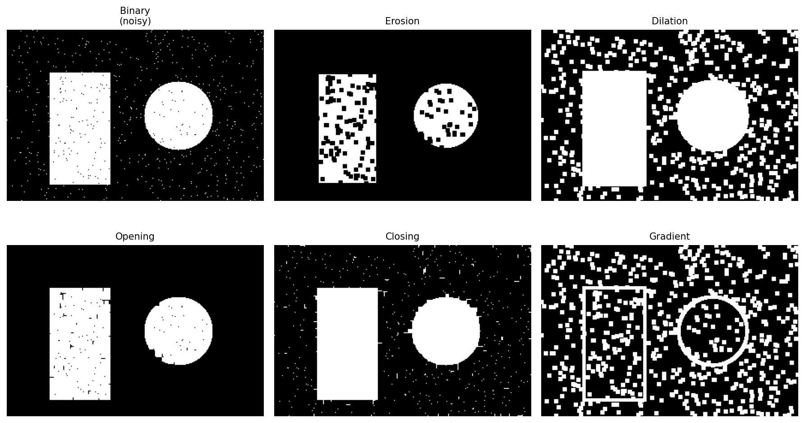

---

## 6. 边缘检测

⭐⭐⭐⭐⭐ **一切分割和特征提取的基础**

### Sobel 算子

```python
sobel_x = cv2.Sobel(gray, cv2.CV_64F, 1, 0, ksize=3)  # x方向梯度
sobel_y = cv2.Sobel(gray, cv2.CV_64F, 0, 1, ksize=3)  # y方向梯度
sobel = cv2.magnitude(sobel_x, sobel_y)                 # 幅值
```

### Laplacian 算子

```python
laplacian = cv2.Laplacian(gray, cv2.CV_64F)
```

### Canny 边缘检测 ⭐⭐⭐⭐⭐

```python
edges = cv2.Canny(gray, threshold1=50, threshold2=150)
# threshold1/threshold2: 双阈值，越低边缘越多
```

**Canny 最佳实践：**
```python
# 先降噪再 Canny
blurred = cv2.GaussianBlur(gray, (5,5), 1.5)
edges = cv2.Canny(blurred, 50, 150)
```

| 方法 | 流行度 | 效果 | 速度 |
|------|:------:|:----:|:----:|
| **Canny** | ⭐⭐⭐⭐⭐ | 最好 | 中等 |
| Sobel | ⭐⭐⭐⭐ | 好 | 快 |
| Laplacian | ⭐⭐⭐ | 噪声敏感 | 快 |

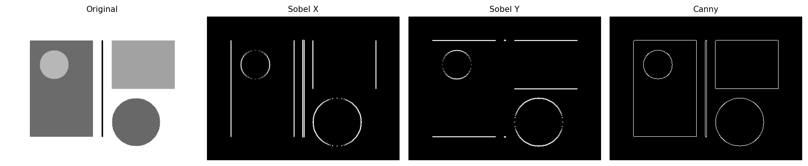

---

## 7. 阈值处理与二值化

⭐⭐⭐⭐⭐ **分割的起点**

### 固定阈值

```python
_, binary = cv2.threshold(gray, 127, 255, cv2.THRESH_BINARY)
_, binary_inv = cv2.threshold(gray, 127, 255, cv2.THRESH_BINARY_INV)
_, trunc = cv2.threshold(gray, 127, 255, cv2.THRESH_TRUNC)
_, tozero = cv2.threshold(gray, 127, 255, cv2.THRESH_TOZERO)
```

### Otsu 自动阈值 ⭐⭐⭐⭐⭐

```python
_, otsu = cv2.threshold(gray, 0, 255, cv2.THRESH_BINARY + cv2.THRESH_OTSU)
# Otsu 自动计算最佳阈值，双峰直方图效果最好
```

### 自适应阈值 ⭐⭐⭐⭐

```python
adaptive = cv2.adaptiveThreshold(gray, 255, cv2.ADAPTIVE_THRESH_GAUSSIAN_C,
                                 cv2.THRESH_BINARY, blockSize=11, C=2)
# 光照不均图像首选
```

| 方法 | 流行度 | 适用场景 |
|------|:------:|---------|
| 固定阈值 | ⭐⭐⭐⭐ | 光照均匀图像 |
| **Otsu** | ⭐⭐⭐⭐⭐ | 自动阈值，双峰直方图 |
| **自适应** | ⭐⭐⭐⭐⭐ | **光照不均图像** |

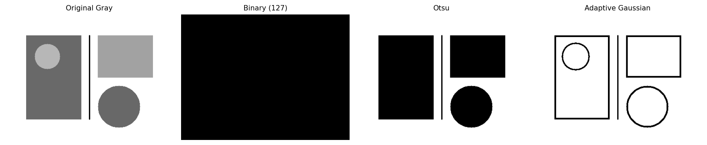

---

## 8. 图像直方图

⭐⭐⭐⭐⭐ **图像分析的基础工具**

### 计算直方图

```python
hist = cv2.calcHist([gray], [0], None, [256], [0, 256])
```

### 直方图均衡化 ⭐⭐⭐⭐

```python
eq = cv2.equalizeHist(gray)  # 全局均衡，可能放大噪声
```

### CLAHE ⭐⭐⭐⭐⭐

```python
clahe = cv2.createCLAHE(clipLimit=2.0, tileGridSize=(8, 8))
enhanced = clahe.apply(gray)
```

### 直方图反投影

```python
roi = cv2.calcHist([hsv_roi], [0,1], None, [180,256], [0,180,0,256])
cv2.normalize(roi, roi, 0, 255, cv2.NORM_MINMAX)
backproj = cv2.calcBackProject([hsv_target], [0,1], roi, [0,180,0,256], 1)
# 颜色目标定位
```

| 方法 | 流行度 | 效果 |
|------|:------:|------|
| 直方图均衡化 | ⭐⭐⭐⭐ | 整体提升对比度 |
| **CLAHE** | ⭐⭐⭐⭐⭐ | 局部自适应，噪点控制好 |
| 直方图反投影 | ⭐⭐⭐ | 颜色目标跟踪 |

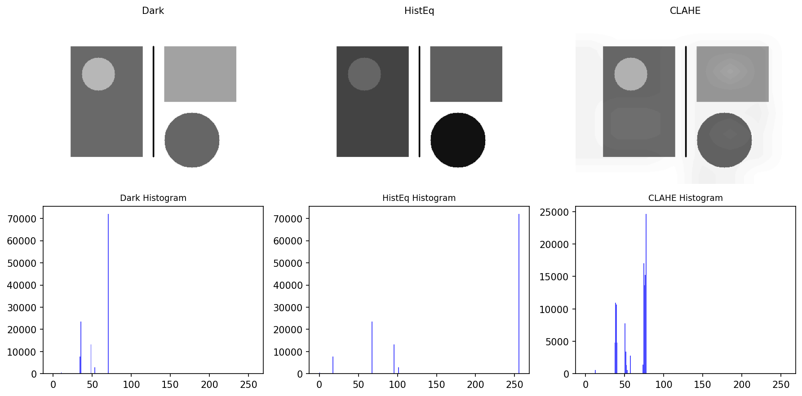

---

## 9. 轮廓检测与分析

⭐⭐⭐⭐⭐ **形状分析的王者**

### 查找轮廓

```python
contours, hierarchy = cv2.findContours(binary, cv2.RETR_EXTERNAL, cv2.CHAIN_APPROX_SIMPLE)
```

| 检索模式 | 说明 | 流行度 |
|---------|------|:------:|
| `RETR_EXTERNAL` | 最外层轮廓 | ⭐⭐⭐⭐⭐ |
| `RETR_LIST` | 所有轮廓，不建立层级 | ⭐⭐⭐ |
| `RETR_CCOMP` | 两层结构(外/内洞) | ⭐⭐⭐ |
| `RETR_TREE` | 完整层级树 | ⭐⭐⭐⭐ |

| 近似方法 | 说明 |
|---------|------|
| `CHAIN_APPROX_SIMPLE` | 仅保存关键点（推荐） |
| `CHAIN_APPROX_NONE` | 保存所有点 |

### 绘制轮廓

```python
cv2.drawContours(img, contours, -1, (0, 255, 0), 2)      # 全部
cv2.drawContours(img, contours, 0, (0, 255, 0), 2)        # 第一个
```

### 轮廓特征 ⭐⭐⭐⭐⭐

```python
for c in contours:
    area = cv2.contourArea(c)                    # 面积
    perimeter = cv2.arcLength(c, True)           # 周长
    x, y, w, h = cv2.boundingRect(c)             # 外接矩形
    rect = cv2.minAreaRect(c)                    # 最小外接矩形
    (x, y), radius = cv2.minEnclosingCircle(c)   # 最小外接圆
    moments = cv2.moments(c)                     # 矩
    cx = int(moments['m10'] / moments['m00'])    # 质心 x
    cy = int(moments['m01'] / moments['m00'])    # 质心 y
    hull = cv2.convexHull(c)                     # 凸包
    defects = cv2.convexityDefects(c, hull)      # 凸缺陷
    approx = cv2.approxPolyDP(c, 0.02 * perimeter, True)  # 多边形逼近
```

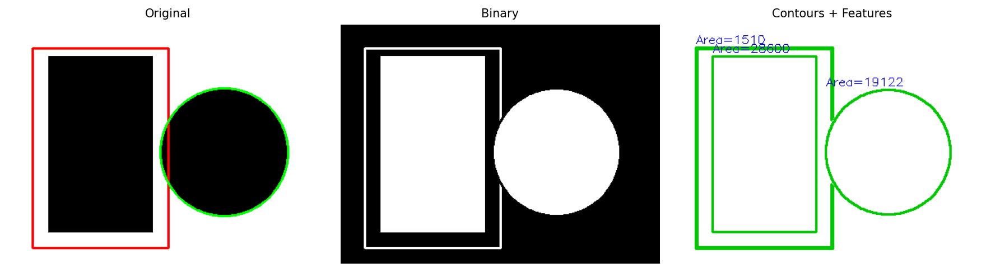

---

## 10. 图像金字塔与缩放

⭐⭐⭐⭐ **多尺度分析基础**

### 高斯金字塔

```python
smaller = cv2.pyrDown(img)     # 缩小 1/2
bigger  = cv2.pyrUp(smaller)   # 放大 2x（会模糊）
```

### 拉普拉斯金字塔

```python
g1 = cv2.pyrDown(img)
laplacian = cv2.subtract(img.astype(float), cv2.pyrUp(g1).astype(float))
```

### 用于图像融合

```python
# 构建两幅图的金字塔，在每层加权平均，再重建
# 常用于图像拼接、多曝光融合
```

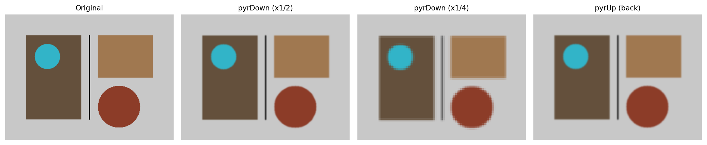

---

## 11. 特征检测与匹配

⭐⭐⭐⭐ **图像对齐、拼接、SLAM 基础**

### 角点检测

```python
# Harris
corners = cv2.cornerHarris(gray, 2, 3, 0.04)

# Shi-Tomasi (GFTT)
corners = cv2.goodFeaturesToTrack(gray, maxCorners=100, qualityLevel=0.01, minDistance=10)
```

### 特征提取与匹配

| 特征 | 流行度 | 特点 | 场景 |
|------|:------:|------|------|
| **SIFT** | ⭐⭐⭐⭐⭐ | 尺度不变，最稳定 | 图像拼接、SLAM |
| **SURF** | ⭐⭐⭐⭐ | SIFT 加速版 | 快速匹配 |
| **ORB** | ⭐⭐⭐⭐⭐ | 免费、速度快 | 移动端实时 |
| **AKAZE** | ⭐⭐⭐ | 非线性尺度空间 | 特殊场景 |

```python
# SIFT 示例
sift = cv2.SIFT_create()
kp1, des1 = sift.detectAndCompute(img1, None)
kp2, des2 = sift.detectAndCompute(img2, None)

# 暴力匹配
bf = cv2.BFMatcher(cv2.NORM_L2, crossCheck=True)
matches = bf.match(des1, des2)

# FLANN 快速匹配
FLANN_INDEX_KDTREE = 1
index_params = dict(algorithm=FLANN_INDEX_KDTREE, trees=5)
search_params = dict(checks=50)
flann = cv2.FlannBasedMatcher(index_params, search_params)
matches = flann.knnMatch(des1, des2, k=2)

# Lowe 比率测试
good = []
for m, n in matches:
    if m.distance < 0.7 * n.distance:
        good.append(m)
```

---

## 12. 模板匹配

⭐⭐⭐⭐ **目标定位的简单方案**

```python
result = cv2.matchTemplate(img, template, cv2.TM_CCOEFF_NORMED)
min_val, max_val, min_loc, max_loc = cv2.minMaxLoc(result)
top_left = max_loc  # 最佳匹配位置
h, w = template.shape[:2]
bottom_right = (top_left[0] + w, top_left[1] + h)
cv2.rectangle(img, top_left, bottom_right, (0, 255, 0), 2)
```

| 匹配方法 | 说明 |
|---------|------|
| `TM_CCOEFF_NORMED` | 归一化相关系数（推荐） |
| `TM_CCORR_NORMED` | 归一化互相关 |
| `TM_SQDIFF_NORMED` | 归一化平方差（越小越好） |

**多尺度模板匹配：**
```python
for scale in np.linspace(0.5, 1.5, 20):
    resized = cv2.resize(template, None, fx=scale, fy=scale)
    result = cv2.matchTemplate(img, resized, cv2.TM_CCOEFF_NORMED)
```

---

## 13. 低光照增强

⭐⭐⭐⭐⭐⭐ **低光照项目必看**

### 方法对比

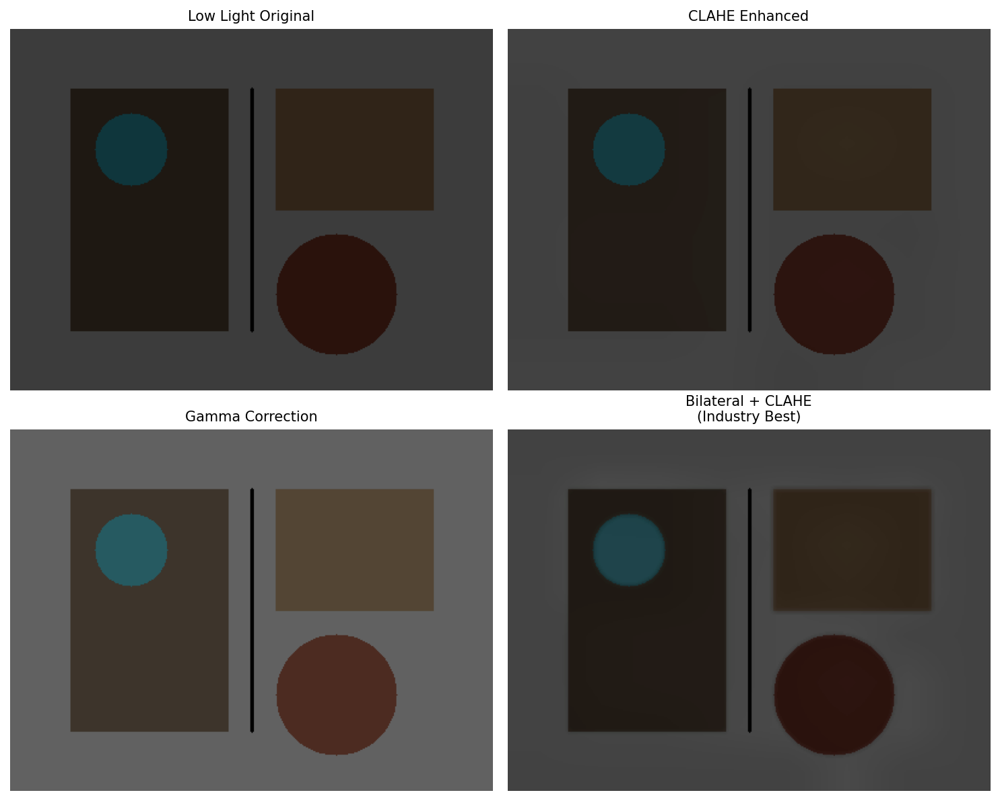

| 方法 | 流行度 | 代码量 | 效果 | 速度 |
|------|:------:|:------:|:----:|:----:|
| **CLAHE** | ⭐⭐⭐⭐⭐ | 3行 | ⭐⭐⭐⭐ | 快 |
| **伽马校正** | ⭐⭐⭐⭐⭐ | 2行 | ⭐⭐⭐ | **极快** |
| 直方图均衡化 | ⭐⭐⭐⭐ | 1行 | ⭐⭐ | 快 |
| 对比度拉伸 | ⭐⭐⭐⭐ | 3行 | ⭐⭐⭐ | 快 |
| 双边+CLAHE | ⭐⭐⭐⭐ | 5行 | ⭐⭐⭐⭐⭐ | 中等 |
| Retinex MSR | ⭐⭐⭐ | 15行 | ⭐⭐⭐⭐ | 慢 |

### 代码速查

```python
# 1. CLAHE（最佳单方法）
lab = cv2.cvtColor(img, cv2.COLOR_BGR2LAB)
l, a, b = cv2.split(lab)
l = cv2.createCLAHE(clipLimit=2.0, tileGridSize=(8,8)).apply(l)
result = cv2.cvtColor(cv2.merge([l, a, b]), cv2.COLOR_LAB2BGR)

# 2. 伽马校正
gamma = 1.5
table = np.array([(i/255)**(1/gamma)*255 for i in range(256)], dtype=np.uint8)
result = cv2.LUT(img, table)

# 3. 双边滤波 + CLAHE（工程首选，去噪后增强）
denoised = cv2.bilateralFilter(img, 9, 50, 50)
lab = cv2.cvtColor(denoised, cv2.COLOR_BGR2LAB)
l, a, b = cv2.split(lab)
l = cv2.createCLAHE(clipLimit=2.0).apply(l)
result = cv2.cvtColor(cv2.merge([l, a, b]), cv2.COLOR_LAB2BGR)

# 4. MSR（多尺度 Retinex）
img_f = img.astype(np.float32) + 1.0
result = np.zeros_like(img_f)
for sigma in [15, 80, 250]:
    for i in range(3):
        blurred = cv2.GaussianBlur(img_f[:,:,i], (0,0), sigma)
        result[:,:,i] += (np.log(img_f[:,:,i]) - np.log(blurred)) / 3
result = cv2.normalize(result, None, 0, 255, cv2.NORM_MINMAX).astype(np.uint8)
```

---

## 14. 图像分割

⭐⭐⭐⭐ **从图像中分离目标**

### 阈值分割

```python
_, otsu = cv2.threshold(gray, 0, 255, cv2.THRESH_BINARY + cv2.THRESH_OTSU)
```

### 分水岭算法

```python
# 1. 确定前景区域
_, sure_fg = cv2.threshold(gray, 0, 255, cv2.THRESH_BINARY + cv2.THRESH_OTSU)
# 2. 确定背景区域
sure_bg = cv2.dilate(sure_fg, kernel, iterations=3)
# 3. 不确定区域
unknown = cv2.subtract(sure_bg, sure_fg)
# 4. 标记
_, markers = cv2.connectedComponents(sure_fg)
markers = markers + 1
markers[unknown == 255] = 0
# 5. 运行分水岭
markers = cv2.watershed(img, markers)
img[markers == -1] = [0, 0, 255]  # 边界标红
```

### GrabCut

```python
mask = np.zeros(img.shape[:2], np.uint8)
bgdModel = np.zeros((1, 65), np.float64)
fgdModel = np.zeros((1, 65), np.float64)
rect = (50, 50, img.shape[1]-50, img.shape[0]-50)
cv2.grabCut(img, mask, rect, bgdModel, fgdModel, 5, cv2.GC_INIT_WITH_RECT)
mask = np.where((mask == 2) | (mask == 0), 0, 1).astype('uint8')
result = img * mask[:, :, np.newaxis]
```

| 方法 | 流行度 | 自动化 | 精度 |
|------|:------:|:------:|:----:|
| 阈值/Otsu | ⭐⭐⭐⭐⭐ | 自动 | ⭐⭐⭐ |
| 分水岭 | ⭐⭐⭐⭐ | 半自动 | ⭐⭐⭐⭐ |
| GrabCut | ⭐⭐⭐⭐ | 半自动 | ⭐⭐⭐⭐ |
| Canny边缘 | ⭐⭐⭐⭐⭐ | 自动 | ⭐⭐⭐ |
| 轮廓分割 | ⭐⭐⭐⭐ | 自动 | ⭐⭐⭐ |

---

## 15. 深度学习 (DNN) 模块

⭐⭐⭐⭐ **用OpenCV跑深度学习模型**

### 加载模型

```python
# 加载 Caffe 模型
net = cv2.dnn.readNetFromCaffe('deploy.prototxt', 'weights.caffemodel')
# 加载 ONNX 模型
net = cv2.dnn.readNetFromONNX('model.onnx')
# 加载 TensorFlow 模型
net = cv2.dnn.readNetFromTensorflow('frozen_graph.pb')
# 加载 Darknet (YOLO)
net = cv2.dnn.readNetFromDarknet('yolo.cfg', 'yolo.weights')
```

### 推理流程

```python
# 1. 图像预处理
blob = cv2.dnn.blobFromImage(img, scalefactor=1/255.0,
                             size=(224, 224), mean=(0.485,0.456,0.406),
                             swapRB=True)
# 2. 设置输入
net.setInput(blob)
# 3. 前向推理
outputs = net.forward()
```

### DNN 后端设置

```python
# CPU 后端
net.setPreferableBackend(cv2.dnn.DNN_BACKEND_OPENCV)
net.setPreferableTarget(cv2.dnn.DNN_TARGET_CPU)
# CUDA GPU（如果有）
net.setPreferableBackend(cv2.dnn.DNN_BACKEND_CUDA)
net.setPreferableTarget(cv2.dnn.DNN_TARGET_CUDA)
```

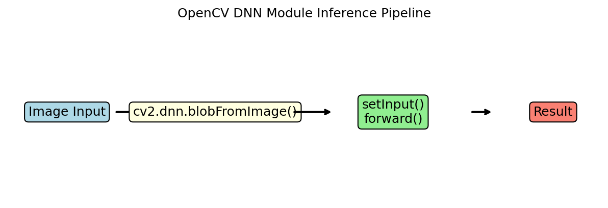

---

## 16. 视频处理

⭐⭐⭐⭐⭐ **实时视觉应用基础**

### 读取视频

```python
cap = cv2.VideoCapture(0)           # 摄像头
cap = cv2.VideoCapture('video.mp4')  # 视频文件
cap = cv2.VideoCapture('rtsp://...') # 网络流

while True:
    ret, frame = cap.read()
    if not ret:
        break
    # 处理 frame
    cv2.imshow('Frame', frame)
    if cv2.waitKey(1) & 0xFF == ord('q'):
        break

cap.release()
cv2.destroyAllWindows()
```

### 写入视频

```python
fourcc = cv2.VideoWriter_fourcc(*'mp4v')  # 编解码器
out = cv2.VideoWriter('output.mp4', fourcc, 30.0, (640, 480))

while cap.isOpened():
    ret, frame = cap.read()
    if not ret:
        break
    out.write(frame)

out.release()
```

| FourCC | 格式 |
|--------|------|
| `*'mp4v'` | MP4 |
| `*'XVID'` | AVI |
| `*'MJPG'` | Motion JPEG |

---

## 17. 相机标定

⭐⭐⭐ **3D视觉基础**

### 棋盘格标定

```python
# 准备棋盘格角点坐标
objp = np.zeros((6*9, 3), np.float32)
objp[:, :2] = np.mgrid[0:9, 0:6].T.reshape(-1, 2)

objpoints = []  # 世界坐标系
imgpoints = []  # 图像坐标系

# 查找角点
ret, corners = cv2.findChessboardCorners(gray, (9, 6), None)
if ret:
    objpoints.append(objp)
    corners2 = cv2.cornerSubPix(gray, corners, (11,11), (-1,-1), criteria)
    imgpoints.append(corners2)
    cv2.drawChessboardCorners(img, (9,6), corners2, ret)

# 标定
ret, mtx, dist, rvecs, tvecs = cv2.calibrateCamera(objpoints, imgpoints, gray.shape[::-1], None, None)

# 去畸变
undistorted = cv2.undistort(img, mtx, dist, None, mtx)
```

---

## 18. 图像拼接

⭐⭐⭐ **全景图制作**

```python
# OpenCV 内置拼接器
stitcher = cv2.Stitcher_create()
status, panorama = stitcher.stitch(images)
if status == cv2.Stitcher_OK:
    cv2.imwrite('panorama.jpg', panorama)
```

```python
# 手动拼接流程
# 1. 特征提取匹配（SIFT/ORB）
# 2. 计算单应性矩阵 (findHomography)
# 3. 透视变换 (warpPerspective)
# 4. 图像融合

# 关键函数
H, mask = cv2.findHomography(src_pts, dst_pts, cv2.RANSAC, 5.0)
```

---

## 19. 傅里叶变换

⭐⭐⭐ **频域分析**

```python
# 离散傅里叶变换
dft = cv2.dft(np.float32(gray), flags=cv2.DFT_COMPLEX_OUTPUT)
dft_shift = np.fft.fftshift(dft)

# 高通滤波（边缘增强）
rows, cols = gray.shape
crow, ccol = rows // 2, cols // 2
mask = np.ones((rows, cols, 2), np.uint8)
mask[crow-30:crow+30, ccol-30:ccol+30] = 0  # 阻塞低频
fshift = dft_shift * mask

# 逆变换
f_ishift = np.fft.ifftshift(fshift)
img_back = cv2.idft(f_ishift)
img_back = cv2.magnitude(img_back[:,:,0], img_back[:,:,1])
```

---

## 20. 实用工具函数

### 图像增强工具

```python
# 转换为 uint8（归一化）
normalized = cv2.normalize(img, None, 0, 255, cv2.NORM_MINMAX).astype(np.uint8)

# 线性变换亮度对比度
adjusted = cv2.convertScaleAbs(img, alpha=1.2, beta=30)  # alpha对比度, beta亮度

# 位平面分解
for i in range(8):
    plane = (gray >> i) & 1
```

### 绘图工具 ⭐⭐⭐⭐⭐

```python
cv2.line(img, (0,0), (100,100), (0,255,0), 2)
cv2.circle(img, (50,50), 20, (255,0,0), -1)     # -1 填充
cv2.rectangle(img, (10,10), (100,100), (0,0,255), 2)
cv2.ellipse(img, (100,100), (50,30), 0, 0, 180, (255,0,0), -1)
cv2.putText(img, "Hello", (10, 50), cv2.FONT_HERSHEY_SIMPLEX, 1, (255,255,255), 2)
```

### 鼠标交互

```python
def on_mouse(event, x, y, flags, param):
    if event == cv2.EVENT_LBUTTONDOWN:
        print(f"Click at ({x}, {y})")
cv2.setMouseCallback('window', on_mouse)
```

---

## 🏆 流行度总排行（Top 20）

| 排名 | 方法 | 模块 | 用途 |
|:----:|------|------|------|
| 1 | `cv2.imread` / `imwrite` | I/O | 读写图 |
| 2 | `cv2.cvtColor` | 色彩空间 | 颜色转换 |
| 3 | `cv2.resize` | 几何变换 | 缩放 |
| 4 | `cv2.threshold` + Otsu | 阈值 | 二值化 |
| 5 | `cv2.Canny` | 边缘检测 | 边缘 |
| 6 | `cv2.GaussianBlur` | 滤波 | 去噪 |
| 7 | `cv2.findContours` | 轮廓 | 形状分析 |
| 8 | `cv2.medianBlur` | 滤波 | 去椒盐噪声 |
| 9 | `cv2.adaptiveThreshold` | 阈值 | 光照不均二值化 |
| 10 | `cv2.inRange` | 色彩空间 | 颜色分割 |
| 11 | `cv2.morphologyEx` | 形态学 | 开闭运算 |
| 12 | `cv2.bilateralFilter` | 滤波 | 保边去噪 |
| 13 | `cv2.Sobel` | 边缘检测 | 梯度 |
| 14 | `createCLAHE` | 直方图 | 低光照增强 |
| 15 | `cv2.VideoCapture` | 视频 | 读视频/摄像头 |
| 16 | `cv2.matchTemplate` | 模板匹配 | 目标定位 |
| 17 | `cv2.warpAffine` | 几何变换 | 仿射变换 |
| 18 | `cv2.contourArea` | 轮廓 | 面积计算 |
| 19 | `cv2.dnn.blobFromImage` | DNN | DL 预处理 |
| 20 | `cv2.putText` | 绘图 | 文字标注 |

---

## 📦 快速安装

```bash
# 基础版
pip install opencv-python numpy matplotlib

# 含 contrib（额外模块）
pip install opencv-contrib-python

# 验证
python -c "import cv2; print(cv2.__version__)"
```

---

> **本笔记对应 OpenCV 版本：4.10.0**
> 配图由 `gen_figures.py` 自动生成，重新生成运行：`python gen_figures.py`
