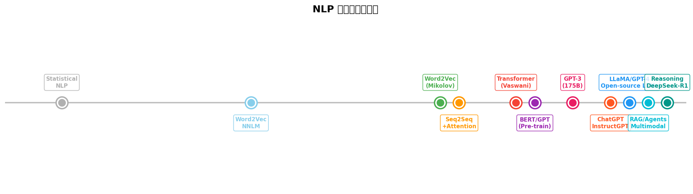
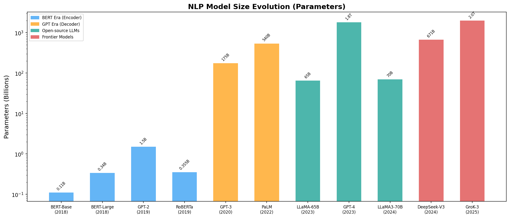
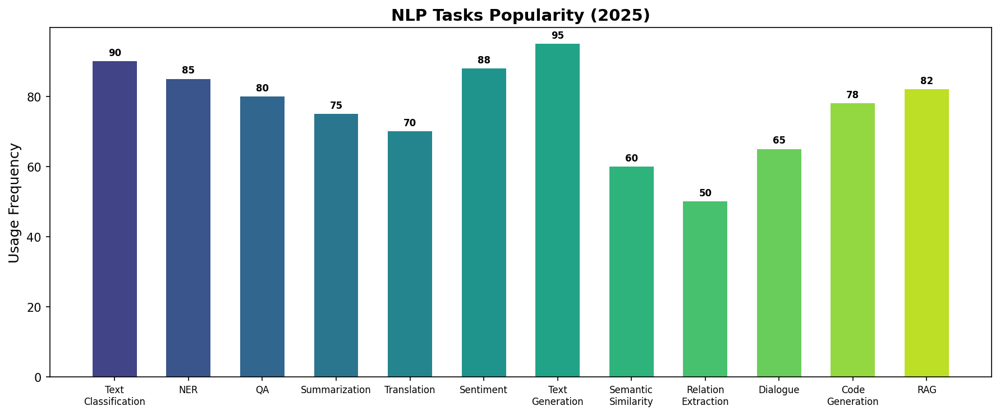
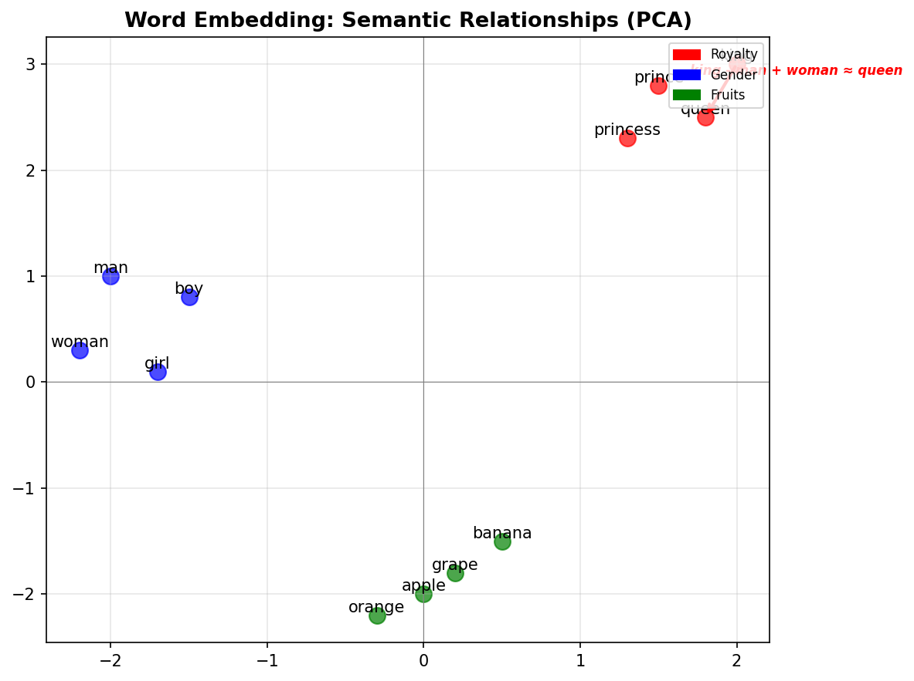
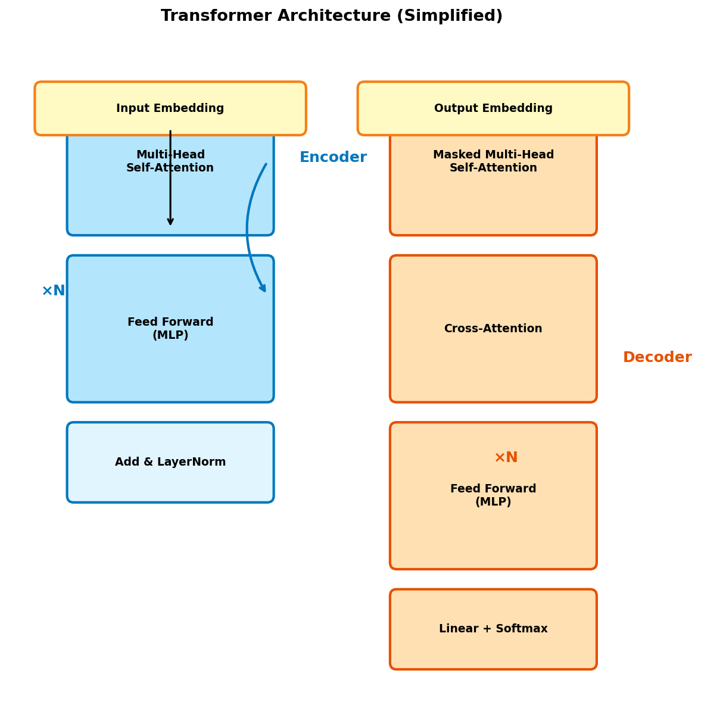
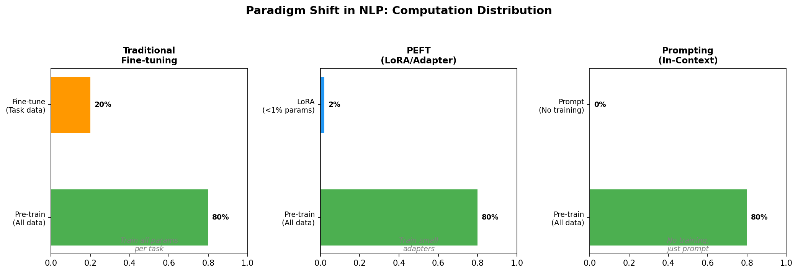
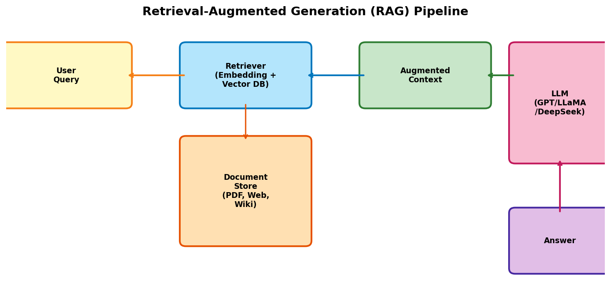
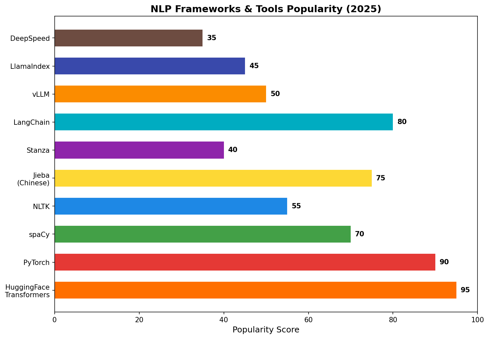

# 📖 NLP（自然语言处理）完整学习笔记

> **版本:** 2025-2026 最新技术栈
> **流行度标记：** ⭐⭐⭐⭐⭐ = 必学 / ⭐⭐⭐⭐ = 常用 / ⭐⭐⭐ = 了解 / ⭐⭐ = 特定场景

---



---

## 📑 目录

1. [NLP 概览与历史演进](#1-nlp-概览与历史演进)
2. [文本预处理](#2-文本预处理)
3. [传统 NLP 方法](#3-传统-nlp-方法)
4. [词嵌入 (Word Embeddings)](#4-词嵌入-word-embeddings)
5. [序列模型：RNN / LSTM / GRU](#5-序列模型rnn--lstm--gru)
6. [注意力机制与 Transformer](#6-注意力机制与-transformer)
7. [BERT 与 Encoder 系列模型](#7-bert-与-encoder-系列模型)
8. [GPT 与 Decoder 系列模型](#8-gpt-与-decoder-系列模型)
9. [大语言模型 (LLMs)](#9-大语言模型-llms)
10. [PEFT：高效微调](#10-peft高效微调)
11. [Prompt Engineering](#11-prompt-engineering)
12. [RAG：检索增强生成](#12-rag检索增强生成)
13. [NLP 智能体 (Agents)](#13-nlp-智能体-agents)
14. [多模态 NLP](#14-多模态-nlp)
15. [中文 NLP 专题](#15-中文-nlp-专题)
16. [NLP 任务与评价指标](#16-nlp-任务与评价指标)
17. [Hugging Face 生态](#17-hugging-face-生态)
18. [模型部署与推理优化](#18-模型部署与推理优化)
19. [主流框架与库汇总](#19-主流框架与库汇总)

---

## 1. NLP 概览与历史演进



NLP 经历了三次重大范式转变：

### 三大范式

| 时代 | 时间 | 核心技术 | 代表模型 | 流行度 |
|------|------|---------|---------|:------:|
| **统计 NLP** | 1990s-2010s | TF-IDF, N-gram, HMM, CRF | — | ⭐⭐⭐ |
| **深度学习** | 2013-2017 | Word2Vec, RNN, LSTM, Seq2Seq | Word2Vec, LSTM | ⭐⭐⭐⭐⭐ |
| **预训练+微调** | 2018-2021 | Transformer, BERT, GPT | BERT, GPT-2/3 | ⭐⭐⭐⭐⭐ |
| **大语言模型** | 2022-今 | Scaling, RLHF, In-Context Learning | GPT-4, LLaMA, DeepSeek | ⭐⭐⭐⭐⭐ |

### 关键里程碑

```
1993  — 统计 NLP（HMM 词性标注）
2003  — NNLM（神经网络语言模型）
2013  — Word2Vec（Mikolov, Google）
2014  — Seq2Seq + Attention（Bahdanau）
2017  — Transformer（Vaswani, "Attention Is All You Need"）
2018  — BERT（Devlin, Google）& GPT（Radford, OpenAI）
2020  — GPT-3 175B（Brown, OpenAI）
2022  — ChatGPT（InstructGPT, RLHF）
2023  — LLaMA（Meta, 开源大模型元年）
2024  — GPT-4o, LLaMA 3, DeepSeek-V2, RAG 普及
2025  — DeepSeek-R1 (推理), Claude 4, Gemini 2.5, Agent 爆发
```



---

## 2. 文本预处理

⭐⭐⭐⭐⭐ **所有 NLP 项目的第一步**

### 2.1 基本流程

```
原始文本 → 清洗 → 分词 → 标准化 → 去停用词 → 特征化 → 模型输入
```

### 2.2 清洗

```python
import re

# 去除 HTML 标签
text = re.sub(r'<[^>]+>', '', text)
# 去除 URL
text = re.sub(r'http\S+|www\S+', '', text)
# 去除特殊字符（保留中文、英文、数字）
text = re.sub(r'[^\w\s\u4e00-\u9fff]', '', text)
# 统一小写
text = text.lower()
```

### 2.3 分词

| 工具 | 语言 | 流行度 | 特点 |
|------|------|:------:|------|
| **spaCy** | 多语言(60+) | ⭐⭐⭐⭐⭐ | 工业级最快，含NER/POS |
| **NLTK** | 英文为主 | ⭐⭐⭐⭐ | 教科书标准，学术用 |
| **Stanza** | 多语言 | ⭐⭐⭐⭐ | Stanford 出品，精度高 |
| **Jieba** | **中文** | ⭐⭐⭐⭐⭐ | 中文分词首选 |
| **HanLP** | 中文 | ⭐⭐⭐⭐ | 功能最全的中文NLP |
| **HuggingFace Tokenizer** | 多语言 | ⭐⭐⭐⭐⭐ | 模型专用Tokenizer |

```python
# spaCy
import spacy
nlp = spacy.load("zh_core_web_sm")
doc = nlp("我爱自然语言处理")
tokens = [token.text for token in doc]

# Jieba（中文）
import jieba
words = jieba.lcut("我爱自然语言处理")  # ['我', '爱', '自然语言处理']

# Transformers
from transformers import AutoTokenizer
tokenizer = AutoTokenizer.from_pretrained("bert-base-chinese")
tokens = tokenizer.tokenize("我爱自然语言处理")
```

### 2.4 标准化

| 操作 | 说明 | 例子 |
|------|------|------|
| Stemming | 词干提取（粗） | "running" → "run" |
| Lemmatization | 词形还原（精） | "better" → "good" |
| 繁简转换 | 中文专用 | "繁體" → "繁体" |
| 全半角转换 | 中文专用 | "Ａ" → "A" |

```python
# Stemming
from nltk.stem import PorterStemmer
stemmer = PorterStemmer()
stemmer.stem("running")  # → "run"

# Lemmatization
from nltk.stem import WordNetLemmatizer
lemmatizer = WordNetLemmatizer()
lemmatizer.lemmatize("better", pos="a")  # → "good"
```

### 2.5 Subword Tokenization ⭐⭐⭐⭐⭐

现代 NLP 模型使用 Subword 分词，平衡词汇表大小和表达能力：

| 算法 | 使用模型 | 原理 |
|------|---------|------|
| **BPE** | GPT, RoBERTa | 合并最频繁的字符对 |
| **WordPiece** | BERT | 基于概率的合并 |
| **Unigram** | AlBERT, XLNet | 基于损失的语言模型 |
| **SentencePiece** | LLaMA, T5 | 直接处理原始文本，无语言依赖 |

```python
from transformers import AutoTokenizer
# BERT: WordPiece
tok = AutoTokenizer.from_pretrained("bert-base-uncased")
tok.tokenize("unbelievable")  # → ['un', '##bel', '##liev', '##able']

# LLaMA: BPE + SentencePiece
tok = AutoTokenizer.from_pretrained("meta-llama/Llama-3.2-3B")
```

---

## 3. 传统 NLP 方法

⭐⭐⭐ **了解历史，理解基础**

### 3.1 Bag of Words (BoW)

```python
from sklearn.feature_extraction.text import CountVectorizer
vectorizer = CountVectorizer(max_features=5000)
X = vectorizer.fit_transform(documents)
```

### 3.2 TF-IDF ⭐⭐⭐⭐

```python
from sklearn.feature_extraction.text import TfidfVectorizer
tfidf = TfidfVectorizer(max_features=10000, ngram_range=(1,2))
X = tfidf.fit_transform(documents)
```

$$TF\text{-}IDF(t,d) = TF(t,d) \times \log\frac{N}{DF(t)}$$

| 方法 | 流行度 | 使用场景 |
|------|:------:|---------|
| **TF-IDF** | ⭐⭐⭐⭐ | 文本分类基线、关键词提取 |
| BoW | ⭐⭐⭐ | 极简单的基线 |
| N-gram | ⭐⭐⭐ | 短语特征 |
| LSA/LDA | ⭐⭐ | 主题模型 |

### 3.3 关键词提取

```python
# TF-IDF 关键词
from sklearn.feature_extraction.text import TfidfVectorizer
# TextRank（基于 PageRank）
import jieba.analyse
keywords = jieba.analyse.textrank(text, topK=10)
# YAKE（无监督）
import yake
kw_extractor = yake.KeywordExtractor()
keywords = kw_extractor.extract_keywords(text)
```

---

## 4. 词嵌入 (Word Embeddings)

⭐⭐⭐⭐⭐ **深度学习 NLP 的基石**



### 4.1 经典 Embedding ⭐⭐⭐⭐

```python
# Word2Vec
from gensim.models import Word2Vec
model = Word2Vec(sentences, vector_size=100, window=5, min_count=5)
model.wv.most_similar("king")  # → queen, prince, ...
vector = model.wv["king"]       # → numpy array (100,)

# GloVe
from gensim.models import KeyedVectors
glove = KeyedVectors.load_word2vec_format("glove.6B.100d.txt", binary=False)

# FastText
from gensim.models import FastText
ft = FastText(sentences, vector_size=100)
```

| 方法 | 年份 | 特点 | 流行度 |
|------|:----:|------|:------:|
| **Word2Vec** | 2013 | 分布假设，负采样 | ⭐⭐⭐⭐⭐ |
| **GloVe** | 2014 | 全局共现矩阵分解 | ⭐⭐⭐⭐ |
| **FastText** | 2016 | Subword 信息，OOV友好 | ⭐⭐⭐⭐ |

### 4.2 Contextual Embeddings ⭐⭐⭐⭐⭐

| 模型 | 特点 | 使用 | 流行度 |
|------|------|------|:------:|
| **BERT Embeddings** | 双向上下文 | `model(**input).last_hidden_state` | ⭐⭐⭐⭐⭐ |
| **GPT Embeddings** | 单向（从左到右） | `model(**input).last_hidden_state` | ⭐⭐⭐⭐⭐ |
| **Sentence Embeddings** | 句级向量 | `sentence-transformers` | ⭐⭐⭐⭐⭐ |

```python
# Sentence-BERT（最常用的句向量）
from sentence_transformers import SentenceTransformer
model = SentenceTransformer("all-MiniLM-L6-v2")  # or "BAAI/bge-large-zh"
emb1 = model.encode("今天天气真好")
emb2 = model.encode("阳光明媚的一天")
similarity = cosine_similarity([emb1], [emb2])  # 语义相似度
```

---

## 5. 序列模型：RNN / LSTM / GRU

⭐⭐⭐⭐ **Transformer 之前的主力**

### 5.1 RNN

```python
import torch.nn as nn
rnn = nn.RNN(input_size=100, hidden_size=256, num_layers=2, batch_first=True)
output, hidden = rnn(x)  # output: (batch, seq_len, hidden)
```

**问题：** 梯度消失/爆炸，长序列难以建模

### 5.2 LSTM ⭐⭐⭐⭐

```python
lstm = nn.LSTM(input_size=100, hidden_size=256, num_layers=2,
               bidirectional=True, batch_first=True)
output, (h_n, c_n) = lstm(x)
```

**特点：** 遗忘门、输入门、输出门 + 细胞状态，缓解长程依赖

### 5.3 GRU ⭐⭐⭐

```python
gru = nn.GRU(input_size=100, hidden_size=256, num_layers=2, batch_first=True)
output, h_n = gru(x)
```

**特点：** LSTM 简化版（更新门+重置门），参数更少

### 现状

| 类型 | 2025 使用率 | 现状 |
|------|:----------:|------|
| 纯 RNN/LSTM | 几乎不用 | 已被 Transformer 取代 |
| **LSTM + Attention** | ⭐⭐ | 极少旧项目在用 |
| **Transformer** | ⭐⭐⭐⭐⭐ | 所有 NLP 新项目首选 |

---

## 6. 注意力机制与 Transformer

⭐⭐⭐⭐⭐ **现代 NLP 的基石**

### 6.1 Scaled Dot-Product Attention

$$Attention(Q,K,V) = softmax\left(\frac{QK^T}{\sqrt{d_k}}\right)V$$

### 6.2 Multi-Head Attention

$$MultiHead(Q,K,V) = Concat(head_1,...,head_h)W^O$$

### 6.3 Transformer 架构



```python
import torch.nn as nn

class MultiHeadAttention(nn.Module):
    def __init__(self, d_model=512, n_heads=8):
        super().__init__()
        assert d_model % n_heads == 0
        self.d_k = d_model // n_heads
        self.n_heads = n_heads
        self.w_q = nn.Linear(d_model, d_model)
        self.w_k = nn.Linear(d_model, d_model)
        self.w_v = nn.Linear(d_model, d_model)
        self.w_o = nn.Linear(d_model, d_model)

    def forward(self, x):
        B, T, D = x.shape
        Q = self.w_q(x).view(B, T, self.n_heads, self.d_k).transpose(1, 2)
        K = self.w_k(x).view(B, T, self.n_heads, self.d_k).transpose(1, 2)
        V = self.w_v(x).view(B, T, self.n_heads, self.d_k).transpose(1, 2)

        attn = Q @ K.transpose(-2, -1) / (self.d_k ** 0.5)
        attn = attn.softmax(dim=-1)
        out = (attn @ V).transpose(1, 2).contiguous().view(B, T, D)
        return self.w_o(out)
```

### 6.4 Transformer 三大变种

| 变种 | 架构 | 代表模型 | 用途 |
|------|------|---------|------|
| **Encoder-only** | 双向注意力 | BERT, RoBERTa | 理解任务（分类/NER/QA） |
| **Decoder-only** | 因果注意力 | GPT, LLaMA | **生成任务（当前主流）** |
| **Encoder-Decoder** | 完整 Transformer | T5, BART | 序列到序列（翻译/摘要） |

---

## 7. BERT 与 Encoder 系列模型

⭐⭐⭐⭐⭐ **NLP 理解任务的标准**

### 7.1 BERT 核心创新

```
预训练 → 双向 Transformer → MLM + NSP → Fine-tune → 下游任务
```

- **Masked Language Model (MLM):** 随机遮罩 15% 的词，预测被遮罩的词
- **Next Sentence Prediction (NSP):** 判断两句话是否连续

### 7.2 BERT 使用

```python
from transformers import AutoTokenizer, AutoModelForSequenceClassification
import torch

tokenizer = AutoTokenizer.from_pretrained("bert-base-chinese")
model = AutoModelForSequenceClassification.from_pretrained(
    "bert-base-chinese", num_labels=2)

inputs = tokenizer("这家餐厅很好", "就是价格有点贵",
                   return_tensors="pt", padding=True, truncation=True)
outputs = model(**inputs)
pred = torch.softmax(outputs.logits, dim=-1)
```

### 7.3 BERT 家族对比

| 模型 | 年份 | 参数量 | 特点 | 流行度 |
|------|:----:|:------:|------|:------:|
| **BERT** | 2018 | 110M/340M | 奠基之作 | ⭐⭐⭐⭐⭐ |
| **RoBERTa** | 2019 | 125M/355M | 更大批量+动态Mask，无NSP | ⭐⭐⭐⭐⭐ |
| **ALBERT** | 2019 | 12M | 参数共享，轻量 | ⭐⭐⭐ |
| **DistilBERT** | 2019 | 66M | 蒸馏，速度快40% | ⭐⭐⭐⭐ |
| **ELECTRA** | 2020 | 110M | 判别式预训练 | ⭐⭐⭐ |
| **DeBERTa-v3** | 2021 | 304M | 解耦注意力，SoTA | ⭐⭐⭐⭐ |
| **ModernBERT** | 2024 | 395M | 最新的编码器架构 | ⭐⭐⭐ |

---

## 8. GPT 与 Decoder 系列模型

⭐⭐⭐⭐⭐ **生成任务的标准**

### 8.1 GPT 家族

| 模型 | 年份 | 参数量 | 关键创新 |
|------|:----:|:------:|---------|
| **GPT-1** | 2018 | 117M | 生成式预训练 |
| **GPT-2** | 2019 | 1.5B | Zero-shot 能力 |
| **GPT-3** | 2020 | **175B** | In-Context Learning |
| **InstructGPT** | 2022 | 175B | RLHF（人类反馈强化学习）|
| **GPT-4** | 2023 | ~1.8T | 多模态，推理能力 |
| **GPT-4o** | 2024 | — | 全模态实时交互 |
| **GPT-4.1** | 2025 | — | 超大上下文，Agent 优化 |

### 8.2 Decoder-only 训练

```python
from transformers import AutoModelForCausalLM

model = AutoModelForCausalLM.from_pretrained("gpt2")
inputs = tokenizer("The capital of France is", return_tensors="pt")
output = model.generate(**inputs, max_new_tokens=20)
print(tokenizer.decode(output[0]))
# "The capital of France is Paris, the largest city in France..."
```

---

## 9. 大语言模型 (LLMs)

⭐⭐⭐⭐⭐⭐ **2023-2025 最热领域**

### 9.1 开源 LLM 对比

| 模型 | 参数 | 开源 | 中文 | 流行度 |
|------|:----:|:----:|:----:|:------:|
| **LLaMA 3** | 8B/70B | ✅ | 一般 | ⭐⭐⭐⭐⭐ |
| **Qwen 2.5** | 0.5B-72B | ✅ | **优秀** | ⭐⭐⭐⭐⭐ |
| **DeepSeek-V3** | 671B(MoE) | ✅ | 优秀 | ⭐⭐⭐⭐⭐ |
| **DeepSeek-R1** | 671B | ✅ | 优秀 | ⭐⭐⭐⭐⭐ |
| **Mistral** | 7B-123B | ✅ | 一般 | ⭐⭐⭐⭐ |
| **GLM-4** | 9B-130B | ✅ | **优秀** | ⭐⭐⭐⭐ |
| **Yi** | 6B-34B | ✅ | 优秀 | ⭐⭐⭐⭐ |
| **Gemma 2** | 2B-27B | ✅ | 一般 | ⭐⭐⭐⭐ |
| **Phi-4** | 14B | ✅ | 一般 | ⭐⭐⭐⭐ |
| **Claude 4** | — | ❌ | 优秀 | ⭐⭐⭐⭐⭐ |
| **Gemini 2.5** | — | ❌ | 优秀 | ⭐⭐⭐⭐⭐ |

### 9.3 RLHF 流程

```
Pre-train → SFT (Supervised Fine-Tune) → RM (Reward Model) → RLHF (PPO)
    ↑              ↑                          ↑                      ↑
 大量文本       高质量指令               人类偏好排序        强化学习优化
```

### 9.4 推理策略

| 策略 | 说明 | 适用模型 |
|------|------|---------|
| **Greedy Decoding** | 每步取最高概率 | 确定性输出 |
| **Beam Search** | 维护 K 条路径 | 翻译、摘要 |
| **Top-k Sampling** | 从 Top-k 采样 | 创造性生成 |
| **Top-p (Nucleus)** | 累计概率>p 的 token | ChatGPT 默认 |
| **Temperature** | 控制随机性 (T>1 更随机) | 生成多样性 |
| **Chain-of-Thought** | 思考链推理 | 复杂推理 |
| **Rejection Sampling** | 生成→筛选 | 质量优先 |

```python
output = model.generate(
    **inputs,
    do_sample=True,
    temperature=0.7,
    top_p=0.9,
    max_new_tokens=512
)
```

### 9.5 Context Window 演进

| 模型 | 最大上下文 | 年份 |
|------|:---------:|:----:|
| GPT-3 | 2K | 2020 |
| GPT-4 | 8K → 32K → 128K | 2023 |
| GPT-4o | 128K | 2024 |
| Claude 3 | 200K | 2024 |
| Gemini 1.5 | **1M → 10M** | 2024 |
| DeepSeek-V2 | 128K | 2024 |
| DeepSeek-R1 | 128K | 2025 |
| GPT-4.1 | **1M** | 2025 |

---

## 10. PEFT：高效微调

⭐⭐⭐⭐⭐ **2023-2025 微调标准方案**

### 10.1 三种微调范式对比



### 10.2 LoRA ⭐⭐⭐⭐⭐

```python
from peft import LoraConfig, get_peft_model, TaskType

lora_config = LoraConfig(
    r=8,                    # LoRA rank（核心参数，越大能力越强）
    lora_alpha=32,          # 缩放系数
    target_modules=["q_proj", "v_proj"],  # 目标模块
    lora_dropout=0.05,
    bias="none",
    task_type=TaskType.CAUSAL_LM
)

model = AutoModelForCausalLM.from_pretrained("meta-llama/Llama-3.2-3B")
model = get_peft_model(model, lora_config)
trainer.train()  # 只训练 LoRA 参数（<1%）
model.save_pretrained("lora-llama-checkpoint")
```

### 10.3 QLoRA ⭐⭐⭐⭐⭐

```python
from transformers import BitsAndBytesConfig

bnb_config = BitsAndBytesConfig(
    load_in_4bit=True,
    bnb_4bit_use_double_quant=True,
    bnb_4bit_quant_type="nf4",
    bnb_4bit_compute_dtype=torch.bfloat16
)

model = AutoModelForCausalLM.from_pretrained(
    "meta-llama/Llama-3.2-3B",
    quantization_config=bnb_config,
    device_map="auto"
)
model = get_peft_model(model, lora_config)
# 24GB 显存即可微调 70B 模型！
```

### 10.4 PEFT 方法对比

| 方法 | 可训练参数 | 显存节省 | 性能保留 | 流行度 |
|------|:---------:|:--------:|:--------:|:------:|
| **LoRA** | <1% | 10x | 95%+ | ⭐⭐⭐⭐⭐ |
| **QLoRA** | <1% | 50x | 93%+ | ⭐⭐⭐⭐⭐ |
| **Adapter** | 3-5% | 5x | 96% | ⭐⭐⭐ |
| **Prefix Tuning** | 0.1% | 20x | 90% | ⭐⭐ |
| **Prompt Tuning** | 0.01% | 50x | 85% | ⭐⭐ |
| **IA³** | 0.01% | 50x | 88% | ⭐⭐ |

---

## 11. Prompt Engineering

⭐⭐⭐⭐⭐ **使用 LLM 的核心技能**

### 11.1 基础技巧

| 技巧 | 示例 | 效果 |
|------|------|------|
| **角色设定** | "你是一个资深算法工程师" | 约束输出风格 |
| **Few-shot** | "例子1:... 例子2:... 任务:..." | 提供参考范式 |
| **Chain-of-Thought** | "让我们一步步思考" | 显著提升推理 |
| **格式约束** | "以 JSON 格式输出" | 结构化输出 |
| **分步指令** | "第一步... 第二步..." | 复杂任务分解 |

### 11.2 高级技巧

```python
# System Prompt + User Prompt
messages = [
    {"role": "system", "content": "你是一个专业的中英文翻译助手"},
    {"role": "user", "content": "把这段中文翻译成英文：\n\n"
     "OpenCV是计算机视觉领域最流行的开源库之一。"}
]

# Chain-of-Thought
prompt = """问题: 一个苹果5元，小明买了3个，付了20元，应该找零多少？
让我们一步步思考：
1. 苹果单价 = 5元
2. 数量 = 3个
3. 总价 = 5 × 3 = 15元
4. 付款 = 20元
5. 找零 = 20 - 15 = 5元
答案: 5元

问题: {}"""

# Structured Output（JSON mode）
response = client.chat.completions.create(
    model="gpt-4",
    messages=[{"role": "user", "content": "Extract entities as JSON"}],
    response_format={"type": "json_object"}
)
```

### 11.3 2025 年新趋势

| 技术 | 说明 | 流行度 |
|------|------|:------:|
| **Structure Output** | JSON Schema 约束输出 | ⭐⭐⭐⭐⭐ |
| **Prompt Caching** | 缓存系统提示词，降本50% | ⭐⭐⭐⭐⭐ |
| **Prompt Chains** | 多步 Prompt 组合 | ⭐⭐⭐⭐ |
| **Auto Prompt** | LLM 自动优化 Prompt | ⭐⭐⭐⭐ |
| **System Prompt** | 结构化系统提示词 | ⭐⭐⭐⭐⭐ |

---

## 12. RAG：检索增强生成

⭐⭐⭐⭐⭐⭐ **2024-2025 企业落地最热架构**



### 12.1 标准 RAG 流程

```
用户问题 → 向量化 → 检索相似文档 → 拼接上下文 → LLM → 答案
    
                    ↑
            文档库 (Vector DB)
```

### 12.2 完整实现

```python
# 1. 文档分块
from langchain.text_splitter import RecursiveCharacterTextSplitter
splitter = RecursiveCharacterTextSplitter(chunk_size=500, chunk_overlap=50)
chunks = splitter.split_documents(documents)

# 2. 向量化 + 存储
from langchain.embeddings import HuggingFaceEmbeddings
from langchain.vectorstores import Chroma

embeddings = HuggingFaceEmbeddings(model_name="BAAI/bge-large-zh-v1.5")
vectorstore = Chroma.from_documents(chunks, embeddings)

# 3. 检索 + 生成
from langchain.chains import RetrievalQA
from langchain.llms import HuggingFacePipeline

qa_chain = RetrievalQA.from_chain_type(
    llm=llm,
    retriever=vectorstore.as_retriever(search_kwargs={"k": 5}),
    return_source_documents=True
)
answer = qa_chain.invoke("公司的离职流程是什么？")
```

### 12.3 RAG 进阶技术

| 技术 | 说明 | 流行度 |
|------|------|:------:|
| **Naive RAG** | 直接检索+生成 | ⭐⭐⭐⭐ |
| **Advanced RAG** | Query重写/重排序/Hybrid Search | ⭐⭐⭐⭐⭐ |
| **Graph RAG** | 知识图谱增强检索 | ⭐⭐⭐⭐ |
| **Agentic RAG** | Agent 自主判断是否需要检索 | ⭐⭐⭐⭐⭐ |
| **Multi-modal RAG** | 图文联合检索 | ⭐⭐⭐⭐ |
| **Self-RAG** | LLM 自行判断检索结果质量 | ⭐⭐⭐ |

### 12.4 向量数据库对比

| 数据库 | 类型 | 流行度 | 特点 |
|--------|------|:------:|------|
| **Chroma** | 本地 | ⭐⭐⭐⭐ | 简单易用，适合原型 |
| **FAISS** | 本地库 | ⭐⭐⭐⭐⭐ | Meta出品，最快 |
| **Milvus** | 服务端 | ⭐⭐⭐⭐⭐ | 分布式，生产首选 |
| **Pinecone** | 云服务 | ⭐⭐⭐⭐ | 全托管，无需运维 |
| **Qdrant** | 服务端 | ⭐⭐⭐⭐ | Rust实现，性能好 |
| **Elasticsearch** | 服务端 | ⭐⭐⭐⭐⭐ | 传统搜索+向量 |

---

## 13. NLP 智能体 (Agents)

⭐⭐⭐⭐⭐⭐ **2025 年最前沿**

### 13.1 Agent 核心架构

```
用户输入 → LLM (推理) → Tool Calling → 执行工具 → 观察结果 → LLM (反思) → 最终输出
                                  ↑
                          工具集 (搜索/代码/计算器/API/文件)
```

### 13.2 主流框架

| 框架 | 特点 | 流行度 |
|------|------|:------:|
| **LangChain** | 最流行，生态最大 | ⭐⭐⭐⭐⭐ |
| **LangGraph** | 有向图驱动的复杂Agent | ⭐⭐⭐⭐⭐ |
| **AutoGen** | 多Agent对话 (Microsoft) | ⭐⭐⭐⭐ |
| **CrewAI** | 角色化多Agent协作 | ⭐⭐⭐⭐ |
| **Semantic Kernel** | 微软官方，C#/Python | ⭐⭐⭐ |
| **Dify** | 可视化Agent构建 | ⭐⭐⭐⭐ |
| **Coze** | 字节跳动，零代码 | ⭐⭐⭐⭐ |

```python
# LangChain Agent 示例
from langchain.agents import create_react_agent, Tool
from langchain_community.tools import WikipediaQueryRun

tools = [
    Tool(name="Calculator", func=lambda x: eval(x), description="数学计算"),
    Tool(name="Search", func=search, description="网络搜索"),
]

agent = create_react_agent(llm, tools, prompt)
result = agent.invoke({"input": "2024年诺贝尔物理学奖得主是谁？他多少岁？"})
```

### 13.3 典型 Agent 应用

| 应用 | 说明 | 所需工具 |
|------|------|---------|
| **代码Agent** | 自主编程、调试 | Python, Shell, Git |
| **数据分析Agent** | 读取数据→分析→出图 | Pandas, Matplotlib |
| **研究Agent** | 调研→阅读→总结 | 搜索, 浏览器, 文件 |
| **客服Agent** | 多轮对话+知识库 | 检索, 数据库 |
| **Devin (类)** | 全栈开发 | IDE, 终端, 浏览器 |

### 13.4 2025 Agent 趋势

- **MCP Protocol** (Model Context Protocol) — 标准化工具调用接口
- **Multi-Agent** — 多个Agent协作（规划/执行/审核）
- **Agent-as-a-Service** — Agent即服务
- **Memory & State** — 持久化记忆
- **Human-in-the-Loop** — 关键步骤人工确认

---

## 14. 多模态 NLP

⭐⭐⭐⭐⭐ **2024-2025 最热方向**

### 14.1 主要模型

| 模型 | 输入 | 输出 | 特点 | 流行度 |
|------|------|------|------|:------:|
| **GPT-4o** | 文+图+音 | 文+图+音 | 全模态实时对话 | ⭐⭐⭐⭐⭐ |
| **GPT-4.1** | 文+图 | 文 | 超大上下文 | ⭐⭐⭐⭐⭐ |
| **LLaVA** | 文+图 | 文 | 开源首选 | ⭐⭐⭐⭐⭐ |
| **Qwen-VL** | 文+图 | 文 | 中文优秀 | ⭐⭐⭐⭐⭐ |
| **DeepSeek-VL2** | 文+图 | 文 | 开源MoE | ⭐⭐⭐⭐ |
| **CLIP** | 文+图 | 文图匹配 | 多模态对齐底座 | ⭐⭐⭐⭐⭐ |

### 14.2 CLIP：图文对齐

```python
from transformers import CLIPProcessor, CLIPModel
from PIL import Image

model = CLIPModel.from_pretrained("openai/clip-vit-base-patch32")
processor = CLIPProcessor.from_pretrained("openai/clip-vit-base-patch32")

image = Image.open("cat.jpg")
inputs = processor(text=["猫", "狗", "鸟"], images=image,
                   return_tensors="pt", padding=True)
outputs = model(**inputs)
probs = outputs.logits_per_image.softmax(dim=-1)  # 图像-文本匹配概率
```

### 14.3 LLaVA：视觉语言模型

```python
from transformers import LlavaNextProcessor, LlavaNextForConditionalGeneration
model = LlavaNextForConditionalGeneration.from_pretrained("llava-hf/llava-v1.6-mistral-7b-hf")
processor = LlavaNextProcessor.from_pretrained("llava-hf/llava-v1.6-mistral-7b-hf")

prompt = "[INST] <image>\nDescribe this image in detail [/INST]"
inputs = processor(text=prompt, images=image, return_tensors="pt")
output = model.generate(**inputs, max_new_tokens=200)
print(processor.decode(output[0], skip_special_tokens=True))
```

---

## 15. 中文 NLP 专题

⭐⭐⭐⭐⭐ **中文场景必备**

### 15.1 中文分词

```python
# Jieba（最流行）
import jieba
words = jieba.lcut("我爱自然语言处理", cut_all=False)
# → ['我', '爱', '自然语言处理']

# Jieba 自定义词典
jieba.load_userdict("mydict.txt")  # 添加领域词汇

# PaddleNLP（百度）
from paddlenlp import Taskflow
seg = Taskflow("word_segmentation")
words = seg("我爱自然语言处理")

# HanLP（功能最全）
import hanlp
tokenizer = hanlp.load(hanlp.pretrained.tok.COARSE_ELECTRA_SMALL_ZH)
```

### 15.2 中文 NLP 模型

| 模型 | 类型 | 参数 | 特点 |
|------|------|:----:|------|
| **BERT-base-Chinese** | Encoder | 110M | 中文BERT标准 |
| **MacBERT** | Encoder | 110M | 纠错式MLM |
| **BERT-wwm** | Encoder | 110M | 全词Mask |
| **RoBERTa-wwm-ext** | Encoder | 110M | 中文RoBERTa最强 |
| **Qwen 2.5** | LLM | 7B-72B | 中文生成首选 |
| **DeepSeek-V3** | LLM | 671B | 中文推理最强 |
| **GLM-4** | LLM | 9B-130B | 中文理解好 |
| **Yi** | LLM | 34B | 双语优秀 |
| **ChatGLM** | LLM | 6B | 清华开源 |

### 15.3 Hugging Face 中文模型

```python
# 直接用 transformers 加载
from transformers import AutoTokenizer, AutoModel

# 中文BERT
model = AutoModel.from_pretrained("google-bert/bert-base-chinese")

# 中文RoBERTa
model = AutoModel.from_pretrained("hfl/rbt3")  # 哈工大讯飞

# 中文LLM
tokenizer = AutoTokenizer.from_pretrained("Qwen/Qwen2.5-7B-Instruct",
    trust_remote_code=True)
model = AutoModelForCausalLM.from_pretrained("Qwen/Qwen2.5-7B-Instruct",
    trust_remote_code=True)
```

---

## 16. NLP 任务与评价指标

### 16.1 常见任务

| 任务 | 输入 | 输出 | 典型模型 | 流行度 |
|------|------|------|---------|:------:|
| **文本分类** | 文本 | 类别 | BERT | ⭐⭐⭐⭐⭐ |
| **命名实体识别(NER)** | 文本 | 实体+类型 | BERT+CRF | ⭐⭐⭐⭐⭐ |
| **关系抽取(RE)** | 文本+实体 | 关系 | BERT | ⭐⭐⭐⭐ |
| **问答(QA)** | 问题+文档 | 答案/区间 | BERT/BART | ⭐⭐⭐⭐⭐ |
| **文本摘要** | 长文本 | 短文本 | BART/Pegasus | ⭐⭐⭐⭐⭐ |
| **机器翻译** | 源语言 | 目标语言 | NLLB/M2M | ⭐⭐⭐⭐ |
| **情感分析** | 文本 | 正/负/中 | BERT | ⭐⭐⭐⭐⭐ |
| **文本生成** | 提示 | 文本 | GPT/LLaMA | ⭐⭐⭐⭐⭐ |
| **语义相似度** | 句子对 | 分数 | Sentence-BERT | ⭐⭐⭐⭐ |
| **文本纠错** | 有错文本 | 纠正文本 | MacBERT | ⭐⭐⭐ |
| **代码生成** | 自然语言 | 代码 | CodeLLaMA/DeepSeek-Coder | ⭐⭐⭐⭐⭐ |

### 16.2 评价指标

| 指标 | 适用任务 | 说明 |
|------|---------|------|
| **Accuracy** | 分类 | 正确率 |
| **Precision / Recall / F1** | 分类/NER | 精确率/召回率/F1 |
| **BLEU** | 翻译/生成 | n-gram 精确匹配 |
| **ROUGE** | 摘要 | 召回率为主的n-gram匹配 |
| **Perplexity** | 语言模型 | 困惑度（越低越好） |
| **BLEURT** | 生成 | 基于BERT的自动评估 |
| **BERTScore** | 生成 | BERT嵌入相似度 |
| **Human Evaluation** | 所有 | 人类评估（最准） |

```python
from sklearn.metrics import classification_report
from datasets import load_metric

# 分类指标
print(classification_report(y_true, y_pred))

# BLEU
bleu = load_metric("bleu")
bleu.compute(predictions=[pred], references=[[ref]])

# ROUGE
rouge = load_metric("rouge")
rouge.compute(predictions=[pred], references=[ref])
```

---

## 17. Hugging Face 生态

⭐⭐⭐⭐⭐ **NLP 开发的事实标准**

### 17.1 核心库

| 库 | 功能 | 流行度 |
|----|------|:------:|
| `transformers` | 模型加载/推理/训练 | ⭐⭐⭐⭐⭐ |
| `datasets` | 数据集加载/处理 | ⭐⭐⭐⭐⭐ |
| `accelerate` | 多GPU/混合精度训练 | ⭐⭐⭐⭐⭐ |
| `peft` | LoRA/QLoRA微调 | ⭐⭐⭐⭐⭐ |
| `trl` | RLHF/DPO训练 | ⭐⭐⭐⭐ |
| `tokenizers` | 快速分词器 | ⭐⭐⭐⭐⭐ |
| `diffusers` | 扩散模型 | ⭐⭐⭐⭐ |
| `optimum` | 模型量化/优化 | ⭐⭐⭐⭐ |

### 17.2 transformers 核心API

```python
from transformers import (
    AutoTokenizer, AutoModel, AutoModelForSequenceClassification,
    AutoModelForCausalLM, TrainingArguments, Trainer, pipeline
)

# Pipeline API（最简单）
classifier = pipeline("sentiment-analysis", model="distilbert-base-uncased")
result = classifier("I love this product!")  # → [{'label':'POSITIVE','score':0.99}]

# 加载模型
model = AutoModel.from_pretrained("bert-base-uncased")
model = AutoModelForCausalLM.from_pretrained(
    "meta-llama/Llama-3.2-3B",
    torch_dtype=torch.bfloat16,
    device_map="auto"
)

# 训练
training_args = TrainingArguments(
    output_dir="./results",
    per_device_train_batch_size=16,
    learning_rate=2e-5,
    num_train_epochs=3,
    fp16=True,
)
trainer = Trainer(model=model, args=training_args, train_dataset=dataset)
trainer.train()
```

### 17.3 AutoModel 体系

```
AutoModel → 基础模型（无头）
AutoModelForSequenceClassification → 分类
AutoModelForTokenClassification → NER/词级别
AutoModelForQuestionAnswering → 问答
AutoModelForCausalLM → 自回归生成（GPT/LLaMA）
AutoModelForSeq2SeqLM → Seq2Seq（T5/BART）
AutoModelForMaskedLM → MLM（BERT）
```

---

## 18. 模型部署与推理优化

⭐⭐⭐⭐ **生产环境必备**

### 18.1 模型量化

| 精度 | 显存节省 | 速度提升 | 质量损失 |
|:----:|:--------:|:--------:|:--------:|
| FP32 | 1x | 1x | 0% |
| FP16 | 2x | 1.5-2x | ~0% |
| INT8 | 4x | 2-3x | <1% |
| INT4 | 8x | 3-4x | 1-3% |

```python
# Transformers 量化
model = AutoModelForCausalLM.from_pretrained(
    "model",
    load_in_4bit=True,  # 或 load_in_8bit=True
    device_map="auto"
)

# Optimum + ONNX
from optimum.onnxruntime import ORTModelForCausalLM
model = ORTModelForCausalLM.from_pretrained("model", export=True)
```

### 18.2 推理框架

| 框架 | 特点 | 流行度 |
|------|------|:------:|
| **vLLM** | PagedAttention，吞吐最高 | ⭐⭐⭐⭐⭐ |
| **TGI** | HuggingFace官方，功能全 | ⭐⭐⭐⭐ |
| **SGLang** | Structured Gen + RadixAttention | ⭐⭐⭐⭐ |
| **TensorRT-LLM** | NVIDIA 官方，性能极致 | ⭐⭐⭐⭐ |
| **llama.cpp** | CPU/边缘设备| ⭐⭐⭐⭐⭐ |
| **Ollama** | 本地运行最简单 | ⭐⭐⭐⭐⭐ |
| **OpenVINO** | Intel CPU/GPU | ⭐⭐⭐ |
| **RKNN** | Rockchip NPU (RK3576) | ⭐⭐⭐ |

```python
# vLLM 推理
from vllm import LLM, SamplingParams

llm = LLM(model="Qwen/Qwen2.5-7B-Instruct", tensor_parallel_size=1)
params = SamplingParams(temperature=0.7, top_p=0.9, max_tokens=512)

outputs = llm.generate(["Hello, how are you?"], params)
print(outputs[0].outputs[0].text)

# Ollama（最简单的本地 LLM）
# $ ollama run qwen2.5:7b
# $ ollama run deepseek-r1:7b
```

### 18.3 推理优化技巧

| 技术 | 加速比 | 说明 |
|------|:------:|------|
| **Flash Attention** | 2-4x | 高效注意力计算 |
| **KV Cache** | 10x+ | 复用解码缓存 |
| **Continuous Batching** | 2-5x | 动态批处理 |
| **Speculative Decoding** | 2-3x | 用小模型辅助大模型 |
| **AWQ/GPTQ** | 3x | 权重量化 |
| **FP8** | 2x | 最新GPU支持 |

---

## 19. 主流框架与库汇总



### 19.1 生态总览

| 类别 | 库/框架 | 流行度 | 用途 |
|------|---------|:------:|------|
| **核心框架** | PyTorch | ⭐⭐⭐⭐⭐ | 深度学习基础 |
| | TensorFlow | ⭐⭐⭐ | 部分遗留项目 |
| | JAX | ⭐⭐⭐ | 高性能研究 |
| **模型库** | HuggingFace Transformers | ⭐⭐⭐⭐⭐ | 所有模型入口 |
| | HuggingFace PEFT | ⭐⭐⭐⭐⭐ | LoRA微调 |
| | HuggingFace TRL | ⭐⭐⭐⭐ | RLHF/DPO |
| **数据处理** | Datasets | ⭐⭐⭐⭐⭐ | 数据加载 |
| | spaCy | ⭐⭐⭐⭐ | 工业文本处理 |
| | NLTK | ⭐⭐⭐ | 教学/学术 |
| **向量检索** | FAISS | ⭐⭐⭐⭐⭐ | 向量搜索 |
| | Chroma | ⭐⭐⭐⭐ | 本地向量DB |
| | Milvus | ⭐⭐⭐⭐⭐ | 生产级向量DB |
| | Pinecone | ⭐⭐⭐⭐ | 云向量DB |
| **LLM 框架** | LangChain | ⭐⭐⭐⭐⭐ | RAG/Agent |
| | LangGraph | ⭐⭐⭐⭐⭐ | Agent 编排 |
| | LlamaIndex | ⭐⭐⭐⭐ | 数据索引 |
| | Haystack | ⭐⭐⭐ | 搜索/NLP管线 |
| **部署** | vLLM | ⭐⭐⭐⭐⭐ | 高性能推理 |
| | Ollama | ⭐⭐⭐⭐⭐ | 本地LLM |
| | llama.cpp | ⭐⭐⭐⭐⭐ | 边缘/CPU |
| | TGI | ⭐⭐⭐⭐ | HF官方推理 |
| **Agent** | AutoGen | ⭐⭐⭐⭐ | 多Agent |
| | CrewAI | ⭐⭐⭐⭐ | 角色化Agent |
| | Semantic Kernel | ⭐⭐⭐ | 微软Agent |
| | Dify | ⭐⭐⭐⭐ | 可视化Agent |
| **中文** | Jieba | ⭐⭐⭐⭐⭐ | 中文分词 |
| | HanLP | ⭐⭐⭐⭐ | 全功能中文NLP |
| | PaddleNLP | ⭐⭐⭐⭐ | 百度中文NLP |
| **监控** | LangSmith | ⭐⭐⭐⭐ | LLM可观测性 |
| | MLflow | ⭐⭐⭐⭐ | ML实验管理 |
| | Weights & Biases | ⭐⭐⭐⭐ | 实验追踪 |

### 19.2 快速环境搭建

```bash
# 基础环境
pip install torch torchvision torchaudio --index-url https://download.pytorch.org/whl/cu118
pip install transformers datasets accelerate peft trl

# LLM 工具
pip install langchain langchain-community chromadb faiss-cpu
pip install vllm  # 推理优化

# 中文工具
pip install jieba hanlp

# Agent
pip install langgraph autogen crewai

# 本地推理
pip install ollama  # 还需要安装 ollama 服务
```

---

## 总结：学习路径建议

```
┌─ 入门（1-2周）─────────────────────────────────────────────────┐
│  文本预处理 → Jieba → TF-IDF → Word2Vec → 分类任务 (BERT)     │
└────────────────────────────────────────────────────────────────┘
                              ↓
┌─ 进阶（2-4周）─────────────────────────────────────────────────┐
│  Transformer原理 → HuggingFace → 微调BERT → LoRA实战          │
└────────────────────────────────────────────────────────────────┘
                              ↓
┌─ 提升（4-8周）─────────────────────────────────────────────────┐
│  LLM推理 → Prompt → RAG → LangChain → Agent开发               │
└────────────────────────────────────────────────────────────────┘
                              ↓
┌─ 前沿（持续）──────────────────────────────────────────────────┐
│  多模态 → RLHF → 模型部署 → 推理优化 → 最新论文               │
└────────────────────────────────────────────────────────────────┘
```

> **2025-2026 重点关注：** RAG → Agent → 多模态 → 端侧部署
>
> 配图由 `gen_figures.py` 自动生成，运行 `python gen_figures.py` 重新生成
