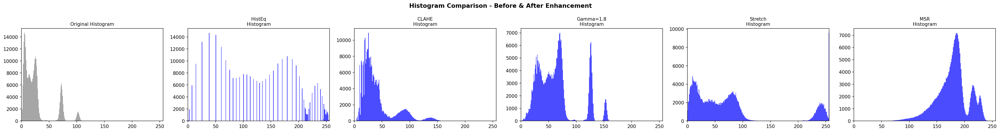

# OpenCV 低光照图像处理笔记

> **文件夹:** `08-OpenCV低光照处理方法`
> **生成日期:** 2026-06-08

---

## 一、概述

低光照图像的核心问题：**暗部细节丢失、对比度低、噪声明显**。OpenCV 提供了多种方法来改善这些问题，本笔记将对常用方法进行归纳和对比。

---

## 二、单方法增强

### 1. 直方图均衡化（Histogram Equalization）

**原理：** 将图像的灰度分布拉伸到整个 0-255 范围，使暗部变亮、亮部更均匀。

```python
import cv2

img = cv2.imread('input.jpg')
ycrcb = cv2.cvtColor(img, cv2.COLOR_BGR2YCrCb)
y, cr, cb = cv2.split(ycrcb)
y_eq = cv2.equalizeHist(y)
eq = cv2.merge([y_eq, cr, cb])
result = cv2.cvtColor(eq, cv2.COLOR_YCrCb2BGR)
```

**优点：** 简单快速、全局对比度提升明显  
**缺点：** 容易过度增强噪声、暗区可能出现色块伪影、细节可能过曝

---

### 2. CLAHE（限制对比度自适应直方图均衡化）

**原理：** 将图像分成小块分别做直方图均衡化，并限制对比度幅度，避免噪声放大。

```python
clahe = cv2.createCLAHE(clipLimit=2.0, tileGridSize=(8, 8))

lab = cv2.cvtColor(img, cv2.COLOR_BGR2LAB)
l, a, b = cv2.split(lab)
l_clahe = clahe.apply(l)
lab_clahe = cv2.merge([l_clahe, a, b])
result = cv2.cvtColor(lab_clahe, cv2.COLOR_LAB2BGR)
```

| 参数 | 作用 | 推荐值 |
|------|------|--------|
| `clipLimit` | 对比度限制幅度 | 1.0 ~ 3.0（越大对比度越强） |
| `tileGridSize` | 分块大小 | (8,8) 或 (4,4) |

**优点：** 局部细节好、噪声控制优于普通直方图均衡化  
**缺点：** 计算量稍大、分块边界可能不自然

---

### 3. 伽马校正（Gamma Correction）

**原理：** 对像素值做非线性映射，暗部被拉伸得更多，亮部压缩。

$$输出 = 255 \times \left( \frac{输入}{255} \right)^{\frac{1}{\gamma}}$$

```python
gamma = 1.8
inv_gamma = 1.0 / gamma
table = np.array([(i / 255.0) ** inv_gamma * 255 for i in range(256)], dtype=np.uint8)
result = cv2.LUT(img, table)
```

| gamma | 效果 |
|-------|------|
| < 1.0 | 图像整体变暗 |
| 1.0 | 无变化 |
| > 1.0 | 图像变亮（暗部增强最明显） |

**优点：** 计算极快、物理意义明确、能保留自然感  
**缺点：** 单一 gamma 全局调整，亮部可能过曝

---

### 4. 对数变换（Log Transformation）

**原理：** 将窄范围的低灰度值映射到更宽的范围，类似人眼对亮度的感知特性。

$$输出 = c \times \log(1 + 输入)$$

```python
normalized = img.astype(np.float32) / 255.0
c = 1.0
log_img = c * np.log(1 + normalized)
result = np.clip(log_img * 255, 0, 255).astype(np.uint8)
```

**优点：** 暗部细节提取效果好  
**缺点：** 整体对比度提升有限、色彩可能偏灰

---

### 5. 对比度拉伸（Contrast Stretching）

**原理：** 将图像的像素值范围线性拉伸到 0-255，去掉高低百分位的极端值。

```python
p_low = np.percentile(img_gray, 5)
p_high = np.percentile(img_gray, 95)
stretched = np.clip((img_gray - p_low) * (255.0 / (p_high - p_low)), 0, 255)
```

**优点：** 简单直观  
**缺点：** 依赖百分位选择、极端值可能被截断

---

### 6. Retinex 理论方法

**原理：** 假设图像 = 光照分量 × 反射分量。在对数域分离光照（低频）和反射（高频），保留反射（即物体本色）。

**SSR（单尺度）：** 用单一高斯滤波估计光照  
**MSR（多尺度）：** 融合多个尺度的高斯滤波结果，兼顾细节和色调

```python
# 多尺度 Retinex
sigmas = (15, 80, 250)
img_float = img.astype(np.float32) + 1.0
result = np.zeros_like(img_float, dtype=np.float32)
for sigma in sigmas:
    blurred = cv2.GaussianBlur(img_float, (0, 0), sigma)
    result += (np.log(img_float) - np.log(blurred)) / len(sigmas)
result = cv2.normalize(result, None, 0, 255, cv2.NORM_MINMAX)
```

**优点：** 光照补偿效果好、色彩还原自然  
**缺点：** 计算量大、可能产生 Halo 伪影

---

### 7. 双边滤波 + 亮度增强（Bilateral Filter）

**原理：** 双边滤波保边去噪，再叠加亮度提升。

```python
filtered = cv2.bilateralFilter(img, 9, 75, 75)
result = cv2.convertScaleAbs(filtered, alpha=1.3, beta=20)
```

**优点：** 降噪同时保留边缘  
**缺点：** 速度慢（尤其大图）、增强力度有限

---

## 三、单方法对比图

### 场景图对比


### 人像图对比


---

## 四、直方图变化对比

直方图直观展示了各方法对像素分布的改变：



| 方法 | 直方图变化 | 说明 |
|------|-----------|------|
| 原图 | 集中在低灰度区 | 典型低光照分布 |
| HistEq | 均匀分布到整个范围 | 但噪声同时放大 |
| CLAHE | 较均匀分布 + 限制峰值 | 更自然 |
| Gamma | 向高灰度区偏移 | 暗部拉开 |
| Stretch | 从集中变为离散散布 | 有间隙 |
| MSR | 类似正态但居中 | 光照补偿 |

---

## 五、组合方法增强

单一方法总有短板，组合使用往往效果更好。

### 1. 伽马校正 + CLAHE

先用伽马提亮暗部，再用 CLAHE 增强局部对比度。

```python
gamma_img = method_gamma(img, gamma=1.8)
result = method_clahe(gamma_img, clip=2.5)
```

**适合场景：** 整体偏暗但局部细节丰富的图像

### 2. 对比度拉伸 + CLAHE

先拉伸全局对比度，再用 CLAHE 增强局部细节。

```python
stretched = method_contrast_stretch(img)
result = method_clahe(stretched, clip=2.0)
```

**适合场景：** 对比度极低的图像

### 3. MSR + CLAHE

先用 Retinex 做光照补偿，再增强局部对比度。

```python
msr = method_multi_scale_retinex(img)
result = method_clahe(msr, clip=2.0)
```

**适合场景：** 光照不均的图像（如逆光、局部阴影）

### 4. 完整流程（MSR → 对比度拉伸 → CLAHE → 伽马微调）

```python
def full_pipeline(img):
    r = method_multi_scale_retinex(img)     # 光照补偿
    s = method_contrast_stretch(r)           # 全局拉伸
    c = method_clahe(s, clip=2.5)            # 局部增强
    g = method_gamma(c, gamma=1.2)           # 微调
    return g
```

**适合场景：** 极端低光照、多目标优化的综合需求

---

## 六、组合方法对比图

### 场景图对比


### 人像图对比


---

## 七、方法选择指南

| 场景 | 推荐方法 |
|------|---------|
| 轻度暗光、快速处理 | 伽马校正（γ=1.5~2.0） |
| 对比度不足、细节糊 | CLAHE（clip=2.0~3.0） |
| 极度暗光 | MSR + CLAHE 组合 |
| 逆光/光照不均 | 对比度拉伸 + CLAHE |
| 需要最均衡效果 | 完整流程（MSR→拉伸→CLAHE→Gamma） |
| 追求速度 | 直方图均衡化 或 伽马校正 |
| 高噪声环境 | 双边滤波去噪 + CLAHE |

---

## 八、完整的代码模板

```python
import cv2
import numpy as np

def enhance_low_light(img, method='clahe'):
    """
    低光照图像增强
    method: 'histeq' | 'clahe' | 'gamma' | 'log' | 'stretch' | 'msr' | 'full'
    """
    if method == 'histeq':
        ycrcb = cv2.cvtColor(img, cv2.COLOR_BGR2YCrCb)
        y, cr, cb = cv2.split(ycrcb)
        y_eq = cv2.equalizeHist(y)
        return cv2.cvtColor(cv2.merge([y_eq, cr, cb]), cv2.COLOR_YCrCb2BGR)

    elif method == 'clahe':
        clahe = cv2.createCLAHE(clipLimit=2.0, tileGridSize=(8, 8))
        lab = cv2.cvtColor(img, cv2.COLOR_BGR2LAB)
        l, a, b = cv2.split(lab)
        return cv2.cvtColor(cv2.merge([clahe.apply(l), a, b]), cv2.COLOR_LAB2BGR)

    elif method == 'gamma':
        gamma, inv = 1.8, 1.0 / 1.8
        lut = np.array([(i / 255.0) ** inv * 255 for i in range(256)], dtype=np.uint8)
        return cv2.LUT(img, lut)

    elif method == 'stretch':
        def stretch(ch):
            p_low, p_high = np.percentile(ch, [5, 95])
            return np.clip((ch.astype(np.float32) - p_low) * 255 / (p_high - p_low + 1e-6), 0, 255).astype(np.uint8)
        return cv2.merge([stretch(c) for c in cv2.split(img)])

    elif method == 'msr':
        img_f = img.astype(np.float32) + 1.0
        result = np.zeros_like(img_f)
        for sigma in [15, 80, 250]:
            for i in range(3):
                blurred = cv2.GaussianBlur(img_f[:,:,i], (0, 0), sigma)
                result[:,:,i] += (np.log(img_f[:,:,i]) - np.log(blurred)) / 3
        return cv2.normalize(result, None, 0, 255, cv2.NORM_MINMAX).astype(np.uint8)

    elif method == 'full':
        # MSR -> Stretch -> CLAHE -> Gamma
        r = enhance_low_light(img, 'msr')
        s = enhance_low_light(r, 'stretch')
        c = enhance_low_light(s, 'clahe')
        return enhance_low_light(c, 'gamma')

    else:
        raise ValueError(f"Unknown method: {method}")


# 使用示例
img = cv2.imread('dark_photo.jpg')
result = enhance_low_light(img, method='full')
cv2.imwrite('enhanced.jpg', result)
```

---

## 九、运行本笔记对比图

如果要重新生成对比图，运行：

```bash
python generate_comparison.py
```

脚本会自动：
1. 生成两张合成的低光照测试图（场景图 + 人像图）
2. 对所有方法逐一处理并保存对比图
3. 生成直方图变化对比
4. 生成组合方法对比图

---

*生成工具: Python + OpenCV 4.10 + Matplotlib*
