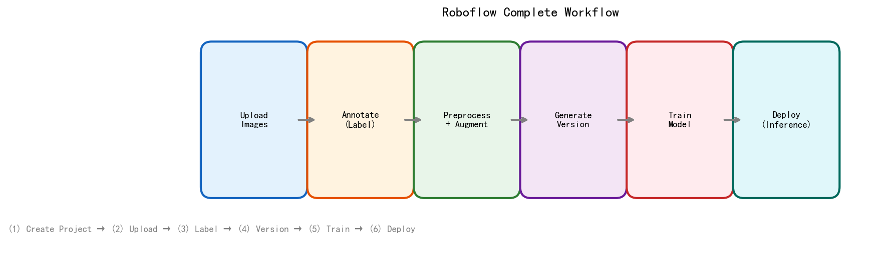
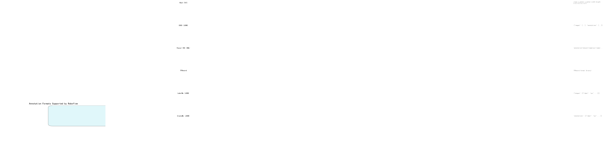
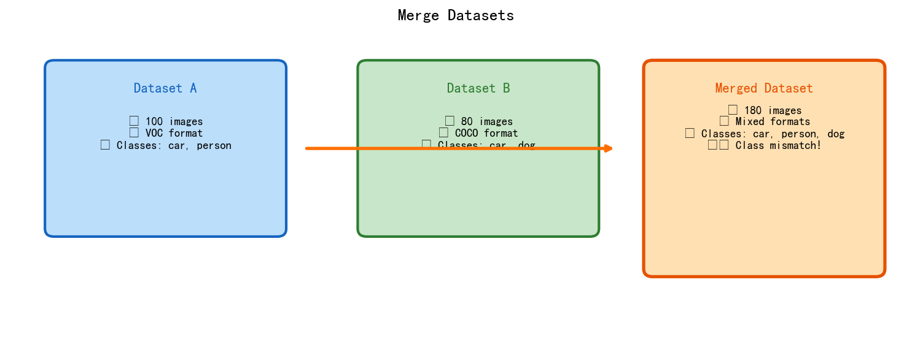
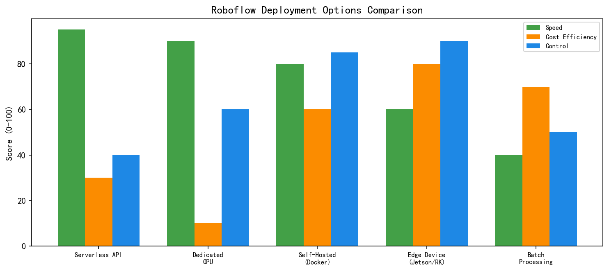

# 📖 Roboflow 完整学习笔记

> Roboflow — 端到端计算机视觉平台：数据集管理 → 标注 → 预处理 → 训练 → 部署
> **流行度标记：** ⭐⭐⭐⭐⭐ = 必学 / ⭐⭐⭐⭐ = 常用 / ⭐⭐⭐ = 了解

---



---

## 📑 目录

1. [Roboflow 简介](#1-roboflow-简介)
2. [注册与 API Key](#2-注册与-api-key)
3. [Workspace 与 Project](#3-workspace-与-project)
4. [上传数据](#4-上传数据)
5. [标注工具](#5-标注工具)
6. [预处理与增强](#6-预处理与增强)
7. [生成版本 (Version)](#7-生成版本-version)
8. [下载数据集](#8-下载数据集)
9. [合并数据集](#9-合并数据集)
10. [向量不一致的处理](#10-向量不一致的处理)
11. [训练模型](#11-训练模型)
12. [模型部署](#12-模型部署)
13. [Roboflow Workflows](#13-roboflow-workflows)
14. [Roboflow Agents](#14-roboflow-agents)
15. [Roboflow Universe](#15-roboflow-universe)
16. [Python SDK 速查](#16-python-sdk-速查)
17. [常见问题与排查](#17-常见问题与排查)

---

## 1. Roboflow 简介

**Roboflow** 是一个端到端计算机视觉平台，覆盖从数据到部署的全流程：

| 功能模块 | 说明 | 流行度 |
|---------|------|:------:|
| **Datasets** | 上传、管理、标注、分析图像 | ⭐⭐⭐⭐⭐ |
| **Preprocessing** | 自动预处理（大小归一化、灰度、自动定向） | ⭐⭐⭐⭐⭐ |
| **Augmentation** | 数据增强（旋转、翻转、裁剪、马赛克等） | ⭐⭐⭐⭐⭐ |
| **Versioning** | 数据集版本管理，可回溯 | ⭐⭐⭐⭐ |
| **Train** | 一键训练 YOLO 等模型 | ⭐⭐⭐⭐⭐ |
| **Deploy** | Serverless/自托管/边缘设备部署 | ⭐⭐⭐⭐⭐ |
| **Workflows** | 可视化多步骤视觉流水线 | ⭐⭐⭐⭐ |
| **Agents** | AI Agent 辅助构建工作流 | ⭐⭐⭐⭐ |
| **Universe** | 20万+ 公开数据集的社区市场 | ⭐⭐⭐⭐⭐ |

---

## 2. 注册与 API Key

### 2.1 注册

访问 [app.roboflow.com](https://app.roboflow.com) 注册账号（免费版支持 1000 张图片）。

### 2.2 获取 API Key

```
Settings → API Key → Copy
```

![API Key 位置示意]

```python
import roboflow

rf = roboflow.Roboflow(api_key="YOUR_API_KEY")
# 所有操作都通过 rf 对象调用
```

> ⚠️ API Key 是访问 Roboflow 的唯一凭证，不要提交到公共仓库。

---

## 3. Workspace 与 Project

### 3.1 Workspace

Workspace 是组织单位，一个账号可以有多个 workspace：

| 类型 | 用途 | 流行度 |
|------|------|:------:|
| **Personal** | 个人项目 | ⭐⭐⭐⭐⭐ |
| **Team** | 团队协作 | ⭐⭐⭐⭐ |
| **Organization** | 企业级 | ⭐⭐⭐ |

```python
# 获取当前 workspace
workspace = rf.workspace()
# 或指定 workspace（访问公开项目）
workspace = rf.workspace("roboflow-100")
```

### 3.2 Project

Project 是具体项目，一个 workspace 下可以有多个 project：

```python
# 获取项目
project = workspace.project("my-project")
# 或通过 URL 获取
project = rf.workspace().project("my-project")
```

**Project 类型（创建时选择）：**

| 类型 | 任务 | 标注格式 |
|------|------|---------|
| **Object Detection** | 目标检测 | Bounding Box |
| **Instance Segmentation** | 实例分割 | Polygon |
| **Classification** | 分类 | Single/Multi Label |
| **Keypoint Detection** | 关键点检测 | Points |
| **OCR** | 文字识别 | Polygon + text |
| **Classification** | 图像分类 | 标签 |

```python
# 创建新 project
project = rf.workspace().create_project(
    project_name="my-detector",
    project_type="object-detection",
    annotation_group="default"
)
```

---

## 4. 上传数据

⭐⭐⭐⭐⭐ **第一步操作**

### 4.1 Web 上传

![Upload 界面示意]

1. 进入 Project → Upload Data
2. **拖拽** 图片/视频/标注文件到上传区
3. 支持 JPG、PNG、WEBP、BMP、HEIC、**MP4、MOV**
4. 最大单张 20MB，最大分辨率 16400×10900

**视频上传：**
- 上传后会自动拆帧
- 可设置采样间隔（1帧/秒 ~ 60帧/秒）
- 支持手动选帧
- 支持裁切（trim）设置起止时间

### 4.2 CLI 上传（大量图片）

```bash
pip install roboflow

# 上传整个文件夹
roboflow import -w my_workspace -p my_project /path/to/images/
```

### 4.3 Python SDK 上传

```python
import roboflow

rf = roboflow.Roboflow(api_key="YOUR_API_KEY")
project = rf.workspace().project("my-project")

# 单张图片上传
project.upload("image.jpg", annotation_path="image.txt", annotation_format="yolo")

# 批量上传
import os
for img in os.listdir("images/"):
    project.upload(os.path.join("images", img))
```

### 4.4 支持的标注格式



| 格式 | 文件类型 | 涵盖项目类型 | 流行度 |
|------|---------|-------------|:------:|
| **YOLO (TXT)** | 每图一个 txt | Detection, Segmentation | ⭐⭐⭐⭐⭐ |
| **COCO (JSON)** | 一个 json | Detection, Segmentation, Keypoint | ⭐⭐⭐⭐⭐ |
| **Pascal VOC (XML)** | 每图一个 xml | Detection | ⭐⭐⭐⭐ |
| **LabelMe (JSON)** | 每图一个 json | Segmentation | ⭐⭐⭐⭐ |
| **TFRecord** | 二进制 | Detection | ⭐⭐⭐ |
| **CreateML (JSON)** | 一个 json | Detection | ⭐⭐⭐ |
| **CVAT (XML)** | 一个 xml | Detection, Segmentation | ⭐⭐⭐ |
| **FiftyOne** | 导入导出 | 通用 | ⭐⭐⭐ |
| **Kitti** | TXT | Detection | ⭐⭐ |

> 完整支持列表：https://roboflow.com/formats

---

## 5. 标注工具

⭐⭐⭐⭐⭐ **在线标注**

### 5.1 标注界面操作

| 快捷键 | 功能 |
|--------|------|
| `W` | 切换到框/多边形工具 |
| `D` | 删除选中标注 |
| `Ctrl+Z` | 撤销 |
| `Q` | 切换标注类 |
| `E` | 旋转图像 |
| `+/-` | 缩放 |

### 5.2 标注特性

| 功能 | 说明 |
|------|------|
| **Bounding Box** | 矩形框标注 |
| **Polygon** | 多边形标注（分割用） |
| **Auto-label** | 基于现有模型自动标注 |
| **SAM (Segment Anything)** | Meta SAM 辅助标注 |
| **Track** | 视频帧间跟踪标注 |
| **Active Learning** | 模型预测后自动建议标注 |
| **AI-assisted labeling** | 智能标注辅助 |
| **Keypoint** | 关键点标注 |
| **Tag** | 图像标签 |

---

## 6. 预处理与增强

⭐⭐⭐⭐⭐⭐ **Roboflow 最核心功能之一**

### 6.1 预处理 (Preprocessing)

在生成版本时自动应用，确保数据集一致性：

```yaml
# 典型预处理流程
Preprocessing:
  - Auto-Orient:  # 自动旋转修正方向
      enabled: true
  - Resize:        # 统一尺寸（必须）
      width: 640
      height: 640
      letterbox: true   # 保持宽高比
  - Grayscale:     # 转灰度（可选）
      enabled: false
  - Contrast:      # 自适应对比度调整
      enabled: true
  - Filter Null:   # 去除空标注图片
      enabled: true
```

| 预处理 | 说明 | 推荐 |
|--------|------|:----:|
| **Auto-Orient** | 自动修正 EXIF 旋转 | ✅ 总是开启 |
| **Resize** | 统一尺寸（letterbox/拉伸） | ✅ 必须 |
| **Grayscale** | 转灰度 | 视任务而定 |
| **Filter Null** | 去除无标注图片 | ✅ 推荐 |
| **Contrast** | 自适应对比度拉伸 | 低光照场景 |
| **Tile** | 大图切块 | 超大分辨率 |
| **Static Crop** | 固定区域裁剪 | ROI 固定 |

### 6.2 数据增强 (Augmentation) ⭐⭐⭐⭐⭐

```yaml
# 典型增强流程
Augmentation:
  - Flip:           # 水平翻转
      horizontal: true
      vertical: false
  - Rotate:         # 旋转
      degrees: 15
  - Shear:          # 错切
      degrees: 5
  - Crop:           # 裁剪缩放
      zoom_min: 0.8
      zoom_max: 1.2
  - Blur:           # 模糊模拟
      pixels: 1.5
  - Noise:          # 噪声模拟
      type: gaussian
      intensity: 5
  - Mosaic:         # 马赛克（YOLO 常用）
      enabled: true
  - MixUp:          # 混合两张图
      alpha: 0.2
  - Exposure:       # 曝光调整
      min: -15
      max: 15
```

**各增强方法效果：**

| 增强 | 效果 | 适用场景 | 流行度 |
|------|------|---------|:------:|
| **Flip** | 镜像翻转 | 通用 | ⭐⭐⭐⭐⭐ |
| **Rotate** | 小角度旋转 | 通用 | ⭐⭐⭐⭐ |
| **Shear** | 透视错切 | 通用 | ⭐⭐⭐⭐ |
| **Crop/Zoom** | 局部缩放 | 小目标检测 | ⭐⭐⭐⭐⭐ |
| **Blur** | 模拟运动模糊 | 运动模糊场景 | ⭐⭐⭐⭐ |
| **Noise** | 模拟传感器噪声 | 低光照 | ⭐⭐⭐⭐ |
| **Mosaic** | 四图拼接 | YOLO 系列必备 | ⭐⭐⭐⭐⭐ |
| **MixUp** | 两张图叠加 | 鲁棒性 | ⭐⭐⭐ |
| **Exposure** | 亮度变化 | 光照变化 | ⭐⭐⭐⭐ |
| **Hue/Saturation** | 颜色变化 | 颜色多样性 | ⭐⭐⭐⭐ |
| **Bounding Box Cutout** | 随机擦除 | 遮挡鲁棒性 | ⭐⭐⭐ |

### 6.3 增强可视化

```python
# 在生成版本页面，右侧会实时预览每项增强的效果
# Check: 勾选需要应用的增强
# 右侧滑块: 控制增强副本数量（3x = 每张生成3个变体）
```

---

## 7. 生成版本 (Version)

⭐⭐⭐⭐⭐ **数据集打版**

### 7.1 生成版本流程

```
预处理 + 增强 配置完毕 → 点击 "Generate" → 等待处理 → 版本就绪
```

### 7.2 Python SDK

```python
# 生成新版本
version = project.generate_version(
    preprocessing={
        "auto-orient": True,
        "resize": {"width": 640, "height": 640, "force": False},
    },
    augmentations={
        "flip": {"horizontal": True},
        "mosaic": {"enabled": True},
    },
    num_versions=3  # 增强倍数
)

# 获取已有的版本列表
versions = project.versions()
print([v.version for v in versions])  # [1, 2, 3, ...]
```

### 7.3 版本管理

| 操作 | 方法 |
|------|------|
| 查看版本 | `project.versions()` |
| 获取指定版本 | `project.version(3)` |
| 删除版本 | `project.version(3).delete()` |
| 版本对比 | Web UI 中可对比不同版本的预处理/增强差异 |

---

## 8. 下载数据集

⭐⭐⭐⭐⭐ **本地训练前必备**

### 8.1 Python SDK 下载

```python
import roboflow

rf = roboflow.Roboflow(api_key="YOUR_API_KEY")

# 方式一：从自己的 project 下载
project = rf.workspace().project("my-detector")
version = project.version(3)
dataset = version.download(
    model_format="yolov8",         # 导出格式
    location="./dataset",          # 保存路径
    overwrite=False,               # 是否覆盖
)

# 方式二：从 Universe 下载公开数据集
project = rf.workspace("roboflow-100").project("poker-cards-cxcvz")
project.version(1).download("yolov8", location="./poker-cards")
```

### 8.2 支持的导出格式

| 参数值 | 格式 | 适用框架 |
|--------|------|---------|
| `yolov5` / `yolov8` / `yolov11` | YOLO TXT | Ultralytics YOLO |
| `coco` | COCO JSON | Detectron2, MMDetection |
| `voc` | Pascal VOC XML | 通用 |
| `darknet` | Darknet TXT | Darknet |
| `tfrecord` | TFRecord | TensorFlow |
| `createml` | JSON | Apple CreateML |
| `multiclass` | 文件夹结构 | 分类任务 |
| `clip` | CSV | CLIP 训练 |

### 8.3 下载后的目录结构

```
dataset/
├── train/
│   ├── images/       # 训练图片
│   │   ├── 001.jpg
│   │   └── ...
│   └── labels/       # 标注（YOLO格式时）
│       ├── 001.txt
│       └── ...
├── valid/            # 验证集（同上结构）
├── test/             # 测试集（同上结构）
├── data.yaml         # 数据集配置文件
└── README.roboflow.dataset.txt  # 说明文件
```

### 8.4 data.yaml 内容

```yaml
# data.yaml（YOLO 格式）
train: ./train/images
val: ./valid/images
test: ./test/images

nc: 3
names: ['car', 'person', 'dog']
```

---

## 9. 合并数据集

⭐⭐⭐⭐ **多个数据集融合**

### 9.1 Web UI 合并

```
1. 进入 Workspace → Datasets 页面
2. 点击数据集右侧 "..." → "Merge Datasets"
3. 勾选要合并的数据集
4. 点击 "Merge Datasets"
5. 命名新数据集 → 点击确认
```



### 9.2 合并规则

- **原数据集保留不变**（不删除）
- 新数据集是各数据集的 **并集**
- **不重复收费**（合并的图不算新图）
- 合并时仅包含**当时已有的标注**

### 9.3 Python SDK 合并

```python
# Roboflow 不直接提供 SDK merge，但可以通过下载+组合+重新上传实现

import roboflow
import shutil, os

rf = roboflow.Roboflow(api_key="YOUR_API_KEY")
ws = rf.workspace()

# 下载两个数据集
ds1 = ws.project("project-a").version(1).download("yolov8", location="./tmp/ds1")
ds2 = ws.project("project-b").version(1).download("yolov8", location="./tmp/ds2")

# 在本地合并
# ...（见第10节处理vector不一致）

# 上传到新 project
new_project = ws.create_project("merged-project", "object-detection")
for img in os.listdir("./merged/train/images/"):
    new_project.upload(f"./merged/train/images/{img}")
```

---

## 10. 向量不一致的处理

⭐⭐⭐⭐ **合并数据集最常见的坑**

### 10.1 什么是向量不一致？

```yaml
# Dataset A: classes = [car=0, person=1, dog=2]
# Dataset B: classes = [person=0, car=1, cat=2]
# 合并后：同一个 "car" 在不同数据集中 class_id 不同！
```

| 问题类型 | 表现 | 原因 |
|---------|------|------|
| **Class ID 不一致** | 同一类标签编号不同 | 各自从 0 开始编号 |
| **类名不一致** | "car" vs "vehicle" | 命名风格不同 |
| **坐标格式不一致** | 归一化 vs 绝对坐标 | YOLO vs VOC 格式差异 |
| **缺失类** | A 有 dog，B 没有 | 数据不平衡 |

### 10.2 处理方法一：Roboflow 内置合并

Roboflow 合并在 Web UI 中会自动处理：

- 保持原类名对应
- 自动合并同类项（"car" 和 "car" 自动合并）
- 不同名但同义的类会被视为不同类

**检查合并结果：** 合并后在 Web UI 查看 Annotation Group 确认类标签映射是否正确。

### 10.3 处理方法二：手动重映射 Class ID（Python）

```python
import os

def remap_labels(label_dir, class_map, output_dir=None):
    """
    重映射标注文件中的 class_id
    
    Args:
        label_dir: 标注文件夹
        class_map: {old_id: new_id} 字典
        output_dir: 输出文件夹（None=原地修改）
    """
    os.makedirs(output_dir, exist_ok=True) if output_dir else None
    
    for fname in os.listdir(label_dir):
        if not fname.endswith('.txt'):
            continue
        
        src = os.path.join(label_dir, fname)
        dst = os.path.join(output_dir or label_dir, fname)
        
        with open(src, 'r') as f:
            lines = f.readlines()
        
        new_lines = []
        for line in lines:
            parts = line.strip().split()
            if not parts:
                continue
            old_id = int(parts[0])
            if old_id in class_map:
                parts[0] = str(class_map[old_id])
                new_lines.append(' '.join(parts))
            # 如果 old_id 不在映射中，跳过（删除该类）
        
        with open(dst, 'w') as f:
            f.write('\n'.join(new_lines))
    
    print(f"Remapped {len(os.listdir(label_dir))} files")

# 使用示例
# Dataset A: car=0, person=1
# Dataset B: car=0, person=1, dog=2  (但我们的合并目标类顺序不同)
# 目标：car=0, person=1, dog=2

# 如果需要把 B 的 dog=2 → dog=3（因为合并后有4个类）
remap_labels("./dataset_b/labels/train", {0: 0, 1: 1, 2: 3})
# 如果 A 中没有人，也可以直接下载两个数据集后手动组合
```

### 10.4 处理方法三：统一 data.yaml

```python
# 合并两个数据集的 data.yaml
import yaml

def merge_yaml(yaml_a_path, yaml_b_path, output_path):
    with open(yaml_a_path) as f:
        a = yaml.safe_load(f)
    with open(yaml_b_path) as f:
        b = yaml.safe_load(f)
    
    # 合并类名（去重，保持顺序）
    merged_names = list(dict.fromkeys(a['names'] + b['names']))
    
    merged = {
        'train': a['train'],  # 手动指定合并后的路径
        'val': a['val'],
        'nc': len(merged_names),
        'names': merged_names,
    }
    
    with open(output_path, 'w') as f:
        yaml.dump(merged, f)
    
    print(f"Merged {len(a['names'])} + {len(b['names'])} -> {len(merged_names)} classes")
    print(f"Class mapping: {merged_names}")
    return merged_names
```

### 10.5 处理方法四：完整合并脚本

```python
import os
import shutil
import yaml
from collections import defaultdict

def merge_datasets(ds1_dir, ds2_dir, output_dir, names1, names2):
    """
    合并两个 YOLO 格式的数据集，自动处理 class_id 映射
    
    Args:
        ds1_dir: 数据集1根目录
        ds2_dir: 数据集2根目录
        output_dir: 输出根目录
        names1: 数据集1的类名列表
        names2: 数据集2的类名列表
    """
    # 1. 构建全局类名映射
    merged_names = list(dict.fromkeys(names1 + names2))
    map2 = {i: merged_names.index(name) for i, name in enumerate(names2)}
    
    print(f"Class mapping (DS2 -> Merged): {map2}")
    
    # 2. 复制图片 + 重映射标注
    for split in ['train', 'valid', 'test']:
        os.makedirs(f"{output_dir}/{split}/images", exist_ok=True)
        os.makedirs(f"{output_dir}/{split}/labels", exist_ok=True)
        
        for ds_dir, name_map, names in [(ds1_dir, None, names1), (ds2_dir, map2, names2)]:
            src_img_dir = f"{ds_dir}/{split}/images"
            src_lbl_dir = f"{ds_dir}/{split}/labels"
            if not os.path.isdir(src_img_dir):
                continue
            
            for fname in os.listdir(src_img_dir):
                # 复制图片
                shutil.copy2(f"{src_img_dir}/{fname}",
                           f"{output_dir}/{split}/images/{fname}")
                
                # 重映射并复制标注
                lbl_name = fname.rsplit('.', 1)[0] + '.txt'
                src_lbl = f"{src_lbl_dir}/{lbl_name}"
                if not os.path.isfile(src_lbl):
                    continue
                
                if name_map:
                    # 有映射需要重写
                    with open(src_lbl) as f:
                        lines = f.readlines()
                    new_lines = []
                    for line in lines:
                        parts = line.strip().split()
                        if parts and int(parts[0]) in name_map:
                            new_id = name_map[int(parts[0])]
                            parts[0] = str(new_id)
                            new_lines.append(' '.join(parts))
                    with open(f"{output_dir}/{split}/labels/{lbl_name}", 'w') as f:
                        f.write('\n'.join(new_lines))
                else:
                    shutil.copy2(src_lbl, f"{output_dir}/{split}/labels/{lbl_name}")
    
    # 3. 生成合并后的 data.yaml
    merged_yaml = {
        'train': f'./{output_dir}/train/images',
        'val': f'./{output_dir}/valid/images',
        'nc': len(merged_names),
        'names': merged_names,
    }
    with open(f"{output_dir}/data.yaml", 'w') as f:
        yaml.dump(merged_yaml, f)
    
    print(f"Merged successfully: {len(merged_names)} classes, {merged_names}")
    print(f"Output: {output_dir}/")

# 使用示例
merge_datasets(
    "./ds1_yolo", "./ds2_yolo", "./merged_dataset",
    names1=['car', 'person'],
    names2=['person', 'dog', 'cat']
)
```

### 10.6 坐标格式不一致

```python
# YOLO: class x_center y_center width height (归一化 0~1)
# VOC:  xmin ymin xmax ymax (绝对像素坐标)

def yolo_to_voc(yolo_bbox, img_w, img_h):
    """YOLO 归一化坐标 → VOC 绝对坐标"""
    cx, cy, w, h = yolo_bbox
    xmin = int((cx - w / 2) * img_w)
    ymin = int((cy - h / 2) * img_h)
    xmax = int((cx + w / 2) * img_w)
    ymax = int((cy + h / 2) * img_h)
    return [xmin, ymin, xmax, ymax]

def voc_to_yolo(voc_bbox, img_w, img_h):
    """VOC 绝对坐标 → YOLO 归一化坐标"""
    xmin, ymin, xmax, ymax = voc_bbox
    cx = ((xmin + xmax) / 2) / img_w
    cy = ((ymin + ymax) / 2) / img_h
    w = (xmax - xmin) / img_w
    h = (ymax - ymin) / img_h
    return [cx, cy, w, h]
```

---

## 11. 训练模型

⭐⭐⭐⭐ **一键训练**

### 11.1 Web UI 训练

```
Project → Versions → 选择版本 → Train with Roboflow
```

| 模型 | 任务 | 特点 |
|------|------|------|
| **YOLOv8** | Detection/Segmentation | 速度与精度均衡 |
| **YOLOv11** | Detection/Segmentation | 最新 YOLO |
| **YOLOv12** | Detection | 注意力机制改进 |
| **FastSAM** | Segmentation | 快速分割 |
| **RT-DETR** | Detection | Transformer 检测器 |

### 11.2 本地训练（下载后用 Ultralytics）

```python
# 1. 从 Roboflow 下载 YOLO 格式数据集
project.version(1).download("yolov8", location="./dataset")

# 2. 本地训练
from ultralytics import YOLO

model = YOLO("yolov8n.pt")  # 加载预训练模型
results = model.train(
    data="./dataset/data.yaml",
    epochs=100,
    imgsz=640,
    batch=16,
    device="cuda",  # 或 "cpu"（RK3576 只能 cpu）
)

# 3. 验证
results = model.val()
print(f"mAP50: {results.box.map50:.3f}")
```

### 11.3 Roboflow 训练的优缺点

| 优点 | 缺点 |
|------|------|
| 无需 GPU 配置 | 免费额度有限 |
| 一键启动，自动调参 | 自定义程度有限 |
| 自动部署 | 不能修改模型结构 |
| 支持 AutoML 调参 | 大模型训练较贵 |

---

## 12. 模型部署

⭐⭐⭐⭐⭐ **上线推理**



### 12.1 部署选项

| 方式 | 延迟 | 吞吐量 | 控制度 | 成本 | 适合场景 |
|------|:----:|:------:|:------:|:----:|---------|
| **Serverless API** | 中 | 高 | 低 | 按量 | 原型验证 |
| **Dedicated GPU** | 低 | 高 | 中 | 高 | 生产高负载 |
| **Self-Hosted** | 低 | 中 | 高 | 中 | 隐私敏感 |
| **Edge Device** | 极低 | 低 | 高 | 低 | 离线/嵌入式 |

### 12.2 Serverless 推理

```python
import roboflow

rf = roboflow.Roboflow(api_key="YOUR_API_KEY")
project = rf.workspace().project("my-detector")

# 在线推理
result = project.version(1).predict("image.jpg", confidence=40, overlap=30)
result.json()  # → {"predictions": [...]}
result.save("prediction.jpg")  # 保存可视化结果
```

### 12.3 Docker 自托管

```bash
# 运行 Roboflow Inference 容器
docker run -it --rm \
    -e ROBOFLOW_API_KEY=YOUR_API_KEY \
    -p 9001:9001 \
    roboflow/roboflow-inference-server-cpu  # 或 -gpu

# 推理 API
curl http://localhost:9001/YOUR_WORKSPACE/YOUR_MODEL/1 \
    -X POST \
    -F "file=@image.jpg"
```

### 12.4 Edge 设备部署

```python
# Edge 设备上运行
from inference import get_roboflow_model

model = get_roboflow_model(
    model_id="workspace/project/1",
    api_key="YOUR_API_KEY"
)

# 实时推理
results = model.infer(image, confidence=0.5)
print(results)
```

---

## 13. Roboflow Workflows

⭐⭐⭐⭐ **可视化流水线**

### 13.1 什么是 Workflow

Workflow 是将多个视觉处理模块串联起来的可视化流水线：

```
Input → Model(Segment) → Crop → Model(Classify) → Count → Output
```

### 13.2 常用 Block

| Block | 功能 | 流行度 |
|-------|------|:------:|
| **Object Detection Model** | 目标检测 | ⭐⭐⭐⭐⭐ |
| **Segmentation Model** | 分割 | ⭐⭐⭐⭐ |
| **Classification Model** | 分类 | ⭐⭐⭐⭐ |
| **Crop** | 裁剪检测区域 | ⭐⭐⭐⭐ |
| **Detections Count** | 计数 | ⭐⭐⭐⭐⭐ |
| **Detections Filter** | 按置信度/类过滤 | ⭐⭐⭐⭐ |
| **OCR** | 文字识别 | ⭐⭐⭐⭐ |
| **Stitcher** | 图像拼接 | ⭐⭐⭐ |
| **Track** | 目标跟踪 | ⭐⭐⭐ |
| **HTTP Request** | 调用外部 API | ⭐⭐⭐ |

### 13.3 创建 Workflow

```
Workflows → Create → 拖拽 Block → 连线 → 配置参数 → Deploy
```

### 13.4 Workflow API 调用

```python
import requests

WORKFLOW_URL = "https://detect.roboflow.com/workflows/YOUR_WS/run"

response = requests.post(
    WORKFLOW_URL,
    params={"api_key": "YOUR_API_KEY"},
    files={"file": open("image.jpg", "rb")},
    json={"workflow": workflow_definition}
)
print(response.json())
```

---

## 14. Roboflow Agents

⭐⭐⭐⭐ **AI 辅助构建**

### 14.1 Roboflow Agent 能力

| 能力 | 说明 |
|------|------|
| 自然语言构建 Workflow | "用YOLO检测车辆然后计数" → 自动生成 |
| 分析上传的图像 | 理解图像内容，推荐模型 |
| 自动修复 Workflow | 运行失败自动重试+修复 |
| 管理 Rapid 模型 | 快速训练/部署 |

### 14.2 MCP Server

Roboflow 提供 MCP (Model Context Protocol) Server：

```json
// 配置 MCP Server 让 AI Agent 访问 Roboflow
{
  "mcpServers": {
    "roboflow": {
      "command": "npx",
      "args": ["@roboflow/mcp-server"],
      "env": {
        "ROBOFLOW_API_KEY": "YOUR_API_KEY"
      }
    }
  }
}
```

---

## 15. Roboflow Universe

⭐⭐⭐⭐⭐ **20万+ 公开数据集**

### 15.1 浏览 Universe

访问 [universe.roboflow.com](https://universe.roboflow.com)

| 搜索技巧 | 说明 |
|---------|------|
| 按任务分类 | Detection / Segmentation / Classification |
| 按应用领域 | 医疗、农业、工业、交通等 |
| 按模型 | 标注格式、图像分辨率 |
| 趋势 | 按下载量/收藏数排序 |

### 15.2 下载 Universe 数据集

```python
import roboflow

rf = roboflow.Roboflow(api_key="YOUR_API_KEY")

# 直接下载 Universe 项目
project = rf.workspace("roboflow-100").project("poker-cards-cxcvz")
dataset = project.version(1).download("yolov8")

# 搜索 Universe
results = rf.search("construction site")  # 搜索公开数据集
for r in results:
    print(f"{r['name']} by {r['workspace']} - {r['downloads']} downloads")
```

---

## 16. Python SDK 速查

### 16.1 完整操作一览

| 操作 | 代码 | 说明 |
|------|------|------|
| 初始化 | `rf = Roboflow(api_key)` | 必须第一个 |
| 获取 workspace | `ws = rf.workspace()` | 当前用户 |
| 创建 project | `ws.create_project(name, type)` | type: object-detection 等 |
| 获取 project | `ws.project(name)` | 通过名字 |
| 上传图片 | `project.upload(path)` | 支持中文路径 |
| 上传标注 | `project.upload(img, ann_path, ann_format)` | 同时传标注 |
| 生成版本 | `project.generate_version(pre, aug)` | 配置预处理+增强 |
| 获取版本 | `project.version(n)` | n 是版本号 |
| 下载版本 | `version.download(format, location)` | format: yolov8/coco等 |
| 获取版本列表 | `project.versions()` | 返回 Version 列表 |
| 训练模型 | `project.train(model_type)` | 在 Roboflow 云端训练 |
| 预测 | `version.predict(image)` | 在线推理 |
| 搜索公开集 | `rf.search(query)` | 在 Universe 搜索 |

### 16.2 环境变量

```bash
# 推荐用环境变量保护 API Key
export ROBOFLOW_API_KEY="YOUR_API_KEY"

# 代码中自动读取
import os
rf = roboflow.Roboflow(api_key=os.environ["ROBOFLOW_API_KEY"])
```

---

## 17. 常见问题与排查

### 17.1 "vector 不一致" / "维度不匹配"

**现象：** 合并数据集后，训练时报错 `mismatched label` 或 `index out of range`

**原因：** 不同数据集的 class_id 映射不同

**解决：**
1. 使用 Roboflow Web UI 的 Merge 功能（自动处理）
2. 或手动运行第 10 节的 `merge_datasets()` 脚本
3. 检查每个数据集的 `data.yaml` 确保 `nc` 和 `names` 正确

### 17.2 上传后没有标注

**原因：**
- 标注文件命名与图片不一致
- 标注格式不符
- 标注中包含 Roboflow 不支持的类名

**解决：** 统一文件名、确认标注格式、检查类名中不要有特殊字符

### 17.3 中文字符问题

**标注文件中的中文类名：** Roboflow 支持，但导出到某些框架可能乱码

**建议：** 类名统一用英文

### 17.4 免费额度

| 资源 | 免费版限制 |
|------|-----------|
| 图片数 | 1000 张 |
| 协作 | 1 人 |
| 数据增强 | ✅ 可用 |
| 云端训练 | ❌ 需要付费 |
| 部署 | ✅ Serverless 有限 |
| 私密数据集 | ✅ |

### 17.5 性能建议

| 场景 | 建议 |
|------|------|
| 大分辨率图像 | 使用 Tile 预处理 |
| 低光照图像 | 添加 Exposure + Noise 增强 |
| 小目标检测 | 使用 Mosaic + Crop 增强 |
| 类别不平衡 | 按类别统计并过采样 |
| 边缘设备部署 | 使用 YOLOv8n/s 等小模型 |
| RK3576 部署 | 使用 INT8 量化 + NPU 推理 |

---

> **本笔记基于 Roboflow 2025-2026 版本编写**
> 配图由 `gen_figures.py` 自动生成，运行 `python gen_figures.py` 重新生成
