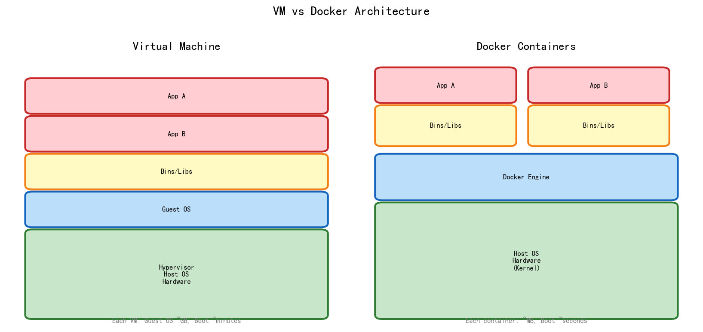
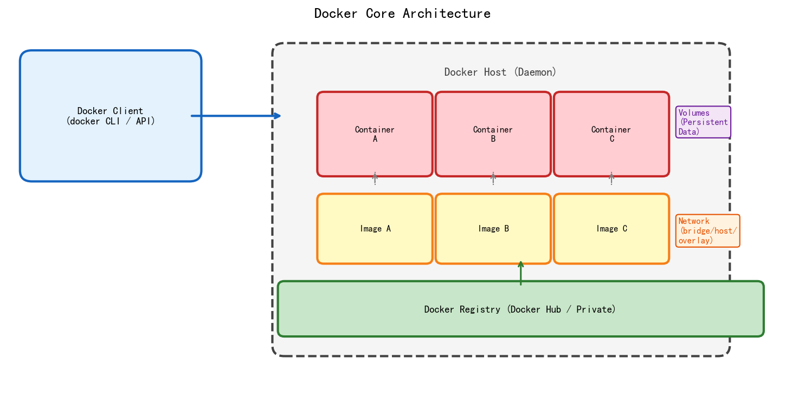
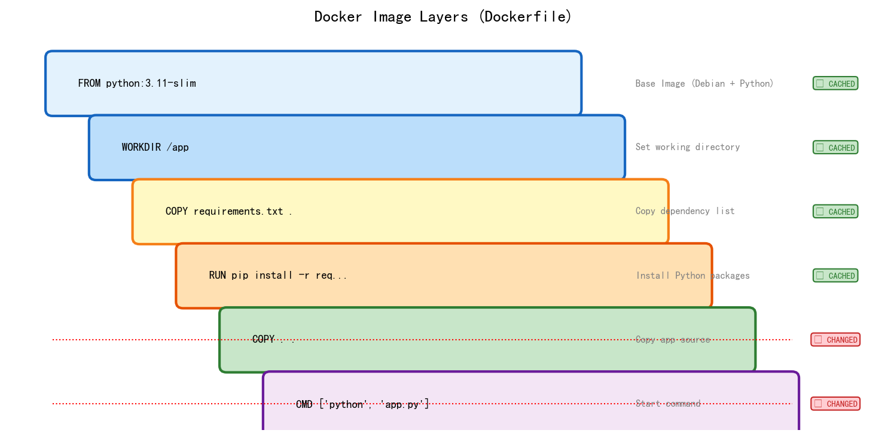
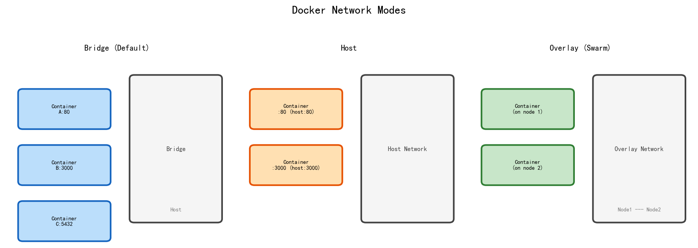

# 📖 Docker 完整学习笔记

> Docker — 容器化部署的事实标准
> **流行度标记：** ⭐⭐⭐⭐⭐ = 必学 / ⭐⭐⭐⭐ = 常用 / ⭐⭐⭐ = 了解

---



---

## 📑 目录

1. [Docker 是什么](#1-docker-是什么)
2. [核心概念](#2-核心概念)
3. [安装与验证](#3-安装与验证)
4. [Dockerfile 编写](#4-dockerfile-编写)
5. [Docker 镜像管理](#5-docker-镜像管理)
6. [Docker 容器管理](#6-docker-容器管理)
7. [数据持久化：Volumes & Bind Mounts](#7-数据持久化volumes--bind-mounts)
8. [Docker 网络](#8-docker-网络)
9. [Docker Compose](#9-docker-compose)
10. [Docker Hub & 私有仓库](#10-docker-hub--私有仓库)
11. [Dockerfile 最佳实践](#11-dockerfile-最佳实践)
12. [容器化应用部署实战](#12-容器化应用部署实战)
13. [Docker 安全](#13-docker-安全)
14. [Docker 监控与排错](#14-docker-监控与排错)
15. [Docker Swarm](#15-docker-swarm)
16. [Docker vs Podman vs Containerd](#16-docker-vs-podman-vs-containerd)
17. [多架构镜像 (ARM/AMD64)](#17-多架构镜像-armamd64)
18. [常见命令速查表](#18-常见命令速查表)

---

## 1. Docker 是什么

Docker 是一个**容器化平台**，让应用及其依赖打包在轻量级容器中运行。

### 1.1 VM vs Docker

| 特性 | 虚拟机 (VM) | Docker 容器 |
|------|:-----------:|:-----------:|
| **启动速度** | 分钟级 | **秒级** |
| **镜像大小** | GB 级 | **MB 级** |
| **资源占用** | 每个 VM 完整 OS | **共享宿主机内核** |
| **隔离性** | 强（完全隔离） | 中（进程级隔离） |
| **性能** | 有损耗（硬件虚拟化） | **接近原生** |
| **密度** | 一机几台 | **一机几十上百** |



### 1.2 为什么用 Docker

| 优势 | 说明 |
|------|------|
| **环境一致** | "在我电脑上能跑" → 彻底解决 |
| **快速部署** | `docker run` 几秒启动 |
| **版本管理** | 镜像 Tag 管理，一键回滚 |
| **微服务友好** | 一个容器一个服务 |
| **CI/CD 集成** | Jenkins/GitHub Actions + Docker |
| **资源隔离** | CPU/内存限制，互不影响 |
| **生态丰富** | Docker Hub 数百万镜像 |

---

## 2. 核心概念

| 概念 | 说明 | 类比 |
|------|------|------|
| **Image (镜像)** | 只读模板，包含应用和依赖 | 类 (Class) |
| **Container (容器)** | 镜像的运行实例，可读写 | 对象 (Instance) |
| **Dockerfile** | 构建镜像的配方文件 | 食谱 |
| **Registry (仓库)** | 存储和分发镜像 | GitHub（代码）|
| **Docker Hub** | Docker 官方公共仓库 | npmjs.com |
| **Volume** | 持久化数据存储 | U盘 |
| **Network** | 容器间通信 | 虚拟网线 |

```bash
# 核心流程
Dockerfile → docker build → Image → docker run → Container
                                        ↑
                                Docker Hub / Registry
```

---

## 3. 安装与验证

### 3.1 安装

| 平台 | 方式 |
|------|------|
| **Windows** | [Docker Desktop](https://www.docker.com/products/docker-desktop/) |
| **macOS** | [Docker Desktop](https://www.docker.com/products/docker-desktop/) |
| **Linux (Ubuntu)** | `sudo apt install docker.io` |
| **Linux (官方脚本)** | `curl -fsSL https://get.docker.com \| sh` |
| **RK3576 (ARM)** | `sudo apt install docker.io` 或 Docker Deb |

### 3.2 验证安装

```bash
# 查看版本
docker --version          # Docker version 27.x.x
docker info               # 详细系统信息

# 运行 hello-world 验证
docker run hello-world
# 输出 Hello from Docker! 表示成功

# 查看当前用户是否有权限
docker ps                 # 如果报权限错误：
sudo usermod -aG docker $USER  # 添加当前用户到 docker 组
newgrp docker             # 重新加载组
```

### 3.3 配置镜像加速

```json
// /etc/docker/daemon.json (Linux) 或 Docker Desktop Settings (Windows/Mac)
{
  "registry-mirrors": [
    "https://docker.m.daocloud.io",
    "https://dockerproxy.com"
  ]
}
```

```bash
sudo systemctl restart docker  # 重启生效
```

---

## 4. Dockerfile 编写

⭐⭐⭐⭐⭐ **最常用的操作**



### 4.1 Dockerfile 指令全表

| 指令 | 用途 | 示例 | 流行度 |
|------|------|------|:------:|
| **FROM** | 指定基础镜像 | `FROM python:3.11-slim` | ⭐⭐⭐⭐⭐ |
| **WORKDIR** | 设置工作目录 | `WORKDIR /app` | ⭐⭐⭐⭐⭐ |
| **COPY** | 复制文件到镜像 | `COPY . /app` | ⭐⭐⭐⭐⭐ |
| **ADD** | 复制+自动解压 | `ADD app.tar.gz /app` | ⭐⭐⭐ |
| **RUN** | 运行命令（构建时） | `RUN pip install -r req.txt` | ⭐⭐⭐⭐⭐ |
| **CMD** | 容器启动命令 | `CMD ["python", "app.py"]` | ⭐⭐⭐⭐⭐ |
| **ENTRYPOINT** | 容器入口点 | `ENTRYPOINT ["python"]` | ⭐⭐⭐⭐ |
| **ENV** | 环境变量 | `ENV MODE=production` | ⭐⭐⭐⭐⭐ |
| **ARG** | 构建参数 | `ARG DEBIAN_FRONTEND=noninteractive` | ⭐⭐⭐⭐ |
| **EXPOSE** | 暴露端口（文档）| `EXPOSE 8080` | ⭐⭐⭐⭐ |
| **VOLUME** | 创建挂载点 | `VOLUME /data` | ⭐⭐⭐⭐ |
| **LABEL** | 添加元数据 | `LABEL version="1.0"` | ⭐⭐⭐ |
| **HEALTHCHECK** | 健康检查 | `HEALTHCHECK CMD curl ...` | ⭐⭐⭐⭐ |
| **USER** | 指定运行用户 | `USER appuser` | ⭐⭐⭐⭐ |
| **SHELL** | 指定 shell | `SHELL ["/bin/bash", "-c"]` | ⭐⭐ |

### 4.2 CMD vs ENTRYPOINT

| 形式 | CMD | ENTRYPOINT |
|------|-----|-----------|
| **可被覆盖** | `docker run image ls` 替换 CMD | `docker run --entrypoint ls image` |
| **典型用法** | 默认参数 | 主程序入口 |
| **Shell 格式** | `CMD python app.py` | `ENTRYPOINT python app.py` |
| **Exec 格式** ✅ | `CMD ["python", "app.py"]` | `ENTRYPOINT ["python"]` |
| **组合** | `ENTRYPOINT ["python"]` + `CMD ["app.py"]` | 用户可传参 |

```dockerfile
# 推荐：ENTRYPOINT + CMD 组合
ENTRYPOINT ["python"]
CMD ["app.py"]           # docker run myimage → python app.py
                          # docker run myimage train.py → python train.py
```

### 4.3 多阶段构建 ⭐⭐⭐⭐

```dockerfile
# ===== 阶段1: 编译 =====
FROM golang:1.21 AS builder
WORKDIR /app
COPY go.mod go.sum ./
RUN go mod download
COPY . .
RUN CGO_ENABLED=0 go build -o server .

# ===== 阶段2: 运行 =====
FROM alpine:3.19
RUN apk --no-cache add ca-certificates
WORKDIR /app
COPY --from=builder /app/server .  # 只复制编译产物
EXPOSE 8080
CMD ["./server"]

# 最终镜像只有 ~15MB（而不是 Go 的 ~1GB）
```

---

## 5. Docker 镜像管理

⭐⭐⭐⭐⭐

### 5.1 构建镜像

```bash
# 从 Dockerfile 构建
docker build -t myapp:1.0 .
docker build -t myapp:1.0 -f Dockerfile.prod .

# 构建参数
docker build --build-arg VERSION=1.0 -t myapp:1.0 .

# 缓存清理
docker build --no-cache -t myapp:1.0 .
```

### 5.2 镜像管理命令

```bash
# 列出镜像
docker images                     # 列表
docker image ls                   # 同上
docker image ls --filter "dangling=true"   # 悬空镜像

# 查看镜像详情
docker inspect myapp:1.0          # JSON 信息
docker history myapp:1.0          # 构建历史层

# 删除镜像
docker rmi myapp:1.0              # 删除
docker image prune                 # 清理悬空镜像
docker image prune -a              # 清理所有未使用镜像

# 标签
docker tag myapp:1.0 myapp:latest
docker tag myapp:1.0 registry.example.com/myapp:1.0

# 保存/加载
docker save -o myapp.tar myapp:1.0        # 导出为 tar
docker load -i myapp.tar                   # 导入
```

### 5.3 镜像层与缓存

```
Layer 1: FROM python:3.11-slim   ← 缓存命中
Layer 2: WORKDIR /app            ← 缓存命中
Layer 3: COPY requirements.txt . ← 缓存命中
Layer 4: RUN pip install ...     ← 缓存命中
Layer 5: COPY . .                ← 代码变了，缓存失效！
```

**优化技巧：** 把"容易变"的指令放到 Dockerfile 后面

```dockerfile
# ❌ 差：代码变了就得重装依赖
COPY . .
RUN pip install -r requirements.txt

# ✅ 好：依赖不常变，充分利用缓存
COPY requirements.txt .
RUN pip install -r requirements.txt
COPY . .
```

---

## 6. Docker 容器管理

⭐⭐⭐⭐⭐

### 6.1 运行容器

```bash
# 基本运行
docker run nginx:latest                     # 前台运行
docker run -d nginx:latest                  # 后台运行（detach）
docker run --name mynginx nginx:latest      # 指定名称

# 端口映射
docker run -d -p 8080:80 nginx:latest       # 宿主机8080 → 容器80
docker run -d -p 8080:80 -p 443:443 nginx   # 多个端口

# 资源限制
docker run --memory="512m" --cpus="2" nginx  # 内存512M, CPU 2核
docker run --memory="512m" --memory-swap="1g" nginx  # 含swap

# 环境变量
docker run -e DB_HOST=localhost -e DB_PORT=5432 myapp

# 挂载卷
docker run -v /host/data:/container/data myapp

# 自动删除（测试用）
docker run --rm nginx                       # 停止后自动删除

# 交互式运行
docker run -it ubuntu bash                  # 进入容器 shell
```

### 6.2 容器管理命令

```bash
# 查看容器
docker ps                    # 运行中的容器
docker ps -a                 # 所有容器（含已停止）
docker ps -q                 # 只显示 ID（用于批量）

# 停止/启动/重启
docker stop container_id
docker start container_id
docker restart container_id

# 暂停/恢复
docker pause container_id
docker unpause container_id

# 删除容器
docker rm container_id        # 删除已停止的
docker rm -f container_id     # 强制删除运行中的
docker container prune        # 删除所有已停止的

# 进入容器
docker exec -it container_id bash    # 进入运行中的容器
docker attach container_id           # 附加到容器主进程

# 查看日志
docker logs container_id              # 查看日志
docker logs -f container_id           # 实时跟踪
docker logs --tail 100 container_id   # 最后100行
docker logs --since 2026-06-08 container_id

# 查看进程
docker top container_id               # 容器内的进程
docker stats                          # 所有容器实时资源
docker stats container_id             # 单个容器资源

# 查看端口映射
docker port container_id
# 查看容器详情
docker inspect container_id
```

### 6.3 容器生命周期

```
Created → Running → Paused
   ↑        ↓         ↓
   └─── Stopped ←─── Unpaused
         ↓
       Removed
```

---

## 7. 数据持久化：Volumes & Bind Mounts

⭐⭐⭐⭐⭐ **数据不丢失的关键**

### 7.1 三种方式对比

| 方式 | 存储位置 | 生命周期 | 共享性 | 适用场景 |
|------|---------|---------|:------:|---------|
| **Volume** | `/var/lib/docker/volumes/` | Docker 管理 | 任意容器 | **数据库、持久数据** |
| **Bind Mount** | 任意宿主机路径 | 宿主文件 | 任意进程 | 开发热重载、配置文件 |
| **tmpfs** | 内存 | 容器周期 | 不可共享 | 临时敏感数据 |

### 7.2 Volume ⭐⭐⭐⭐⭐

```bash
# 创建卷
docker volume create mydata
docker volume ls

# 使用卷
docker run -v mydata:/app/data mysql:8
docker run --mount source=mydata,target=/app/data mysql:8  # 新版语法

# 卷管理
docker volume inspect mydata        # 查看详情
docker volume prune                  # 清理未使用的卷
docker rm -v container_id            # 删除容器时同时删除卷
```

### 7.3 Bind Mount

```bash
# 开发环境：代码热重载
docker run -v $(pwd):/app -w /app node:18 npm run dev
docker run --mount type=bind,source="$(pwd)",target=/app node:18

# 配置文件
docker run -v /etc/nginx/nginx.conf:/etc/nginx/nginx.conf:ro nginx
# :ro = 只读，防止容器修改宿主文件
```

---

## 8. Docker 网络

⭐⭐⭐⭐⭐ **容器通信的基础**



### 8.1 网络模式

| 模式 | 说明 | 用途 |
|------|------|------|
| **bridge** (默认) | 虚拟网桥，容器间可通过 IP 通信 | 单机多容器 |
| **host** | 容器直接使用宿主机网络 | 高性能场景 |
| **none** | 无网络 | 安全隔离 |
| **overlay** | 跨宿主机容器通信 | Docker Swarm |

### 8.2 网络命令

```bash
# 查看网络
docker network ls
docker network inspect bridge

# 创建网络
docker network create mynet

# 指定网络运行
docker run -d --network mynet --name app1 myapp
docker run -d --network mynet --name app2 myapp

# DNS 自动解析：同一 network 下，容器名即主机名
# app1 中 ping app2 就能通

# 连接已有容器到网络
docker network connect mynet app3

# 端口映射
docker run -d -p 8080:80 nginx  # 宿主机:容器
```

### 8.3 容器间通信方式

```yaml
# ✅ 推荐：自定义 bridge network（DNS 自动解析）
docker network create app-net
docker run --network app-net --name web myapp
docker run --network app-net --name db mysql
# web 里可以直接连接 "db:3306"

# ❌ 不推荐：--link（已废弃）
docker run --link db:db myapp
```

---

## 9. Docker Compose

⭐⭐⭐⭐⭐ **多容器编排的标准**

### 9.1 docker-compose.yml 结构

```yaml
version: '3.8'

services:
  # ===== Web 服务 =====
  web:
    build: ./web                # 从 Dockerfile 构建
    image: myapp:latest         # 或直接指定镜像
    ports:
      - "8080:80"               # 端口映射
    volumes:
      - ./web:/app              # 挂载代码（开发热重载）
      - web_data:/data          # 命名卷
    environment:
      - DB_HOST=db
      - DB_PORT=5432
    env_file: .env               # 环境变量文件
    depends_on:
      - db                      # 依赖（确保启动顺序）
    restart: unless-stopped
    networks:
      - app-net

  # ===== 数据库 =====
  db:
    image: postgres:15
    volumes:
      - pgdata:/var/lib/postgresql/data
    environment:
      POSTGRES_DB: myapp
      POSTGRES_PASSWORD: secret
    healthcheck:                # 健康检查
      test: ["CMD-SHELL", "pg_isready"]
      interval: 10s

  # ===== Redis 缓存 =====
  redis:
    image: redis:7-alpine
    command: redis-server --requirepass ${REDIS_PASS}
    restart: always

  # ===== Nginx 反向代理 =====
  nginx:
    image: nginx:alpine
    ports:
      - "80:80"
      - "443:443"
    volumes:
      - ./nginx.conf:/etc/nginx/nginx.conf:ro
    depends_on:
      - web

volumes:
  pgdata:                      # 声明命名卷
  web_data:

networks:
  app-net:
    driver: bridge
```

### 9.2 Compose 命令

```bash
# 启动
docker compose up -d                # 后台启动所有服务
docker compose up -d --build        # 重新构建后启动

# 查看
docker compose ps                   # 服务状态
docker compose logs -f              # 所有服务日志
docker compose logs web -f          # 指定服务日志

# 操作单个服务
docker compose exec web bash        # 进入 web 容器
docker compose stop web             # 停止 web 服务
docker compose restart web          # 重启 web

# 停止/清理
docker compose down                 # 停止并删除容器/网络
docker compose down -v              # 同时删除卷（数据会丢！）
docker compose down --rmi all       # 同时删除镜像

# 构建
docker compose build                # 构建所有服务的镜像
docker compose build web            # 只构建 web

# 缩放
docker compose up -d --scale web=3  # 启动 3 个 web 实例
```

### 9.3 常用 Compose 配置片段

**Flask + Redis 计数器：**
```yaml
version: '3.8'
services:
  web:
    build: .
    ports: ["5000:5000"]
    environment:
      - REDIS_HOST=redis
  redis:
    image: redis:7-alpine
```

**React + FastAPI + PostgreSQL：**
```yaml
services:
  frontend:
    build: ./frontend
    ports: ["3000:3000"]
  backend:
    build: ./backend
    ports: ["8000:8000"]
    depends_on: [db]
  db:
    image: postgres:15
    volumes: ["pgdata:/var/lib/postgresql/data"]
```

---

## 10. Docker Hub & 私有仓库

### 10.1 Docker Hub

```bash
# 登录
docker login                        # 交互式输入用户名密码
docker login -u username -p token   # 用 Access Token

# 推送镜像到 Docker Hub
docker tag myapp:1.0 username/myapp:1.0
docker push username/myapp:1.0

# 拉取镜像
docker pull username/myapp:1.0
docker pull nginx:latest             # 官方镜像
```

### 10.2 私有仓库

```bash
# 运行本地 Registry
docker run -d -p 5000:5000 --name registry registry:2

# 推送
docker tag myapp:1.0 localhost:5000/myapp:1.0
docker push localhost:5000/myapp:1.0

# 拉取
docker pull localhost:5000/myapp:1.0

# 带认证的私有仓库
docker run -d -p 5000:5000 \
  -v /auth:/auth \
  -e "REGISTRY_AUTH=htpasswd" \
  -e "REGISTRY_AUTH_HTPASSWD_REALM=Registry" \
  -e "REGISTRY_AUTH_HTPASSWD_PATH=/auth/htpasswd" \
  registry:2

# Harbor（企业级，推荐）
# 使用 docker-compose 部署 Harbor：https://goharbor.io
```

### 10.3 GitHub Container Registry (GHCR)

```bash
# 登录 GHCR
echo $GITHUB_TOKEN | docker login ghcr.io -u USERNAME --password-stdin

# 推送
docker tag myapp:1.0 ghcr.io/username/myapp:1.0
docker push ghcr.io/username/myapp:1.0
```

---

## 11. Dockerfile 最佳实践

### 11.1 精简镜像大小

```dockerfile
# ❌ 大镜像（~1GB）
FROM ubuntu:22.04
RUN apt update && apt install -y python3 python3-pip
COPY . /app
RUN pip3 install -r /app/requirements.txt

# ✅ 小镜像（~150MB）
FROM python:3.11-slim
WORKDIR /app
COPY requirements.txt .
RUN pip install --no-cache-dir -r requirements.txt
COPY . .
```

| 基础镜像 | 大小 | 适用 |
|---------|:----:|------|
| `alpine` | ~5MB | 静态编译、Go/Rust |
| `python:3.11-slim` | ~120MB | Python 应用 |
| `node:20-alpine` | ~130MB | Node.js 应用 |
| `ubuntu:22.04` | ~80MB | 需要系统包 |
| `scratch` | 0MB | 纯静态二进制 |

### 11.2 安全最佳实践

```dockerfile
# 1. 不要用 root 运行
RUN groupadd -r appuser && useradd -r -g appuser appuser
USER appuser

# 2. 不要硬编码密码
# ❌ 不要：ENV DB_PASSWORD=secret
# ✅ 要用：运行时 -e 传入或 .env 文件

# 3. 减少攻击面
FROM python:3.11-slim  # 用 slim 而不是 full
RUN apt-get update && apt-get install -y --no-install-recommends \
    packages \
    && rm -rf /var/lib/apt/lists/*  # 清理 apt 缓存

# 4. 多阶段构建只保留运行所需
COPY --from=builder /app/server /app/
```

### 11.3 缓存优化

```dockerfile
# ✅ 依赖放前面，代码放后面
FROM python:3.11-slim
WORKDIR /app
COPY requirements.txt .         # 依赖很少变
RUN pip install -r requirements.txt  # 缓存命中
COPY . .                        # 代码经常变
```

---

## 12. 容器化应用部署实战

### 12.1 Python Flask + Gunicorn

```dockerfile
FROM python:3.11-slim
WORKDIR /app
COPY requirements.txt .
RUN pip install --no-cache-dir -r requirements.txt
COPY . .
EXPOSE 8000

# 生产环境使用 Gunicorn
CMD ["gunicorn", "-w", "4", "-b", "0.0.0.0:8000", "app:app"]
```

```yaml
# docker-compose.yml
services:
  web:
    build: .
    ports: ["8000:8000"]
    environment:
      - MODE=production
    restart: always
```

### 12.2 Node.js Express

```dockerfile
FROM node:20-alpine
WORKDIR /app
COPY package*.json .
RUN npm ci --only=production
COPY . .
EXPOSE 3000
CMD ["node", "server.js"]
```

### 12.3 React 前端 + Nginx

```dockerfile
# 多阶段构建
FROM node:20-alpine AS builder
WORKDIR /app
COPY package*.json ./
RUN npm ci
COPY . .
RUN npm run build

FROM nginx:alpine
COPY --from=builder /app/build /usr/share/nginx/html
COPY nginx.conf /etc/nginx/conf.d/default.conf
EXPOSE 80
CMD ["nginx", "-g", "daemon off;"]
```

### 12.4 OpenCV Python 应用（RK3576 场景）

```dockerfile
FROM arm64v8/python:3.11-slim

RUN apt-get update && apt-get install -y \
    libopencv-dev python3-opencv \
    && rm -rf /var/lib/apt/lists/*

WORKDIR /app
COPY requirements.txt .
RUN pip install --no-cache-dir -r requirements.txt
COPY . .
CMD ["python", "main.py"]
```

---

## 13. Docker 安全

### 13.1 权限最小化

```bash
# 不给 --privileged（除非明确需要）
docker run --privileged alpine  # ❌ 危险！

# 只给需要的 capability
docker run --cap-drop=ALL --cap-add=NET_BIND_SERVICE nginx

# 只读根文件系统
docker run --read-only --tmpfs /tmp myapp

# 指定安全选项
docker run --security-opt=no-new-privileges:true myapp
```

### 13.2 镜像安全扫描

```bash
# Docker Scout（内置）
docker scout quickview myapp:1.0
docker scout cves myapp:1.0

# Trivy（开源）
trivy image myapp:1.0
```

### 13.3 安全清单

- [ ] 不使用 `--privileged`
- [ ] 不暴露 Docker Socket（除非必要）
- [ ] 使用 `USER` 非 root 运行
- [ ] 镜像定期扫描漏洞
- [ ] 不硬编码密钥
- [ ] 使用 `.dockerignore` 排除敏感文件
- [ ] 保持基础镜像更新

---

## 14. Docker 监控与排错

### 14.1 资源监控

```bash
# 实时监控
docker stats                    # 所有容器 CPU/内存/网络/IO
docker stats container_id       # 指定容器

# 查看日志
docker logs -f container_id
docker logs --tail 500 --since 5m container_id
```

### 14.2 常见排错

```bash
# 容器启动失败
docker logs container_id        # 看错误日志

# 端口冲突
docker ps                       # 检查端口占用
netstat -tlnp | grep 8080       # 宿主机端口检查

# 磁盘空间不足
docker system df                # 查看磁盘使用
docker system prune -a          # 清理所有未使用的
docker volume prune              # 清理无用卷

# 进入问题容器
docker exec -it container_id bash  # 探索容器内部

# 复制文件进出容器
docker cp container_id:/app/log.txt ./log.txt
docker cp ./config.yml container_id:/app/config.yml

# 查看容器变化
docker diff container_id        # 查看容器文件系统变化
```

### 14.3 Docker System 命令

```bash
# 系统信息
docker system df                # 磁盘使用统计
docker system info              # 系统信息

# 清理
docker system prune             # 清理悬空镜像+停止容器+无用网络
docker system prune -a --volumes # 清理所有（含未用镜像和卷）
```

---

## 15. Docker Swarm

⭐⭐⭐ **容器编排（生产环境可用 K8s 替代）**

### 15.1 初始化 Swarm

```bash
# 管理节点初始化
docker swarm init --advertise-addr 192.168.1.100

# 工作节点加入
docker swarm join --token SWMTKN-*** 192.168.1.100:2377
```

### 15.2 Swarm 服务

```bash
# 部署服务
docker service create --replicas 3 --name web -p 80:80 nginx

# 查看服务
docker service ls
docker service ps web               # 查看服务副本状态
docker service logs web             # 查看服务日志

# 扩缩容
docker service scale web=5

# 滚动更新
docker service update --image nginx:1.25 web

# 删除服务
docker service rm web
```

### 15.3 Swarm + Compose

```yaml
# docker-stack.yml
version: '3.8'
services:
  web:
    image: myapp:latest
    ports:
      - "80:80"
    deploy:
      replicas: 5
      update_config:
        parallelism: 2
        delay: 10s
      restart_policy:
        condition: any
```

```bash
docker stack deploy -c docker-stack.yml myapp
```

---

## 16. Docker vs Podman vs Containerd

| 特性 | Docker | Podman | Containerd |
|:----:|:------:|:------:|:----------:|
| **守护进程** | 有 (dockerd) | **无守护进程** | 有 (containerd) |
| **Rootless** | 需配置 | **原生支持** | 需配置 |
| **K8s 集成** | 通过 CRI | 通过 CRI | **原生 CRI** |
| **命令行** | `docker` | `podman` (alias docker) | `ctr` / `nerdctl` |
| **Compose** | `docker compose` | `podman-compose` | `nerdctl compose` |
| **流行度** | ⭐⭐⭐⭐⭐ | ⭐⭐⭐⭐ | ⭐⭐⭐⭐ |
| **适用场景** | 开发/CI/CD/单机 | **安全敏感环境** | **K8s 底层运行时** |

```bash
# Podman（完全兼容 docker 命令）
alias docker=podman
podman run nginx  # 和 docker 用法一样

# containerd（K8s 默认）
ctr images pull docker.io/library/nginx:alpine
nerdctl run -p 80:80 nginx:alpine  # 类似 docker CLI
```

---

## 17. 多架构镜像 (ARM/AMD64)

⭐⭐⭐⭐ **RK3576 等 ARM 设备必备**

### 17.1 问题

```bash
# 在 ARM 设备（如 RK3576、树莓派）上拉 x86 镜像会失败
docker run --rm amd64/python  # ❌ exec format error
```

### 17.2 方案一：拉取 ARM 镜像

```bash
# 明确指定 ARM 版本
docker pull arm64v8/python:3.11-slim
docker pull --platform linux/arm64 python:3.11-slim

# 或者让 Docker 自动选择（manifest 包含多架构）
docker pull python:3.11-slim  # Docker 自动选对应架构
```

### 17.3 方案二：构建多架构镜像

```bash
# 使用 buildx（Docker 内置）
docker buildx create --use          # 创建构建器
docker buildx ls                    # 查看

# 一次性构建多架构
docker buildx build \
  --platform linux/amd64,linux/arm64,linux/arm/v7 \
  -t username/myapp:1.0 \
  --push .

# 或构建后推送
docker buildx build \
  --platform linux/arm64 \
  -t username/myapp:arm64 \
  -o type=docker .
```

### 17.4 跨平台模拟（QEMU）

```bash
# 在 x86 上模拟 ARM（测试用）
docker run --platform linux/arm64 -it python:3.11-slim bash
# 需要安装 QEMU: docker run --privileged --rm tonistiigi/binfmt --install all
```

---

## 18. 常见命令速查表

### 18.1 生命周期

| 操作 | 命令 |
|------|------|
| 构建镜像 | `docker build -t name:tag .` |
| 运行容器 | `docker run -d --name web -p 80:80 nginx` |
| 停止容器 | `docker stop web` |
| 启动容器 | `docker start web` |
| 重启容器 | `docker restart web` |
| 删除容器 | `docker rm -f web` |
| 删除镜像 | `docker rmi name:tag` |

### 18.2 信息查看

| 操作 | 命令 |
|------|------|
| 查看容器 | `docker ps -a` |
| 查看镜像 | `docker images` |
| 查看卷 | `docker volume ls` |
| 查看网络 | `docker network ls` |
| 查看日志 | `docker logs -f web` |
| 查看资源 | `docker stats` |
| 查看详情 | `docker inspect web` |

### 18.3 网络相关

| 操作 | 命令 |
|------|------|
| 创建网络 | `docker network create mynet` |
| 指定网络运行 | `docker run --network mynet nginx` |
| 端口映射 | `docker run -p 8080:80 nginx` |

### 18.4 数据持久化

| 操作 | 命令 |
|------|------|
| 创建卷 | `docker volume create mydata` |
| 使用卷 | `docker run -v mydata:/data nginx` |
| 绑定挂载 | `docker run -v /host/path:/container/path nginx` |

### 18.5 Compose

| 操作 | 命令 |
|------|------|
| 启动 | `docker compose up -d` |
| 停止 | `docker compose down` |
| 查看 | `docker compose ps` |
| 日志 | `docker compose logs -f` |
| 重新构建 | `docker compose up -d --build` |

### 18.6 清理

| 操作 | 命令 |
|------|------|
| 清理悬空镜像 | `docker image prune` |
| 清理所有 | `docker system prune -a` |
| 清理卷 | `docker volume prune` |

---

## 总结：学习路径

```
┌─ 入门（1天）───────────────────────────────────────────────────┐
│  docker run/ps/stop/rm → Dockerfile 基础 → docker build        │
└────────────────────────────────────────────────────────────────┘
                              ↓
┌─ 进阶（2-3天）─────────────────────────────────────────────────┐
│  网络 + Volumes → docker-compose → 多服务编排 → 实战部署       │
└────────────────────────────────────────────────────────────────┘
                              ↓
┌─ 提升（1周）───────────────────────────────────────────────────┐
│  多阶段构建 → 安全 → 监控 → 多架构(ARM) → Swarm               │
└────────────────────────────────────────────────────────────────┘
```

> **本笔记对应 Docker 版本：27.x (2026)**
> 配图由 `gen_figures.py` 生成，运行 `python gen_figures.py` 重新生成
