# 🐳 Docker 完全学习笔记

> 容器化部署的"从入门到精通"指南
>
> 学习日期：2026-06-15 | 整理人：小夏

---

## 📋 目录

1. [Docker 是什么](#1-docker-是什么)
2. [安装与配置](#2-安装与配置)
3. [核心概念：镜像、容器、仓库](#3-核心概念镜像容器仓库)
4. [Dockerfile 编写指南](#4-dockerfile-编写指南)
5. [镜像管理](#5-镜像管理)
6. [容器管理](#6-容器管理)
7. [数据持久化：Volumes & Bind Mounts](#7-数据持久化volumes--bind-mounts)
8. [Docker 网络通信](#8-docker-网络通信)
9. [Docker Compose 编排](#9-docker-compose-编排)
10. [Docker Hub & 私有仓库](#10-docker-hub--私有仓库)
11. [Dockerfile 最佳实践](#11-dockerfile-最佳实践)
12. [多架构镜像（ARM/x86）](#12-多架构镜像armx86)
13. [安全最佳实践](#13-安全最佳实践)
14. [监控与排错](#14-监控与排错)
15. [常用命令速查表](#15-常用命令速查表)

---

## 1. Docker 是什么

### 1.1 一句话解释

> **Docker** 是一个"集装箱"系统——把你的应用和它的所有依赖（代码、库、配置文件、环境变量）打包成一个**标准化的盒子（镜像）**，这个盒子可以在任何有 Docker 的机器上**一模一样地运行**。

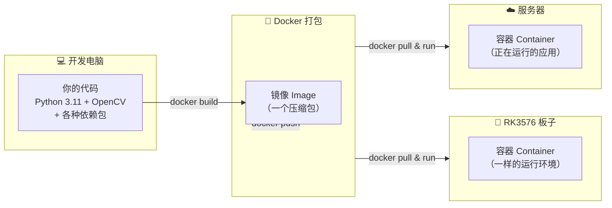
```mermaid
flowchart LR
    subgraph DEV["💻 开发电脑"]
        APP["你的代码<br/>Python 3.11 + OpenCV<br/>+ 各种依赖包"]
    end
    
    subgraph DOCKER["🐳 Docker 打包"]
        IMG["镜像 Image<br/>（一个压缩包）"]
    end
    
    subgraph SERVER["☁️ 服务器"]
        RUNNING["容器 Container<br/>（正在运行的应用）"]
    end
    
    subgraph RK3576["🔧 RK3576 板子"]
        EMBED["容器 Container<br/>（一样的运行环境）"]
    end
    
    APP -->|docker build| IMG
    IMG -->|docker push| DOCKER
    DOCKER -->|docker pull & run| SERVER
    DOCKER -->|docker pull & run| RK3576
```

### 1.2 虚拟机 VS Docker 容器

这是初学者最容易混淆的概念，记住一张图就够了：

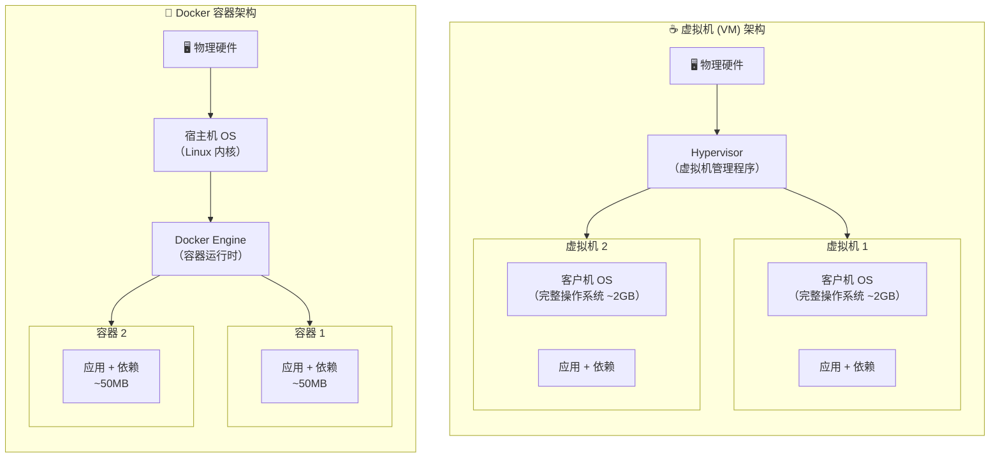
```mermaid
flowchart TB
    subgraph VM["☕ 虚拟机 (VM) 架构"]
        direction TB
        HW1["🖥️ 物理硬件"]
        HYP["Hypervisor<br/>（虚拟机管理程序）"]
        subgraph VM1["虚拟机 1"]
            GUEST1["客户机 OS<br/>（完整操作系统 ~2GB）"]
            BIN1["应用 + 依赖"]
        end
        subgraph VM2["虚拟机 2"]
            GUEST2["客户机 OS<br/>（完整操作系统 ~2GB）"]
            BIN2["应用 + 依赖"]
        end
        HW1 --> HYP
        HYP --> VM1
        HYP --> VM2
    end

    subgraph DOCKER_ARCH["🐳 Docker 容器架构"]
        direction TB
        HW2["🖥️ 物理硬件"]
        HOST["宿主机 OS<br/>（Linux 内核）"]
        DOCKER_ENGINE["Docker Engine<br/>（容器运行时）"]
        subgraph CT1["容器 1"]
            BIN3["应用 + 依赖<br/>~50MB"]
        end
        subgraph CT2["容器 2"]
            BIN4["应用 + 依赖<br/>~50MB"]
        end
        HW2 --> HOST
        HOST --> DOCKER_ENGINE
        DOCKER_ENGINE --> CT1
        DOCKER_ENGINE --> CT2
    end
```

| 对比项 | ☕ 虚拟机 (VM) | 🐳 Docker 容器 |
|--------|:------------:|:--------------:|
| **启动速度** | 分钟级（要启动整个操作系统） | **秒级**（只是启动一个进程） |
| **镜像大小** | GB 级（包含完整 OS） | **MB 级**（只包含应用和依赖） |
| **资源占用** | 每个 VM 独占资源 | **共享宿主 OS 内核**，极其轻量 |
| **隔离级别** | 硬件级虚拟化，完全隔离 | 进程级隔离 |
| **一台机能跑** | 几台 ~ 几十台 | **几十 ~ 几百个** |
| **性能损耗** | 有（硬件虚拟化开销） | **接近原生** |

> 💡 **打个比方**：
> - **虚拟机** = 每人一栋别墅（有独立的地基、水电、装修），隔音好但占地大
> - **Docker 容器** = 公寓楼里的房间（共享大楼的水电结构），轻便灵活

### 1.3 Docker 核心工作流程

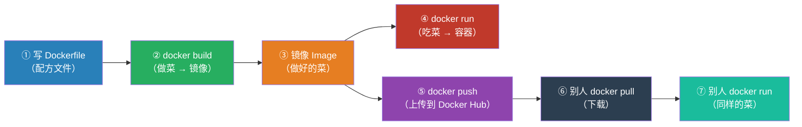
```mermaid
flowchart LR
    A["① 写 Dockerfile<br/>（配方文件）"] --> B["② docker build<br/>（做菜 → 镜像）"]
    B --> C["③ 镜像 Image<br/>（做好的菜）"]
    C --> D["④ docker run<br/>（吃菜 → 容器）"]
    C --> E["⑤ docker push<br/>（上传到 Docker Hub）"]
    E --> F["⑥ 别人 docker pull<br/>（下载）"]
    F --> G["⑦ 别人 docker run<br/>（同样的菜）"]
    
    style A fill:#2980b9,color:#fff
    style B fill:#27ae60,color:#fff
    style C fill:#e67e22,color:#fff
    style D fill:#c0392b,color:#fff
    style E fill:#8e44ad,color:#fff
    style F fill:#2c3e50,color:#fff
    style G fill:#1abc9c,color:#fff
```

---

## 2. 安装与配置

### 2.1 各平台安装

| 平台 | 安装方式 | 备注 |
|------|---------|------|
| **Windows** | [Docker Desktop](https://www.docker.com/products/docker-desktop/) 直接安装 | 会自动启用 WSL2 |
| **macOS** | [Docker Desktop](https://www.docker.com/products/docker-desktop/) | Intel/Apple Silicon 都支持 |
| **Ubuntu** | `sudo apt install docker.io` | 最方便 |
| **RK3576 (ARM64)** | `sudo apt install docker.io` | 走 Ubuntu 源 |
| **官方一键脚本** | `curl -fsSL https://get.docker.com \| sh` | 全平台自动 |

### 2.2 验证安装

```bash
# 1️⃣ 查看版本（确认安装成功）
docker --version
# 输出示例：Docker version 27.3.1, build 1234567

# 2️⃣ 运行 Hello World（最经典的验证）
docker run hello-world
# 如果能打印出 Hello from Docker! 就说明一切正常

# 3️⃣ 查看系统信息
docker info
# 可以看到 Containers/Running/Images 等统计
```

### 2.3 解决权限问题

```bash
# ❌ 如果你执行 docker ps 报这个错：
# permission denied while trying to connect to the Docker daemon socket

# ✅ 解决办法：把当前用户加到 docker 组
sudo usermod -aG docker $USER

# ⚠️ 重要：执行完上面的命令后，要注销重新登录，或者运行：
newgrp docker

# 然后再试：
docker ps  # 现在应该能正常显示了
```

### 2.4 配置镜像加速（国内用户必看）

国内拉 docker 镜像经常很慢，配置镜像加速可以快 10 倍：

```bash
# 创建或修改 /etc/docker/daemon.json
sudo mkdir -p /etc/docker
sudo tee /etc/docker/daemon.json <<-'EOF'
{
  "registry-mirrors": [
    "https://docker.m.daocloud.io",     # DaoCloud 加速
    "https://dockerproxy.com",           # DockerProxy
    "https://dockerhub.timeweb.cloud"    # TimeWeb
  ]
}
EOF

# 重启 Docker 使配置生效
sudo systemctl restart docker

# 验证是否生效
docker info | grep -A 5 "Registry Mirrors"
```

---

## 3. 核心概念：镜像、容器、仓库

### 3.1 三个核心概念的类比

| 概念 | 说明 | 厨房类比 | Docker 类比 |
|------|------|---------|-------------|
| **Image（镜像）** | 一个只读的模板，包含运行应用所需的一切 | 🥟 **速冻饺子**（做好了的，可以存着） | `python:3.11-slim` |
| **Container（容器）** | 镜像的运行实例，可以读写，可以启动/停止 | 🔥 **正在煮的饺子**（速冻饺子下锅了） | `docker run nginx` |
| **Registry（仓库）** | 存储和分发镜像的地方，类似 GitHub | 🛒 **超市**（买速冻饺子的地方） | Docker Hub |

```
                  docker build                      docker run
    Dockerfile ───────────────→ Image ───────────────────→ Container
    （配方）      构建镜像          （速冻饺子）   运行       （正在煮的饺子）
                                    │
                                    │ docker push / pull
                                    ▼
                                Registry
                              （超市/仓库）
```

### 3.2 镜像（Image）—— 只读模板

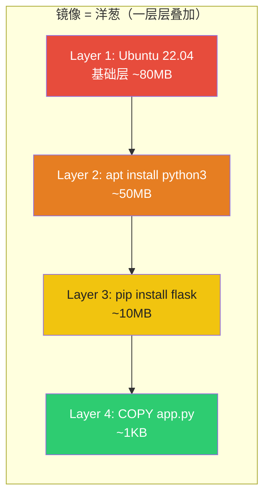
```mermaid
flowchart LR
    subgraph IMG["镜像 = 洋葱（一层层叠加）"]
        L1["Layer 1: Ubuntu 22.04<br/>基础层 ~80MB"]
        L2["Layer 2: apt install python3<br/>~50MB"]
        L3["Layer 3: pip install flask<br/>~10MB"]
        L4["Layer 4: COPY app.py<br/>~1KB"]
    end
    
    L1 --> L2 --> L3 --> L4
    
    style L1 fill:#e74c3c,color:#fff
    style L2 fill:#e67e22,color:#fff
    style L3 fill:#f1c40f,color:#222
    style L4 fill:#2ecc71,color:#fff
```

**镜像的关键特点：**

- **分层结构**：镜像由多个只读层叠加而成，就像洋葱一样
- **共享缓存**：多个镜像可以共享相同的基础层（比如都基于 ubuntu:22.04）
- **不可修改**：镜像一旦构建就不能改了，要更新就重建新版本

### 3.3 容器（Container）—— 运行中的镜像

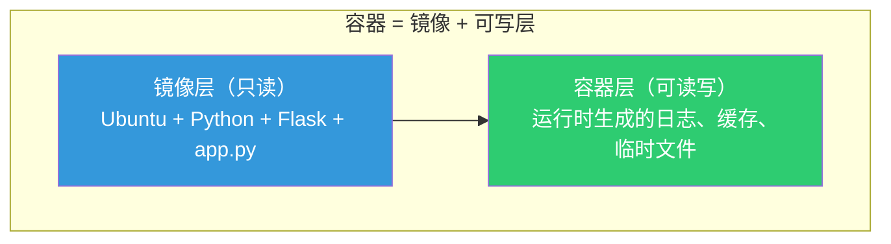
```mermaid
flowchart TB
    subgraph CONTAINER["容器 = 镜像 + 可写层"]
        IMG_LAYERS["镜像层（只读）<br/>Ubuntu + Python + Flask + app.py"]
        WRITABLE["容器层（可读写）<br/>运行时生成的日志、缓存、临时文件"]
    end
    
    IMG_LAYERS --> WRITABLE
    
    style IMG_LAYERS fill:#3498db,color:#fff
    style WRITABLE fill:#2ecc71,color:#fff
```

**容器的关键特点：**

- **镜像 + 可写层**：容器启动时，在镜像顶部加一个可写层
- **秒级启动**：容器本质就是一个进程，启动非常快
- **隔离运行**：每个容器有自己的文件系统、网络、进程空间
- **删除即失**：容器删除后，可写层也消失（除非用了 Volume）

```bash
# 看看这行命令做了什么事：
docker run -d --name my-nginx -p 8080:80 nginx:alpine

# 拆解：
# docker run   → "启动一个容器"
# -d           → "后台运行（detach）"
# --name my-nginx → "给容器起个名字"
# -p 8080:80   → "把宿主机的8080端口映射到容器的80端口"
# nginx:alpine → "用哪个镜像来创建容器"
```

---

## 4. Dockerfile 编写指南

### 4.1 什么是一个好的 Dockerfile？

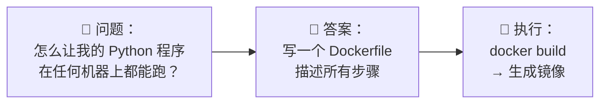
```mermaid
flowchart LR
    A["🤔 问题：<br/>怎么让我的 Python 程序<br/>在任何机器上都能跑？"]
    B["📝 答案：<br/>写一个 Dockerfile<br/>描述所有步骤"]
    C["🐳 执行：<br/>docker build<br/>→ 生成镜像"]
    
    A --> B --> C
```

Dockerfile 就是一个**菜谱**，告诉 Docker 怎么做（构建）你的应用镜像。

### 4.2 一个完整的例子（逐行注释）

```dockerfile
# ===== 第一步：选锅（选择基础镜像）=====
# FROM 是 Dockerfile 的第一行，指定你的镜像基于哪个基础镜像
# python:3.11-slim 比 python:3.11 小很多（~120MB vs ~900MB）
# slim = 精简版，只保留运行 Python 所需的最小系统
FROM python:3.11-slim

# ===== 第二步：创建工作目录 =====
# WORKDIR 设置容器里的"当前目录"
# 后续的 COPY、RUN、CMD 都会在这个目录下执行
# 相当于 cd /app
WORKDIR /app

# ===== 第三步：复制依赖文件 =====
# 先把 requirements.txt 复制进去
# ⚠️ 为什么要先复制这个，而不是直接 COPY . .？
# 因为 Docker 构建有缓存机制，这个文件不常变，放前面可以命中缓存
COPY requirements.txt .

# ===== 第四步：安装依赖 =====
# RUN 在构建镜像时执行命令
# --no-cache-dir 是 pip 的参数，不要缓存下载的包（减小镜像体积）
RUN pip install --no-cache-dir -r requirements.txt

# ===== 第五步：复制源代码 =====
# 代码经常改，所以放后面（前面的 layers 可以重用缓存）
COPY . .

# ===== 第六步：声明端口 =====
# EXPOSE 只是"文档"，告诉别人这个容器会监听哪个端口
# 实际端口映射还是要靠 docker run -p
EXPOSE 5000

# ===== 第七步：启动命令 =====
# CMD 指定容器启动时运行的命令
# 推荐用 exec 格式（JSON 数组），而不是 shell 格式
# 这个例子：用 Gunicorn 启动 Flask 应用，4 个工作进程
CMD ["gunicorn", "--workers=4", "--bind=0.0.0.0:5000", "app:app"]

# ==========================================
# 💡 完整流程：
# docker build -t my-flask-app .
# docker run -d -p 5000:5000 my-flask-app
# 打开浏览器访问 http://localhost:5000
# ==========================================
```

### 4.3 Dockerfile 指令全集（带注释）

```dockerfile
# ═══════════════════════════════════════════
# 🎯 FROM          必须！指定基础镜像
# ═══════════════════════════════════════════
FROM python:3.11-slim          # 基于 Python 3.11 精简版
FROM ubuntu:22.04              # 基于 Ubuntu 22.04
FROM alpine:3.19               # 基于 Alpine Linux（~5MB！极小）
FROM node:20-alpine            # 基于 Node.js 20 Alpine
FROM scratch                   # 空镜像（用于纯静态编译的 Go/Rust）
FROM nginx:alpine AS base      # 给这个阶段起个名字（多阶段构建用）

# ═══════════════════════════════════════════
# 🎯 WORKDIR       设置工作目录（相当于 cd）
# ═══════════════════════════════════════════
WORKDIR /app                   # 后续指令都在 /app 下执行
# 💡 如果目录不存在会自动创建

# ═══════════════════════════════════════════
# 🎯 COPY          复制文件到镜像
# ═══════════════════════════════════════════
COPY requirements.txt .        # 复制单个文件到工作目录
COPY . .                       # 复制当前目录所有文件到工作目录
COPY --chown=appuser:appuser . .  # 复制并修改文件所有者

# ═══════════════════════════════════════════
# 🎯 ADD           增强版 COPY（支持自动解压、URL下载）
# ═══════════════════════════════════════════
ADD app.tar.gz /app            # 自动解压 tar.gz 到 /app
# ⚠️ 建议：能用 COPY 就不要用 ADD，COPY 更清晰

# ═══════════════════════════════════════════
# 🎯 RUN           在构建时执行命令
# ═══════════════════════════════════════════
RUN pip install flask          # 安装 Python 包
RUN apt-get update && apt-get install -y \
    build-essential \                           # 换行用 \ 连接
    && rm -rf /var/lib/apt/lists/*              # 清理 apt 缓存（减小体积）

# ═══════════════════════════════════════════
# 🎯 CMD           容器启动时的默认命令
# ═══════════════════════════════════════════
CMD ["python", "app.py"]       # ✅ 推荐：exec 格式（JSON 数组）
CMD python app.py              # ❌ 不推荐：shell 格式

# ═══════════════════════════════════════════
# 🎯 ENTRYPOINT    容器入口点（和 CMD 配合使用）
# ═══════════════════════════════════════════
ENTRYPOINT ["python"]          # 主程序
CMD ["app.py"]                 # 默认参数
# 💡 这样 docker run myimage train.py 就会执行 python train.py

# ═══════════════════════════════════════════
# 🎯 ENV           设置环境变量
# ═══════════════════════════════════════════
ENV PYTHONUNBUFFERED=1         # Python 日志实时输出（不缓冲）
ENV MODE=production            # 运行模式
# ⚠️ 不要在这里放密码！运行时通过 -e 传入

# ═══════════════════════════════════════════
# 🎯 EXPOSE        声明端口（文档作用）
# ═══════════════════════════════════════════
EXPOSE 8000                    # 告诉别人容器监听 8000 端口

# ═══════════════════════════════════════════
# 🎯 USER          指定运行用户（安全！）
# ═══════════════════════════════════════════
RUN useradd -m -s /bin/bash appuser
USER appuser                   # 不要用 root 运行！安全风险

# ═══════════════════════════════════════════
# 🎯 VOLUME        声明挂载点
# ═══════════════════════════════════════════
VOLUME /data                   # 声明 /data 应该挂载外部存储

# ═══════════════════════════════════════════
# 🎯 LABEL         添加元数据（相当于给镜像贴标签）
# ═══════════════════════════════════════════
LABEL version="1.0"
LABEL maintainer="xiaoxia@example.com"

# ═══════════════════════════════════════════
# 🎯 HEALTHCHECK   健康检查（容器是否活着）
# ═══════════════════════════════════════════
HEALTHCHECK --interval=30s --timeout=3s \
    CMD curl -f http://localhost:5000/health || exit 1

# ═══════════════════════════════════════════
# 🎯 ARG           构建参数（只在构建时有效）
# ═══════════════════════════════════════════
ARG DEBIAN_FRONTEND=noninteractive
# 通过 docker build --build-arg VERSION=1.0 传入
ARG VERSION
```

### 4.4 CMD vs ENTRYPOINT 的区别（面试常考）

```bash
# 先看两个例子：
```

```dockerfile
# 例1：只用 CMD
FROM ubuntu
CMD ["echo", "hello"]

# docker run myimage            → 输出 hello
# docker run myimage ls         → 输出文件列表（CMD 被覆盖了！）
```

```dockerfile
# 例2：ENTRYPOINT + CMD 组合
FROM ubuntu
ENTRYPOINT ["echo"]
CMD ["hello"]

# docker run myimage            → 输出 hello
# docker run myimage world      → 输出 world（CMD 被 world 覆盖，ENTRYPOINT 不变）
```

| 场景 | 写法 | 效果 |
|------|------|------|
| **只需要默认命令** | 只用 `CMD` | `docker run` 可覆盖 |
| **必须执行的入口** | 只用 `ENTRYPOINT` | 不可覆盖（除非 `--entrypoint`） |
| **入口+默认参数** ✅ | `ENTRYPOINT` + `CMD` | 入口固定，参数可覆盖 |

### 4.5 多阶段构建（减小镜像体积的利器）

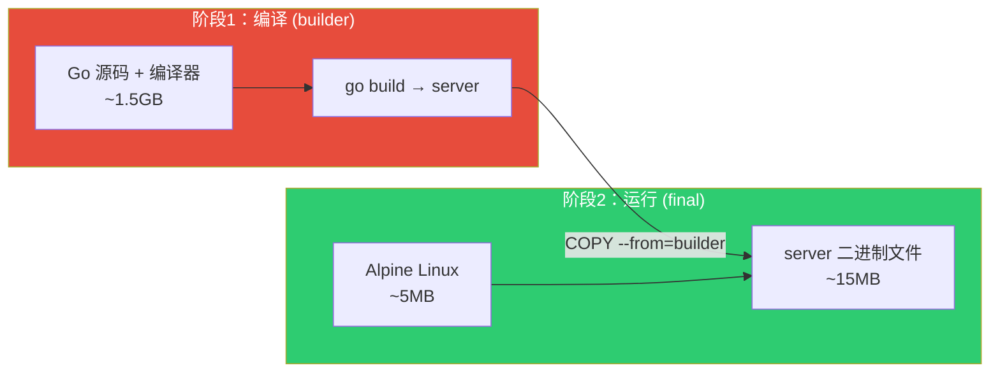
```mermaid
flowchart LR
    subgraph STAGE1["阶段1：编译 (builder)"]
        GO_SRC["Go 源码 + 编译器<br/>~1.5GB"]
        COMPILE["go build → server"]
    end
    subgraph STAGE2["阶段2：运行 (final)"]
        ALPINE["Alpine Linux<br/>~5MB"]
        BINARY["server 二进制文件<br/>~15MB"]
    end
    
    GO_SRC --> COMPILE
    COMPILE -->|COPY --from=builder| BINARY
    ALPINE --> BINARY
    
    style STAGE1 fill:#e74c3c,color:#fff
    style STAGE2 fill:#2ecc71,color:#fff
```

```dockerfile
# ═══════════════════════════════════════════
# 场景：编译 Go 程序
# 问题：Go 编译环境 1.5GB，但运行只需要编译好的二进制文件
# 方案：多阶段构建 = 第一阶段编译 + 第二阶段只复制编译结果
# ═══════════════════════════════════════════

# ===== 第一阶段：编译环境 =====
# AS builder 给这个阶段起个名字，后面好引用
FROM golang:1.21 AS builder

WORKDIR /app

# 先复制依赖文件，利用缓存
COPY go.mod go.sum ./
RUN go mod download

# 复制源码并编译
COPY . .
# CGO_ENABLED=0 表示不依赖 C 库，生成纯静态二进制
RUN CGO_ENABLED=0 go build -o server .

# ===== 第二阶段：运行环境 =====
FROM alpine:3.19

# Alpine 非常精简，连 CA 证书都没有，需要手动安装
RUN apk --no-cache add ca-certificates tzdata

WORKDIR /app

# 只复制编译好的二进制文件过来（不复制 Go 编译器！）
COPY --from=builder /app/server .

EXPOSE 8080
CMD ["./server"]

# ⚠️ 最终镜像大小：~18MB（而不是 1.5GB！）
```

---

## 5. 镜像管理

### 5.1 构建镜像

```bash
# 最基本的构建
docker build -t myapp:1.0 .
#         ↑标签名:版本号  ↑ 构建上下文目录（包含 Dockerfile）

# 指定 Dockerfile 文件名
docker build -t myapp:1.0 -f Dockerfile.prod .

# 传入构建参数
docker build --build-arg VERSION=1.0 -t myapp:1.0 .

# 不使用缓存（从头构建）
docker build --no-cache -t myapp:1.0 .

# 查看构建过程（更详细的日志）
docker build --progress=plain -t myapp:1.0 .
```

### 5.2 查看和管理镜像

```bash
# 列出所有镜像
docker images
# 或
docker image ls

# 只显示镜像 ID（可用于脚本批量操作）
docker images -q

# 查看悬空镜像（没有标签的，通常是无用的中间层）
docker images --filter "dangling=true"

# 查看镜像的详细信息（JSON 格式）
docker inspect myapp:1.0

# 查看镜像的构建历史（每一层做了什么）
docker history myapp:1.0

# 给镜像打标签
docker tag myapp:1.0 myapp:latest          # 加个 latest 标签
docker tag myapp:1.0 xiaoxia/myapp:1.0     # 准备推送到 Docker Hub

# 删除镜像
docker rmi myapp:1.0                        # 删除单个
docker image prune                           # 删除所有悬空镜像
docker image prune -a                        # 删除所有未使用的镜像
```

### 5.3 导入导出镜像

```bash
# 把镜像导出为 tar 文件（方便离线传输）
docker save -o myapp.tar myapp:1.0

# 从 tar 文件导入镜像
docker load -i myapp.tar

# 场景：在内网服务器上部署
# 在能上网的机器上：
docker pull python:3.11-slim
docker save -o python.tar python:3.11-slim
# scp python.tar 到内网服务器
# 在内网服务器上：
docker load -i python.tar
```

### 5.4 镜像分层与缓存原理

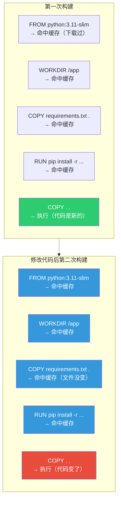
```mermaid
flowchart TB
    subgraph BUILD1["第一次构建"]
        L1["FROM python:3.11-slim<br/>→ 命中缓存（下载过）"]
        L2["WORKDIR /app<br/>→ 命中缓存"]
        L3["COPY requirements.txt .<br/>→ 命中缓存"]
        L4["RUN pip install -r ...<br/>→ 命中缓存"]
        L5["COPY . .<br/>→ 执行（代码是新的）"]
    end
    
    subgraph BUILD2["修改代码后第二次构建"]
        M1["FROM python:3.11-slim<br/>→ 命中缓存"]
        M2["WORKDIR /app<br/>→ 命中缓存"]
        M3["COPY requirements.txt .<br/>→ 命中缓存（文件没变）"]
        M4["RUN pip install -r ...<br/>→ 命中缓存"]
        M5["COPY . .<br/>→ 执行（代码变了）"]
    end
    
    BUILD1 -.-> BUILD2
    
    style L5 fill:#2ecc71,color:#fff
    style M1 fill:#3498db,color:#fff
    style M2 fill:#3498db,color:#fff
    style M3 fill:#3498db,color:#fff
    style M4 fill:#3498db,color:#fff
    style M5 fill:#e74c3c,color:#fff
```

**缓存优化的关键原则：**

```dockerfile
# ❌ 差：把代码放在依赖前面
# 每次改代码都要重新安装所有依赖（因为 COPY . . 导致缓存失效）
COPY . .
RUN pip install -r requirements.txt

# ✅ 好：把"不常变的"放前面，"常变的"放后面
# 依赖文件（requirements.txt）很少变 → 放前面 → 缓存命中
# 代码经常变 → 放后面 → 不影响依赖缓存
COPY requirements.txt .
RUN pip install -r requirements.txt
COPY . .
```

---

## 6. 容器管理

### 6.1 容器的完整生命周期

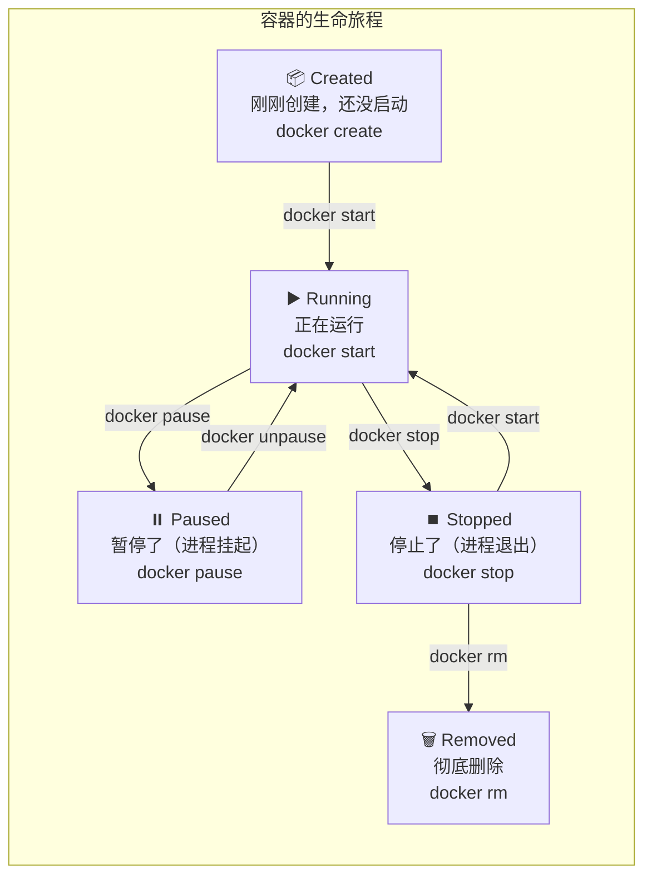
```mermaid
flowchart LR
    subgraph LIFE["容器的生命旅程"]
        direction TB
        CREATED["📦 Created<br/>刚刚创建，还没启动<br/>docker create"]
        RUNNING["▶️ Running<br/>正在运行<br/>docker start"]
        PAUSED["⏸️ Paused<br/>暂停了（进程挂起）<br/>docker pause"]
        STOPPED["⏹️ Stopped<br/>停止了（进程退出）<br/>docker stop"]
        REMOVED["🗑️ Removed<br/>彻底删除<br/>docker rm"]
        
        CREATED -->|docker start| RUNNING
        RUNNING -->|docker pause| PAUSED
        PAUSED -->|docker unpause| RUNNING
        RUNNING -->|docker stop| STOPPED
        STOPPED -->|docker start| RUNNING
        STOPPED -->|docker rm| REMOVED
    end
```

### 6.2 运行容器（最常用的操作）

```bash
# ═══════════════════════════════════════════
# 🎯 基础运行
# ═══════════════════════════════════════════
docker run nginx:alpine                  # 前台运行（Ctrl+C 终止）
docker run -d nginx:alpine               # 后台运行（detach 模式）
docker run --name my-nginx nginx:alpine  # 指定容器名称

# ═══════════════════════════════════════════
# 🎯 端口映射（宿主机端口:容器端口）
# ═══════════════════════════════════════════
docker run -d -p 8080:80 nginx
# 访问 http://localhost:8080 → 容器里的 nginx 80 端口

docker run -d -p 8080:80 -p 443:443 nginx
# 同时映射多个端口

# ═══════════════════════════════════════════
# 🎯 资源限制（防止容器吃光宿主机资源）
# ═══════════════════════════════════════════
docker run --memory="512m" --cpus="2" nginx
# 限制：最多用 512MB 内存 + 2 个 CPU 核心

# ═══════════════════════════════════════════
# 🎯 环境变量
# ═══════════════════════════════════════════
docker run -e DB_HOST=localhost -e DB_PORT=5432 myapp
# 在容器里可以通过环境变量读取这些值

# ═══════════════════════════════════════════
# 🎯 交互式进入容器（调试用）
# ═══════════════════════════════════════════
docker run -it ubuntu bash
# -i = interactive（交互式）
# -t = tty（分配终端）
# 💡 这个命令会进入 Ubuntu 容器的 bash shell

# ═══════════════════════════════════════════
# 🎯 自动清理（测试用）
# ═══════════════════════════════════════════
docker run --rm nginx
# 容器停止后自动删除（不会留下垃圾）
```

### 6.3 容器管理命令

```bash
# ═══ 查看容器 ═══
docker ps                # 只显示运行中的
docker ps -a             # 显示所有（包括已停止的）
docker ps -q             # 只显示 ID（批量操作时很有用）

# ═══ 停止/启动/重启 ═══
docker stop container_id_or_name     # 优雅停止（发 SIGTERM，等 10 秒）
docker kill container_id             # 强制杀死（发 SIGKILL）
docker start container_id            # 启动已停止的
docker restart container_id          # 重启

# ═══ 暂停/恢复 ═══
docker pause container_id            # 暂停（进程挂起，不占 CPU）
docker unpause container_id          # 恢复

# ═══ 删除容器 ═══
docker rm container_id               # 删除已停止的
docker rm -f container_id            # 强制删除运行中的
docker container prune               # 删除所有已停止的

# ═══ 进入容器 ═══
docker exec -it container_id bash    # 进入运行中的容器（最常用！）
# 进去之后就可以像在普通 Linux 里一样操作了
# 比如：ls、cat、vim、ping 等

# ═══ 查看日志 ═══
docker logs container_id             # 查看所有日志
docker logs -f container_id          # 实时跟踪（类似 tail -f）
docker logs --tail 100 container_id  # 只看最后 100 行
docker logs --since 5m container_id  # 只看过去 5 分钟的

# ═══ 查看进程 ═══
docker top container_id              # 容器内运行的进程
docker stats                         # 所有容器实时 CPU/内存/网络
docker stats container_id            # 只看指定容器

# ═══ 查看端口映射 ═══
docker port container_id             # 查看端口映射情况

# ═══ 查看详细信息 ═══
docker inspect container_id          # 超详细的 JSON 信息
```

### 6.4 代码改完后重新部署的完整流程

```bash
# 场景：你修了个 bug，要重新部署
# 1️⃣ 重新构建镜像
docker build -t myapp:2.0 .

# 2️⃣ 停止并删除旧容器
docker stop my-app-container
docker rm my-app-container

# 3️⃣ 启动新容器
docker run -d --name my-app-container -p 8080:80 myapp:2.0

# 4️⃣ 检查日志
docker logs -f my-app-container
```

---

## 7. 数据持久化：Volumes & Bind Mounts

### 7.1 为什么要数据持久化？

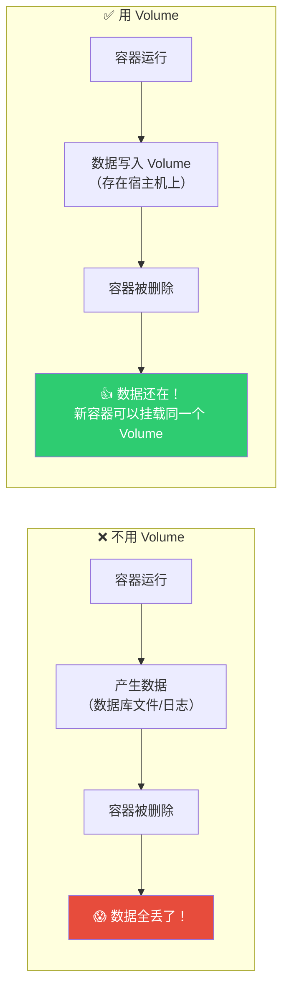
```mermaid
flowchart LR
    subgraph BAD["❌ 不用 Volume"]
        A["容器运行"] --> B["产生数据<br/>（数据库文件/日志）"]
        B --> C["容器被删除"]
        C --> D["😱 数据全丢了！"]
    end
    
    subgraph GOOD["✅ 用 Volume"]
        E["容器运行"] --> F["数据写入 Volume<br/>（存在宿主机上）"]
        F --> G["容器被删除"]
        G --> H["👍 数据还在！<br/>新容器可以挂载同一个 Volume"]
    end
    
    style D fill:#e74c3c,color:#fff
    style H fill:#2ecc71,color:#fff
```

### 7.2 三种存储方式对比

| 方式 | 存哪里 | 谁管理 | 能被谁用 | 推荐场景 |
|------|--------|--------|---------|---------|
| **Volume** 📦 | `/var/lib/docker/volumes/` | Docker 管理 | 任意容器 | **数据库！** 生产数据 |
| **Bind Mount** 📁 | 你指定的任意路径 | 你自己管理 | 任意进程 | 开发时改代码 |
| **tmpfs** 🌩️ | 内存里 | Docker 管理 | 只有本容器 | 密码、密钥等敏感数据 |

### 7.3 Volume（推荐用于数据库等生产数据）

```bash
# ═══ 创建卷 ═══
docker volume create my-postgres-data
# 查看所有卷
docker volume ls
# 查看卷的详细信息（存在哪个路径）
docker volume inspect my-postgres-data
# 输出：
# {
#     "Mountpoint": "/var/lib/docker/volumes/my-postgres-data/_data"
# }

# ═══ 使用卷（两种语法，效果一样） ═══
# 旧语法（更简洁）
docker run -v my-postgres-data:/var/lib/postgresql/data postgres:15
#          ↑卷名           ↑容器里的路径

# 新语法（更清晰，推荐）
docker run --mount source=my-postgres-data,target=/var/lib/postgresql/data postgres:15

# ═══ 清理 ═══
docker volume prune          # 删除所有未使用的卷
docker rm -v container_id    # 删除容器时也删除它的卷
```

### 7.4 Bind Mount（开发用，代码热重载）

```bash
# ═══ 场景：开发 Flask 应用 ═══
# 把宿主机上的代码目录挂载到容器里
# 这样在宿主机上改代码，容器里立刻生效（不用重新构建！）

# 当前目录是 /home/user/my-flask-app
# 把当前目录挂载到容器的 /app
docker run -v $(pwd):/app -p 5000:5000 my-flask-image

# 加上 :ro 表示只读挂载（防止容器修改你的代码）
docker run -v $(pwd):/app:ro -p 5000:5000 my-flask-image

# 新版语法：
docker run --mount type=bind,source="$(pwd)",target=/app -p 5000:5000 my-flask-image

# ═══ 场景：挂载 Nginx 配置文件 ═══
docker run -v /home/user/nginx.conf:/etc/nginx/nginx.conf:ro nginx
```

### 7.5 实战：MySQL 数据库持久化

```bash
# 📌 目标：启动一个 MySQL 容器，数据要持久化，删容器不丢数据

# 第一步：创建数据卷
docker volume create mysql-data

# 第二步：启动 MySQL（带数据卷）
docker run -d \
    --name my-mysql \
    -e MYSQL_ROOT_PASSWORD=my-secret-pw \
    -e MYSQL_DATABASE=myapp \
    -v mysql-data:/var/lib/mysql \
    -p 3306:3306 \
    mysql:8.0

# 第三步：往数据库里写点数据
docker exec -it my-mysql mysql -p
# 输入密码后执行：CREATE TABLE test (id INT); INSERT INTO test VALUES (1);

# 第四步：删除容器
docker rm -f my-mysql

# 第五步：启动新容器，挂载同一个卷
docker run -d \
    --name my-mysql-new \
    -e MYSQL_ROOT_PASSWORD=my-secret-pw \
    -v mysql-data:/var/lib/mysql \
    -p 3306:3306 \
    mysql:8.0

# 第六步：检查数据还在不在
docker exec -it my-mysql-new mysql -p
# SELECT * FROM test;  → 数据还在！👍
```

---

## 8. Docker 网络通信

### 8.1 Docker 网络模式

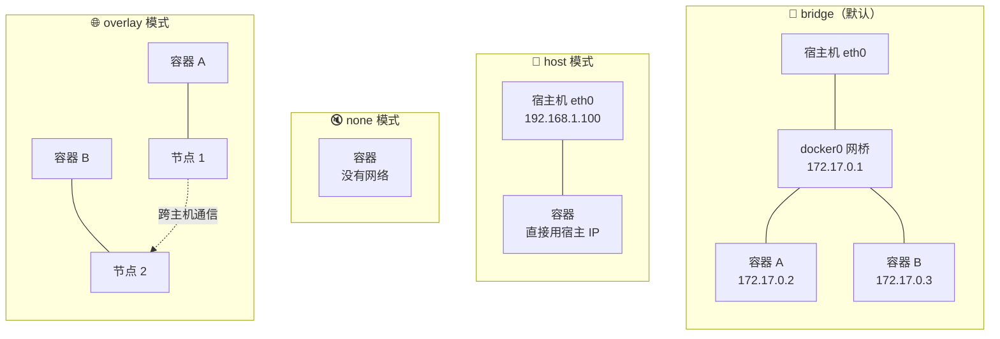
```mermaid
flowchart TB
    subgraph BRIDGE["🌉 bridge（默认）"]
        direction TB
        HOST1["宿主机 eth0"]
        DOCKER0["docker0 网桥<br/>172.17.0.1"]
        C1["容器 A<br/>172.17.0.2"]
        C2["容器 B<br/>172.17.0.3"]
        
        HOST1 --- DOCKER0
        DOCKER0 --- C1
        DOCKER0 --- C2
    end
    
    subgraph HOST_MODE["🚀 host 模式"]
        direction TB
        HOST2["宿主机 eth0<br/>192.168.1.100"]
        C3["容器<br/>直接用宿主 IP"]
        HOST2 --- C3
    end
    
    subgraph NONE["🔇 none 模式"]
        C4["容器<br/>没有网络"]
    end
    
    subgraph OVERLAY["🌐 overlay 模式"]
        direction TB
        NODE1["节点 1"]
        NODE2["节点 2"]
        C5["容器 A"] --- NODE1
        C6["容器 B"] --- NODE2
        NODE1 -.->|跨主机通信| NODE2
    end
```

| 网络模式 | 说明 | 适用场景 |
|---------|------|---------|
| **bridge**（默认） | 容器通过虚拟网桥连接到宿主机，有独立 IP | **单机多容器通信** ✅ 最常用 |
| **host** | 容器直接使用宿主机网络，没有独立 IP | 追求极致网络性能 |
| **none** | 容器没有网络 | 安全隔离 |
| **overlay** | 跨多台宿主机的容器网络 | Docker Swarm 集群 |

### 8.2 网络命令

```bash
# 查看所有网络
docker network ls

# 查看某个网络的详细信息（有哪些容器在里面）
docker network inspect bridge

# 创建自定义网络
docker network create my-app-net
# 默认是 bridge 驱动
# 可以指定子网：
docker network create --subnet=172.20.0.0/16 my-app-net

# 指定网络运行容器
docker run -d --network my-app-net --name web my-web-app
docker run -d --network my-app-net --name db postgres:15

# 把已有的容器连接到网络
docker network connect my-app-net existing-container

# 断开连接
docker network disconnect my-app-net existing-container
```

### 8.3 容器间通信的两种方式

```bash
# ═══ 方式一：通过 IP 通信 ═══
# 容器在同一个 bridge 网络里，可以通过 IP 互相访问
# 但是容器重启后 IP 会变！

# ═══ 方式二：通过容器名通信（推荐！） ═══
# 在自定义网络中，Docker 内置了 DNS 解析
# 容器名 = 主机名

# 第一步：创建自定义网络
docker network create app-network

# 第二步：两个容器都连到这个网络
docker run -d --network app-network --name web my-web-image
docker run -d --network app-network --name db postgres:15

# 第三步：在 web 容器里访问 db
# 直接通过名字访问，不用记 IP！
docker exec -it web ping db        # ✅ 能 ping 通！
# 在代码里连接：postgresql://db:5432/mydatabase

# ❌ 如果没在同一个自定义网络里：
# 默认 bridge 网络不支持 DNS 解析，只能通过 IP 访问
# 默认网络的容器可以通过 --link 但已废弃
```

### 8.4 端口映射（从外部访问容器）

```bash
# 把宿主机的 8080 端口 → 容器的 80 端口
docker run -d -p 8080:80 nginx
#            ↑宿主机:容器

# 只绑定到特定的 IP
docker run -d -p 127.0.0.1:8080:80 nginx
# 这样只有本机能访问，外部访问不到（更安全）

# 随机分配宿主机端口
docker run -d -P nginx
# -P（大写）会自动把容器暴露的端口映射到宿主机随机端口
# docker port container_id 可以查看分配了什么端口

# UDP 端口
docker run -d -p 8080:80/udp nginx
```

---

## 9. Docker Compose 编排

### 9.1 什么时候需要 Compose？

```bash
# ❌ 没有 Compose 时，要手动敲一堆命令：
docker network create mynet
docker volume create pgdata
docker run -d --network mynet -v pgdata:/var/lib/postgresql/data --name db postgres:15
docker run -d --network mynet -p 8080:80 --name web my-web-app
# ... 每次都这一串，而且容易漏

# ✅ 有 Compose 时，写一个 docker-compose.yml 就搞定：
docker compose up -d
# 所有容器、网络、卷自动创建
```

### 9.2 一个完整的 Compose 文件（逐行注释）

```yaml
# ═══════════════════════════════════════════
# docker-compose.yml
# 一个完整的 Web 应用 + 数据库 + 缓存 示例
# ═══════════════════════════════════════════

# version 字段现在不是必须的了，但是写上可以提醒自己版本
version: '3.8'

# ===== services：定义所有容器 =====
services:

  # ------ Web 后端服务 ------
  web:
    # 从当前目录下的 Dockerfile 构建
    build: ./web
    
    # 端口映射
    ports:
      - "8080:8000"           # 宿主机8080 → 容器8000
    
    # 环境变量
    environment:
      - DB_HOST=db            # 数据库主机名（就是下面 db 服务的名字）
      - DB_PORT=5432
      - REDIS_HOST=redis
      - MODE=production
    
    # 从文件读取环境变量（推荐，敏感信息放文件里）
    env_file: .env
    
    # 卷挂载（开发时热重载用）
    volumes:
      - ./web:/app            # bind mount：代码实时同步
      - web_uploads:/app/uploads  # named volume：上传文件持久化
    
    # 依赖（控制启动顺序）
    depends_on:
      - db
      - redis
    
    # 自动重启策略
    restart: unless-stopped
    
    # 连接到哪个网络
    networks:
      - app-net

  # ------ 数据库 ------
  db:
    image: postgres:15-alpine  # 直接用现成的镜像
    
    # 环境变量（配置数据库）
    environment:
      POSTGRES_DB: myapp
      POSTGRES_USER: appuser
      POSTGRES_PASSWORD: ${DB_PASSWORD}  # 从 .env 文件读取
    
    # 数据持久化（数据库数据不能丢！）
    volumes:
      - pgdata:/var/lib/postgresql/data
    
    # 健康检查（确认数据库准备好了再让前端连接）
    healthcheck:
      test: ["CMD-SHELL", "pg_isready -U appuser"]
      interval: 10s
      timeout: 5s
      retries: 5
    
    restart: always
    networks:
      - app-net

  # ------ Redis 缓存 ------
  redis:
    image: redis:7-alpine
    command: redis-server --requirepass ${REDIS_PASSWORD}
    restart: always
    networks:
      - app-net

  # ------ Nginx 反向代理 ------
  nginx:
    image: nginx:alpine
    ports:
      - "80:80"               # HTTP
      - "443:443"             # HTTPS
    volumes:
      - ./nginx.conf:/etc/nginx/nginx.conf:ro  # 配置文件（只读）
    depends_on:
      - web
    networks:
      - app-net

# ===== volumes：声明命名卷 =====
volumes:
  pgdata:                     # 数据库数据卷
  web_uploads:                # 上传文件卷

# ===== networks：声明网络 =====
networks:
  app-net:
    driver: bridge            # 默认 bridge 驱动
```

### 9.3 Compose 命令大全

```bash
# ═══ 启动和停止 ═══
docker compose up -d                    # 后台启动所有服务
docker compose up -d --build            # 重新构建镜像再启动
docker compose down                     # 停止并删除容器和网络
docker compose down -v                  # 同时删除卷（⚠️ 数据会丢！）
docker compose down --rmi all           # 同时删除镜像

# ═══ 查看状态 ═══
docker compose ps                       # 服务状态
docker compose logs -f                  # 所有服务日志（实时跟踪）
docker compose logs web -f              # 只看 web 服务的日志

# ═══ 操作单个服务 ═══
docker compose exec web bash            # 进入 web 容器
docker compose stop web                 # 停止 web
docker compose start web                # 启动 web
docker compose restart web              # 重启 web
docker compose rm web                   # 删除 web 容器

# ═══ 构建 ═══
docker compose build                    # 构建所有服务的镜像
docker compose build web                # 只构建 web

# ═══ 扩缩容 ═══
docker compose up -d --scale web=3      # web 启动 3 个实例
```

### 9.4 常用 Compose 模板

**最简单的 Flask + Redis 计数器：**

```yaml
# docker-compose.yml
# 一个访问计数器的 Web 应用
version: '3.8'

services:
  web:
    build: .                            # 用当前目录的 Dockerfile
    ports:
      - "5000:5000"
    environment:
      - REDIS_HOST=redis                # Redis 地址（就是下面的 redis 服务）
  
  redis:
    image: redis:7-alpine                # 直接用官方镜像
```

**React + FastAPI + PostgreSQL 全栈：**

```yaml
services:
  frontend:
    build: ./frontend                    # React 构建
    ports: ["3000:3000"]
    depends_on: [backend]

  backend:
    build: ./backend                     # FastAPI
    ports: ["8000:8000"]
    environment:
      DATABASE_URL: postgresql://user:pass@db:5432/mydb
    depends_on: [db]

  db:
    image: postgres:15
    volumes: ["pgdata:/var/lib/postgresql/data"]
    environment:
      POSTGRES_PASSWORD: secretpassword

volumes:
  pgdata:
```

---

## 10. Docker Hub & 私有仓库

### 10.1 Docker Hub——Docker 的"GitHub"

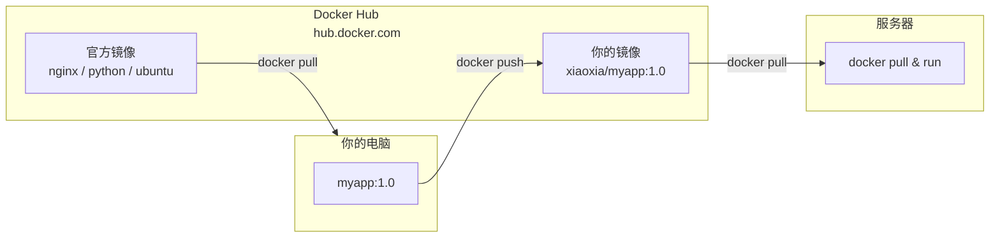
```mermaid
flowchart LR
    subgraph LOCAL["你的电脑"]
        IMG["myapp:1.0"]
    end
    
    subgraph HUB["Docker Hub<br/>hub.docker.com"]
        OFFICIAL["官方镜像<br/>nginx / python / ubuntu"]
        YOUR["你的镜像<br/>xiaoxia/myapp:1.0"]
    end
    
    subgraph SERVER["服务器"]
        DEPLOY["docker pull & run"]
    end
    
    IMG -->|docker push| YOUR
    OFFICIAL -->|docker pull| LOCAL
    YOUR -->|docker pull| DEPLOY
```

### 10.2 推送到 Docker Hub

```bash
# 1️⃣ 登录 Docker Hub
docker login
# 会提示输入用户名和密码（建议用 Access Token 而不是密码）

# 2️⃣ 给镜像打标签（镜像名要包含你的 Docker Hub 用户名）
docker tag myapp:1.0 your-username/myapp:1.0
# 格式：dockerhub用户名/镜像名:版本

# 3️⃣ 推送
docker push your-username/myapp:1.0

# 4️⃣ 别人拉取
docker pull your-username/myapp:1.0
```

### 10.3 搭建私有 Registry

```bash
# ═══ 最简单的私有仓库（适合内网） ═══
docker run -d -p 5000:5000 --name registry registry:2

# 推送镜像到私有仓库
docker tag myapp:1.0 localhost:5000/myapp:1.0
docker push localhost:5000/myapp:1.0

# 从私有仓库拉取
docker pull localhost:5000/myapp:1.0

# ═══ 带认证的私有仓库 ═══
docker run -d -p 5000:5000 \
    --name registry \
    -v /auth:/auth \
    -e "REGISTRY_AUTH=htpasswd" \
    -e "REGISTRY_AUTH_HTPASSWD_REALM=Registry" \
    -e "REGISTRY_AUTH_HTPASSWD_PATH=/auth/htpasswd" \
    registry:2

# 生成认证文件
# htpasswd -c /auth/htpasswd username
```

### 10.4 GitHub Container Registry (GHCR)

```bash
# 用 GitHub 当镜像仓库（免费！）
# 登录
echo $GITHUB_TOKEN | docker login ghcr.io -u YOUR_USERNAME --password-stdin

# 推送
docker tag myapp:1.0 ghcr.io/YOUR_USERNAME/myapp:1.0
docker push ghcr.io/YOUR_USERNAME/myapp:1.0

# 拉取
docker pull ghcr.io/YOUR_USERNAME/myapp:1.0
```

---

## 11. Dockerfile 最佳实践

### 11.1 精简镜像体积

```dockerfile
# ═══ 基础镜像对比 ═══
# python:3.11          ~900MB  ❌ 太大
# python:3.11-slim     ~120MB  ✅ 可以
# python:3.11-alpine   ~50MB   ✅✅ 更小（但兼容性差一点）

# ═══ 清理 apt 缓存 ═══
# ❌ 差
RUN apt-get update
RUN apt-get install -y curl vim
# 缓存还在，镜像变大

# ✅ 好：在同一层安装并清理
RUN apt-get update && apt-get install -y \
    curl \
    vim \
    && rm -rf /var/lib/apt/lists/*
# apt-get update 产生的缓存被清掉了

# ═══ Python 依赖 ═══
# ❌ 差
RUN pip install flask numpy pandas opencv-python

# ✅ 好
RUN pip install --no-cache-dir -r requirements.txt
# --no-cache-dir 不让 pip 缓存下载的包
```

### 11.2 利用构建缓存

```dockerfile
# 记住一个原则：把"不常变的"放前面，"常变的"放后面

# ✅ 对的顺序：
FROM python:3.11-slim
WORKDIR /app
COPY requirements.txt .          # 依赖文件 → 很少变
RUN pip install -r requirements.txt  # 依赖安装 → 极少变
COPY . .                         # 源代码 → 经常变

# 这样改代码时，前 4 层都能命中缓存，只需重建最后一层

# ❌ 错的顺序：
FROM python:3.11-slim
COPY . .                         # 源代码放前面
RUN pip install -r requirements.txt  # 每次改代码都得重装依赖！
```

### 11.3 多阶段构建实战

```dockerfile
# ═══ 场景：React 前端 + Nginx ═══
# 前端构建时需要 Node.js（大），运行时只需要静态文件 + Nginx（小）

# 第一阶段：构建 React 应用
FROM node:20-alpine AS build
WORKDIR /app
COPY package*.json ./
RUN npm ci                              # 安装依赖
COPY . .
RUN npm run build                       # 构建：生成 build/ 目录

# 第二阶段：Nginx 提供静态文件服务
FROM nginx:alpine
# 只复制构建好的静态文件，不要 Node.js
COPY --from=build /app/build /usr/share/nginx/html
COPY nginx.conf /etc/nginx/conf.d/default.conf
EXPOSE 80
CMD ["nginx", "-g", "daemon off;"]

# 最终镜像只有 ~25MB（而不是 ~1.3GB）
```

### 11.4 安全相关

```dockerfile
# 1️⃣ 不要用 root 运行（安全风险）
# ❌
FROM python:3.11-slim
COPY . /app
CMD ["python", "app.py"]         # 默认 root

# ✅
FROM python:3.11-slim
RUN adduser --disabled-password appuser
WORKDIR /app
COPY . .
USER appuser                     # 切换到普通用户
CMD ["python", "app.py"]

# 2️⃣ 不要硬编码密码
# ❌
ENV DB_PASSWORD=admin123

# ✅ 运行时通过 -e 传入，或使用 .env 文件
# docker run -e DB_PASSWORD=xxx myapp

# 3️⃣ 使用 .dockerignore
# 类似 .gitignore，排除不需要的文件
```

```dockerignore
# .dockerignore
# 不把这些文件复制到镜像中（减小体积 + 安全）

.git/
__pycache__/
*.pyc
.env                          # 敏感信息
node_modules/                 # 太大，在镜像里重新 npm install
Dockerfile
README.md
*.md
```

---

## 12. 多架构镜像（ARM/x86）

### 12.1 为什么要关心架构？

```bash
# 你的开发电脑是 x86（Intel/AMD）
# 但 RK3576 是 arm64！

# ❌ 在 RK3576 上拉 x86 镜像会报错：
docker run python:3.11
# WARNING: The requested image's platform (linux/amd64) does not match
# exec format error  （根本跑不了！）
```

### 12.2 拉取正确架构的镜像

```bash
# 方法一：自动选择（推荐）
# 多架构镜像（manifest list）会自动选择对应架构
# Docker 会检查宿主机架构，自动拉取对应的版本
docker pull python:3.11-slim
# 在 x86 上 → linux/amd64
# 在 RK3576 上 → linux/arm64

# 方法二：手动指定
docker pull --platform linux/arm64 python:3.11-slim
docker pull --platform linux/amd64 python:3.11-slim

# 查看镜像架构
docker inspect python:3.11-slim | grep Architecture
```

### 12.3 构建多架构镜像

```bash
# ═══ 使用 buildx（Docker 内置的多架构构建工具） ═══

# 第一步：创建构建器
docker buildx create --use --name multiarch-builder

# 第二步：一次性构建并推送多架构镜像
docker buildx build \
    --platform linux/amd64,linux/arm64,linux/arm/v7 \
    -t your-username/myapp:1.0 \
    --push .

# 💡 这条命令会：
# 1. 同时构建 amd64 + arm64 + armv7 三个版本的镜像
# 2. 打包成一个 manifest list
# 3. 推送到 Docker Hub

# 第三步：用户拉取时自动匹配架构
docker pull your-username/myapp:1.0
# 自动下载对应架构的版本
```

### 12.4 在 RK3576 上开发和测试

```bash
# RK3576 是 arm64 架构，直接 docker pull 即可
# 确保镜像支持 linux/arm64

# 如果要在 x86 电脑上测试 arm64 镜像（模拟）：
docker run --platform linux/arm64 -it arm64v8/ubuntu bash
# 需要安装 QEMU 模拟器：
docker run --privileged --rm tonistiigi/binfmt --install all
```

---

## 13. 安全最佳实践

### 13.1 权限最小化

```bash
# ❌ 危险：给容器所有权限
docker run --privileged alpine

# ✅ 只给需要的权限
docker run --cap-drop=ALL --cap-add=NET_BIND_SERVICE nginx
# --cap-drop=ALL  = 先去掉所有权限
# --cap-add=...   = 再只加需要的

# ✅ 只读文件系统（除了 /tmp 和 /data）
docker run --read-only --tmpfs /tmp --tmpfs /run myapp

# ✅ 禁止容器获得新权限
docker run --security-opt=no-new-privileges:true myapp
```

### 13.2 不要暴露 Docker 守护进程

```bash
# ❌ 极度危险！不要把 /var/run/docker.sock 挂载给容器
docker run -v /var/run/docker.sock:/var/run/docker.sock myapp
# 这样容器就有了宿主机的 root 权限！

# ✅ 如果确实需要（比如 CI/CD），用专门的 Docker-in-Docker 镜像
```

### 13.3 其他安全检查清单

```bash
# ✅ 检查清单：
# [ ] 不用 --privileged
# [ ] 不用 root 运行（USER appuser）
# [ ] 不挂载 docker.sock
# [ ] 镜像定期扫描漏洞
# [ ] 不加硬编码密码
# [ ] 用 .dockerignore 排除敏感文件
# [ ] 基础镜像保持更新（:slim 比 :latest 更安全）
# [ ] 多阶段构建减少攻击面
```

---

## 14. 监控与排错

### 14.1 监视资源使用

```bash
# 实时监控所有容器的 CPU、内存、网络、磁盘 IO
docker stats

# 只看某个容器
docker stats container_id

# 输出示例：
# CONTAINER ID   NAME      CPU %   MEM USAGE / LIMIT    MEM %
# abc123def      nginx     0.05%   12.5MiB / 512MiB     2.44%
```

### 14.2 常见问题排查

```bash
# ═══ 问题1：容器启动失败 ═══
# 第一步：看日志
docker logs container_id

# 第二步：如果日志没信息，可能是启动参数有问题
docker inspect container_id  # 看看配置

# ═══ 问题2：端口冲突 ═══
# 报错：port is already allocated
docker ps                    # 看看谁占用了端口
# 或者用系统命令查：
sudo netstat -tlnp | grep 8080

# ═══ 问题3：磁盘空间不足 ═══
docker system df             # 查看磁盘使用情况
# TYPE              TOTAL     ACTIVE    SIZE      RECLAIMABLE
# Images            15        8         3.2GB     1.5GB (46%)
# Containers        22        5         85MB      70MB (82%)
# Local Volumes     3         1         2.1GB     0B (0%)
# Build Cache       --        --        1.8GB     1.8GB

# 清理：
docker system prune -a --volumes  # 清理所有未使用的
```

### 14.3 进入容器调试

```bash
# 容器在运行，但行为不对 → 进去看看
docker exec -it container_id bash

# 进去之后可以：
ls -la                    # 看看文件系统
ps aux                    # 看看进程
cat /etc/nginx/nginx.conf # 检查配置
curl localhost:80         # 测试服务
env                       # 查看环境变量
```

### 14.4 文件复制

```bash
# 从容器复制文件到宿主机
docker cp container_id:/app/logs/app.log ./app.log

# 从宿主机复制文件到容器
docker cp ./config.yml container_id:/app/config.yml
```

---

## 15. 常用命令速查表

### 15.1 生命周期

| 操作 | 命令 | 说明 |
|------|------|------|
| 构建镜像 | `docker build -t name:tag .` | 从 Dockerfile 构建 |
| 运行容器 | `docker run -d --name n1 -p 80:80 nginx` | 后台运行 + 端口映射 |
| 停止容器 | `docker stop n1` | 优雅停止 |
| 启动容器 | `docker start n1` | 启动已停止的容器 |
| 重启容器 | `docker restart n1` | 重启 |
| 删除容器 | `docker rm -f n1` | 强制删除 |
| 删除镜像 | `docker rmi name:tag` | 删除镜像 |

### 15.2 查看信息

| 操作 | 命令 |
|------|------|
| 运行中的容器 | `docker ps` |
| 所有容器 | `docker ps -a` |
| 所有镜像 | `docker images` |
| 所有卷 | `docker volume ls` |
| 所有网络 | `docker network ls` |
| 实时日志 | `docker logs -f n1` |
| 资源占用 | `docker stats` |
| 详细信息 | `docker inspect n1` |
| 磁盘使用 | `docker system df` |

### 15.3 网络

| 操作 | 命令 |
|------|------|
| 创建网络 | `docker network create mynet` |
| 查看网络 | `docker network ls` |
| 端口映射 | `docker run -p 8080:80 nginx` |
| 指定网络运行 | `docker run --network mynet nginx` |

### 15.4 数据持久化

| 操作 | 命令 |
|------|------|
| 创建卷 | `docker volume create mydata` |
| 挂载卷 | `docker run -v mydata:/data nginx` |
| 挂载目录 | `docker run -v /host/path:/container/path nginx` |

### 15.5 Compose

| 操作 | 命令 |
|------|------|
| 启动所有服务 | `docker compose up -d` |
| 停止所有服务 | `docker compose down` |
| 查看服务状态 | `docker compose ps` |
| 查看所有日志 | `docker compose logs -f` |
| 重新构建并启动 | `docker compose up -d --build` |

### 15.6 清理

| 操作 | 命令 |
|------|------|
| 清悬空镜像 | `docker image prune` |
| 清所有未用资源 | `docker system prune -a` |
| 清未用卷 | `docker volume prune` |
| 清构建缓存 | `docker builder prune` |

---

### 🗺️ 学习路径建议


```mermaid
flowchart LR
    subgraph D1["📅 第1天 入门"]
        A1["docker run / ps / stop / rm"]
        A2["写第一个 Dockerfile"]
        A3["docker build"]
    end
    subgraph D2["📅 第2-3天 进阶"]
        B1["docker network 网络"]
        B2["docker volume 数据持久化"]
        B3["docker compose 多服务编排"]
    end
    subgraph D3["📅 第1周 实战"]
        C1["部署自己的 Web 应用"]
        C2["多阶段构建优化镜像"]
        C3["多架构镜像（ARM/x86）"]
    end
    subgraph D4["📅 持续提升"]
        D1_1["Docker Swarm / K8s"]
        D1_2["CI/CD 流水线集成"]
        D1_3["安全扫描和加固"]
    end
    
    D1 --> D2 --> D3 --> D4
```

---

> 📝 **总结**：Docker 的核心思想就是"一次构建，到处运行"。理解**镜像的分层缓存**、**容器的生命周期**、**Volume 的数据持久化**这三个概念，就能解决 80% 的日常问题。从 `docker run` 开始，到 `docker-compose` 编排多个服务，这就是容器化工作的日常。
