# 🐳 Docker 实战记录 —— 在 Windows 上搭建 Linux 开发环境

> **从零开始的 Docker 上手指南**
>
> 记录时间：2026-06-15 | 基于真实操作过程整理

---

## 📋 目录

1. [为什么要在 Windows 上用 Docker？](#1-为什么要在-windows-上用-docker)
2. [安装 Docker Desktop](#2-安装-docker-desktop)
3. [配置镜像加速器（解决下载超时）](#3-配置镜像加速器解决下载超时)
4. [拉取并运行第一个 Ubuntu 容器](#4-拉取并运行第一个-ubuntu-容器)
5. [挂载 Windows 目录（数据持久化）](#5-挂载-windows-目录数据持久化)
6. [容器内的正确操作姿势](#6-容器内的正确操作姿势)
7. [什么是容器？（通俗理解）](#7-什么是容器通俗理解)
8. [镜像 vs 容器的核心概念](#8-镜像-vs-容器的核心概念)
9. [数据持久性说明](#9-数据持久性说明)
10. [在容器内安装 ROS2](#10-在容器内安装-ros2)
11. [常用命令速查](#11-常用命令速查)
12. [常见问题与解决](#12-常见问题与解决)

---

## 1. 为什么要在 Windows 上用 Docker？

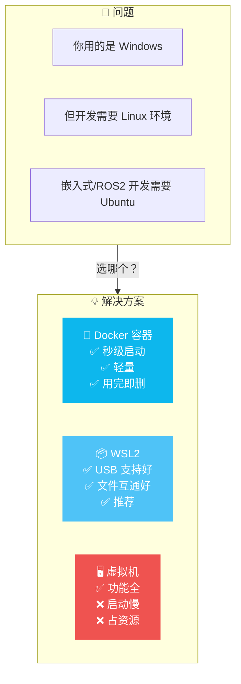

### 各方案对比（来自真实体验）

| 方案 | 启动速度 | 资源占用 | USB 支持 | GUI | 推荐场景 |
|------|---------|---------|:--------:|:---:|---------|
| **Docker** 🐳 | **秒级** | **极低** | ❌ 有限 | ❌ 需配置 | **命令行开发、编译** |
| **WSL2** 📦 | 秒级 | 低 | ✅ 良好 | ✅ 原生 | **全能推荐** |
| **虚拟机** | 分钟级 | 高 | ✅ 良好 | ✅ 原生 | 需要完整桌面环境 |

> 💡 **这次实战选择的方案**：Docker —— 因为我们只需要命令行环境来编译代码、装包测试，不需要 GUI 和 USB。

---

## 2. 安装 Docker Desktop

### 下载与安装


**安装步骤：**

```powershell
# 1. 从官网下载 Docker Desktop for Windows
# https://www.docker.com/products/docker-desktop/

# 2. 双击安装，一路 Next，安装完成后重启电脑

# 3. 启动 Docker Desktop（桌面图标或开始菜单）

# 4. 验证安装是否成功
docker version
```

**预期输出：**
```
Client: Docker Engine - Community
 Version:           27.3.1
 ...
Server: Docker Desktop
 Engine:
  Version:          27.3.1
```

看到 Client 和 Server 都有版本号，说明安装成功 ✅

---

## 3. 配置镜像加速器（解决下载超时）

### 问题现象

```bash
# 第一次拉取镜像时遇到这个错误：
docker run -it --name my-ubuntu ubuntu:22.04 bash
# Error response from daemon: Get "https://registry-1.docker.io/v2/":
# net/http: request canceled while waiting for connection
# (Client.Timeout exceeded while awaiting headers)
```

> ⚠️ 这是**国内网络访问 Docker Hub 超时**的典型问题，不是你的错，也不是 Docker 的问题。配置镜像加速器就能解决。

### 配置步骤

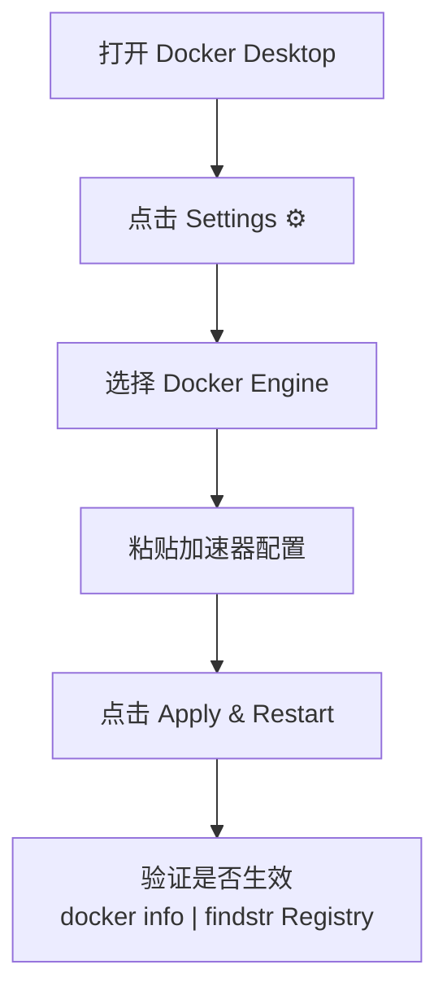

**操作过程：**

1. 在 Windows 系统托盘找到 Docker 🐳 图标，**右键 → Settings**
2. 左侧菜单选 **Docker Engine**
3. 在编辑框中把配置**替换为**：

```json
{
  "builder": {
    "gc": {
      "defaultKeepStorage": "20GB",
      "enabled": true
    }
  },
  "experimental": false,
  "registry-mirrors": [
    "https://docker.1ms.run",
    "https://docker-0.unsee.tech",
    "https://docker.m.daocloud.io"
  ]
}
```

4. 点击右下角 **Apply & Restart**
5. 重启后验证：

```powershell
docker info | findstr "Registry Mirrors"
```

**预期输出：**
```
Registry Mirrors:
 https://docker.1ms.run/
 https://docker-0.unsee.tech/
 https://docker.m.daocloud.io/
```

### 配置前后对比

| 项目 | 修改前 | 修改后 |
|------|--------|--------|
| `registry-mirrors` | ❌ 缺失 | ✅ 已添加 3 个国内镜像源 |
| 现有配置 | ✅ 正常 | ✅ 保留不变 |
| 拉取镜像 | ❌ 超时失败 | ✅ 正常下载 |

---

## 4. 拉取并运行第一个 Ubuntu 容器

### 一句话命令

```powershell
# 就这一行命令，一个完整的 Linux 环境就启动了！
docker run -it --name my-ubuntu ubuntu:22.04 bash
```

### 这条命令发生了什么？

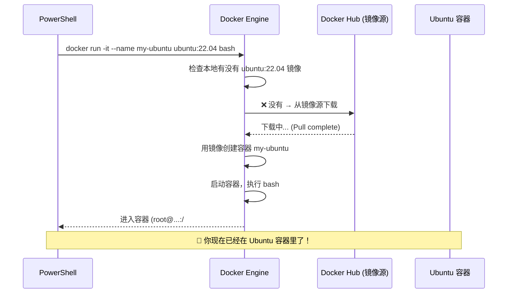

### 完整操作过程

```powershell
# PowerShell 中执行
PS C:\Users\29503> docker run -it --name my-ubuntu ubuntu:22.04 bash

# 输出：
Unable to find image 'ubuntu:22.04' locally    # ← 本地没找到 → 自动下载
22.04: Pulling from library/ubuntu
a6e2f4e9d0a5: Pull complete                     # ← 下载完成
Digest: sha256:4f838adc7181d9039ac795a7d0aba0...
Status: Downloaded newer image for ubuntu:22.04
root@f2271a4c07cc:/#                           # ← ✅ 成功进入！
```

### 容器内探索

```bash
# 你现在就在 Ubuntu 22.04 容器里了！
# 先看看这是什么系统
cat /etc/os-release

# 看看当前目录
pwd          # 输出：/
ls -la       # 列出文件

# 查看 Python 版本
python3 --version

# 安装几个工具试试
apt update
apt install -y python3-pip git vim curl wget
```

### 退出和重新进入

```bash
# 退出容器（容器会停止）
exit

# 或者按 Ctrl+P+Q 退出但不停止容器
```

```powershell
# 在 PowerShell 中重新进入
docker start -ai my-ubuntu

# 如果只是要执行一条命令，不进入交互模式
docker exec my-ubuntu ls -la
```

---

## 5. 挂载 Windows 目录（数据持久化）

### 为什么要挂载？

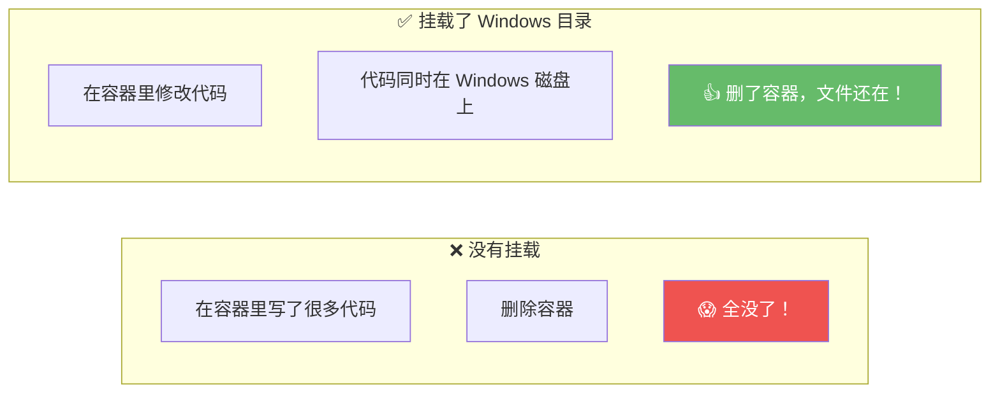

### 带挂载的方式运行容器

```powershell
# 推荐：挂载当前 PowerShell 目录到容器的 /workspace
docker run -it --name my-ubuntu `
    -v ${PWD}:/workspace `    # 挂载当前目录
    -w /workspace `           # 启动后直接进入 /workspace
    ubuntu:22.04 bash

# 参数解释：
# -v ${PWD}:/workspace  → 将 Windows 当前目录挂载到容器的 /workspace
# -w /workspace          → 启动容器后直接进入 /workspace 目录
```

### 验证挂载生效

```bash
# 在容器内创建一个文件
echo "Hello from Docker!" > /workspace/test.txt

# 查看
ls /workspace/
cat /workspace/test.txt
```

然后打开 Windows 文件管理器，进入之前运行命令的那个目录，就能看到 `test.txt` 了 ✅

### 挂载前后的区别

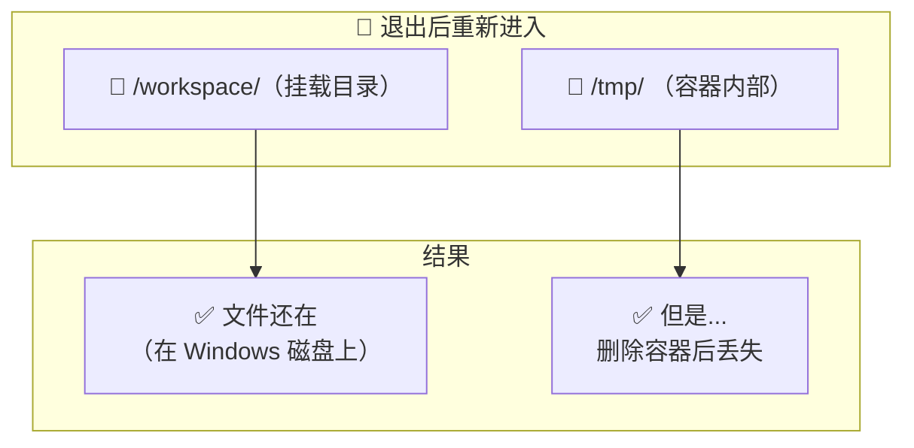

---

## 6. 容器内的正确操作姿势

### 新手最容易犯的错

```
❌ 在容器内输入 docker ps
   → bash: docker: command not found

❌ 在容器内输入 sudo apt update
   → bash: sudo: command not found
```

### 为什么这些命令不存在？

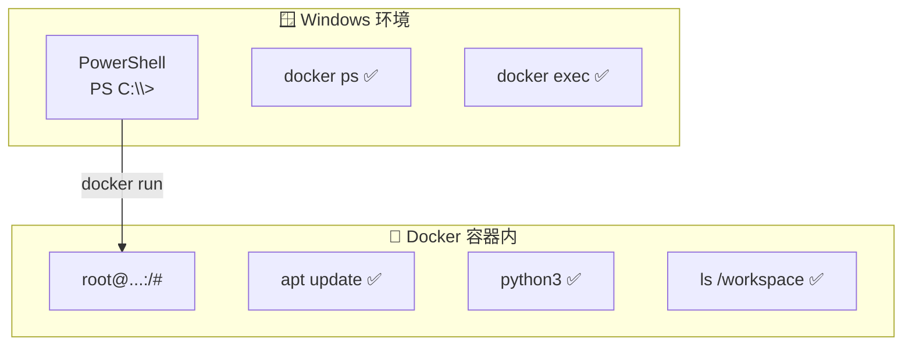

### 两个环境要分清楚

| 环境 | 提示符 | 能做什么 | 不能做什么 |
|------|--------|---------|-----------|
| **Windows PowerShell** | `PS C:\>` | `docker` 命令、Windows 操作 | ❌ apt/pip/linux 命令 |
| **Docker 容器内** | `root@...:/#` | Linux 命令、`apt`、`python3` | ❌ `docker` 命令、`sudo` |

### 正确操作示例

```bash
# ✅ 在容器内：直接运行，不需要 sudo（因为你已经是 root）
apt update
apt install -y python3 git vim

# ❌ 不要加 sudo
sudo apt install python3    # 会报错：sudo: command not found
```

```powershell
# ✅ 在 PowerShell 中：运行 docker 命令
docker ps -a
docker stop my-ubuntu
docker start -ai my-ubuntu
```

---

## 7. 什么是容器？（通俗理解）

### 一句話理解

> **容器 = 一个轻量级的、可移动的"软件运行盒子"**

### 用搬家来类比 🏠

| 传统方式 | 容器方式 |
|---------|---------|
| 你有一堆零散的物品（代码 + 依赖 + 配置） | 你把所有物品放进一个标准尺寸的**集装箱** |
| 搬到新家后，发现插座不匹配、桌子装不上 | 到了新家，集装箱直接可以摆放和使用 |
| 每个应用互相干扰，装 A 软件可能影响 B 软件 | 每个集装箱是独立的，互不干扰 |

**容器就是这个"集装箱"：**
- 把应用和它需要的东西打包在一起
- 有标准规格，在任何地方都能用
- 彼此隔离，互不影响

### 容器 vs 虚拟机

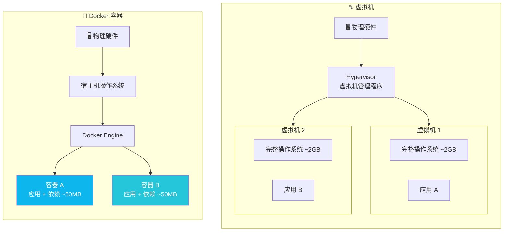

| 特性 | ☕ 虚拟机 | 🐳 Docker 容器 |
|------|:--------:|:-------------:|
| **启动速度** | 分钟级 | **秒级** |
| **资源占用** | GB 级别 | **MB 级别** |
| **操作系统** | 每个 VM 有完整 OS | **共享宿主机内核** |
| **隔离级别** | 硬件级完全隔离 | 进程级隔离 |
| **一台机能跑** | 几台 ~ 几十台 | **几十 ~ 几百个** |

### 你刚才做了什么？

```powershell
docker run -it --name my-ubuntu ubuntu:22.04 bash
```

这条命令实际做了 4 件事：


**你的真实体验：**
- 在 Windows 电脑上
- 运行了一个 Ubuntu Linux 环境
- 不需要安装虚拟机
- 几秒钟就启动了

这就是容器的魔力 🎩✨

---

## 8. 镜像 vs 容器的核心概念

### 用编程来类比

```python
# 镜像 = 类（Class）
class Ubuntu22_04:    # 这是一个镜像定义
    os = "Ubuntu"
    version = "22.04"
    packages = ["base system"]

# 容器 = 对象（Instance）
my_container = Ubuntu22_04()    # 从镜像创建容器
your_container = Ubuntu22_04()  # 可以创建多个独立的容器
```

### 用厨房来类比

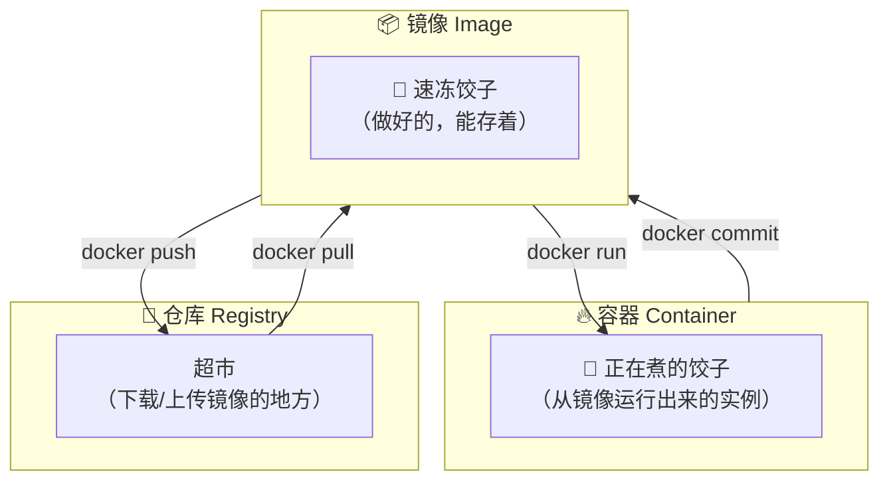

### 镜像的分层结构

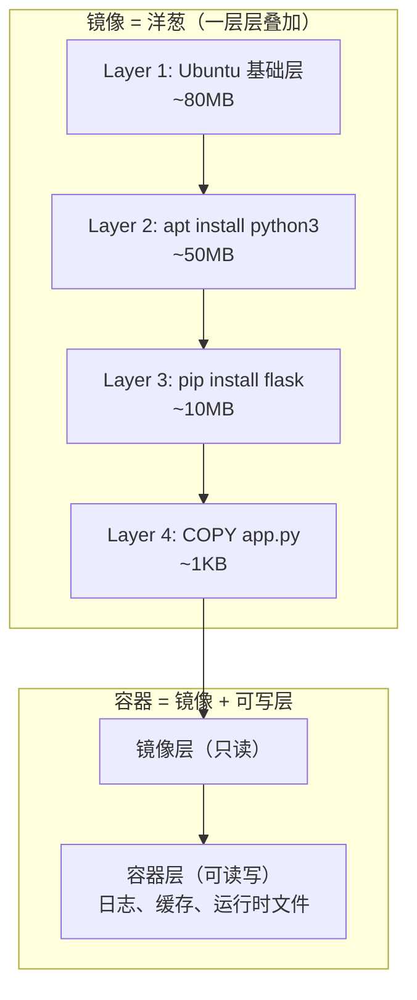

### 关键区别总结

| 概念 | 类比 | 可写？ | 生命周期 |
|------|------|:------:|---------|
| **镜像 (Image)** | 🥟 速冻饺子 / 📋 类 | ❌ 只读 | 永久存储 |
| **容器 (Container)** | 🔥 正在煮的饺子 / 🏠 对象实例 | ✅ 可读写 | 创建→运行→停止→删除 |

---

## 9. 数据持久性说明

### 三种情况下的数据命运

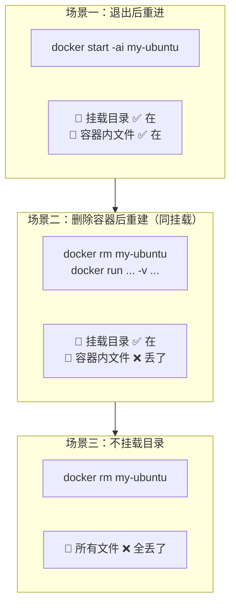

| 操作 | 挂载目录的文件 | 容器内其他文件 |
|------|:-------------:|:-------------:|
| 退出后重新进入**同一个**容器 | ✅ 还在 | ✅ 还在 |
| 删除容器后重建（相同挂载） | ✅ 还在（在 Windows 上） | ❌ 丢失 |
| 删除容器后不重建 | ✅ 还在（在 Windows 上） | ❌ 丢失 |

### 结论

> **只要用 `-v` 挂载 Windows 目录，代码和数据就安全了 —— 它们实际存在 Windows 磁盘上，不依赖容器存活。**

---

## 10. 在容器内安装 ROS2

### 完整安装命令

```bash
# 在 Ubuntu 22.04 容器内执行

# 1. 安装必要工具
apt update && apt install -y curl gnupg lsb-release

# 2. 添加 ROS2 仓库密钥
curl -sSL https://raw.githubusercontent.com/ros/rosdistro/master/ros.key \
    -o /usr/share/keyrings/ros-archive-keyring.gpg

# 3. 添加 ROS2 软件源
echo "deb [arch=$(dpkg --print-architecture) \
    signed-by=/usr/share/keyrings/ros-archive-keyring.gpg] \
    http://packages.ros.org/ros2/ubuntu \
    $(. /etc/os-release && echo $UBUNTU_CODENAME) main" | \
    tee /etc/apt/sources.list.d/ros2.list > /dev/null

# 4. 更新并安装
apt update
apt install -y ros-humble-turtlesim

# 5. 验证
source /opt/ros/humble/setup.bash
ros2 run turtlesim turtlesim_node
```

### 可能会遇到的问题

| 问题 | 原因 | 解决 |
|------|------|------|
| `E: Unable to locate package ros-humble-*` | 没加 ROS2 软件源 | 先执行步骤 2-3 |
| `curl: (28) Connection timeout` | 容器内网络问题 | 等一会重试 |
| `sudo: command not found` | 不需要 sudo | 直接运行命令 |

---

## 11. 常用命令速查

### 容器生命周期

| 操作 | 命令 | 说明 |
|------|------|------|
| 运行新容器 | `docker run -it --name n1 ubuntu:22.04 bash` | 创建并进入 |
| 查看运行中的 | `docker ps` | 只看运行的 |
| 查看所有 | `docker ps -a` | 含已停止的 |
| 重新进入 | `docker start -ai my-ubuntu` | 进入已停止的 |
| 进入运行中的 | `docker exec -it my-ubuntu bash` | 容器已在运行 |
| 退出 | `exit` 或 `Ctrl+D` | 退出并停止 |
| 退出不停止 | `Ctrl+P+Q` | 后台继续运行 |
| 停止 | `docker stop my-ubuntu` | 优雅停止 |
| 删除 | `docker rm my-ubuntu` | 删掉容器 |
| 强制删除 | `docker rm -f my-ubuntu` | 运行中也删 |

### 挂载相关

| 操作 | 命令 |
|------|------|
| 挂载当前目录 | `docker run -v ${PWD}:/workspace -w /workspace ubuntu bash` |
| 挂载指定目录 | `docker run -v D:\project:/workspace ubuntu bash` |
| 挂载多个目录 | `docker run -v D:\code:/code -v D:\data:/data ubuntu bash` |

### 镜像管理

| 操作 | 命令 |
|------|------|
| 列出镜像 | `docker images` |
| 拉取镜像 | `docker pull ubuntu:22.04` |
| 删除镜像 | `docker rmi ubuntu:22.04` |
| 镜像信息 | `docker inspect ubuntu:22.04` |

---

## 12. 常见问题与解决

### Q1: 拉取镜像超时

```bash
# 错误：
Error response from daemon: Get "https://registry-1.docker.io/v2/":
net/http: request canceled while waiting for connection
```

**原因**：国内网络连接 Docker Hub 超时

**解决**：配置镜像加速器（见第 3 章）

---

### Q2: docker: command not found（在容器内）

```bash
# 错误：
root@...:/# docker ps
bash: docker: command not found
```

**原因**：你在**容器内部**，Docker 是宿主机程序

**解决**：在 Windows PowerShell 中运行 docker 命令

---

### Q3: sudo: command not found（在容器内）

```bash
# 错误：
root@...:/# sudo apt update
bash: sudo: command not found
```

**原因**：Ubuntu 最小镜像没装 sudo，而且你已经是 root

**解决**：直接运行命令，不加 sudo

---

### Q4: 退出后文件找不到了

**原因**：没有用 `-v` 挂载目录

**解决**：用 `-v ${PWD}:/workspace` 参数启动容器

---

### Q5: 能 ping 通外网吗？

默认情况下容器可以访问外网。如果不行：

```bash
# 检查 DNS
cat /etc/resolv.conf

# 手动设置 DNS
echo "nameserver 8.8.8.8" > /etc/resolv.conf
```

---

### Q6: 容器和 Windows 怎么传文件？

```bash
# 方法一：挂载目录（推荐）
# 在 /workspace 里操作的文件，Windows 那边也能看到

# 方法二：docker cp 命令
# Windows → 容器
docker cp config.yml my-ubuntu:/workspace/config.yml
# 容器 → Windows
docker cp my-ubuntu:/workspace/output.log ./output.log
```

---

## 总结：这次操作你学到了什么？

### 你走过的路

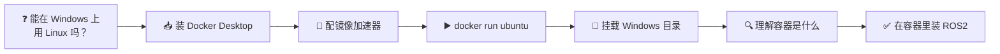

### 核心要点

| 要点 | 记住一句话 |
|------|-----------|
| **Docker 是什么** | 在电脑里快速创建一个"干净、独立、可随意折腾"的 Linux 小房间 |
| **玩坏了怎么办** | 删掉重建，只需要 1 秒钟 |
| **数据怎么保存** | 用 `-v` 挂载 Windows 目录 |
| **docker 命令在哪输** | 在 Windows PowerShell，不在容器里 |
| **apt 命令在哪输** | 在容器里，不需要 sudo |

---

> 📝 **最后的建议**：Docker 是用来跑的，不是用来理解的。先跑起来再说，用多了自然就懂了。你今天已经成功走出了第一步 —— 从安装到成功运行 Ubuntu 容器，还会挂载目录了 👏
