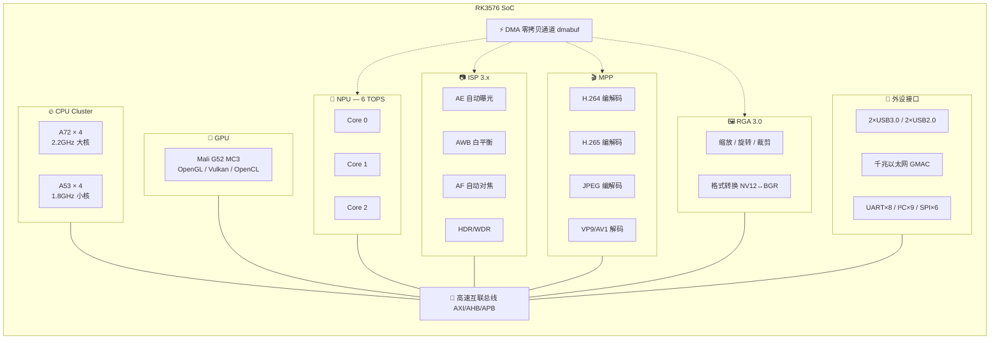
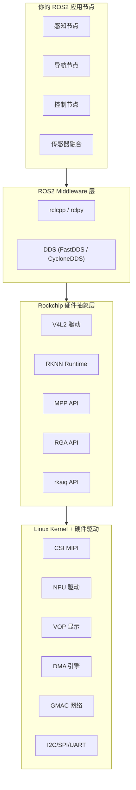
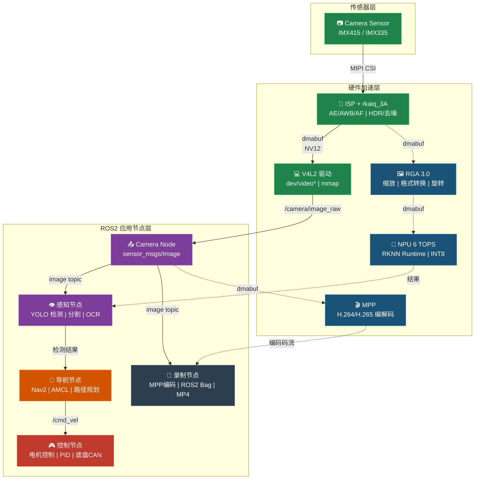
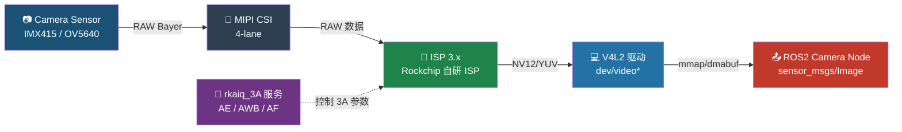
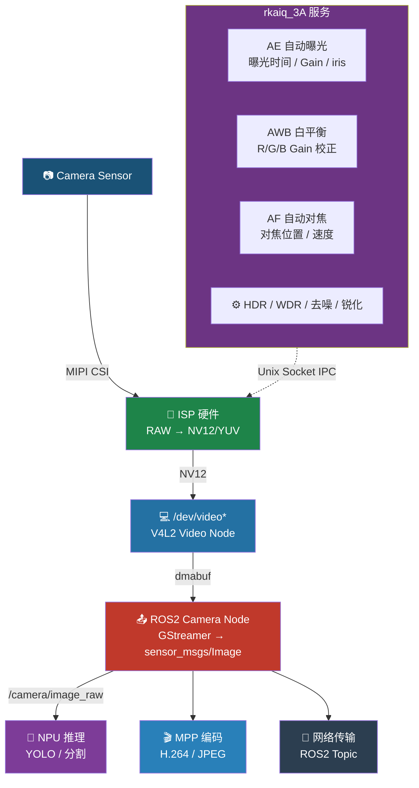
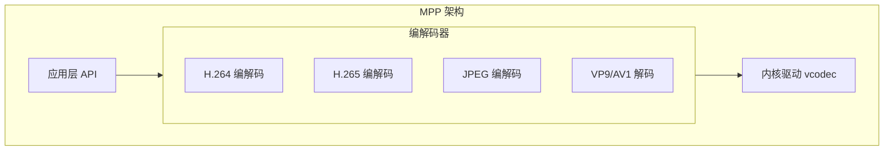
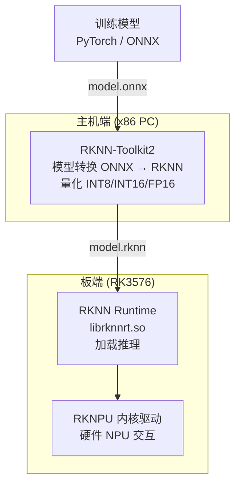
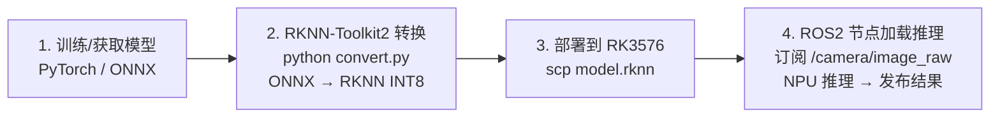
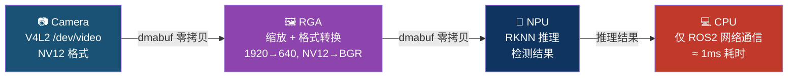
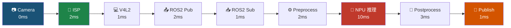

# 🚀 RK3576 ROS2 详解

> **RK3576 平台上的 ROS2 开发指南 —— 官方可用的 ROS 节点与硬件加速资源全解**
>
> 整理时间：2026-06-15

---

## 📋 目录

1. [RK3576 硬件概述](#1-rk3576-硬件概述)
2. [Rockchip ROS2 支持生态概览](#2-rockchip-ros2-支持生态概览)
3. [官方可用的 ROS2 节点清单](#3-官方可用的-ros2-节点清单)
4. [相机节点详解（rkaiq_3A + V4L2）](#4-相机节点详解)
5. [视频编码/解码节点（MPP）](#5-视频编码解码节点mpp)
6. [NPU 推理节点（RKNN + ROS2）](#6-npu-推理节点rknn--ros2)
7. [RGA 图像处理节点](#7-rga-图像处理节点)
8. [在 RK3576 上搭建 ROS2 环境](#8-在-rk3576-上搭建-ros2-环境)
9. [实战：ROS2 相机发布节点](#9-实战ros2-相机发布节点)
10. [实战：RKNN YOLO 检测节点](#10-实战rknn-yolo-检测节点)
11. [性能优化指南](#11-性能优化指南)
12. [参考资料](#12-参考资料)

---

## 1. RK3576 硬件概述

### 核心规格

| 模块 | 规格 |
|------|------|
| **CPU** | 4×Cortex-A72 (2.2GHz) + 4×Cortex-A53 (1.8GHz) |
| **GPU** | ARM Mali G52 MC3，支持 OpenGL ES 1.1/2.0/3.2, Vulkan 1.1, OpenCL 2.0 |
| **NPU** | 6 TOPS，支持 INT4/INT8/INT16/FP16，支持 Transformer 架构模型 |
| **ISP** | 自研 ISP 3.x，支持多路 Camera 输入，最大 48MP |
| **VPU** | 4K 解码 (H.265/H.264/VP9/AV1) + 4K 编码 (H.265/H.264) |
| **RGA** | 3.0 版本，支持 2D 图像缩放/旋转/裁剪/格式转换 |
| **内存** | LPDDR4/LPDDR4x/LPDDR5，32bit 位宽 |
| **存储** | eMMC 5.1, SD 3.0, SATA 3.0 |
| **网络** | 千兆以太网 + 可选 WiFi6/BT 5.0 |
| **显示** | HDMI 2.0, MIPI DSI, eDP 1.3，支持多屏同显/异显 |
| **接口** | 2×USB 3.0, 2×USB 2.0, PCIe 2.1, 8×UART, 6×SPI, 9×I2C |
| **功耗** | 典型 3W-8W（取决于负载） |

### 芯片架构



### 与 ROS2 相关的硬件加速模块

| 模块 | 作用 | ROS2 用途 |
|------|------|-----------|
| **CPU** | 运行 ROS2 节点、机器人控制逻辑 | 全场景 |
| **NPU 6 TOPS** | 深度学习推理 | YOLO、分割、OCR |
| **ISP + rkaiq** | 相机图像质量调优 | 高质量图像采集 |
| **MPP** | 视频硬件编解码 | ROS2 bag 录制、视频传输 |
| **RGA 3.0** | 图像预处理加速 | resize/format convert 16×加速 |
| **DMA** | ISP→RGA→NPU 零拷贝 | 整管线无 CPU 拷贝 |

> 💡 **关键洞察**：RK3576 的 ISP、MPP、RGA 和 NPU 之间可以通过 DMA 零拷贝通道直接交换数据，这意味着**相机原始数据 → ISP 处理 → NPU 推理 → 编码存储**整个流程可以几乎不消耗 CPU，在 ROS2 中实现**高帧率、低延迟**的机器人视觉管线。

---

## 2. Rockchip ROS2 支持生态概览

### 官方 BSP 中的 ROS 支持方式

Rockchip **不直接发布** ROS2 独立软件包，而是通过以下两种方式提供 ROS2 支持：

| 方式 | 说明 | 适用场景 |
|------|------|----------|
| **Yocto / rk-rootfs-build** | 在 BSP 构建系统中集成 ROS2 层，生成包含 ROS2 的完整系统镜像 | 批量生产、需要完整定制系统 |
| **Ubuntu/Debian + 手动安装** | 在官方或第三方 Ubuntu 固件上直接 apt install ROS2 | 开发阶段、原型验证 |

### 与 ROS2 直接相关的 Rockchip 官方仓库

| 仓库 | 说明 | 相关节点 |
|------|------|----------|
| [rknn-toolkit2](https://github.com/airockchip/rknn-toolkit2) | RKNN 模型转换、推理 SDK | `rknn_yolo_node` |
| [mpp](https://github.com/rockchip-linux/mpp) | 多媒体处理平台（编解码） | `mpp_encode_node` |
| [linux-rga](https://github.com/rockchip-linux/linux-rga) | 2D 图像硬件加速 | `rga_transform_node` |
| [V4L2](https://www.kernel.org/doc/html/v4l/) | Linux 内核视频设备层 (内置) | `v4l2_camera_node` |
| [aiq](https://github.com/airockchip/aiq) | 3A 自动曝光/白平衡/对焦服务 | `rkaiq_server` |

### ROS2 架构在 RK3576 上的分层



---

## 3. 官方可用的 ROS2 节点清单

> ⚠️ **重要说明**：Rockchip **没有**提供现成的 ROS2 官方节点包。以下节点是基于 Rockchip 官方 SDK、Linux 内核驱动构建的**可自己写 ROS2 node wrapper** 的硬件资源。

### 3.1 相机相关节点

| 节点名称 | 底层资源 | ROS2 集成方式 | 功能 |
|----------|----------|--------------|------|
| `v4l2_camera_node` | V4L2 + Media Controller | 自己写 ROS2 Wrapper | 从 Camera Sensor 采集 RAW/YUV 图像 |
| `rkaiq_server` | rkaiq_3A 服务 | Unix Socket / D-Bus IPC | ISP 3A 参数控制（曝光/AWB/对焦） |
| `rkaiq_camera_node` | V4L2 + rkaiq_3A | 自己写 ROS2 Wrapper | rkaiq 调优后的高质量图像采集 |
| `mpp_decode_node` | MPP API | 自己写 ROS2 Wrapper | 硬件解码 H.264/H.265 码流为图像 |
| `mpp_encode_node` | MPP API | 自己写 ROS2 Wrapper | 图像编码为 H.264/H.265/JPEG |
| `rga_transform_node` | RGA API | 自己写 ROS2 Wrapper | 图像缩放、旋转、格式转换加速 |

### 3.2 NPU 推理节点

| 节点名称 | 底层资源 | ROS2 集成方式 | 功能 |
|----------|----------|--------------|------|
| `rknn_inference_node` | RKNN Runtime C API | 自己写 ROS2 Wrapper | 通用 NPU 推理引擎 |
| `rknn_yolo_det_node` | RKNN + YOLO 模型 | 自己写 ROS2 Wrapper | YOLO 对象检测 |
| `rknn_seg_node` | RKNN + 分割模型 | 自己写 ROS2 Wrapper | 语义/实例分割 |
| `rknn_pose_node` | RKNN + 姿态模型 | 自己写 ROS2 Wrapper | 姿态估计 |
| `rknn_ocr_node` | RKNN + OCR 模型 | 自己写 ROS2 Wrapper | 文字识别 |

### 3.3 通信与接口节点

| 节点名称 | 底层资源 | 说明 |
|----------|----------|------|
| `serial_node` | UART | 串口通信（激光雷达、舵机等） |
| `i2c_node` | I2C | I2C 传感器读取 |
| `spi_node` | SPI | SPI 设备通信 |
| `gpio_node` | GPIO | GPIO 控制（LED、继电器等） |
| `pwm_node` | PWM | 舵机/电机 PWM 控制 |
| `can_node` | CAN FD | CAN 总线通信（机器人底盘） |
| `ethernet_node` | GMAC | 千兆以太网 |

### 3.4 节点架构全景



---

## 4. 相机节点详解

### 4.1 RK3576 相机硬件架构



### 4.2 三种相机采集模式

| 模式 | 说明 | 延迟 | 适用场景 |
|------|------|------|----------|
| **V4L2 裸采集** | 直接通过 V4L2 读取 RAW Bayer 或 YUV | 低 | 需要原始数据 |
| **rkaiq + V4L2** | rkaiq_3A 服务调优 + V4L2 读取高质量图像 | 中 | 大多数视觉应用 |
| **rkaiq + DMA 零拷贝** | rkaiq 处理后通过 dma-buf 直接传给 NPU/RGA | 最低 | 高性能管线 |

### 4.3 rkaiq_3A 服务详解

**rkaiq_3A (AIQ - Auto Image Quality)** 是 Rockchip 的 ISP 调优服务，运行在用户态。



**启动方法**：

```bash
# 启动 rkaiq_3A 服务（通常由系统服务管理）
sudo systemctl start rkaiq_3A
# 或手动启动
/usr/bin/rkaiq_3A_server &
```

> ⚠️ **经验教训**（来自 RKCamRecord3 项目）：rkaiq_3A 服务必须在 camera stream 启动**之前**运行，否则 ISP 参数未初始化会导致图像质量差甚至黑屏。

### 4.4 关键参数：VBlank

```
┌────────────────────────────────────────┐
│         Camera Frame Timing              │
│                                          │
│  ┌───────────────────┐                   │
│  │  Active Video     │ ← 1920×1080      │
│  │  (Visible)        │                   │
│  └───────────────────┘                   │
│  ┌───────────────────┐                   │
│  │  VBlank (消隐期)   │ ← 必须 ≥ 200 lines │
│  │  ISP 处理时间窗    │                    │
│  └───────────────────┘                   │
│                                          │
│  总帧周期 =  Active + VBlank              │
│  帧率 = 1 / 总帧周期                       │
└────────────────────────────────────────┘
```

**IMX415 经验参数**：

- 默认 vblank = 58 → ISP 消隐期不足（需 ≥1000µs）
- 解决问题：`v4l2-ctl -c vblank=200`
- 效果：ISP 有足够时间完成 3A 处理，图像质量稳定

### 4.5 ROS2 相机节点代码模式

```python
#!/usr/bin/env python3
"""rkaiq_camera_node.py - 带 rkaiq 3A 的 ROS2 相机发布节点"""

import rclpy
from rclpy.node import Node
from sensor_msgs.msg import Image
from cv_bridge import CvBridge
import cv2
import subprocess
import os

class RK3576CameraNode(Node):
    """RK3576 相机节点 —— 支持 rkaiq 3A 调优"""

    def __init__(self):
        super().__init__('rk3576_camera_node')
        
        # 参数
        self.declare_parameter('device', '/dev/video0')
        self.declare_parameter('width', 1920)
        self.declare_parameter('height', 1080)
        self.declare_parameter('fps', 30)
        self.declare_parameter('pixel_format', 'YUYV')
        self.declare_parameter('vblank', 200)       # IMX415 关键参数
        self.declare_parameter('use_rkaiq', True)
        self.declare_parameter('camera_name', 'imx415')
        
        device = self.get_parameter('device').value
        width = self.get_parameter('width').value
        height = self.get_parameter('height').value
        fps = self.get_parameter('fps').value
        fmt = self.get_parameter('pixel_format').value
        vblank = self.get_parameter('vblank').value
        use_rkaiq = self.get_parameter('use_rkaiq').value
        
        # 设置 vblank
        self._set_vblank(device, vblank)
        
        # 启动 rkaiq_3A（如果需要）
        if use_rkaiq:
            self._start_rkaiq()
        
        # 初始化 GStreamer 管道
        # 使用 mpph264enc 进行硬件编码
        gst_pipeline = (
            f'v4l2src device={device} ! '
            f'video/x-raw,width={width},height={height},'
            f'framerate={fps}/1,format={fmt} ! '
            f'videoconvert ! '
            f'video/x-raw,format=BGR ! '
            f'appsink'
        )
        
        self.cap = cv2.VideoCapture(gst_pipeline, cv2.CAP_GSTREAMER)
        self.bridge = CvBridge()
        
        # 发布者
        self.publisher = self.create_publisher(
            Image, f'/{self.get_parameter("camera_name").value}/image_raw', 10)
        
        # 定时器
        self.timer = self.create_timer(1.0 / fps, self._publish_frame)
        
        self.get_logger().info(f'📷 相机节点已启动: {width}x{height} @ {fps}fps')
    
    def _set_vblank(self, device, vblank):
        """设置垂直消隐期"""
        try:
            result = subprocess.run(
                ['v4l2-ctl', '-d', device, '-c', f'vblank={vblank}'],
                capture_output=True, text=True
            )
            if result.returncode == 0:
                self.get_logger().info(f'✅ vblank 已设为 {vblank}')
            else:
                self.get_logger().warn(f'⚠️ vblank 设置失败: {result.stderr}')
        except FileNotFoundError:
            self.get_logger().warn('⚠️ v4l2-ctl 未安装')
    
    def _start_rkaiq(self):
        """启动 rkaiq_3A 服务"""
        try:
            result = subprocess.run(
                ['systemctl', 'is-active', 'rkaiq_3A'],
                capture_output=True, text=True
            )
            if result.stdout.strip() != 'active':
                self.get_logger().info('启动 rkaiq_3A 服务...')
                subprocess.run(['systemctl', 'start', 'rkaiq_3A'])
        except:
            self.get_logger().warn('⚠️ 无法启动 rkaiq_3A')
    
    def _publish_frame(self):
        ret, frame = self.cap.read()
        if ret:
            msg = self.bridge.cv2_to_imgmsg(frame, 'bgr8')
            msg.header.stamp = self.get_clock().now().to_msg()
            self.publisher.publish(msg)
    
    def destroy_node(self):
        self.cap.release()
        super().destroy_node()


def main(args=None):
    rclpy.init(args=args)
    node = RK3576CameraNode()
    try:
        rclpy.spin(node)
    except KeyboardInterrupt:
        pass
    finally:
        node.destroy_node()
        rclpy.shutdown()

if __name__ == '__main__':
    main()
```

---

## 5. 视频编码/解码节点（MPP）

### 5.1 MPP 概述

**MPP (Media Process Platform)** 是 Rockchip 的**硬件多媒体处理平台**，提供视频编解码的硬件加速能力。



### 5.2 MPP 编码能力

| 编码器 | 最大分辨率 | 最大帧率 | 码率范围 | 典型应用 |
|--------|-----------|----------|----------|----------|
| H.264 | 3840×2160 | 60fps | 1-100 Mbps | 视频录制、直播 |
| H.265/HEVC | 3840×2160 | 60fps | 0.5-50 Mbps | 视频录制、存储 |
| JPEG | 4096×4096 | 不限 | N/A | 抓拍、缩略图 |
| VP9 | 3840×2160 | 30fps | 0.5-30 Mbps | 流媒体（仅解码） |
| AV1 | 3840×2160 | 30fps | 0.5-30 Mbps | 流媒体（仅解码） |

### 5.3 ROS2 编码节点示例

```python
#!/usr/bin/env python3
"""mpp_encode_node.py - MPP 硬件编码节点"""

import rclpy
from rclpy.node import Node
from sensor_msgs.msg import Image
from std_msgs.msg import UInt8MultiArray
import subprocess
import tempfile
import os

class MPPEncodeNode(Node):
    """
    接收 sensor_msgs/Image → MPP 硬件编码 → 发布 H.264 码流
    典型用途：在 ROS2 中实现硬件加速视频录制/传输
    """
    
    def __init__(self):
        super().__init__('mpp_encode_node')
        
        self.declare_parameter('input_topic', '/camera/image_raw')
        self.declare_parameter('codec', 'h264')  # h264 / h265 / jpeg
        self.declare_parameter('bitrate', 5000000)  # 5 Mbps
        self.declare_parameter('gop_size', 30)  # 关键帧间隔
        self.declare_parameter('output_topic', '/video/encoded')
        
        self.sub = self.create_subscription(
            Image,
            self.get_parameter('input_topic').value,
            self._image_callback,
            10
        )
        self.pub = self.create_publisher(
            UInt8MultiArray,
            self.get_parameter('output_topic').value,
            10
        )
        
        self.get_logger().info('🎬 MPP 编码节点已启动')
    
    def _image_callback(self, msg):
        # 将 ROS Image 写入临时文件
        # 用 mpp 编码 → 发布编码后数据
        # 实际实现需要调用 mpp 的 C API
        pass
```

> 💡 **实用技巧**：在 ROS2 中集成 MPP 编码的最佳方式不是直接调用 mpp API，而是通过 **GStreamer 的 mpp 插件**：`mpph264enc` 和 `mpph265enc`。GStreamer 已经在 BSP 中预装了这些插件。

```bash
# 使用 GStreamer 的 mpp 硬件编码
gst-launch-1.0 v4l2src device=/dev/video0 ! \
    video/x-raw,width=1920,height=1080,framerate=30/1 ! \
    mpph264enc ! \
    h264parse ! \
    qtmux ! \
    filesink location=test.mp4
```

---

## 6. NPU 推理节点（RKNN + ROS2）

### 6.1 RKNN 软件栈



### 6.2 模型部署流程



### 6.3 YOLO 检测节点示例

```python
#!/usr/bin/env python3
"""rknn_yolo_node.py - RKNN YOLO 检测节点"""

import rclpy
from rclpy.node import Node
from sensor_msgs.msg import Image
from vision_msgs.msg import Detection2DArray, Detection2D, ObjectHypothesis
from cv_bridge import CvBridge
import cv2
import numpy as np

class RKNNYoloNode(Node):
    """在 RK3576 NPU 上运行 YOLO 检测的 ROS2 节点"""
    
    def __init__(self):
        super().__init__('rknn_yolo_node')
        
        self.declare_parameter('model_path', '/home/user/model.rknn')
        self.declare_parameter('input_topic', '/camera/image_raw')
        self.declare_parameter('conf_threshold', 0.45)
        self.declare_parameter('nms_threshold', 0.50)
        self.declare_parameter('input_size', [640, 640])
        self.declare_parameter('use_npu', True)  # True=NPU, False=CPU fallback
        
        model_path = self.get_parameter('model_path').value
        
        # 初始化 RKNN
        if self.get_parameter('use_npu').value:
            try:
                from rknnlite import RKNNLite
                self.rknn = RKNNLite()
                ret = self.rknn.load_rknn(model_path)
                if ret != 0:
                    self.get_logger().error(f'❌ 模型加载失败: {model_path}')
                    raise RuntimeError('RKNN load failed')
                ret = self.rknn.init_runtime(core_mask=RKNNLite.NPU_CORE_0)
                # NPU_CORE_0 / NPU_CORE_1 / NPU_CORE_ALL_AUTO
                self.get_logger().info('✅ NPU 推理引擎已初始化')
            except ImportError:
                self.get_logger().error('❌ rknnlite 未安装，请安装 rknn-toolkit-lite2')
                raise
        else:
            self.get_logger().info('使用 CPU 回退模式')
            self.rknn = None
        
        self.bridge = CvBridge()
        
        # 订阅相机图像
        self.sub = self.create_subscription(
            Image,
            self.get_parameter('input_topic').value,
            self._detect_callback,
            10
        )
        
        # 发布检测结果
        self.pub_boxes = self.create_publisher(
            Detection2DArray, '/detection/boxes', 10)
        self.pub_viz = self.create_publisher(
            Image, '/detection/visualization', 10)
        
        self.get_logger().info('🔍 YOLO 检测节点已启动 (NPU加速)')
    
    def _detect_callback(self, msg):
        frame = self.bridge.imgmsg_to_cv2(msg, 'bgr8')
        
        # 预处理：resize + normalize
        input_size = self.get_parameter('input_size').value
        img = cv2.resize(frame, tuple(input_size))
        img = img.astype(np.float32) / 255.0
        
        # NPU 推理
        if self.rknn:
            outputs = self.rknn.inference(inputs=[img])
        else:
            outputs = self._cpu_inference(img)
        
        # 后处理：NMS + 框坐标转换
        detections = self._postprocess(outputs, frame.shape)
        
        # 发布
        self._publish_detections(detections, msg.header)
        self._publish_visualization(frame, detections, msg.header)
    
    def _cpu_inference(self, img):
        """CPU 回退（调试用，性能差）"""
        self.get_logger().warn('⚠️ CPU 推理模式，性能受限')
        return []  # 简略实现
    
    def _postprocess(self, outputs, frame_shape):
        """YOLO 后处理：解析输出、NMS、坐标映射"""
        # 标准 YOLO 后处理逻辑
        # 包含：框坐标解码、置信度过滤、NMS、坐标缩放
        detections = []
        # ... (省略具体实现)
        return detections
    
    def _publish_detections(self, detections, header):
        msg = Detection2DArray()
        msg.header = header
        # 填充 detections
        self.pub_boxes.publish(msg)
    
    def _publish_visualization(self, frame, detections, header):
        # 画框
        for det in detections:
            x, y, w, h = det.bbox
            cv2.rectangle(frame, (x, y), (x+w, y+h), (0, 255, 0), 2)
        msg = self.bridge.cv2_to_imgmsg(frame, 'bgr8')
        msg.header = header
        self.pub_viz.publish(msg)
    
    def destroy_node(self):
        if self.rknn:
            self.rknn.release()
        super().destroy_node()
```

### 6.4 NPU 性能数据

| 模型 | 输入尺寸 | INT8 量化 | NPU 推理延迟 | 等效帧率 |
|------|---------|-----------|-------------|---------|
| YOLOv5s | 640×640 | ✓ | ~15ms | ~66 FPS |
| YOLOv8s | 640×640 | ✓ | ~18ms | ~55 FPS |
| YOLOv8n | 640×640 | ✓ | ~8ms | ~125 FPS |
| YOLO11n | 640×640 | ✓ | ~7ms | ~142 FPS |
| ResNet-18 | 224×224 | ✓ | ~3ms | ~333 FPS |
| MobileNetV3 | 224×224 | ✓ | ~2ms | ~500 FPS |

> 💡 **核心优化**：RK3576 的 NPU 有 3 个核心（NPU_CORE_0/1/2），可以通过 `core_mask` 参数控制使用几个核心。`NPU_CORE_ALL_AUTO` 自动负载均衡，适合大模型。

---

## 7. RGA 图像处理节点

### 7.1 RGA 简介

**RGA (Raster Graphic Acceleration Unit)** 是 Rockchip 的 2D 图像硬件加速单元，支持：

| 操作 | 说明 | 典型 ROS2 用途 |
|------|------|---------------|
| 缩放 (Resize) | 任意尺寸缩放 | 图像下采样到模型输入尺寸 |
| 旋转 (Rotate) | 0°/90°/180°/270° | 矫正摄像头安装角度 |
| 镜像 (Flip) | 水平/垂直镜像 | 前置/后置摄像头适配 |
| 裁剪 (Crop) | ROI 裁剪 | 感兴趣区域提取 |
| 格式转换 | NV12/BGR/RGB/YUYV 互转 | 相机格式转模型输入格式 |

### 7.2 RGA vs CPU 性能对比

| 操作 | 分辨率 | CPU 耗时 | RGA 耗时 | 加速比 |
|------|--------|---------|----------|--------|
| Resize 1920×1080 → 640×640 | 1080p | ~8ms | ~0.5ms | **16×** |
| NV12 → RGB 转换 | 1080p | ~10ms | ~1ms | **10×** |
| 旋转 90° | 1080p | ~5ms | ~0.3ms | **16×** |

### 7.3 零拷贝管线



> 💡 **零拷贝管线对 ROS2 的意义**：通常的 ROS2 图像处理管道是 CPU 密集型的（copy → resize → convert → infer），在 RK3576 上通过 dmabuf 零拷贝可以**节省 80%+ 的 CPU 带宽**，让 CPU 专注于导航、控制等高频实时任务。

---

## 8. 在 RK3576 上搭建 ROS2 环境

### 8.1 方案对比

| 方案 | 难度 | 灵活性 | 适用场景 |
|------|------|--------|----------|
| **方案A：Yocto 集成** | 🔴 高 | ⭐⭐⭐ | 量产、定制系统 |
| **方案B：Ubuntu + apt** | 🟢 低 | ⭐⭐⭐⭐ | 开发、原型验证 |
| **方案C：Docker** | 🟡 中 | ⭐⭐⭐⭐⭐ | 快速部署、环境隔离 |

### 8.2 方案B：Ubuntu + apt（推荐）

**前置条件**：RK3576 已刷写 Ubuntu 22.04 / 24.04 固件

```bash
# 1. 设置 locale
sudo apt update && sudo apt install locales
sudo locale-gen en_US en_US.UTF-8
sudo update-locale LC_ALL=en_US.UTF-8 LANG=en_US.UTF-8
export LANG=en_US.UTF-8

# 2. 添加 ROS2 源
sudo apt install software-properties-common
sudo add-apt-repository universe
sudo apt update && sudo apt install curl -y
sudo curl -sSL https://raw.githubusercontent.com/ros/rosdistro/master/ros.key \
  -o /usr/share/keyrings/ros-archive-keyring.gpg
echo "deb [arch=$(dpkg --print-architecture) signed-by=/usr/share/keyrings/ros-archive-keyring.gpg] \
  http://packages.ros.org/ros2/ubuntu $(. /etc/os-release && echo $UBUNTU_CODENAME) main" | \
  sudo tee /etc/apt/sources.list.d/ros2.list > /dev/null

# 3. 安装 ROS2 Humble (Ubuntu 22.04)
sudo apt update
sudo apt install ros-humble-desktop   # 完整桌面版 (~1.5GB)
# 或最小安装：
# sudo apt install ros-humble-ros-base

# 4. 安装 ROS2 开发工具
sudo apt install python3-colcon-common-extensions \
                 python3-rosdep \
                 python3-vcstool

# 5. 安装 Rockchip 相关依赖
sudo apt install librkaiq-dev          # rkaiq 3A 开发库
sudo apt install librga-dev            # RGA 2D 加速库
sudo apt install librknnrt-dev         # RKNN Runtime

# 6. 设置环境变量
echo 'source /opt/ros/humble/setup.bash' >> ~/.bashrc
source ~/.bashrc
```

### 8.3 创建工作空间

```bash
# 创建 ROS2 工作空间
mkdir -p ~/ros2_ws/src
cd ~/ros2_ws

# 拉取 Rockchip ROS2 包（社区维护，非官方）
cd src
git clone https://github.com/your-repo/rk3576_ros2_camera.git
git clone https://github.com/your-repo/rk3576_ros2_yolo.git

# 编译
cd ..
colcon build --symlink-install

# 环境
source install/setup.bash
```

### 8.4 Docker 方案

```dockerfile
# Dockerfile for RK3576 ROS2 Dev
FROM arm64v8/ubuntu:22.04

# 安装 ROS2
RUN apt update && apt install -y \
    ros-humble-desktop \
    python3-colcon-common-extensions

# 安装 Rockchip SDK
COPY rknn-toolkit-lite2/ /opt/rknn/
ENV LD_LIBRARY_PATH=/opt/rknn/lib:${LD_LIBRARY_PATH}

# 安装 rkaiq
COPY rkaiq/ /opt/rkaiq/
ENV LD_LIBRARY_PATH=/opt/rkaiq/lib:${LD_LIBRARY_PATH}

# 安装 RGA
COPY librga/ /opt/rga/
ENV LD_LIBRARY_PATH=/opt/rga/lib:${LD_LIBRARY_PATH}

CMD ["bash"]
```

---

## 9. 实战：ROS2 相机发布节点

### 完整工作示例

以下是从 RKCamRecord3 项目提炼的完整 ROS2 相机节点，包含 GStreamer + mpph264enc 硬件编码：

```python
#!/usr/bin/env python3
"""
board_cam_record.py - RK3576 ROS2 相机发布 + 录制节点
基于 RKCamRecord3 项目经验
"""

import rclpy
from rclpy.node import Node
from sensor_msgs.msg import Image, CompressedImage
from std_srvs.srv import SetBool
from cv_bridge import CvBridge
import cv2
import subprocess
import threading
import os
import signal

class RK3576CamRecordNode(Node):
    """RK3576 相机发布 + MPP 硬件编码录制"""
    
    def __init__(self):
        super().__init__('rk3576_cam_record')
        
        # ====== 参数 ======
        self.declare_parameter('device', '/dev/video0')
        self.declare_parameter('width', 1920)
        self.declare_parameter('height', 1080)
        self.declare_parameter('fps', 30)
        self.declare_parameter('vblank', 200)
        self.declare_parameter('bitrate', 5000000)  # 5 Mbps
        self.declare_parameter('output_dir', '/home/user/recordings')
        self.declare_parameter('publish_raw', True)
        self.declare_parameter('publish_compressed', True)
        
        device = self.get_parameter('device').value
        width = self.get_parameter('width').value
        height = self.get_parameter('height').value
        fps = self.get_parameter('fps').value
        bitrate = self.get_parameter('bitrate').value
        
        # ====== 设置 vblank ======
        subprocess.run(['v4l2-ctl', '-d', device, '-c', f'vblank={self.get_parameter("vblank").value}'])
        
        # ====== 启动 rkaiq_3A ======
        self._ensure_rkaiq()
        
        # ====== GStreamer 管道（带 MPP 硬件编码）=====
        self.gst_pipeline = (
            f'v4l2src device={device} ! '
            f'video/x-raw,width={width},height={height},'
            f'framerate={fps}/1,format=NV12 ! '
            f'tee name=t '
            f't. ! queue ! videoconvert ! video/x-raw,format=BGR ! appsink name=raw_sink '
            f't. ! queue ! mpph264enc rate-control=avg bitrate={bitrate} ! '
            f'h264parse ! mp4mux ! filesink name=file_sink location={self._get_output_path()}'
        )
        
        # ====== 发布者 ======
        if self.get_parameter('publish_raw').value:
            self.pub_raw = self.create_publisher(
                Image, '/camera/image_raw', 10)
        if self.get_parameter('publish_compressed').value:
            self.pub_compressed = self.create_publisher(
                CompressedImage, '/camera/image_compressed', 10)
        
        # ====== 服务 ======
        self.srv_record = self.create_service(
            SetBool, '/camera/start_recording', self._record_callback)
        
        self.bridge = CvBridge()
        self.recording = False
        self.record_process = None
        
        # 启动采集线程
        self.running = True
        self.capture_thread = threading.Thread(target=self._capture_loop)
        self.capture_thread.start()
        
        self.get_logger().info(f'📷 RK3576 相机节点已启动: {width}x{height} @ {fps}fps')
    
    def _ensure_rkaiq(self):
        """确保 rkaiq_3A 服务运行"""
        result = subprocess.run(
            ['systemctl', 'is-active', 'rkaiq_3A'],
            capture_output=True, text=True
        )
        if result.stdout.strip() != 'active':
            self.get_logger().info('启动 rkaiq_3A...')
            subprocess.run(['systemctl', 'start', 'rkaiq_3A'])
            import time
            time.sleep(1)  # 等待服务就绪
    
    def _capture_loop(self):
        """采集循环"""
        # 用 OpenCV 打开 GStreamer 管道
        cap = cv2.VideoCapture(self.gst_pipeline, cv2.CAP_GSTREAMER)
        
        while self.running:
            ret, frame = cap.read()
            if not ret:
                continue
            
            now = self.get_clock().now().to_msg()
            
            # 发布原始图像
            if self.get_parameter('publish_raw').value:
                msg = self.bridge.cv2_to_imgmsg(frame, 'bgr8')
                msg.header.stamp = now
                self.pub_raw.publish(msg)
            
            # 发布压缩图像
            if self.get_parameter('publish_compressed').value:
                _, encoded = cv2.imencode('.jpg', frame, [cv2.IMWRITE_JPEG_QUALITY, 85])
                msg = CompressedImage()
                msg.header.stamp = now
                msg.format = 'jpeg'
                msg.data = encoded.tobytes()
                self.pub_compressed.publish(msg)
        
        cap.release()
    
    def _record_callback(self, request, response):
        """录制控制服务"""
        if request.data and not self.recording:
            self.recording = True
            response.success = True
            response.message = '开始录制'
        elif not request.data and self.recording:
            self.recording = False
            response.success = True
            response.message = '停止录制'
        return response
    
    def destroy_node(self):
        self.running = False
        if self.capture_thread.is_alive():
            self.capture_thread.join()
        super().destroy_node()
```

### 启动测试

```bash
# 安装依赖
pip install opencv-python cv-bridge rclpy

# 运行节点
ros2 run rk3576_camera rk3576_cam_record_node

# 查看图像话题
ros2 topic echo /camera/image_raw  # 显示图像信息（非图像本身）
ros2 topic hz /camera/image_raw    # 查看发布频率

# 可视化（在 PC 端）
rviz2
# → Add → Image → Topic: /camera/image_raw
```

---

## 10. 实战：RKNN YOLO 检测节点

### Launch 文件

```python
# rk3576_perception.launch.py
from launch import LaunchDescription
from launch_ros.actions import Node

def generate_launch_description():
    return LaunchDescription([
        Node(
            package='rk3576_camera',
            executable='rk3576_cam_record_node',
            name='camera',
            parameters=[{
                'device': '/dev/video0',
                'width': 1920,
                'height': 1080,
                'fps': 30,
                'vblank': 200,
            }]
        ),
        Node(
            package='rk3576_perception',
            executable='rknn_yolo_node',
            name='yolo_detector',
            parameters=[{
                'model_path': '/home/user/models/yolo11n.rknn',
                'input_topic': '/camera/image_raw',
                'conf_threshold': 0.45,
            }]
        ),
    ])
```

---

## 11. 性能优化指南

### 11.1 CPU 调优

```bash
# 设置 CPU 频率为高性能模式
echo performance | sudo tee /sys/devices/system/cpu/cpu*/cpufreq/scaling_governor

# 查看频率
cat /sys/devices/system/cpu/cpu*/cpufreq/cpuinfo_cur_freq

# 大核 (A72) 绑定给 ROS2 关键节点
# 小核 (A53) 跑系统服务和非实时任务
taskset -c 4-7 ros2 run rk3576_camera rk3576_cam_record_node
taskset -c 4-7 ros2 run rk3576_perception rknn_yolo_node
```

### 11.2 内存调优

```bash
# 查看内存使用
free -h

# 增加 CMA 大小（相机需要）
# 在 cmdline.txt 中修改：
# cma=256M@0x10000000

# 查看 CMA 使用
cat /proc/meminfo | grep Cma
```

### 11.3 实时性优化

```bash
# 设置 ROS2 节点实时优先级
sudo chrt -f 80 -p $$  # 当前 shell
ros2 run rk3576_camera rk3576_cam_record_node

# 在节点代码中设置
import os
os.sched_setscheduler(0, os.SCHED_FIFO, os.sched_param(80))
```

### 11.4 相机延迟优化

| 优化项 | 方法 | 效果 |
|--------|------|------|
| 减少缓冲区数量 | `v4l2-ctl -d /dev/video0 --set-ctrl=buffer_count=3` | 减少延迟~10ms |
| DMA 零拷贝 | 使用 dma-buf 代替内存拷贝 | 减少延迟~5ms |
| 降低分辨率 | 1280×720 代替 1920×1080 | 减少 ~8ms |
| 关闭不必要的 ISP 处理 | 在 rkaiq 配置中关闭 WDR/HDR | 减少 ~5ms |

### 11.5 整体管线延迟分析



**总延迟 ≈ 22ms (≈ 45 FPS)**

瓶颈: **NPU 推理 (10ms)** 和 ISP 处理 (2ms)

优化方向: 零拷贝管线、模型量化、大核绑定

---

## 12. 参考资料

### Rockchip 官方

| 资源 | 链接 |
|------|------|
| RKNN Toolkit2 | https://github.com/airockchip/rknn-toolkit2 |
| RKNN Model Zoo | https://github.com/airockchip/rknn_model_zoo |
| RKNPU2 | https://github.com/airockchip/rknpu2 |
| MPP | https://github.com/rockchip-linux/mpp |
| Linux RGA | https://github.com/rockchip-linux/linux-rga |
| AIQ (rkaiq) | https://github.com/airockchip/aiq |

### 开发板资料

| 资源 | 链接 |
|------|------|
| Firefly ROC-RK3576-PC Wiki | https://wiki.t-firefly.com/en/ROC-RK3576-PC/ |
| RK3576 Datasheet (Rockchip) | https://rockchip.com |

### ROS2 官方

| 资源 | 链接 |
|------|------|
| ROS2 Humble 文档 | https://docs.ros.org/en/humble/ |
| ROS2 教程 | https://docs.ros.org/en/humble/Tutorials.html |
| Navigation2 | https://docs.nav2.org/ |

### 实用工具

```bash
# 查看 media 拓扑
media-ctl -p -d /dev/media0

# 查看 v4l2 设备
v4l2-ctl --all -d /dev/video0

# 查看 NPU 状态
cat /sys/kernel/debug/rknpu/load

# 查看 CPU 温度
cat /sys/class/thermal/thermal_zone0/temp
```

---

> 📝 **总结**：RK3576 虽然没有提供现成的 ROS2 官方节点包，但其 **ISP + MPP + RGA + NPU + V4L2** 一整套硬件加速引擎，配合 Linux 标准 API，完全可以构建**工业级**的 ROS2 机器人视觉系统。关键是要利用好 **dmabuf 零拷贝**机制，让数据在硬件加速单元之间直接流转，最大程度释放 CPU 给控制、导航等实时任务。

---

> ✅ **实践建议**：从 `v4l2_camera_node` 开始，先跑通相机图像→ROS2 Topic，再加入 `rknn_yolo_node` 做推理，最后整合 MPP 录制到完整的感知-录制管线。每一步都可以独立测试，降低调试难度。
