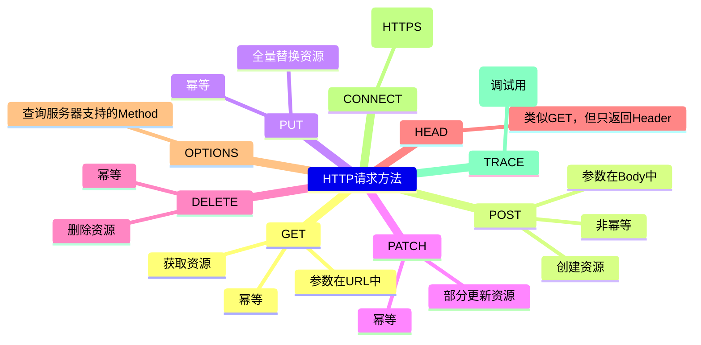
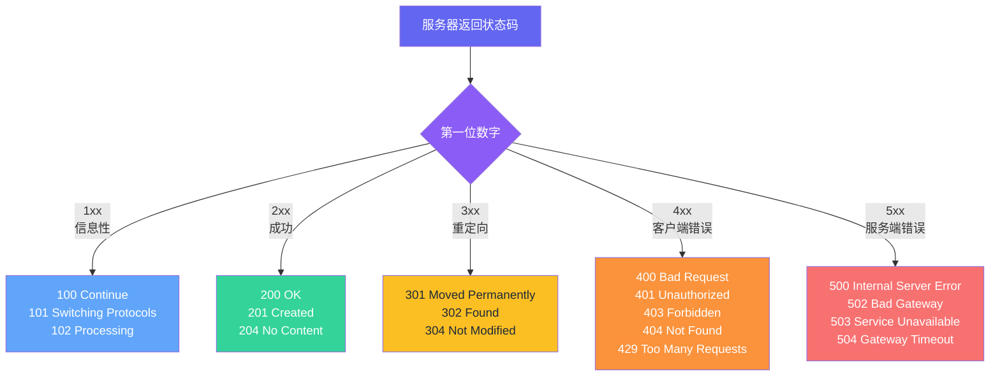
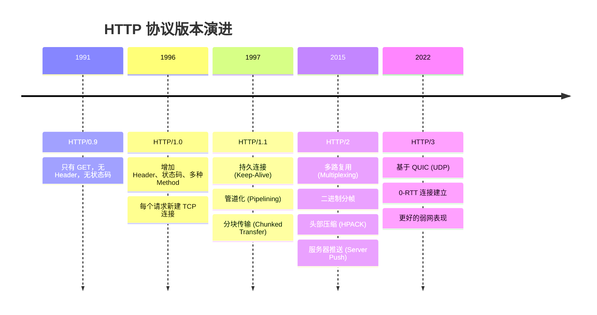
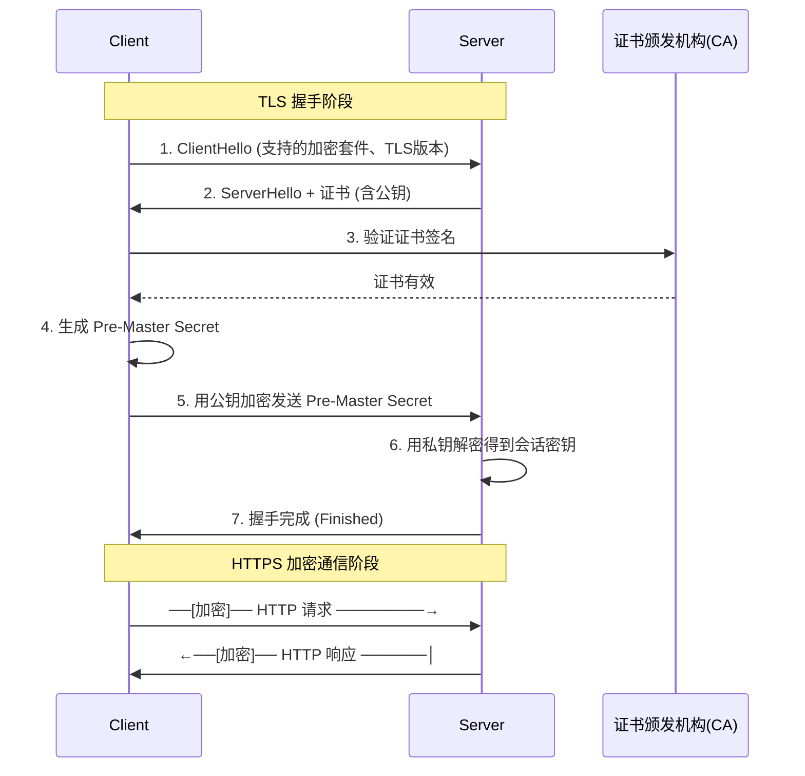
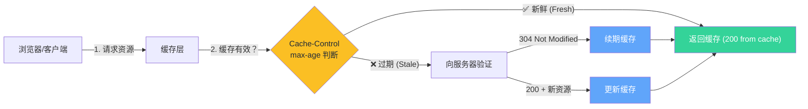
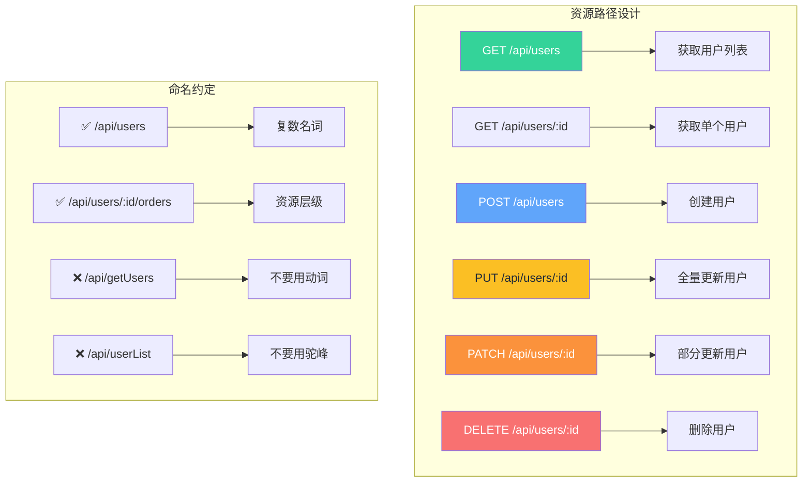
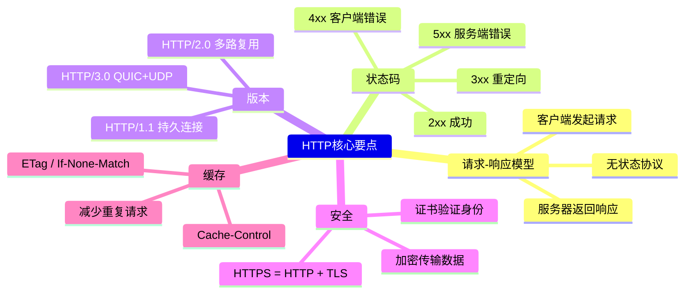

# 🌐 HTTP 协议详解

## 1. 什么是 HTTP？

**HTTP（HyperText Transfer Protocol，超文本传输协议）** 是互联网上应用最广泛的协议之一。它定义了客户端（浏览器、App）与服务器之间如何通信，采用 **请求-响应模型**。

```text
客户端                         服务器
   │                             │
   │────── HTTP Request ────────→│
   │                             │
   │←──── HTTP Response ────────│
   │                             │
```

### 核心特点

| 特点 | 说明 |
|------|------|
| **无状态** | 每个请求之间相互独立，服务器不记忆之前的请求 |
| **明文传输** | HTTP 本身不加密（HTTPS 解决此问题） |
| **客户端驱动** | 总是客户端发起请求，服务器被动响应 |
| **灵活可扩展** | 通过 Header 可以扩展功能 |

---

## 2. HTTP 请求与响应结构

### 请求结构

```http
POST /api/users HTTP/1.1
Host: example.com
Content-Type: application/json
Authorization: Bearer xxx

{"name": "Alice", "age": 25}
```

```
┌─────────────────────────────────┐
│ 请求行 (Request Line)            │
│ POST /api/users HTTP/1.1       │
├─────────────────────────────────┤
│ 请求头 (Headers)                 │
│ Host: example.com              │
│ Content-Type: application/json │
│ Authorization: Bearer xxx      │
├─────────────────────────────────┤
│ 空行 (CRLF)                     │
├─────────────────────────────────┤
│ 请求体 (Body) — 可选             │
│ {"name": "Alice", "age": 25}  │
└─────────────────────────────────┘
```

### 响应结构

```http
HTTP/1.1 200 OK
Content-Type: application/json
Set-Cookie: session_id=abc123

{"id": 1, "name": "Alice", "age": 25}
```

```
┌──────────────────────────────────┐
│ 状态行 (Status Line)              │
│ HTTP/1.1 200 OK                 │
├──────────────────────────────────┤
│ 响应头 (Response Headers)         │
│ Content-Type: application/json  │
│ Set-Cookie: session_id=abc123   │
├──────────────────────────────────┤
│ 空行 (CRLF)                      │
├──────────────────────────────────┤
│ 响应体 (Body) — 可选              │
│ {"id": 1, "name": "Alice"}     │
└──────────────────────────────────┘
```

---

## 3. HTTP 请求方法 (Methods)



### 常用方法对比

| 方法 | 幂等 | 安全 | 是否有 Body | 用途 |
|------|------|------|-------------|------|
| GET | ✅ | ✅ | ❌ | 查询资源 |
| POST | ❌ | ❌ | ✅ | 创建资源 |
| PUT | ✅ | ❌ | ✅ | 全量更新 |
| PATCH | ❌ | ❌ | ✅ | 部分更新 |
| DELETE | ✅ | ❌ | ❌ | 删除资源 |

> **幂等**：同一个请求执行多次，结果相同
> **安全**：不会改变服务器状态

---

## 4. HTTP 状态码 (Status Codes)



### 常见状态码速查表

| 状态码 | 含义 | 说明 |
|--------|------|------|
| **200** | OK | 请求成功 |
| **201** | Created | 资源创建成功（POST 常见） |
| **204** | No Content | 成功但无返回体（DELETE 常见） |
| **301** | Moved Permanently | 永久重定向 |
| **302** | Found | 临时重定向 |
| **304** | Not Modified | 缓存有效（配合 `If-Modified-Since`） |
| **400** | Bad Request | 请求格式错误 |
| **401** | Unauthorized | 未认证（需登录） |
| **403** | Forbidden | 无权限 |
| **404** | Not Found | 资源不存在 |
| **405** | Method Not Allowed | 不允许的方法 |
| **429** | Too Many Requests | 请求频率超限 |
| **500** | Internal Server Error | 服务器内部错误 |
| **502** | Bad Gateway | 网关/代理错误 |
| **503** | Service Unavailable | 服务暂时不可用 |
| **504** | Gateway Timeout | 网关超时 |

---

## 5. HTTP 版本演进



### 版本对比表

| 特性 | HTTP/1.1 | HTTP/2 | HTTP/3 |
|------|----------|--------|--------|
| 传输层 | TCP | TCP | **QUIC (UDP)** |
| 连接复用 | ❌ 串行 | ✅ 多路复用 | ✅ 多路复用 |
| 头部压缩 | ❌ | ✅ HPACK | ✅ QPACK |
| 队头阻塞 | ✅ 有 | ⚠️ TCP 层级 | ❌ 消除 |
| 服务器推送 | ❌ | ✅ | ✅ |
| 连接建立 | 3 次握手 | 3 次握手 | 0-RTT |
| 加密 | 可选 (HTTPS) | 事实上强制 | 强制 |

### 队头阻塞 (Head-of-Line Blocking)

```
HTTP/1.1  请求串行发送 ─── 一个慢了后面全等
┌─────┐    ┌─────┐    ┌─────┐
│ Req1 │───→│ Req2 │───→│ Req3 │
└─────┘    └─────┘    └─────┘
     ←────── 必须等 Req1 返回 ──────→

HTTP/2   请求并发复用同一条 TCP 连接
┌─────┐────┐
│ Req1 │   │   Stream 1
├─────┤   ├───┼───
│ Req2 │   │   Stream 3
├─────┤   │   │
│ Req3 │   │   Stream 5
└─────┘   ┘   │
             TCP Connection
```

---

## 6. HTTPS — 安全的 HTTP



### HTTP vs HTTPS

| 对比项 | HTTP | HTTPS |
|--------|------|-------|
| 端口 | 80 | 443 |
| 加密 | ❌ 明文 | ✅ TLS/SSL 加密 |
| 数据完整性 | ❌ 可篡改 | ✅ 防篡改 |
| 身份验证 | ❌ 无 | ✅ 证书验证 |
| 性能 | 快 | 稍慢（多一次握手） |
| SEO | ❌ 排名低 | ✅ 排名高 |

---

## 7. HTTP 缓存机制



### 缓存相关 Header

| Header | 方向 | 说明 |
|--------|------|------|
| `Cache-Control: max-age=3600` | 响应 | 缓存有效期（秒） |
| `Cache-Control: no-cache` | 响应 | 每次需验证 |
| `Cache-Control: no-store` | 响应 | 禁止缓存 |
| `ETag: "hash123"` | 响应 | 资源唯一标识 |
| `If-None-Match: "hash123"` | 请求 | 配合 ETag 做条件请求 |
| `Last-Modified: Wed, 21 Oct 2023` | 响应 | 最后修改时间 |
| `If-Modified-Since: ...` | 请求 | 配合 Last-Modified |

---

## 8. RESTful API 设计规范



---

## 总结



---

> **一句话总结：HTTP 是 Web 的基石，理解它的请求/响应结构、状态码、缓存和版本演进，是后端开发的基本功。**
