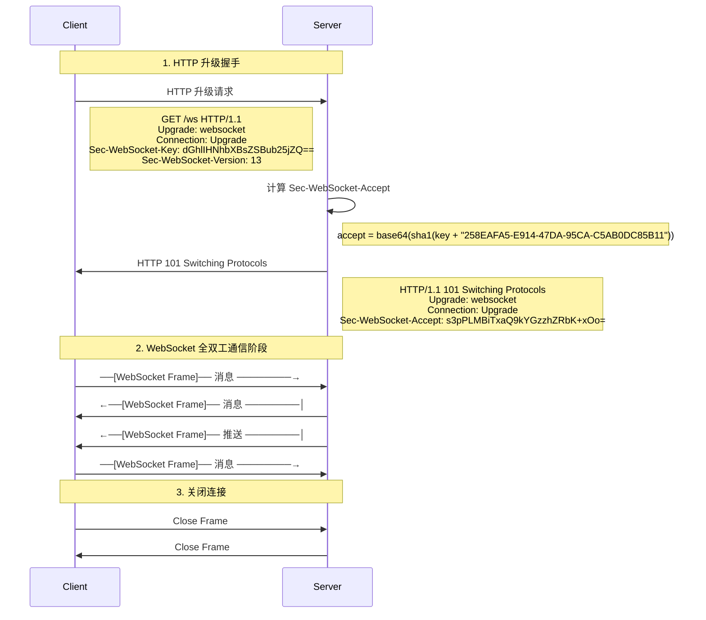
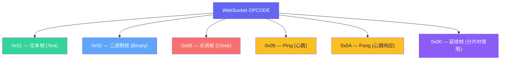
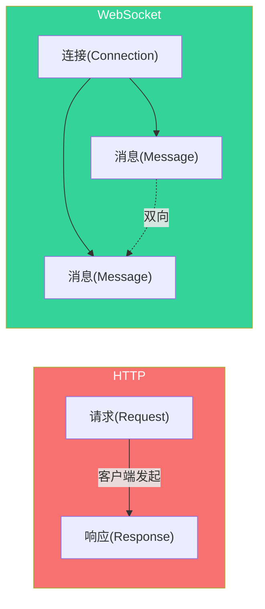
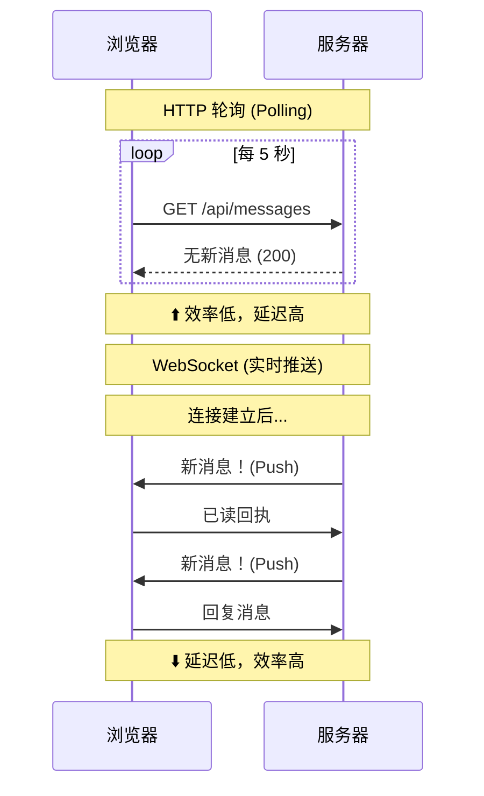
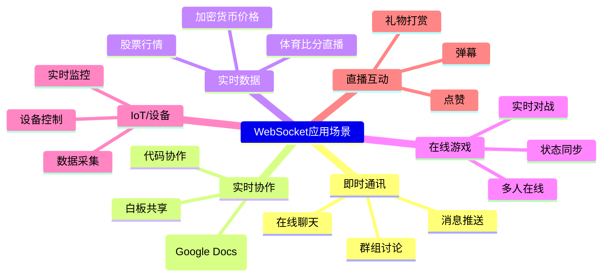
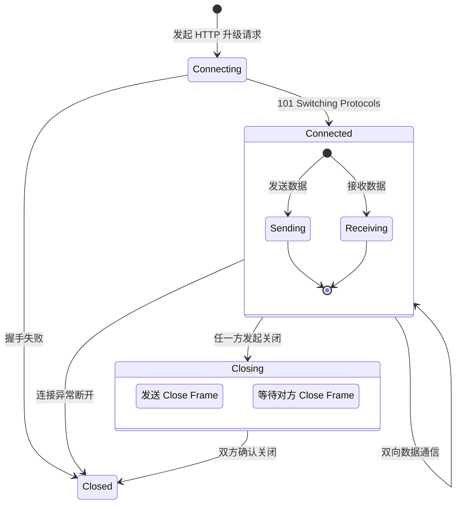
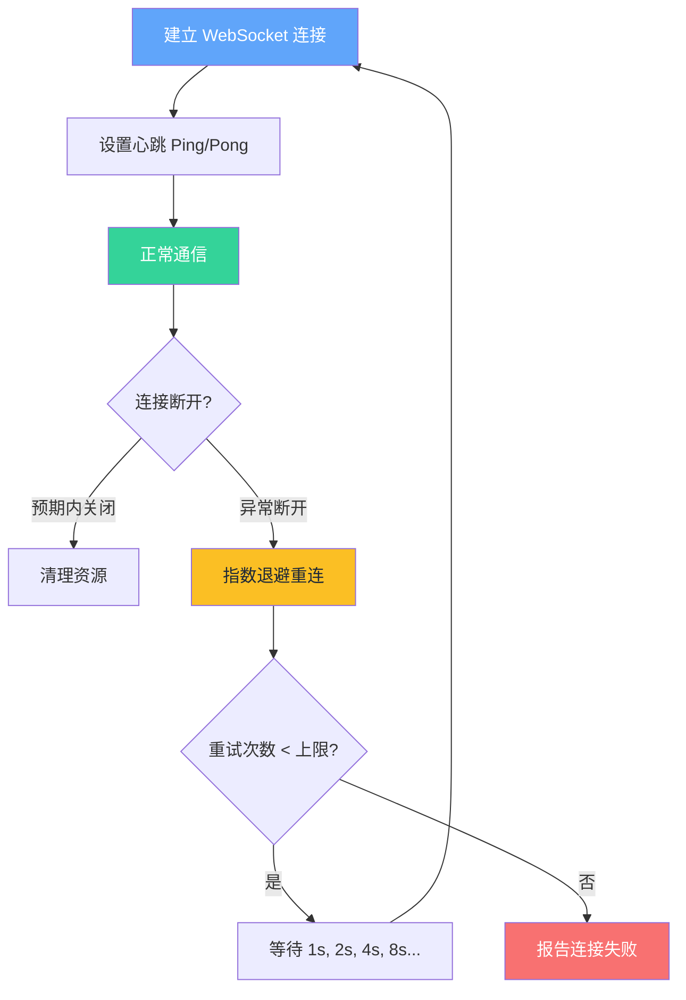
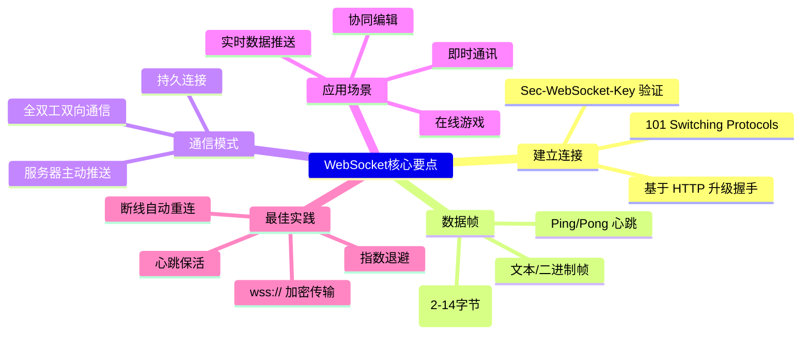

# 🔌 WebSocket 协议详解

## 1. 什么是 WebSocket？

**WebSocket** 是一种在 **单个 TCP 连接** 上提供 **全双工通信** 的协议。它解决了 HTTP 协议"请求-响应"模式的局限性——服务器无法主动向客户端推送数据。

```text
HTTP 模式（半双工）              WebSocket 模式（全双工）
┌─────────┐                    ┌─────────┐
│         │──请求──→│         │         │←────数据推送────│
│ 客户端  │←──响应──│ 服务端  │ 客户端  │────数据发送────→│ 服务端
│         │──请求──→│         │         │←────数据推送────│
│         │←──响应──│         │         │────数据发送────→│
└─────────┘                    └─────────┘
    一应一答                       随时双向
```

### 核心特点

| 特点 | 说明 |
|------|------|
| **全双工** | 客户端和服务器可以同时互相发送数据 |
| **低延迟** | 建立连接后无需重复握手，节省开销 |
| **轻量级** | 数据帧头部仅 2~14 字节，远小于 HTTP |
| **跨域支持** | 浏览器原生支持跨域 WebSocket |
| **双向推送** | 服务器可随时主动向客户端推送消息 |

---

## 2. WebSocket 连接建立 — 握手 (Handshake)

WebSocket 连接从 **HTTP 升级请求** 开始，这是它和 HTTP 最密切的关系：



### 握手请求头详解

```
# 客户端请求
GET /chat HTTP/1.1
Host: example.com
Upgrade: websocket           ← 告诉服务器要升级协议
Connection: Upgrade          ← 标记这是一个升级请求
Sec-WebSocket-Key: dGhlIHNhbXBsZSBub25jZQ==   ← 客户端生成的 16 位随机数(base64)
Sec-WebSocket-Version: 13   ← WebSocket 协议版本（目前固定 13）

# 服务端响应
HTTP/1.1 101 Switching Protocols
Upgrade: websocket
Connection: Upgrade
Sec-WebSocket-Accept: s3pPLMBiTxaQ9kYGzzhZRbK+xOo=   ← 证明服务器支持 WS
```

> **Sec-WebSocket-Accept** 的计算方式：
> ```
> accept = base64( SHA1( key + "258EAFA5-E914-47DA-95CA-C5AB0DC85B11" ) )
> ```
> 这个固定的 GUID 用于防止缓存代理重新发送 WebSocket 请求。

---

## 3. WebSocket 数据帧 (Frame) 结构

WebSocket 通信以 **帧 (Frame)** 为单位，帧结构非常轻量：

```
  0                   1                   2                   3
  0 1 2 3 4 5 6 7 8 9 0 1 2 3 4 5 6 7 8 9 0 1 2 3 4 5 6 7 8 9 0 1
 ┌─────┬─────┬───────────┬───────┬───────────────┬───────────────┐
 │F    │RSV  │OPCODE     │MASK   │ Payload Len   │Extended Len   │
 │IN   │     │(4 bits)   │(1 bit)│ (7 bits)      │(0/2/8 bytes)  │
 ├─────┴─────┴───────────┴───────┴───────────────┴───────────────┤
 │                      Masking Key (0 or 4 bytes)               │
 ├───────────────────────────────────────────────────────────────┤
 │                      Payload Data                             │
 └───────────────────────────────────────────────────────────────┘
```

### 帧字段说明

| 字段 | 长度 | 说明 |
|------|------|------|
| **FIN** | 1 bit | 是否为消息的最后一帧 |
| **RSV** | 3 bits | 保留位，扩展用 |
| **OPCODE** | 4 bits | 帧类型（见下表） |
| **MASK** | 1 bit | 是否掩码（客户端 → 服务器必须为 1） |
| **Payload Len** | 7 bits | 数据长度（0-125） |
| **Extended Len** | 0/2/8 bytes | 扩展长度（当 Payload Len=126 时 2 字节，=127 时 8 字节）|
| **Masking Key** | 0/4 bytes | 掩码密钥（客户端发数据时必须带）|
| **Payload Data** | 变长 | 实际数据 |

### OPCODE 帧类型



---

## 4. WebSocket vs HTTP 对比



### 详细对比

| 对比维度 | HTTP | WebSocket |
|----------|------|-----------|
| **通信模式** | 半双工（请求→响应） | **全双工** |
| **协议开销** | 高（请求头几百字节） | **低**（帧头 2~14 字节） |
| **连接建立** | 每次请求都要握手 | **一次握手，持久连接** |
| **服务器推送** | ❌ 不支持（需轮询/SSE） | ✅ **原生支持** |
| **数据传输** | 文本（HTTP/2 前） | **文本 + 二进制** |
| **跨域** | 需 CORS 配置 | 浏览器原生支持 |
| **缓存** | ✅ 可缓存 | ❌ 不可缓存 |
| **浏览器支持** | ✅ 全部支持 | ✅ 现代浏览器支持 |
| **适用场景** | REST API、网页加载 | **实时通信** |

### 实时性对比



---

## 5. WebSocket 使用场景



### 场景详解

| 场景 | 为什么用 WebSocket | 替代方案的问题 |
|------|-------------------|---------------|
| **聊天 App** | 需要服务器实时推送消息 | HTTP 轮询延迟高、浪费带宽 |
| **股票行情** | 价格变动频繁，毫秒级推送 | SSE 只能单向，HTTP 开销大 |
| **协同编辑** | 多用户实时同步光标和内容 | HTTP 无法处理双向高频更新 |
| **在线游戏** | 低延迟、高频的状态同步 | HTTP 握手开销太大 |
| **物联网监控** | 设备状态实时上报+远程控制 | 长轮询消耗服务器资源 |

---

## 6. WebSocket 的生命周期



### 心跳保活 (Heartbeat / Ping-Pong)

为了防止连接因长时间空闲而被网络设备（路由器、防火墙）断开，WebSocket 提供了内置的心跳机制：

```
客户端                         服务器
  │                             │
  │──── Ping Frame ────────────→│
  │                             │
  │←─── Pong Frame ────────────│   ← 如果收不到 Pong，可以判定连接断开
  │                             │
```

> 实践中，即使 WebSocket 有 Ping/Pong，很多应用还会在应用层额外做心跳，确保端到端可用。

---

## 7. 代码示例

### 前端 JavaScript

```javascript
// 建立连接
const ws = new WebSocket('wss://example.com/chat');

// 连接建立时
ws.onopen = () => {
    console.log('WebSocket 已连接');
    ws.send(JSON.stringify({ type: 'join', room: 'general' }));
};

// 收到消息
ws.onmessage = (event) => {
    const data = JSON.parse(event.data);
    console.log('收到:', data);
};

// 发送消息
function sendMessage(text) {
    ws.send(JSON.stringify({ type: 'message', text }));
}

// 连接关闭
ws.onclose = (event) => {
    console.log('连接关闭:', event.code, event.reason);
    // 自动重连
    setTimeout(() => reconnect(), 3000);
};

// 错误处理
ws.onerror = (error) => {
    console.error('WebSocket 错误:', error);
};
```

### 后端 Node.js (ws 库)

```javascript
const WebSocket = require('ws');
const server = new WebSocket.Server({ port: 8080 });

server.on('connection', (ws, req) => {
    console.log('新客户端连接:', req.socket.remoteAddress);

    // 接收消息
    ws.on('message', (data) => {
        const msg = JSON.parse(data);
        console.log('收到:', msg);

        // 广播给所有客户端
        server.clients.forEach((client) => {
            if (client.readyState === WebSocket.OPEN) {
                client.send(JSON.stringify({
                    from: req.socket.remoteAddress,
                    text: msg.text,
                    time: Date.now()
                }));
            }
        });
    });

    // 心跳
    ws.isAlive = true;
    ws.on('pong', () => { ws.isAlive = true; });

    // 错误处理
    ws.on('error', (err) => console.error('客户端错误:', err));

    // 断开连接
    ws.on('close', () => {
        console.log('客户端断开');
    });
});

// 心跳检测定时器
const interval = setInterval(() => {
    server.clients.forEach((ws) => {
        if (ws.isAlive === false) return ws.terminate();
        ws.isAlive = false;
        ws.ping();
    });
}, 30000);

server.on('close', () => clearInterval(interval));
```

---

## 8. 注意事项与最佳实践

### 连接管理



### 关键注意事项

| 注意点 | 说明 |
|--------|------|
| **🔒 使用 wss://** | 生产环境必须用加密的 WebSocket，禁止明文 ws:// |
| **🔄 自动重连** | 网络不稳定断开后自动重连，用指数退避避免雪崩 |
| **💓 心跳保活** | 防止反向代理/防火墙超时断开空闲连接 |
| **📦 消息压缩** | 大数据量时考虑压缩（如 PerMessage-Deflate） |
| **📊 连接数限制** | 浏览器同域名最多 255 个 WebSocket 连接 |
| **🛡️ 鉴权处理** | 推荐在 URL 参数或首次消息中传递 Token |
| **🧹 资源清理** | 页面关闭前主动调用 `ws.close()` |

### 常见错误码

| 错误码 | 含义 | 常见原因 |
|--------|------|---------|
| **1000** | Normal Closure | 正常关闭 |
| **1001** | Going Away | 服务器关闭/页面跳转 |
| **1006** | Abnormal Closure | 非正常断开（无 Close Frame）|
| **1011** | Internal Error | 服务器内部错误 |
| **1015** | TLS Handshake | TLS 握手失败（证书问题）|

---

## 总结



---

> **一句话总结：WebSocket 通过一次 HTTP 升级握手建立持久连接，实现真正的全双工实时通信，是实时应用的基石。**
