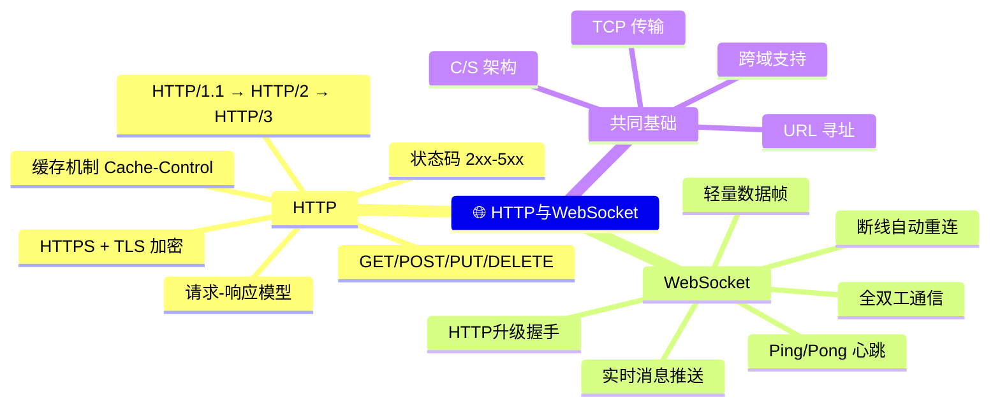

# 📖 HTTP 与 WebSocket 笔记

> HTTP 是请求的应答，WebSocket 是长久的对话。

## 📂 文件列表

| # | 文件 | 内容 | 页数 |
|---|------|------|------|
| 1 | [`01-HTTP协议详解.md`](./01-HTTP协议详解.md) | HTTP 协议结构、方法、状态码、版本演进、HTTPS、缓存 | ~8500 字 |
| 2 | [`02-WebSocket协议详解.md`](./02-WebSocket协议详解.md) | WebSocket 握手、帧结构、应用场景、代码示例、最佳实践 | ~10500 字 |

## 📊 内容概览

> 🖊️ 笔记中的图使用 Mermaid 绘制，在支持 Mermaid 的 Markdown 编辑器（Typora、Obsidian、VS Code + 插件、GitHub）中均可渲染。
