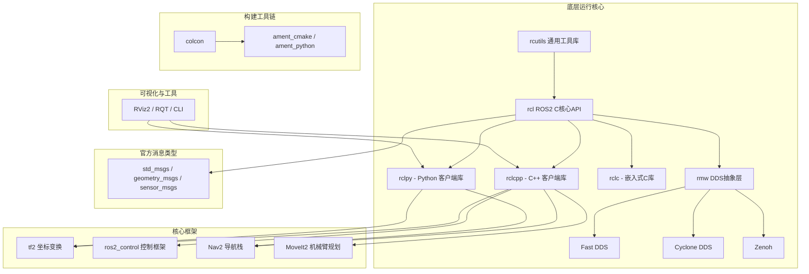
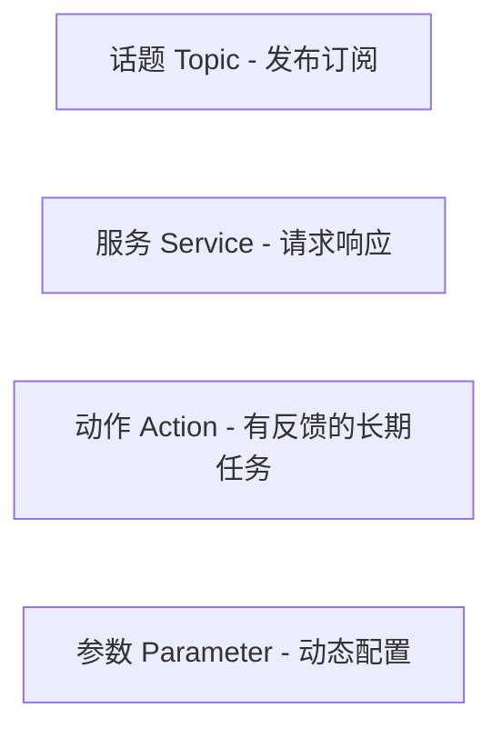
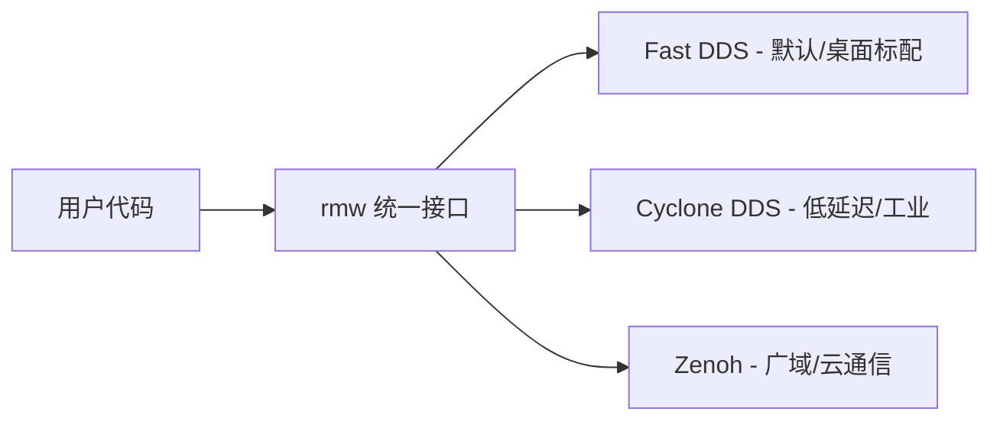
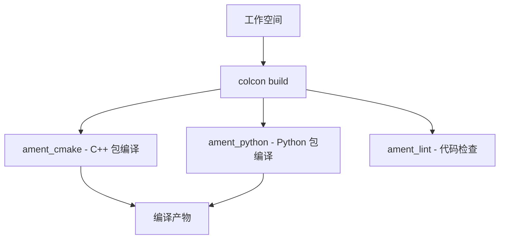
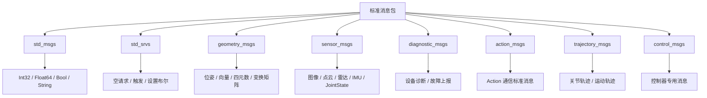
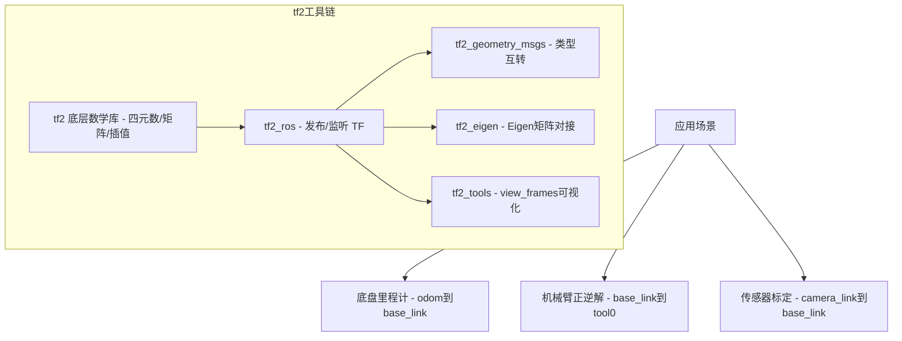
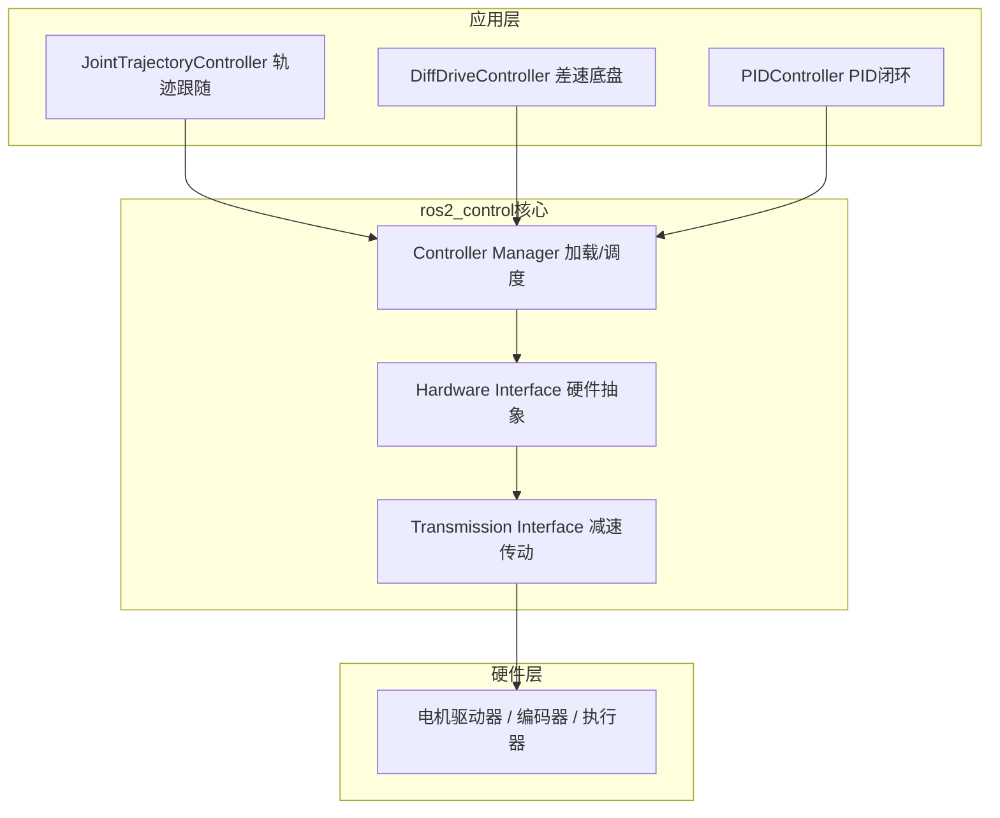
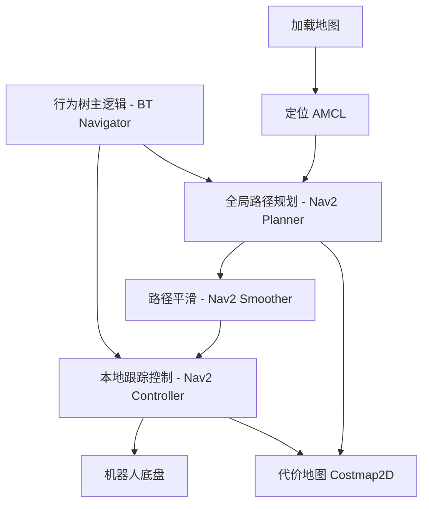
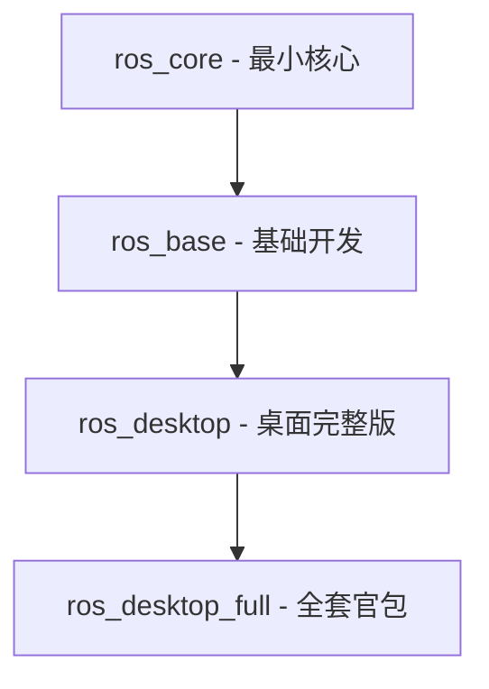
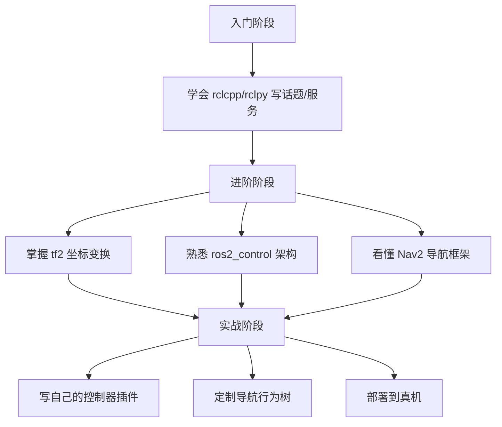

# 📦 ROS2 标准官方组件全分类笔记

> **来源：** Open Robotics 官方维护，随 ROS2 发行版同步发布，apt 源直接安装
>
> **整理时间：** 2026-06-16
>
> **一句话总结：** 所有标记为 `ros_core` / `ros_base` / `ros_desktop` 的包都是官方出品，下面这些全在里面

---

## 📊 全局架构总览



---

## 一、🧱 底层运行核心（ros_core 元包）

> 💡 **解构 ROS2 分层设计：** 从 C 工具库 → 核心 API → 客户端语言绑定 → DDS 通信抽象，一层层往上包，每层可以换，接口不变。

### 1.1 基础 C 工具层

| 包名 | 功能 | 通俗理解 |
|------|------|----------|
| **rcutils** | 日志、时间、字符串、内存、文件操作 | 🤔 整个 ROS2 的"地基"，所有 C 代码都依赖它 |
| **rcl** | ROS2 C 核心 API | 📇 统一封装了话题/服务/动作/参数四大通信范式 |
| **rcl_action** | Action 通信底层实现 | 🎯 有反馈的异步通信底层 |
| **rcl_lifecycle** | 生命周期节点底层接口 | 🔄 节点"启动→配置→激活→去激活→关闭"标准化管理 |



### 1.2 多语言客户端库（开发写节点必备）

| 包名 | 语言 | 适用场景 | 个人体会 |
|------|------|----------|----------|
| **rclcpp** | C++ | 🏭 工业实时开发、性能关键节点 | **主流方案**，底盘控制、导航、机械臂都用它 |
| **rclpy** | Python | 🚀 快速原型、数据采集、测试脚本 | 调试利器，写个话题收发几行搞定 |
| **rclc** | C（嵌入式） | 🔌 micro-ROS 跑 MCU（ESP32/STM32） | 在单片机上学 ROS2 的概念 |

> 💡 **选型建议：** 正式项目用 `rclcpp`（性能+稳定性），验证想法用 `rclpy`（快速迭代），嵌入式跑 MCU 才用 `rclc`。

### 1.3 DDS 通信抽象层 RMW（中间件隔离）



| 包名 | 特点 | 什么时候用 |
|------|------|-----------|
| **rmw** | 中间件统一抽象接口 | 永远要装，这是接口定义 |
| **rmw_fastrtps_cpp** | 默认 DDS，桌面/机器人标配 | 💡 **新手 / 大多数场景直接用这个** |
| **rmw_cyclonedds_cpp** | 低延迟、高可靠，工业实时场景 | 🏭 对延迟敏感或者可靠性要求极高 |
| **rmw_zenoh_cpp** | 轻量广域通信 | 🛰️ 跨网络/云端通信，新版官方力推 |

> 💡 **切换 DDS 的方式：** `export RMW_IMPLEMENTATION=rmw_cyclonedds_cpp`，一行环境变量换通信底层，代码完全不用改，这就是抽象层的威力。

### 1.4 消息 / 接口生成工具 rosidl

- **作用：** 自动编译 `.msg` / `.srv` / `.action` 文件 → 生成 C/C++/Python 代码
- **你只需要：** 写接口定义文件（如 `Int64MultiArray.msg`），rosidl 帮你生成所有语言的绑定代码
- **常用的消息包：**
  - `builtin_interfaces` — 内置基础时间、持续时间消息
  - `common_interfaces` — 通用消息元包（整合 std_msgs、sensor_msgs 等）

```bash
# 消息定义文件示例：VelocityTarget.msg
# 路径：your_package/msg/VelocityTarget.msg
float64 linear_x
float64 angular_z
duration timeout

# 编译后自动生成 Python：your_package.msg._velocity_target 类
# 编译后自动生成 C++：your_package::msg::VelocityTarget 结构体
```

---

## 二、🛠️ 构建与开发工具链

> 💡 **对比 ROS1：** ROS1 用 `catkin`，ROS2 改为 `colcon` + `ament`，逻辑类似但结构更清晰。



| 工具/包 | 功能 |
|---------|------|
| **colcon** | 🏗️ 工作空间编译入口工具，**你只需要记住这一个命令** |
| **ament_cmake** | C++ 功能包编译核心，写 `CMakeLists.txt` 必需 |
| **ament_python** | Python 功能包编译，写 `setup.py` 即可 |
| **ament_package** | 功能包识别、依赖解析 |
| **ament_lint / clang-format / flake8 / cppcheck** | 全套代码检查工具，保证代码质量 |

```bash
# 常用编译命令清单
colcon build                  # 编译整个工作空间
colcon build --packages-select my_pkg   # 只编译某个包
colcon build --cmake-args -DCMAKE_BUILD_TYPE=Release  # Release 模式
colcon test                   # 运行测试
source install/setup.bash     # 生效环境变量（重要！每次编译完都 source）
```

---

## 三、📡 标准通信消息接口包

> 💡 **这些是"通用数据类型标准"，所有传感器、底盘、机械臂的数据格式都用它们定义。**



| 消息包 | 常用消息类型举例 | 谁在用 |
|--------|-----------------|--------|
| **std_msgs** | `Int32`, `Float64`, `Bool`, `String`, `Header` | 📌 几乎所有话题都会引用 Header |
| **geometry_msgs** | `Pose`, `Twist`, `Quaternion`, `Transform`, `Point` | 🚗 底盘 cmd_vel、定位位姿 |
| **sensor_msgs** | `Image`, `PointCloud2`, `LaserScan`, `Imu`, `JointState` | 📷 相机、雷达、IMU、关节传感器 |
| **trajectory_msgs** | `JointTrajectory`, `MultiDOFJointTrajectory` | 🦾 机械臂运动规划 |
| **control_msgs** | `JointControllerState`, `GripperCommand` | 🤖 ros2_control 控制器 |

> 💡 **写接口文件的小知识：**
> 引用其他包的类型 → 在 `.msg` 开头用 `#include` 那套机制（按 ROS2 规则直接写包名/类型名就行）
> 自定义新消息 → 装在自定义包内，编译自动生成代码

---

## 四、🗺️ 坐标变换栈 geometry2（tf2）

> 💡 **一句话理解 tf2：** 机器人身上每个零件在运动，tf2 告诉你"这个时刻，激光雷达相对于机器人中心在哪、机械臂末端相对于基座在哪，实时更新"。



| 包名 | 功能 | 通俗比喻 |
|------|------|----------|
| **tf2** | 底层数学（四元数、坐标变换、插值） | 🧮 算距离角度的"计算器" |
| **tf2_ros** | 发布/监听 TF 变换，节点层封装 | 📡 喊出"我的位置在哪"的"广播员" |
| **tf2_geometry_msgs** | geometry_msgs 与 tf2 类型互转 | 🔄 两种格式互转的"翻译官" |
| **tf2_eigen** | 对接 Eigen 矩阵库 | 📐 跟数学库打交道的"Adapter" |
| **tf2_tools** | `view_frames` 等调试可视化工具 | 🖥️ 能看到整个坐标树的"地图显示" |

```bash
# 实用命令
ros2 run tf2_tools view_frames          # 生成当前 TF 树 PDF
ros2 topic echo /tf                     # 实时查看坐标变换数据
ros2 run tf2_ros tf2_echo base_link laser_link  # 查看两个坐标系相对关系
```

> 💡 **最常用的场景：** `lookupTransform("base_link", "laser_link", tf2::TimePointZero)` 获取激光雷达相对底盘中心的实时变换，然后把激光数据转换到底盘坐标系。

---

## 五、⚙️ 硬件实时控制框架 ros2_control

> 💡 **这是上一份笔记里 PID 控制器的家**。整个工业机器人控制的全套标准生态。

### 5.1 三层架构模型



### 5.2 组件详解

**核心框架包：**

| 包名 | 功能 | 解读 |
|------|------|------|
| **controller_manager** | 🎛️ 控制器加载/调度/切换 | 像"操作系统"，管理谁在运行 |
| **hardware_interface** | 🧩 硬件抽象标准 | 定义了：位置接口、速度接口、力矩接口、IMU 接口 |
| **transmission_interface** | ⚙️ 减速传动机构模型 | 电机转 N 圈 → 关节转 1 圈，模拟减速比 |

**标准控制器插件（ros2_controllers）：**

| 控制器 | 功能 | 典型场景 |
|--------|------|----------|
| **pid_controller** | 🔄 PID 闭环控制（位置/速度环） | 电机速度控制、位置伺服 |
| **diff_drive_controller** | 🚗 差速小车底盘控制器 | 两轮差速/四轮差速小车 |
| **joint_trajectory_controller** | 🦾 机械臂轨迹跟随 | 做圆周运动、点到点运动 |
| **forward_command_controller** | 📤 直接力矩/速度输出 | 开环控制、原始指令转发 |

**控制工具库：**

| 包名 | 功能 |
|------|------|
| **control_toolbox** | 独立 PID 算法类（可直接在自定义节点里调用 PID！）、滤波器算法 |
| **realtime_tools** | 实时缓冲、实时发布工具，保证控制循环的实时性 |

```cpp
// 在自定义节点中使用 control_toolbox 的 PID 示例
#include <control_toolbox/pid.hpp>

control_toolbox::Pid pid;
pid.initPid(1.0, 0.1, 0.01, 100.0, -100.0);  // Kp, Ki, Kd, i_max, i_min

double cmd = pid.computeCommand(error, dt);     // 输入误差和时间步长，输出控制量
pid.reset();                                     // 重置积分项
```

---

## 六、🧭 机器人导航栈 Nav2

> 💡 **NAV2 = 让机器人从 A 点走到 B 点的全套工具**，同时避开障碍物、不平路面。这是 ROS2 最复杂也最成熟的框架之一。



| 组件 | 功能 | 通俗比喻 |
|------|------|----------|
| **nav2_bt_navigator** | 行为树导航主逻辑 | 🧠 "大脑" — 按规则决策下一步 |
| **nav2_planner** | 全局路径规划（A\*、Smac） | 🗺️ "导航仪" — 从起点到终点的全局大路 |
| **nav2_controller** | 本地轨迹跟踪控制器 | 🚗 "驾驶员" — 盯着眼前的路实时转向 |
| **nav2_amcl** | 粒子滤波激光定位 | 📍 "我在哪？" — 用地图+激光算姿态 |
| **nav2_map_server** | 地图加载/保存 | 💾 存图和读图 |
| **nav2_smoother** | 路径平滑 | ✨ 把折线路径变顺滑，减少急转弯 |
| **nav2_costmap_2d** | 代价地图（障碍物/膨胀层） | 🚫 "哪里能走，哪里不能走" |

> 💡 **Nav2 的行为树机制：**
> 导航不再是硬编码的 if-else，而是通过行为树（Behavior Tree）编排：
> ```
> 恢复 -> 计算路径 -> 跟踪路径 -> 到达？
> 如果撞到墙 -> 恢复（转圈、后退）-> 重新规划
> ```

---

## 七、🖥️ 可视化与交互工具

### 7.1 RViz2 — 3D 可视化

> 💡 **RViz2 就是机器人的"后视镜"**，所有传感器数据、坐标变换、机器人模型都可以在里面实时显示。

```bash
# 启动 RViz2
ros2 run rviz2 rviz2

# 或者通常直接
rviz2
```

**核心插件：**

| 插件 | 显示内容 |
|------|----------|
| `rviz_common` | 基础显示框架 |
| `rviz_default_plugins` | 雷达显示、图像显示、点云、TF 坐标树、机器人模型（URDF） |

### 7.2 RQT 系列 — QT 图形调试工具

```bash
# 启动 RQT
ros2 run rqt rqt
```

| 工具 | 功能 | 什么时候用 |
|------|------|-----------|
| **rqt_graph** | 📊 节点/话题拓扑图 | 🔍 看节点之间通没通，谁发了谁没收到 |
| **rqt_tf_tree** | 🌳 实时坐标树 | 🔍 看坐标变换关系对不对 |
| **rqt_plot** | 📈 数据曲线绘图 | 🔍 看实时数值变化曲线 |
| **rqt_controller_manager** | 🎛️ ros2_control 控制器可视化管理 | 🔍 查看/切换控制器状态 |
| **rqt_console** | 📋 日志过滤查看 | 🔍 看警告/错误日志 |

### 7.3 命令行工具（内置）

```bash
# 日常高频命令
ros2 run <pkg> <exec>          # 运行节点
ros2 topic list                # 列出所有话题
ros2 topic echo /topic_name    # 监听话题数据
ros2 topic pub /topic_name ... # 发布话题数据

ros2 service list              # 列出服务
ros2 service call /srv_name ... # 调用服务

ros2 action list               # 列出动作

ros2 param list                # 列出参数
ros2 param get /node param     # 获取参数
ros2 param set /node param val # 设置参数

ros2 bag record -a             # 录制所有话题
ros2 bag play <bag_dir>        # 回放录制数据
```

> 💡 **ros2 bag — 数据录制的黑科技：**
> 调试疑难问题时，用 `ros2 bag record -a` 录一段现场数据，拿回来在 RViz2 里反复回放分析，不用机器人一直跑着。

---

## 八、🤖 机器人模型与几何工具

### URDF / Xacro — 给你的机器人画"骨架"

> 💡 **URDF（Unified Robot Description Format）** 是用 XML 描述机器人：有几条腿、关节在哪、长什么样。**Xacro** 是 URDF 的增强版，支持变量、宏，不会写重复代码。

```xml
<!-- URDF 骨架示例（一个简单的两轮底盘） -->
<link name="base_link">
    <visual>
        <geometry><box size="0.3 0.2 0.1"/></geometry>
        <material name="blue"/>
    </visual>
</link>

<joint name="left_wheel_joint" type="continuous">
    <parent link="base_link"/>
    <child link="left_wheel"/>
    <origin xyz="0.1 0.15 0" rpy="0 0 0"/>
</joint>
```

| 包名 | 功能 |
|------|------|
| **urdf / xacro** | 机器人统一描述语言解析工具 |
| **robot_state_publisher** | 🔑 **必装** — 读取关节状态，发布 TF 坐标（机械臂/底盘都少不了它） |
| **joint_state_publisher** | 发布关节角度状态（调试时很有用） |

---

## 九、🎮 仿真官方组件

> 💡 **用仿真验证你的代码，避免直接上真机撞墙。**


| 包组 | 功能 |
|------|------|
| **gazebo_ros_pkgs** | Gazebo 仿真与 ROS2 桥接 — **官方标准仿真环境** |
| **ros2_control_gazebo** | 仿真硬件接口，让 ros2_control 控制器可以在 Gazebo 里跑 |

> 💡 **开发流程建议：**
> 在 Gazebo 里搭好仿真 → 把你的控制代码连上 ros2_control → 在仿真里反复调试路径/参数 → 调好了直接真机上跑（同样的控制代码！）

---

## 十、生命周期、组件化与高级工具

### 10.1 生命周期节点

> 💡 **为什么需要生命周期？** 节点不是"开机就能用"的——相机需要先初始化、检查连接、配置参数，然后才能开始采集。生命周期把节点的"生老病死"标准化了。

```
Unconfigured（未配置）
    | configure()
Inactive（已配置，未激活）
    | activate()
Active（正常运行）
    | deactivate()
Inactive
    | shutdown()
Finalized（已关闭）
```

- `rclcpp_lifecycle` / `rclpy_lifecycle` — 控制器、导航模块的标准规范

### 10.2 Composable Nodes（组件化节点）

> 💡 **核心优势：** 多个节点跑在同一个进程里，图像/点云直接内存共享，省掉 Topic 序列化反序列化的开销，延迟大幅降低。

```bash
# 组件化节点启动示例
ros2 component load /ComponentManager my_pkg MyComponent
```

### 10.3 高级工具

| 工具 | 功能 | 为什么重要 |
|------|------|-----------|
| **ros1_bridge** | ROS1 <-> ROS2 双向通信桥 | 🏛️ 老项目是 ROS1？不重构、不迁移，直接桥接通信 |
| **micro-ROS** | 嵌入式 ROS2，适配 MCU | 🔌 ESP32/STM32 也能跑 ROS2 通信 |

---

## 十一、📦 元包 — 一键安装指南

> 💡 **元包 = 官方打包好的"套餐"**，想清楚你做什么场景，选对套餐，一行命令装完。



| 元包 | 包含内容 | 推荐对象 |
|------|----------|----------|
| **ros_core** | 仅通信 + 基础消息 | 🖥️ 嵌入式中，最小运行 |
| **ros_base** | 核心 + CLI + tf2 + 消息 | 🧪 纯开发包，不需要 GUI |
| **ros_desktop** | Base + RViz2 + RQT | 💻 **桌面开发，推荐！** |
| **ros_desktop_full** | 全套餐 = Desktop + Nav2 + ros2_control + 仿真 + MoveIt2 | 🏭 **项目完整部署** |

```bash
# 安装示例（Humble 为例）
sudo apt install ros-humble-ros-desktop           # 桌面开发
# 或者全装
sudo apt install ros-humble-ros-desktop-full      # 完整版
```

---

## ✅ 官方 vs 第三方 — 如何区分

> 💡 **这一点很重要！** 很多新手把社区包当成官方包，出问题了找错地方。

| 分类 | 特征 | 举例 |
|------|------|------|
| ✅ **Open Robotics 官方维护** | 随 ROS2 发行版同步发布，预装或官方 apt 源直接安装 | 本文所有组件 |
| ❌ **社区第三方包** | 需要手动指定源，或 GitHub 下载编译 | YOLO、SLAM 第三方算法、厂商相机驱动、自定义机械臂驱动 |

```bash
# 如何判断一个包是不是官方的？
apt search ros-humble- | grep "^ros-humble-"  # 官方 apt 搜得到的包
# 或者直接
apt policy ros-humble-rclcpp  # 看源和版本信息
```

---

## 📝 总结与学习路线



| 阶段 | 学习重点 | 参考组件 |
|------|----------|----------|
| 🌱 **入门** | 理解四大通信机制、写简单节点 | rclcpp / rclpy |
| 🌿 **进阶** | 坐标变换、控制框架、导航基础 | tf2 / ros2_control / Nav2 |
| 🌳 **实战** | 自定义插件、行为树、硬实时部署 | 所有组件整合使用 |

---

> **📎 笔记说明：** 本文档内容整理自《ROS2 标准官方组件全分类（Open Robotics 官方维护，发行版预装）.pdf》
>
> **祝你 ROS2 开发之旅顺利！🚀**
