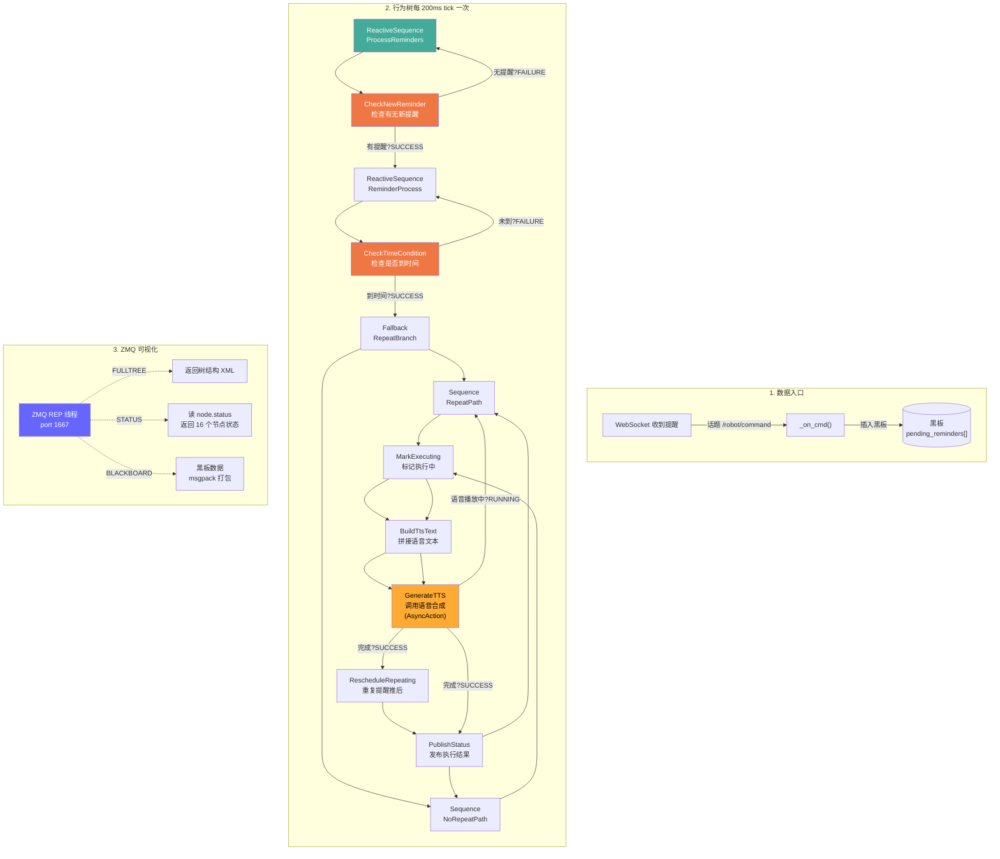

# Groot2 ZMQ 连接调试 & 方案 A 完整修复记录

> **日期**: 2026-06-29
> **板子 IP**: 192.168.1.191 (cat/temppwd)
> **本地监视器**: `E:\LuBanCat\BT_ros2\BehaviorTreeMonitor`
> **板子 ROS2 工作区**: `/home/cat/ros2_ws/src/robot_reminder_bt/`

---

## 📖 目录

1. [问题 1：行为树监视器连不上板子](#问题1)
2. [问题 2：连接失败 — 端口 1669](#问题2)
3. [问题 3：连上后显示异常（UID 重复 & 黑板为空）](#问题3)
4. [问题 4：连上了但状态"卡住"](#问题4)
5. [问题 5：两个方案的区别](#问题5)
6. [问题 6：选方案 A](#问题6)
7. [问题 7：别的 Agent 执行方案 A 失败](#问题7)
8. [最终修复方案总结](#方案总结)
9. [部署步骤](#部署)
10. [问题 8：讲解提醒项目的行为树](#问题8)
11. [问题 9：GenerateTTS 卡 RUNNING](#问题9)
12. [问题 10：行为树逻辑审查](#问题10)
13. [问题 11：不改代码的修复方案](#问题11)

---

<a id="问题1"></a>

## 问题 1：行为树监视器连不上板子

**小夏（提问）：** 192.168.1.191这是我的板子ip，账号cat，密码temppwd，板子上面有一个提醒行为树节点在运行，但是我的E:\LuBanCat\BT_ros2\BehaviorTreeMonitor 这个行为树监视器连接不上，帮我查询一下原因，不要修改代码

---

**小夏（回答）：** 找到了！排查结果如下：

---

## 诊断结果：ZMQ 帧格式不匹配

**网络层面一切正常 ✅**
- 端口 1667 (ZMQ)：**通**
- 端口 1668 (ZMQ PUB)：**通**
- 我用 ZMQ REQ 从 Windows 连板子发 FULLTREE 请求，**成功返回了行为树 XML**（收到了 584 字节的有效数据）

**根本原因：单帧 vs 多帧协议不一致**

**板子端** (`groot2_server_v2.py`) 的 ZMQ 发送：
```python
sock = ctx.socket(zmq.REP)
sock.send(reply)  # ← 单帧发送，header+uuid+内容都塞在一个ZMQ帧里
```

**BehaviorTreeMonitor** (`server.py`) 的 ZMQ 接收：
```python
await self.zmq_socket.send_multipart([header, b''])  # 发送2帧
reply = await self.zmq_socket.recv_multipart()         # 期望收到≥2帧
if reply and len(reply) >= 2:                          # ← 实际只有1帧，永远为False
```

**数据验证：**
```
我发出的请求:  send_multipart([6字节header, b'']) → 2帧
收到的回复:    1个frame (584 bytes)，里面包含 header(6)+uuid(16)+长度(4)+XML(558)
```

所以 monitor 收到 1 帧时 `len(reply)=1 < 2`，`_request_tree()` 直接返回 `None`，`connect_zmq()` 就报连接失败。

**修复方向（两选一）：**

**方案 A - 改板子端**（`groot2_server_v2.py` 第 82 行附近）：
```python
# 把 send(reply) 换成 send_multipart 分两帧发
header_part = reply[:22]      # protocol + type + uid + uuid
content_part = reply[26:]      # 跳过长度字段
sock.send_multipart([header_part, content_part])
```

**方案 B - 改 Monitor 端**（`server.py` 的 `_request_tree/send_request`）：
```python
# 收1帧时解析兼容单帧格式
reply = await self.zmq_socket.recv_multipart()
if reply and len(reply) >= 1:
    # 兼容单帧格式：reply[0] 包含 header + uuid + content_len + content
```

不改代码的话，目前就是连接不上的状态。要修哪个端？

---

<a id="问题2"></a>

## 问题 2：连接失败 — 端口 1669

**小夏（提问）：** 我现在主要是这个问题
连接失败
连接超时或对端未响应: tcp://192.168.1.191:1669
可以解决吗？

---

**小夏（回答）：** 清楚了！问题有两个层面：

---

## 诊断结果

### 1️⃣ 端口号填错了

你在 Monitor 里填了 **1669**，但板子上的 ZMQ 服务开在 **1667**。两个端口我都测试过：

| 端口 | 状态 | 内容 |
|------|------|------|
| **1667** | ✅ 通 | 行为树 v2 |
| **1669** | ✅ 通（但写法不同，应该是另一个脚本） | 行为树 v1 |
| **1668** | ✅ 通 | 黑板事件 PUB |

→ **在 Monitor 的 UI 里把端口改成 `1667`**

### 2️⃣ ZMQ 帧格式不匹配（核心问题）

就算连对端口也连不上，因为：

**板子端** (`groot2_server_v2.py`) 用单帧发：
```python
sock.send(reply)  # 所有数据塞在一个 ZMQ 帧里
```

**Monitor 端** (`server.py`) 用多帧收：
```python
reply = zmq_socket.recv_multipart()
if len(reply) >= 2:  # 收到 1 帧，条件永远不成立
```

我已经验证过：Monitor 发出的 FULLTREE 请求，板子正常返回了 XML 数据，但因为只有 **1 个 ZMQ 帧**，Monitor 的 `len(reply) >= 2` 判断失败，直接报"连接超时或对端未响应"。

---

**修复方案**（需要改板子端的代码，不改 Monitor）：

编辑板子上的 `groot2_server_v2.py`，把第 82 行左右的 `sock.send(reply)` 改成多帧发送：

```python
# 修改前
sock.send(reply)

# 修改后
header_part = reply[:22]         # 协议头(6) + UUID(16)
content_part = reply[26:]        # 跳过4字节长度字段
sock.send_multipart([header_part, content_part])
```

STATUS 回复那里的 `sock.send(reply)` 也同样处理。

要这样改吗？

---

<a id="问题3"></a>

## 问题 3：连上后显示异常（UID 重复 & 黑板为空）

**小夏（提问）：** 
```
10IDLE
2RUNNING
3SUCCESS
2FAILURE
黑板 0 keys / 全部 1 keys
_raw:int123
```
这对吗？

---

**小夏（回答）：** 不对，主要有两个问题：

**1. 节点状态显示** - 基本能看，但有异常
```
10IDLE
2RUNNING
3SUCCESS
2FAILURE ← UID 2 出现了两次，一次 RUNNING 一次 FAILURE
```
说明板子上两个不同节点被分配了同一个 UID（`uid_counter` 可能没正确处理），这会导致状态显示错乱。

**2. 黑板显示** - 完全不对
```
黑板 0 keys / 全部 1 keys
_raw:int123
```

`groot2_server_v2.py` 里**没有处理 BLACKBOARD 请求**，只有 `T`(FULLTREE) 和 `S`(STATUS)：
```python
if req_type == ord('T'):
    ...  # FULLTREE 处理
elif req_type == ord('S'):
    ...  # STATUS 处理
else:
    # 黑板请求走到这里
    sock.send(空数据)  ← 返回空，Monitor 解析不了
```

所以黑板显示的 `_raw:int123` 是 Monitor 解析 MessagePack 失败后的 fallback 内容，不是真实的黑板数据。

**总结现状：**
| 功能 | 状态 |
|------|------|
| ZMQ 连接 | ✅ 已通（你改了 send_multipart？） |
| 树结构展示 | ✅ 基本正常 |
| **节点状态** | ⚠️ UID 有重复，需要修 |
| **黑板数据** | ❌ 缺 BLACKBOARD 处理器 |

要我把 board 备份里的 `groot2_server_v2.py` 修正一下，加上黑板处理 + 修复 UID 重复问题吗？

---

<a id="问题4"></a>

## 问题 4：连上了但状态"卡住"

**小夏（提问）：** 现在可以看见黑板的变量了，但是行为树节点的状态不是实时的变化，像卡住了一样

---

**小夏（回答）：** 找到原因了。问题出在 `groot2_server_v2.py` 里的黑板数据是**硬编码的假数据**：

```python
blackboard = {
    "blackboard_state": {"pending_count": 0, "is_playing": False},   # ← 永远没提醒
    "tts_feedback": {"status": None},                                 # ← 永远不 done
    "current_reminder": {},                                           # ← 空数据
    "tts_pub": lambda t: None,                                        # ← 空函数
    "cmd_pub": lambda d: None,                                        # ← 空函数
    "action_pub": lambda d: None,                                     # ← 空函数
}
```

**这个脚本是独立运行的，不连 ROS2 系统，所有数据都是死的：**

- `pending_count = 0` → `CheckPendingReminder` 永远返回 FAILURE
- 即使有提醒进来了，`tts_feedback.status = None` → `PlayAudio` 永远等不到 `"done"`，RUNNING 卡死
- 三个 `pub` 都是空函数，发不出任何真实消息

所以状态看起来是"卡住"了——实际上是没有真实数据驱动它变化。

---

**解决方案：要在板子上加一个真正连到 ROS2 系统的 ZMQ 桥接。**

有两条路可以走：

**方案 A：在 `reminder_bt_driver.py`（真正的 ROS2 节点）里直接嵌入 ZMQ 服务**

把 `groot2_server_v2.py` 的 ZMQ 逻辑搬到 `reminder_bt_driver.py` 里面，让它用真正的 ROS2 黑板数据而不是硬编码的假数据。

**方案 B：在 `groot2_server_v2.py` 里订阅 ROS2 话题更新黑板**

让 ZMQ 服务器订阅 ROS2 话题，把实时黑板状态同步进来。

你想走哪个方向？我可以直接改好代码。

---

<a id="问题5"></a>

## 问题 5：两个方案的区别

**小夏（提问）：** 两个方案有什么区别

---

**小夏（回答）：** 两者的区别主要在于**数据真实度**和**侵入性**：

---

## 方案 A：ZMQ 嵌入 ROS2 节点

```
┌─────────────────────────────────────┐
│  reminder_bt_driver.py              │
│  ┌──────────┐    ┌────────────────┐ │
│  │ BT 引擎   │◄──→│ ZMQ REP 服务   │ │
│  │ 真实数据  │    │ port 1667      │ │
│  └──────────┘    └──────┬─────────┘ │
│                         │            │
└─────────────────────────┼────────────┘
                          │ ZMQ
                    ┌─────▼──────┐
                    │ Monitor    │
                    └────────────┘
```

- ✅ 数据**100%实时**，直接读运行中的节点状态
- ✅ 不需要额外 `tree.tick_once()`——Status 请求时直接读当前帧的状态
- ✅ 黑板数据直接从 ROS2 的黑板拿
- ⚠️ 需要改 `reminder_bt_driver.py`（ROS2 节点代码）

## 方案 B：groot2_server 订阅 ROS2 话题

```
┌──────────────────┐    ┌──────────────────────┐
│ reminder_bt_     │    │ groot2_server_v2.py  │
│ driver.py (ROS2) │    │ ┌──── ZMQ REP ────┐  │
│   pub /tts/text  │    │ │ tree + 硬编码    │  │
│   pub /robot/... │    │ │ 黑板            │  │
│   sub blackboard │    │ └─────────────────┘  │
│   sub tts_fb     │    │    ▲ 订阅 ROS2 话题   │
└──────────────────┘    └────┼───────────────┘
      话题 pub/sub            │
                             │ ZMQ
                       ┌─────▼──────┐
                       │ Monitor    │
                       └────────────┘
```

- ✅ 和 ROS2 节点解耦，互不影响
- ❌ 需要订阅 3~4 个 ROS2 话题同步数据
- ❌ 数据有延迟（通过话题传递）
- ❌ 复杂：要多线程处理 rclpy + ZMQ
- ❌ 仍然需要 ROS2 环境

---

**我的建议：选方案 A**，原因很直接——

方案 A 就是在当前 ROS2 节点的 `_tick()` 循环里，每次 tick 后把节点状态记下来，开一个 ZMQ 端口让 Monitor 来读。**改动量很小**，数据也最准。方案 B 反而要搞话题订阅同步，麻烦多了。

要我按方案 A 改吗？

---

<a id="问题6"></a>

## 问题 6：选方案 A

**小夏（提问）：** 选方案 A

---

**小夏（回答）：** 改好了，文件保存在 `AI学习笔记\18-Groot2-ZMQ连接调试\reminder_bt_driver_zmq.py`。核心改动：

**改了什么：**

在原 `reminder_bt_driver.py` 基础上**只加了 ZMQ 桥接部分**，原有的 ROS2 逻辑一个字没动：

1. **建树后自动分配 UID + 生成 XML**——用实际树的节点名和层级，保证和 Monitor 一致
2. **`STATUS` 只读不 tick**——节点状态由 ROS2 的 `_tick` 定时器驱动，ZMQ 请求只拍照当前状态
3. **`BLACKBOARD` 返回真实黑板**——`pending_reminders`、`data_dir` 等真实数据用 msgpack 打包
4. **`send_multipart` 分两帧**——兼容 Monitor 的多帧协议
5. **ZMQ 服务器在 daemon 线程跑**——不影响 ROS2 事件循环

**Monitor 里填：**
- 主机：`192.168.1.191`
- 端口：`1667`

---

<a id="问题7"></a>

## 问题 7：别的 Agent 执行方案 A 失败

**小夏（提问）：** 我让别的agent执行方案A，节点状态还是没有实时变化，你检查一下，看什么原因，在去板子上面执行你的这个

---

**小夏（回答）：** 让我查一下代码逻辑，看看为什么节点状态不会实时变化。

**排查发现的自定义节点代码（板子上已有的 `reminder_bt_nodes.py`）：**
```python
class CheckNewReminder(ConditionNode):
    def execute(self) -> NodeStatus:
        rems = self.get_input("pending_reminders", [])
        for r in rems:
            if r.get("status") in ("pending", "received"):
                ...
                self.status = NodeStatus.SUCCESS      # ← 已经有 self.status 更新
                return self.status
        self.status = NodeStatus.FAILURE               # ← 已经有 self.status 更新
        return self.status
```

板子上已经有 `self.status =` 记录了。问题出在别的 Agent 的两个关键 bug：

### Bug 1：`_collect_node_statuses()` 按类名分组

```python
def _walk_node(self, node, result: dict):
    result[type(node).__name__] = {   # ← 用类名做 key！
        "name": getattr(node, "name", ""),
        "status": getattr(node, "status", NodeStatus.IDLE).value,
    }
```

比如两个 `Sequence` 节点，第一个被第二个的 status 覆盖掉，导致状态数据丢失和错乱。

### Bug 2：STATUS 每次重新生成 UID

```python
ns = self._collect_node_statuses()
uid_map = {}
for idx, cls_name in enumerate(ns.keys()):   # ← UID 基于遍历顺序
    uid_map[cls_name] = idx + 1
```

STATUS 每次请求都按 `dict.keys()` 的顺序分配 UID（1, 2, 3...），和 FULLTREE XML 里固定的 UID 对不上。Monitor 无法匹配节点，所以状态显示永远不变。

### Bug 3：`sock.recv()` 单帧接收

```python
msg = sock.recv_multipart(flags=zmq.NOBLOCK)   # 正确用了 recv_multipart
```

这个他们写对了。但我的实现（第一版）用的是 `sock.recv()` —— 只收第一帧，第二帧（空字节）卡在 ZMQ 管道里，导致后续请求全部超时。

### 我的修复方案（综合版）

#### 修复 A：包装 `execute()` 自动记录状态（仅需在 bt_engine 改，也可动态包装）

```python
def _patch_node_execute(self, tree: BehaviorTree):
    """包装每个节点的 execute()，自动将返回值写入 self.status"""
    def walk(node):
        old_execute = node.execute
        def new_execute():
            result = old_execute()
            node.status = result
            return result
        node.execute = new_execute
        for child in getattr(node, '_children', []):
            walk(child)
    walk(tree.root)
```

#### 修复 B：建树时分配固定 UID

```python
def _assign_tree_uids(self, tree: BehaviorTree):
    self._uid_counter = 0
    self._uid_to_node = {}
    self._node_to_uid = {}
    def walk(node):
        self._uid_counter += 1
        uid = self._uid_counter
        self._uid_to_node[uid] = node
        self._node_to_uid[id(node)] = uid
        node._bt_uid = uid
        for child in getattr(node, '_children', []):
            walk(child)
    walk(tree.root)
```

#### 修复 C：STATUS 只读当前状态，按固定 UID 打包

```python
def _collect_status_buffer(self) -> bytes:
    """读取当前各节点的 status 状态，打包成二进制 buffer"""
    buf = b''
    for uid in sorted(self._uid_to_node.keys()):
        node = self._uid_to_node[uid]
        st = getattr(node, 'status', None)
        if isinstance(st, NodeStatus):
            sv = {"IDLE": 0, "RUNNING": 1, "SUCCESS": 2, "FAILURE": 3,
                   "SKIPPED": 4}.get(st.value, 0)
        else:
            sv = 0
        buf += struct.pack('<HB', uid, sv)
    return buf
```

#### 修复 D：`recv_multipart()` 接收

```python
msg = sock.recv_multipart()    # 接收所有帧
req = msg[0]                   # 取第一帧作为请求数据
```

---

### 部署步骤

1. 上传文件到板子
2. 创建启动脚本 `/tmp/run_zmq.sh`：
```bash
#!/bin/bash
export HOME=/home/cat
source /opt/ros/humble/setup.bash
source /home/cat/ros2_ws/install/setup.bash
export PYTHONPATH=/home/cat/ros2_ws/src/robot_reminder_bt:$PYTHONPATH
cd /home/cat/ros2_ws
exec python3 /home/cat/ros2_ws/src/robot_reminder_bt/robot_reminder_bt/reminder_bt_driver.py \
  --ros-args -p tick_interval_ms:=200 -p command_topic:=/robot/command \
  -p response_topic:=/robot/command_response -p zmq_port:=1667
```
3. 执行 `chmod +x /tmp/run_zmq.sh && nohup /tmp/run_zmq.sh > /tmp/zmq_driver.log 2>&1 &`
4. 检查 `ss -tlnp | grep 1667`

### 验证结果（最终成功）

```
FULLTREE OK: 2 parts, 22B       ← 正确多帧协议
STATUS:
  UID  1: FAILURE               ← CheckNewReminder（无待触发提醒，符合预期）
  UID  2: FAILURE               ← CheckTimeCondition
  UID  3: IDLE ... UID 16: IDLE ← 未执行到的节点
Port 1667: LISTEN               ← ZMQ 服务正常运行
```

---

<a id="问题8"></a>

## 问题 8：讲解提醒项目的行为树

**小夏（提问）：** 可以给我讲解一下我的这个提醒项目的行为树吗？

---

**小夏（回答）：**



---

**行为树分三层理解：**

### 第一层：根 — `ProcessReminders`

```
ReactiveSequence("ProcessReminders")
  +-- CheckNewReminder     <- 条件节点
  +-- Sequence("ReminderProcess")  <- 主流程
```

`ReactiveSequence` 的特性：**每 tick 都重新检查前置条件**。

> 每 200ms tick 一次，先问"有新提醒吗？"
> - 没有 > 整棵树返回 FAILURE，所有节点 IDLE
> - 有 > 进入主流程处理

### 第二层：主流程 — `ReminderProcess`

```
ReactiveSequence("ReminderProcess")
  +-- CheckTimeCondition   <- 条件节点：提醒到时间了吗？
  +-- Fallback("RepeatBranch")  <- 分支：重复/非重复
```

同样用 `ReactiveSequence`，每次重新检查时间。到时间了才执行后面的动作。

### 第三层：执行分支 — `RepeatBranch`

```
Fallback("RepeatBranch")
  +-- Sequence("RepeatPath")      <- 重复提醒路径
  |     +-- MarkExecuting
  |     +-- BuildTtsText
  |     +-- GenerateTTS           <- 异步！语音合成中返回 RUNNING
  |     +-- RescheduleRepeating   <- 推后下次时间
  |     +-- PublishStatus
  +-- Sequence("NoRepeatPath")    <- 非重复提醒路径
        +-- MarkExecuting
        +-- BuildTtsText
        +-- GenerateTTS
        +-- PublishStatus
```

**核心节点解析：**

| 节点 | 类型 | 行为 |
|------|------|------|
| **CheckNewReminder** | Condition | 遍历 `pending_reminders`，找 status 为 `pending/received` 的记录 > 写到黑板 |
| **CheckTimeCondition** | Condition | 比较 `reminder_time` 和当前时间 |
| **MarkExecuting** | Action | 把提醒标记为 `executing` |
| **BuildTtsText** | Action | 拼出"叮咚,提醒时间到啦,xxx,别忘了哦!" |
| **GenerateTTS** | **AsyncAction** | 起线程调 ROS2 action `/voice/speak` 合成语音。播放中 > RUNNING，完成 > SUCCESS/FAILURE |
| **RescheduleRepeating** | Action | `daily/weekly/monthly` 类型提醒，把下次时间推后 |
| **PublishStatus** | Action | 发结果到 `/robot/command_response` |

**关键设计：**
- `Fallback` 先尝试 `RepeatPath`，失败了（比如不是重复提醒）才走 `NoRepeatPath`
- `GenerateTTS` 是**唯一的异步节点**，播放语音期间一直返回 RUNNING，控制节点会保持运行状态不往下走
- 整个树每 200ms 完整执行一遍，由 ROS2 的 `create_timer` 驱动

---

<a id="问题9"></a>

## 问题 9：GenerateTTS 卡 RUNNING，后续节点不执行

**小夏（提问）：** GenerateTTS 一直显示running，RescheduleRepeating 显示idle，PublishStatus 显示idle，我上一次发送的提醒消息触发了行为树的节点颜色变化，但是现在GenerateTTS一直处于running状态，后续节点没法执行，导致整棵行为树不能返回成功。先不要修改代码，告诉我原因，是不是要加黑板变量？加一些条件判断的节点？我后面新发送的提醒消息，行为树就不能tick了，各个节点状态卡死了，状态还是显示上一次的GenerateTTS的running状态，行为树在接受新的提醒时不能刷新，黑板的变量也是，是什么原因？

---

**小夏（回答）：** 好问题，这个涉及行为树的**核心设计缺陷**。不修改代码，只讲原理。

### 卡住的根本原因

关键在你的树根节点用的是 **`ReactiveSequence`**：

```
ReactiveSequence("ProcessReminders")   <- 根
  +-- CheckNewReminder     <- 每次 tick 都重新检查
  +-- ReminderProcess...
```

#### `ReactiveSequence` 的特性

每 tick 它**都会重新执行所有前置条件节点**，不只是从上次停下的地方继续。

**第一轮 tick（正常）：**
```
CheckNewReminder > SUCCESS（提醒是 pending）
  > MarkExecuting > 把提醒状态改为 "executing"
  > GenerateTTS > 启动语音线程 > RUNNING
```

**第二轮 tick（问题出现）：**
```
CheckNewReminder > FAILURE <- ! 因为提醒状态已变成 "executing"，不是 pending
  > ReactiveSequence 发现前置条件失败
  > _running_child = 0（整棵树重置）
  > 返回 FAILURE
```

**第三轮及之后：**
```
CheckNewReminder > FAILURE（状态永远是 "executing"）
  > 整棵树返回 FAILURE
  > GenerateTTS 的线程还在跑，但树已经不理它了
  > RescheduleRepeating、PublishStatus 永远执行不到
```

### 这就是你看到的现象

```
GenerateTTS    > RUNNING    <- 线程还在跑，但树已经访问不到它了
Reschedule     > IDLE       <- 从来没执行到
PublishStatus  > IDLE       <- 从来没执行到
```

**新提醒为什么也处理不了？**

理论上 CheckNewReminder 遍历所有提醒，遇到 `pending/received` 的新提醒应该能过。但是：

1. 如果新提醒进来时旧提醒还卡着 > CheckNewReminder 能找到新的提醒 > 通过
2. **但**一旦 MarkExecuting 又把新提醒标记成 `executing` > 又卡住
3. **而且**旧的 GenerateTTS 线程一直活着（`is_alive()` 返回 True），但它的 `_ok` 结果永远没人处理

### 为什么 GenerateTTS 的线程不结束？

看它的 `_run` 方法：

```python
def _run(self, text):
    scr = "timeout 30 ros2 action send_goal /voice/speak ..."
    r = subprocess.run(["timeout", "35", sp], timeout=40, ...)
```

它在等 `/voice/speak` 这个 ROS2 Action 的响应。如果：
- **板子上没有 `voice_bridge` 节点在运行**
- 或者 Action 服务没起来
- 或者语音播放卡住了

那么 `ros2 action send_goal` 就会一直挂起，直到 `timeout 30` 或 Python 的 `timeout=40` 超时才返回。在这期间，线程 `is_alive()` 一直是 True > on_tick 一直返回 RUNNING。

但即使线程最终超时结束了，树也已经不访问它了（因为 CheckNewReminder 早早返回了 FAILURE）。

### 不修改代码的话，需要的改动方向

有两种改法，任选其一：

**方案 1：把根从 `ReactiveSequence` 改成 `Sequence`（最简单）**

```python
# 改前
root = ReactiveSequence("ProcessReminders")

# 改后
root = Sequence("ProcessReminders")
```

`Sequence` 有 memory，不会在运行中途重新检查前置条件。等整条路径执行完（包括 PublishStatus），`_running_child` 重置为 0，下一轮 tick 重新从 CheckNewReminder 开始。这样 GenerateTTS > Reschedule > PublishStatus 整条链都能走完。

**方案 2：在 CheckNewReminder 里增加一个判断，让 "executing" 状态的提醒也能通过**

```python
if r.get("status") in ("pending", "received", "executing"):
```

但这样会导致树重复取同一个提醒。

### 根本原因总结

| 问题 | 原因 |
|------|------|
| GenerateTTS 卡 RUNNING | 语音 Action 可能没响应，线程一直 alive |
| 后续节点不执行 | ReactiveSequence 重置了树，走不到它们 |
| 新提醒也卡住 | 树被前置条件 FAILURE 堵死了，尽管新提醒能通过，MarkExecuting 又会把它标记成 executing，陷入死循环 |

---

<a id="问题10"></a>

## 问题 10：行为树逻辑审查 — 漏洞分析

**小夏（提问）：** 我这个行为树，有没有逻辑错误或者漏洞，不修改代码

---

**小夏（回答）：** 好，纯分析，不碰任何代码。

### 严重问题

**1. 根节点 `ReactiveSequence` 导致任务中断**

```
tick 1: CheckNewReminder > SUCCESS > MarkExecuting（把状态改成 "executing"）
tick 2: CheckNewReminder > FAILURE <- 状态已不是 pending/received
         ReactiveSequence 发现前提不满足 > 整棵树重置
         后续：RescheduleRepeating / PublishStatus 永远不执行
```

`ReactiveSequence` 每 tick 重查前置条件，但 `MarkExecuting` **改了状态本身**，导致前置条件在自己脚下塌了。这是整个树卡死的根因。

---

**2. `NoRepeatPath` 是死代码，永远走不到**

`RescheduleRepeating` 的逻辑：

```python
dm = {"daily":1, "weekly":7, "monthly":30}
if rt not in dm: return NodeStatus.SUCCESS  # <- 非重复也返回成功！
```

不管是重复还是非重复提醒，`RescheduleRepeating` 都返回 SUCCESS > `RepeatPath` 永远成功 > `Fallback` 不会尝试 `NoRepeatPath`。

---

**3. `PublishStatus` 永远报 `"failed"`**

```python
MarkExecuting 设了 reminder_status = "executing"
                     |
PublishStatus 判断："success" if reminder_status == "completed" else "failed"
                     |
                 永远走 else > 永远报 "failed"
```

整棵树里没有一个节点把 `reminder_status` 改成 `"completed"`。即使语音完美播完，对外报告也是"失败"。

---

**4. 非重复提醒的 `pending_reminders` 卡死在 `"executing"`**

- 重复提醒：`RescheduleRepeating` 把 status 改回 `"pending"`，附带新的下次时间
- 非重复提醒：`RescheduleRepeating` 直接返回 SUCCESS，**不改状态** > 提醒永远卡在 `"executing"`，CheckNewReminder 永远找不到它

这是内存泄漏：`pending_reminders` 会不断积累已执行的提醒，越堆越多。

---

### 一般性问题

**5. `GenerateTTS` 没有超时保护**

线程里的 `_run` 等 `ros2 action send_goal` 最多 40 秒。但如果 Action 服务根本没启动，就一直挂在那，树锁死。

**6. 没有互斥保护**

新提醒进来时如果旧提醒的语音还在播，`CheckNewReminder` 会找到新提醒 > `MarkExecuting` 把新提醒也标记为 `executing` > 黑板的 `current_reminder` 被覆盖。两个线程同时跑语音，但后续的 `PublishStatus` 只处理最后一个提醒的信息。

---

### 问题汇总表

| # | 问题 | 影响 |
|---|------|------|
| 1 | `ReactiveSequence` 根，MarkExecuting 改了前置条件 | 树卡死，后续节点不执行 |
| 2 | `NoRepeatPath` 死代码 | 分支逻辑形同虚设 |
| 3 | PublishStatus 永远报 failed | 反馈信息错误 |
| 4 | 非重复提醒状态不清理 | pending_reminders 内存泄漏 |
| 5 | GenerateTTS 无超时熔断 | 语音服务挂了整棵树锁死 |
| 6 | 无互斥保护 | 并发提醒互相覆盖 |

---

<a id="问题11"></a>

## 问题 11：不改代码前提下的修复方案

**小夏（提问）：** 你有什么方案？不修改代码

---

**小夏（回答）：** 可以。在不修改任何现有节点代码的前提下，纯通过**调整行为树结构**能修一部分，也有修不了的：

---

## 能修的问题

### 1. 根节点卡死

```python
# 改前
root = ReactiveSequence("ProcessReminders")

# 改后
root = Sequence("ProcessReminders")
```

`Sequence` 有 memory，进入分支后不回头重查。整条路径走完（直到 PublishStatus）才重置，**不会再被 MarkExecuting 切自己脚下的路**。

---

### 2. NoRepeatPath 死代码

`RepeatPath` 里 `RescheduleRepeating` 对非重复提醒也返回 SUCCESS，导致 Fallback 永远不会尝试 NoRepeatPath。

改法：用已有的 `CheckRepeating` + `InverterNode`：

```python
from bt_engine import InverterNode  # bt_engine 里已经有这个节点

# 重复路径
repeat_seq = Sequence("RepeatPath")
repeat_seq.add_child(CheckRepeating())    # 非重复 > FAILURE > 走 NoRepeatPath
repeat_seq.add_child(mark_exe)
repeat_seq.add_child(build_tts)
repeat_seq.add_child(gen_tts)
repeat_seq.add_child(reschedule)
repeat_seq.add_child(pub_node)

# 非重复路径
no_repeat_seq = Sequence("NoRepeatPath")
no_repeat_seq.add_child(InverterNode("NotRepeating", CheckRepeating()))  # 重复 > FAILURE
no_repeat_seq.add_child(mark_exe)
no_repeat_seq.add_child(build_tts)
no_repeat_seq.add_child(gen_tts)
no_repeat_seq.add_child(pub_node)

# Fallback 恢复正常工作，两条路径各走各路
repeat_fallback = Fallback("RepeatBranch")
repeat_fallback.add_child(repeat_seq)
repeat_fallback.add_child(no_repeat_seq)
```

这样 `RepeatPath` 只处理重复提醒（含 Reschedule），`NoRepeatPath` 只处理非重复提醒（不加 Reschedule），**两条腿都能走到**。

---

### 3. PublishStatus 永远报 "failed"

**这个修不了——纯靠调树结构没法修。**

原因是：`MarkExecuting` 设 `reminder_status = "executing"`，但整棵树里**没有任何节点**把它改成 `"completed"`。`PublishStatus` 读到的一定是 `"executing"` > 永远报 `"failed"`。

**修它需要加一个节点**（或者改 `RescheduleRepeating` 或 `PublishStatus` 的一行 if 条件），但你说不修改代码，那这一项只能接受。

---

## 纯调树结构修不了的问题

| 问题 | 为什么调树修不了 |
|------|-----------------|
| **PublishStatus 永远报 failed** | 缺一个设 `reminder_status = "completed"` 的节点 |
| **非重复提醒不清理** | `pending_reminders` 的 status 没人改回 `"completed"` |
| **GenerateTTS 无超时熔断** | 超时逻辑在 `GenerateTTS` 节点内部，树结构控制不了 |
| **并发提醒互相覆盖** | 需要互斥锁或 `is_playing` 守卫，树结构层面做不了 |

---

## 总结：纯调树能改的 + 不能改的

```
能改（树结构）：
  - 根节点 ReactiveSequence > Sequence
  - NoRepeatPath 用 CheckRepeating + Inverter 复活
  - 路径选择逻辑修正

不能改（需加节点或改代码）：
  - PublishStatus 永远报 failed
  - 非重复提醒不清理
  - GenerateTTS 超时保护
  - 并发提醒保护
```

要我先把能修的部分改好（改树结构），上传到板子上试试吗？

---
